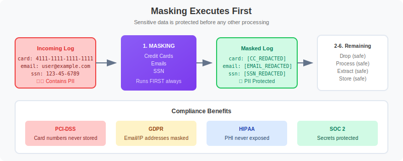

# OPMIG-08: Security, Masking & Compliance

> **Series:** OPMIG | **Notebook:** 8 of 9 | **Created:** December 2025

> **OpenPipeline Migration Series** | Notebook 8 of 9  
> **Level:** Advanced  
> **Estimated Time:** 80 minutes

---

## Learning Objectives

By completing this notebook, you will:

1. Configure masking processors for PII protection
2. Use built-in and custom masking patterns
3. ⭐ **NEW:** Implement GDPR compliance checklist
4. ⭐ **NEW:** Implement HIPAA compliance checklist
5. ⭐ **NEW:** Implement PCI-DSS compliance checklist
6. ⭐ **NEW:** Implement SOC 2 compliance checklist
7. Validate masking effectiveness
8. Design complete security pipelines

---


---

## Security Stage Overview

Masking executes **first** in the Processing stage, ensuring sensitive data is redacted before any other processing occurs.



<!--MARKDOWN_TABLE_ALTERNATIVE
| Stage | Contents | PII Status |
|-------|----------|------------|
| Incoming | card: 4111-..., email: user@... | ⚠️ Contains PII |
| After Masking | card: [CC_REDACTED], email: [EMAIL_REDACTED] | ✅ PII Protected |
| Remaining Stages | Drop, Process, Extract, Store | ✅ Safe (no PII) |
-->

### Why Masking First?

| Order | Reason |
|-------|--------|
| **Before parsing** | Sensitive data never extracted to fields |
| **Before routing** | Can't route based on unmasked PII |
| **Before storage** | Compliance-safe from the start |
| **Before extraction** | Metrics/events don't contain PII |

---

## Understanding Masking

### What Masking Does

Masking replaces sensitive patterns with redacted values:

**Before:**
```
User email: john.doe@example.com, card: 4111-1111-1111-1111
```

**After:**
```
User email: [EMAIL_REDACTED], card: [CC_REDACTED]
```

### Masking Processor Configuration

| Field | Description |
|-------|-------------|
| **Name** | Descriptive name for the mask |
| **Matching Condition** | When to apply masking |
| **Fields** | Which fields to mask (or all) |
| **Pattern** | DPL pattern to match sensitive data |
| **Replacement** | Text to replace matches with |

### Masking vs. Dropping

| Action | Use When |
|--------|----------|
| **Mask** | Need the record, just hide sensitive parts |
| **Drop** | Entire record is not needed |

---

## Built-in Masking Patterns

OpenPipeline includes pre-built matchers for common sensitive data.

### Credit Card Numbers

**DPL Pattern:**
```
CREDITCARD
```

**Matches:**
- `4111111111111111`
- `4111-1111-1111-1111`
- `4111 1111 1111 1111`

**Masking Processor:**
```
Name: Mask Credit Cards
Pattern: CREDITCARD:cc
Replacement: [CC_REDACTED]
Fields: content, message
```

### Email Addresses

**DPL Pattern:**
```
EMAIL
```

**Matches:**
- `user@example.com`
- `first.last@company.org`

**Masking Processor:**
```
Name: Mask Emails
Pattern: EMAIL:email
Replacement: [EMAIL_REDACTED]
Fields: content, message
```

### IP Addresses

**DPL Pattern:**
```
IPADDR
IPV4ADDR
IPV6ADDR
```

**Masking Processor:**
```
Name: Mask IP Addresses
Pattern: IPADDR:ip
Replacement: [IP_REDACTED]
Fields: content, client_ip, remote_addr
```

### Phone Numbers (Custom Pattern)

**DPL Pattern:**
```
'(' INT{3} ')' SPACE? INT{3} '-' INT{4}
```

**Matches:**
- `(555) 123-4567`
- `(555)123-4567`

---

## Custom Masking with replacePattern

The `replacePattern` function enables custom masking using DPL patterns.

### Syntax

```dql
fieldsAdd content = replacePattern(content, "PATTERN", replacement: "REPLACEMENT")
```

### Example: Mask SSN

**Pattern:** SSN format `123-45-6789`

```dql
fieldsAdd content = replacePattern(content, "INT{3} '-' INT{2} '-' INT{4}", replacement: "[SSN_REDACTED]")
```

### Example: Mask API Keys

**Pattern:** Keys starting with `key_` followed by alphanumeric

```dql
fieldsAdd content = replacePattern(content, "'key_' WORD", replacement: "[API_KEY_REDACTED]")
```

### Example: Mask Bearer Tokens

**Pattern:** Bearer tokens in Authorization headers

```dql
fieldsAdd content = replacePattern(content, "'Bearer ' NSPACE", replacement: "Bearer [TOKEN_REDACTED]")
```

### Example: Mask Passwords in URLs

**Pattern:** Password parameter in query strings

```dql
fieldsAdd content = replacePattern(content, "'password=' LD:pwd ('&'|EOL)", replacement: "password=[REDACTED]&")
```

### Chaining Multiple Masks

```dql
// Apply multiple masks in sequence
fieldsAdd content = replacePattern(content, "CREDITCARD", replacement: "[CC_REDACTED]")
| fieldsAdd content = replacePattern(content, "EMAIL", replacement: "[EMAIL_REDACTED]")
| fieldsAdd content = replacePattern(content, "IPADDR", replacement: "[IP_REDACTED]")
```

---

## Compliance Patterns

### PCI-DSS Compliance

**Requirements:**
- Mask all Primary Account Numbers (PANs)
- Mask CVV/CVC codes
- Mask cardholder names when combined with PANs

**Pipeline Configuration:**

```dql
// Mask credit card numbers
fieldsAdd content = replacePattern(content, "CREDITCARD", replacement: "[PAN_REDACTED]")
// Mask CVV (3-4 digits after 'cvv=' or 'cvc=')
| fieldsAdd content = replacePattern(content, "('cvv='|'cvc='|'CVV='|'CVC=') INT{3,4}", replacement: "cvv=[REDACTED]")
```

### GDPR Compliance

**Requirements:**
- Mask personal identifiers (emails, phone numbers)
- Mask IP addresses (considered PII in EU)
- Mask names when identifiable

**Pipeline Configuration:**

```dql
// Mask emails
fieldsAdd content = replacePattern(content, "EMAIL", replacement: "[PII_REDACTED]")
// Mask IP addresses
| fieldsAdd content = replacePattern(content, "IPADDR", replacement: "[IP_REDACTED]")
// Mask user IDs
| fieldsAdd content = replacePattern(content, "'userId=' LD:uid", replacement: "userId=[USER_REDACTED]")
```

### HIPAA Compliance

**Requirements:**
- Mask Protected Health Information (PHI)
- Mask patient identifiers
- Mask medical record numbers

**Pipeline Configuration:**

```dql
// Mask patient IDs
fieldsAdd content = replacePattern(content, "'patientId=' LD:pid", replacement: "patientId=[PHI_REDACTED]")
// Mask MRNs
| fieldsAdd content = replacePattern(content, "'mrn=' LD:mrn", replacement: "mrn=[PHI_REDACTED]")
// Mask SSNs
| fieldsAdd content = replacePattern(content, "INT{3} '-' INT{2} '-' INT{4}", replacement: "[SSN_REDACTED]")
```

### SOC 2 Compliance

**Requirements:**
- Mask credentials and secrets
- Mask authentication tokens
- Audit access to sensitive data

**Pipeline Configuration:**

```dql
// Mask passwords
fieldsAdd content = replacePattern(content, "('password='|'pwd='|'passwd=') LD:pwd", replacement: "password=[REDACTED]")
// Mask API keys
| fieldsAdd content = replacePattern(content, "('api_key='|'apiKey='|'API_KEY=') LD:key", replacement: "api_key=[REDACTED]")
// Mask tokens
| fieldsAdd content = replacePattern(content, "'Bearer ' NSPACE", replacement: "Bearer [REDACTED]")
```

---

## Field Removal for Security

Sometimes it's better to remove entire fields rather than mask values.

### Using fieldsRemove

```dql
// Remove sensitive fields entirely
fieldsRemove password, secret, api_key, token, authorization
```

### When to Remove vs. Mask

| Scenario | Action |
|----------|--------|
| Field always contains sensitive data | Remove |
| Only some values are sensitive | Mask |
| Need to know field existed | Mask with placeholder |
| Compliance requires no trace | Remove |

### Conditional Field Removal

Apply removal only when field contains sensitive patterns:

```dql
// Remove field only if it contains a pattern
fieldsAdd authorization = if(contains(authorization, "Bearer"), null, else: authorization)
```

---

## Validating Masking

After configuring masking, verify it's working correctly.

> ⚠️ **Important:** Test with sample data before deploying to production.

```python
// Check for any remaining credit card patterns in stored logs
// If masking works, this should return 0 results
fetch logs, from: now() - 24h
| filter matchesPhrase(content, "4111")
   OR matchesPhrase(content, "5500")
   OR matchesPhrase(content, "3782")
| limit 10
```

```python
// Check for any remaining email patterns
// Look for @ symbol with surrounding text
fetch logs, from: now() - 24h
| filter matchesPhrase(content, "@gmail.com")
   OR matchesPhrase(content, "@yahoo.com")
   OR matchesPhrase(content, "@example.com")
| limit 10
```

```python
// Verify redaction placeholders are present
// This confirms masking is actively working
fetch logs, from: now() - 24h
| filter contains(content, "[REDACTED]")
   OR contains(content, "[CC_REDACTED]")
   OR contains(content, "[EMAIL_REDACTED]")
   OR contains(content, "[PII_REDACTED]")
| summarize {masked_count = count()}, by: {dt.openpipeline.pipelines}
| sort masked_count desc
```

```python
// Sample masked logs to verify format
fetch logs, from: now() - 24h
| filter contains(content, "REDACTED")
| fields timestamp, content
| limit 20
```

```python
// Audit: Count masked records by pipeline and type
fetch logs, from: now() - 24h
| fieldsAdd has_cc_mask = contains(content, "[CC_REDACTED]"),
           has_email_mask = contains(content, "[EMAIL_REDACTED]"),
           has_ip_mask = contains(content, "[IP_REDACTED]"),
           has_pii_mask = contains(content, "[PII_REDACTED]")
| summarize {
    total = count(),
    cc_masked = countIf(has_cc_mask),
    email_masked = countIf(has_email_mask),
    ip_masked = countIf(has_ip_mask),
    pii_masked = countIf(has_pii_mask)
  }, by: {dt.openpipeline.pipelines}
```

```python
// Check for potential SSN patterns that might be missed
// Pattern: ###-##-#### where # is a digit
fetch logs, from: now() - 24h
| filter matchesPhrase(content, "-")
| filter NOT contains(content, "[SSN_REDACTED]")
| fields content
| limit 50
```

---

## Testing Masking in DPL Architect

Before deploying masking rules, test them:

1. Open **DPL Architect** in Dynatrace
2. Paste sample log with sensitive data
3. Test your DPL pattern matches correctly
4. Verify replacement produces expected output

### Test Cases to Include

| Test Case | Input | Expected Output |
|-----------|-------|------------------|
| Credit card | `4111-1111-1111-1111` | `[CC_REDACTED]` |
| Credit card no dashes | `4111111111111111` | `[CC_REDACTED]` |
| Email | `user@example.com` | `[EMAIL_REDACTED]` |
| IPv4 | `192.168.1.1` | `[IP_REDACTED]` |
| IPv6 | `2001:db8::1` | `[IP_REDACTED]` |
| Mixed content | Multiple patterns | All redacted |

---

## Best Practices

### Masking Configuration

| Practice | Reason |
|----------|--------|
| Mask before routing | Routing rules shouldn't see PII |
| Use descriptive placeholders | Aids troubleshooting |
| Test patterns thoroughly | Avoid over/under masking |
| Document masking rules | Compliance audits |

### Pattern Design

| Practice | Reason |
|----------|--------|
| Be specific | Avoid false positives |
| Handle variations | Same data, different formats |
| Use built-in matchers | Pre-tested, reliable |
| Chain patterns | Cover all sensitive data |

### Compliance

| Practice | Reason |
|----------|--------|
| Document all masking | Audit trail |
| Regular pattern review | New data sources |
| Test with real samples | Ensure effectiveness |
| Monitor for leaks | Continuous validation |

### Performance

| Practice | Reason |
|----------|--------|
| Apply to specific fields | Faster than all fields |
| Use matching conditions | Skip unneeded records |
| Order patterns by frequency | Most common first |

---

## Complete Security Pipeline Example

### Pipeline: `payment-logs-secure`

**Masking Processor 1: Credit Cards**
```
Name: Mask Credit Cards
Pattern: CREDITCARD
Replacement: [CC_REDACTED]
Fields: content, card_number
Matching: (all records)
```

**Masking Processor 2: CVV Codes**
```dql
fieldsAdd content = replacePattern(content, "('cvv='|'cvc=') INT{3,4}", replacement: "cvv=[REDACTED]")
```

**Masking Processor 3: Emails**
```
Name: Mask Emails
Pattern: EMAIL
Replacement: [EMAIL_REDACTED]
Fields: content, customer_email
Matching: (all records)
```

**Masking Processor 4: IP Addresses**
```
Name: Mask IPs
Pattern: IPADDR
Replacement: [IP_REDACTED]
Fields: content, client_ip, remote_addr
Matching: (all records)
```

**Masking Processor 5: Auth Tokens**
```dql
fieldsAdd content = replacePattern(content, "'Bearer ' NSPACE", replacement: "Bearer [TOKEN_REDACTED]")
| fieldsRemove authorization, auth_token
```

### Pipeline Verification Query

```python
// Verify complete masking for payment-logs pipeline
fetch logs, from: now() - 1h
| filter dt.openpipeline.pipelines == "payment-logs-secure"
| summarize {
    total = count(),
    with_cc = countIf(contains(content, "[CC_REDACTED]")),
    with_email = countIf(contains(content, "[EMAIL_REDACTED]")),
    with_ip = countIf(contains(content, "[IP_REDACTED]")),
    with_token = countIf(contains(content, "[TOKEN_REDACTED]"))
  }
```

---

## Next Steps

Now that security is configured, complete your migration:

| Notebook | Focus Area |
|----------|------------|
| **OPMIG-09** | Troubleshooting & Validation |

---

## References

- [OpenPipeline Masking](https://docs.dynatrace.com/docs/discover-dynatrace/platform/openpipeline/use-cases/mask-sensitive-data)
- [DPL replacePattern](https://docs.dynatrace.com/docs/discover-dynatrace/platform/grail/dynatrace-pattern-language/dpl-architecture)
- [Data Privacy in Dynatrace](https://docs.dynatrace.com/docs/manage/data-privacy-and-security)
- [Compliance Best Practices](https://docs.dynatrace.com/docs/manage/data-privacy-and-security/data-privacy)

---

*Last Updated: December 12, 2025*
