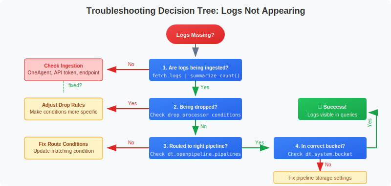
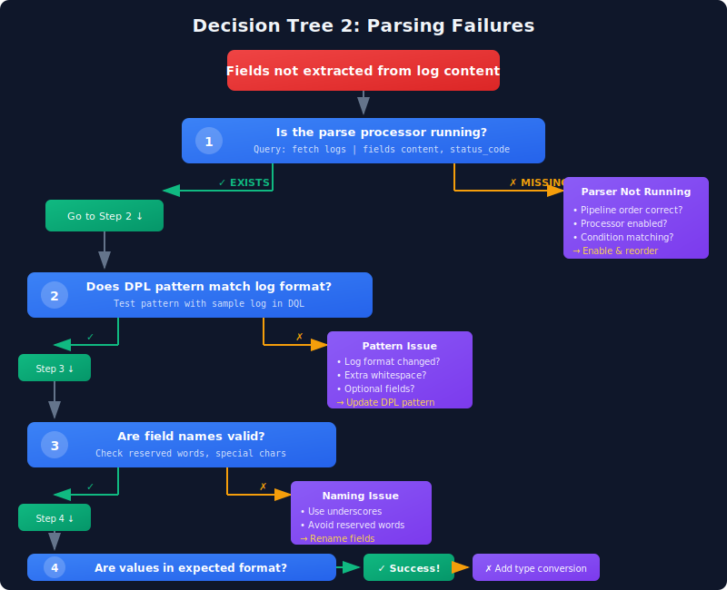
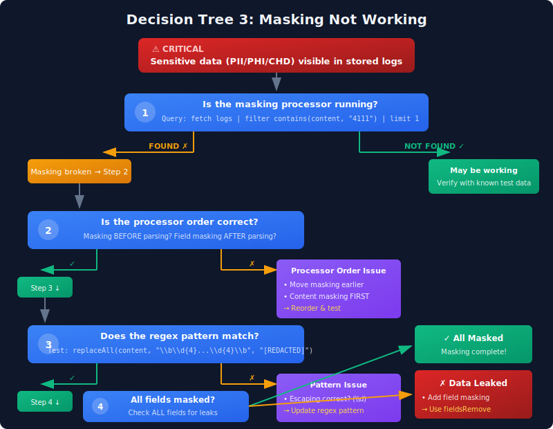
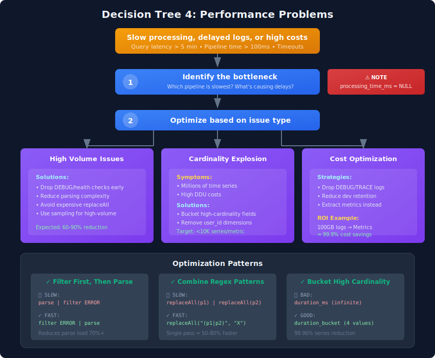

# OPMIG-09: Troubleshooting & Validation

> **Series:** OPMIG | **Notebook:** 9 of 9 | **Created:** December 2025
> **Level:** Intermediate  
> **Prerequisites:** OPMIG-01 through OPMIG-08  
> **Estimated Time:** 45 minutes  

---

## Learning Objectives

By the end of this notebook, you will be able to:

- ⭐ **Navigate decision trees** to diagnose common OpenPipeline issues
- **Validate pipeline processing** using DQL verification queries
- **Troubleshoot parsing failures** and identify root causes
- **Debug masking and security processing** to ensure PII/PHI protection
- ⭐ **Execute emergency rollback procedures** when issues occur
- ⭐ **Resolve performance problems** in high-volume environments
- **Identify bucket and routing issues** with systematic diagnosis
- **Test end-to-end pipeline flows** before production deployment

---


---

## Migration Validation Checklist

Use this checklist to validate your migration:

### Data Flow Validation

- [ ] All log sources are flowing to OpenPipeline
- [ ] Data volumes match expectations
- [ ] No data loss detected
- [ ] Timestamps are correct

### Parsing Validation

- [ ] Log levels extracted correctly
- [ ] Custom fields parsed as expected
- [ ] JSON payloads properly flattened
- [ ] No parsing errors in logs

### Routing Validation

- [ ] Logs routed to correct pipelines
- [ ] Bucket assignments are correct
- [ ] No unrouted data accumulating

### Security Validation

- [ ] Sensitive data masked properly
- [ ] No PII visible in stored logs
- [ ] Compliance requirements met

### Extraction Validation

- [ ] Metrics being generated
- [ ] Events appearing correctly
- [ ] Business events available

---

## Troubleshooting Decision Trees

Visual decision trees for diagnosing and resolving common OpenPipeline issues.

### Decision Tree 1: Logs Not Appearing



<!--MARKDOWN_TABLE_ALTERNATIVE
| Step | Question | If No | If Yes |
|------|----------|-------|--------|
| 1 | Are logs being ingested? | Check OneAgent, API token, endpoint | Go to step 2 |
| 2 | Being dropped by pipeline? | Go to step 3 | Adjust drop rules |
| 3 | Routed to right pipeline? | Fix route conditions | Go to step 4 |
| 4 | In correct bucket? | Fix storage settings | Success! |
-->

---

### Decision Tree 2: Parsing Failures



<!--MARKDOWN_TABLE_ALTERNATIVE
| Step | Question | If Yes (✓) | If No (✗) |
|------|----------|------------|-----------|
| 1 | Is parse processor running? | Go to Step 2 | Enable processor, fix condition, reorder |
| 2 | Does DPL pattern match format? | Go to Step 3 | Update DPL pattern to match format |
| 3 | Are field names valid? | Go to Step 4 | Rename fields (use underscores, avoid reserved) |
| 4 | Values in expected format? | Success! | Add type conversion (toLong, etc.) |
-->

---

### Decision Tree 3: Masking Not Working



<!--MARKDOWN_TABLE_ALTERNATIVE
| Step | Question | If Found/No | If Not Found/Yes |
|------|----------|-------------|------------------|
| 1 | Query for unmasked data? | Masking broken → Step 2 | May be working, verify |
| 2 | Processor order correct? | Move masking earlier | Go to Step 3 |
| 3 | Regex pattern matches? | Update regex pattern | Go to Step 4 |
| 4 | All fields masked? | Add field masking, fieldsRemove | Complete! |
-->

---

### Decision Tree 4: Performance Problems



<!--MARKDOWN_TABLE_ALTERNATIVE
| Issue Type | Symptoms | Solutions | Expected Improvement |
|------------|----------|-----------|---------------------|
| High Volume | Delayed logs, slow queries | Drop DEBUG early, reduce parsing, sampling | 60-90% reduction |
| Cardinality | Millions of time series, high DDU | Bucket fields, remove user_id dimensions | 99%+ reduction |
| Cost | High storage costs | Drop low-value logs, reduce retention, extract metrics | 99.9% savings |
-->

---

---

## Pipeline Health Monitoring

Monitor the overall health of your OpenPipeline configuration.

---

## Emergency Rollback Procedures ⭐ EXPANDED

When OpenPipeline issues occur in production, follow these emergency procedures.

### Scenario 1: Critical Logs Being Dropped

**Symptoms:**
- Production error logs missing
- Security events not visible
- Business-critical logs vanished

**Immediate Actions:**

1. **Disable Drop Processor (UI)**
```
   Settings → Log Monitoring → OpenPipeline
   → Select pipeline → Processors tab
   → Find drop processor → Toggle OFF
   → Save pipeline
   
   Effect: Immediate (within 1-2 minutes)
```

2. **Disable Drop Processor (API)**
```bash
   # Get current pipeline config
   curl -X GET "https://{tenant}.live.dynatrace.com/api/v2/openpipeline/logs/pipelines/{pipelineId}" \
     -H "Authorization: Api-Token {token}"
   
   # Edit JSON: Set processor "enabled": false
   
   # Update pipeline
   curl -X PUT "https://{tenant}.live.dynatrace.com/api/v2/openpipeline/logs/pipelines/{pipelineId}" \
     -H "Authorization: Api-Token {token}" \
     -H "Content-Type: application/json" \
     -d @updated-pipeline.json
```

3. **Verify Logs Reappear**
```dql
   fetch logs
   | filter log.source == "critical-service"
   | filter timestamp > now() - 5m
   | summarize count()
```

**Post-Incident:**
- Review drop condition logic
- Add safeguards (never drop ERROR/FATAL)
- Test in staging before re-enabling

---

### Scenario 2: Parsing Breaking Log Ingestion

**Symptoms:**
- Logs delayed or not appearing
- Pipeline processing time spiking
- Parse errors in pipeline metrics

**Immediate Actions:**

1. **Disable Parse Processor**
```
   Settings → OpenPipeline → Select pipeline
   → Disable DQL parse processor
   → Save
   
   Result: Logs stored unparsed (content field only)
   Impact: Fields not extracted, but logs visible
```

2. **Check Processing Metrics**
```
   ⚠️ QUERY DISABLED: Fields return NULL in this tenant
   
   dt.openpipeline.processing_time_ms - EXISTS but returns NULL
   dt.openpipeline.status - EXISTS but returns NULL
```

   **Alternative Query:**
```dql
// Monitor pipeline log volume and sources instead
fetch logs
| filter dt.openpipeline.pipelines == "my-pipeline"
| summarize
    log_count = count(),
    sources = collectDistinct(dt.openpipeline.source)
| sort log_count desc
```

3. **Test Parse Pattern Offline**
```dql
   // Use makeTimeseries or static data to test pattern
   data record(
     content = "192.168.1.1 - GET /api/users HTTP/1.1 200 1024"
   )
   | parse content, """
       IPADDR:client_ip SPACE '-' SPACE
       LD:method SPACE LD:path SPACE LD:protocol SPACE
       INT:status_code SPACE INT:bytes
     """
   | fields client_ip, method, status_code
```

**Post-Incident:**
- Fix parse pattern
- Test with production log samples
- Re-enable processor

---

### Scenario 3: Masking Failure (PII/PHI Exposed)

**Symptoms:**
- Credit card numbers visible in queries
- SSNs, patient IDs, or emails not redacted
- Compliance violation alerts

**CRITICAL - Immediate Actions:**

1. **STOP INGESTION (if actively leaking)**
```bash
   # Disable entire pipeline immediately
   curl -X PUT "https://{tenant}.live.dynatrace.com/api/v2/openpipeline/logs/pipelines/{pipelineId}" \
     -H "Authorization: Api-Token {token}" \
     -d '{"enabled": false}'
```

2. **Identify Exposure Window**
```dql
   fetch logs
   | filter log.source == "payment-service"
   | filter matchesPhrase(content, "4111-1111-1111-1111") // Test pattern
   | summarize 
       first_exposure = min(timestamp),
       last_exposure = max(timestamp),
       affected_count = count()
```

3. **Purge Sensitive Data (if supported)**
```
   ⚠️ IMPORTANT: Dynatrace does not support selective log deletion
   
   Options:
   1. Wait for retention period to expire
   2. Contact Dynatrace support for emergency data purge
   3. Revoke bucket access to prevent further exposure
   4. Document incident for compliance audit
```

4. **Revoke Bucket Access**
```
   Settings → Buckets → Select bucket
   → Access Control → Remove all users except admins
   → Save
   
   Effect: Prevents unauthorized viewing while investigating
```

5. **Fix Masking and Re-Enable**
```dql
   // Test masking pattern before deploying
   data record(
     content = "Payment processed: card=4111-1111-1111-1111, cvv=123"
   )
   | fieldsAdd content = replaceAll(content, "\\b\\d{4}[\\s-]?\\d{4}[\\s-]?\\d{4}[\\s-]?\\d{4}\\b", "[PAN_REDACTED]")
   | fieldsAdd content = replaceAll(content, "cvv[=:]?\\s*\\d{3,4}", "cvv=[REDACTED]")
   | fields content
   
   // Expected: "Payment processed: card=[PAN_REDACTED], cvv=[REDACTED]"
```

**Post-Incident (MANDATORY):**
- [ ] Document exposure timeline
- [ ] Notify compliance/security team
- [ ] File incident report (PCI-DSS, HIPAA, GDPR)
- [ ] Review all masking patterns
- [ ] Implement automated compliance checks
- [ ] Add pre-production masking tests

---

### Scenario 4: Routing to Wrong Bucket

**Symptoms:**
- Production logs in dev bucket (7-day retention)
- Audit logs in default bucket (missing compliance)
- High-value logs being dropped prematurely

**Immediate Actions:**

1. **Verify Current Routing**
```dql
   fetch logs
   | filter log.source == "production-api"
   | summarize {count = count()}, by: {dt.system.bucket}
| sort count desc
```

2. **Create Temporary High-Retention Bucket**
```
   Settings → Buckets → Create Bucket
   Name: emergency_recovery_logs
   Retention: 90 days
   Access: Admins only
```

3. **Update Pipeline Storage**
```
   Pipeline → Storage Configuration
   Default Bucket: emergency_recovery_logs
   Save
   
   Effect: New logs routed to safe bucket immediately
```

4. **Fix Routing Rules**
```
   Pipeline → Routing Tab
   
   Rule 1 (HIGHEST PRIORITY):
     Condition: log.source == "production-api" AND loglevel == "ERROR"
     Target: prod_error_logs (90 days)
   
   Rule 2:
     Condition: log.source == "production-api"
     Target: prod_logs (35 days)
   
   Default:
     Target: default_logs (35 days)
```

**Post-Incident:**
- Review all routing rules for correctness
- Document expected bucket for each log source
- Add monitoring alerts for unexpected bucket usage

---

### Scenario 5: Complete Pipeline Rollback

**When to Use:**
- Multiple critical issues
- Unknown root cause
- Need time to investigate safely

**Full Rollback Procedure:**

1. **Disable Entire Pipeline**
```bash
   curl -X PUT "https://{tenant}.live.dynatrace.com/api/v2/openpipeline/logs/pipelines/{pipelineId}" \
     -H "Authorization: Api-Token {token}" \
     -H "Content-Type: application/json" \
     -d '{"enabled": false}'
```

2. **Restore Previous Version (if available)**
```bash
   # Restore from backup JSON
   curl -X PUT "https://{tenant}.live.dynatrace.com/api/v2/openpipeline/logs/pipelines/{pipelineId}" \
     -H "Authorization: Api-Token {token}" \
     -H "Content-Type: application/json" \
     -d @pipeline-backup-YYYYMMDD.json
```

3. **Verify Rollback Success**
```dql
   fetch logs
   | filter timestamp > now() - 5m
   | summarize 
       count(),
       pipelines = collectDistinct(dt.openpipeline.pipelines),
       buckets = collectDistinct(dt.system.bucket)
```

4. **Communicate Status**
```
   Template:
   
   Subject: OpenPipeline Rollback - [Pipeline Name]
   
   Timeline:
   - [HH:MM] Issue detected: [description]
   - [HH:MM] Rollback initiated
   - [HH:MM] Rollback complete
   
   Impact:
   - Logs affected: [time window]
   - Data loss: [yes/no]
   - Service affected: [list]
   
   Next Steps:
   - Root cause analysis in progress
   - Fix ETA: [estimate]
   - Testing in staging before re-deploy
```

---

### Emergency Rollback Checklist

**Before ANY pipeline changes:**
- [ ] Backup current pipeline configuration (JSON export)
- [ ] Test in staging environment first
- [ ] Document expected behavior
- [ ] Have rollback plan ready
- [ ] Notify team of change window

**During incident:**
- [ ] Identify affected time window
- [ ] Disable problematic processor/pipeline
- [ ] Verify logs flowing again
- [ ] Document all actions taken
- [ ] Communicate to stakeholders

**After rollback:**
- [ ] Root cause analysis
- [ ] Fix and test in staging
- [ ] Peer review changes
- [ ] Document lessons learned
- [ ] Update runbooks

---


```python
// Overview: Log volume by pipeline (last 24 hours)
fetch logs, from: now() - 24h
| summarize {log_count = count()}, by: {dt.openpipeline.pipelines}
| sort log_count desc
```

---

## Performance Troubleshooting ⭐ NEW

Diagnose and resolve performance issues in high-volume OpenPipeline environments.

### Performance Issue 1: Slow Processing / High Latency

**Symptoms:**
- Logs delayed (ingestion_time - timestamp > 5 minutes)
- Pipeline processing time > 100ms
- Queries timing out or slow to return

**Diagnosis Queries:**

```dql
// 1. Identify slow pipelines
// ⚠️ Original query disabled: dt.openpipeline.processing_time_ms returns NULL
//
// fetch logs
// | filter timestamp > now() - 1h
// | summarize
//     avg_processing = avg(dt.openpipeline.processing_time_ms),
//     p95_processing = percentile(dt.openpipeline.processing_time_ms, 95),
//     max_processing = max(dt.openpipeline.processing_time_ms),
//     log_count = count(),
//     by: {dt.openpipeline.pipelines}
// | sort avg_processing desc

// Alternative: Analyze pipeline volume to identify high-load pipelines
fetch logs
| filter timestamp > now() - 1h
| summarize
    log_count = count(),
    sources = countDistinct(dt.openpipeline.source),
    logs_per_minute = count() / 60,
    by: {dt.openpipeline.pipelines}
| sort log_count desc
```

```dql
// 2. Check ingestion lag
// ⚠️ QUERY DISABLED: dt.system.ingestion_time returns NULL in this tenant
//
// Original query (commented out):
// fetch logs
// | filter timestamp > now() - 15m
// | fieldsAdd lag_seconds = (dt.system.ingestion_time - timestamp) / 1000000000
// | summarize
//     avg_lag = avg(lag_seconds),
//     p95_lag = percentile(lag_seconds, 95),
//     max_lag = max(lag_seconds),
//     by: {log.source}
// | filter avg_lag > 60
// | sort avg_lag desc
//
// Note: Ingestion lag monitoring requires dt.system.ingestion_time field
// which is not populated in this tenant.
```

```dql
// 3. Find expensive processors
// ⚠️ QUERY DISABLED: Processor-level metrics not available
//
// dt.openpipeline.processor_time_ms - Not available in this tenant
// dt.openpipeline.processor_name - Not available in this tenant
//
// Original query (commented out):
// fetch logs
// | filter dt.openpipeline.pipelines == "my-slow-pipeline"
// | summarize
//     processor_time = avg(dt.openpipeline.processor_time_ms),
//     by: {dt.openpipeline.processor_name}
// | sort processor_time desc
//
// Note: Processor-level performance metrics require additional telemetry
// configuration. Monitor overall pipeline performance instead (see Query 1 alternative).
```

**Common Causes & Solutions:**

| Cause | Solution | Expected Improvement |
|-------|----------|---------------------|
| Complex regex in parse/mask | Simplify patterns, use anchors | 50-80% faster |
| Too many processors | Consolidate logic, remove unused | 30-50% faster |
| High-volume debug logs | Add drop processor early | 60-90% reduction |
| Expensive fieldsAdd logic | Pre-compute values, use lookup | 40-70% faster |
| Large log messages (>10KB) | Truncate content field | 30-50% faster |

**Optimization Example:**

```dql
// ❌ SLOW: Multiple replaceAll in sequence
| fieldsAdd content = replaceAll(content, "pattern1", "X")
| fieldsAdd content = replaceAll(content, "pattern2", "Y")
| fieldsAdd content = replaceAll(content, "pattern3", "Z")

// ✅ FAST: Single regex with alternation
| fieldsAdd content = replaceAll(content, "(pattern1|pattern2|pattern3)", "[REDACTED]")
```

```dql
// ❌ SLOW: Parse all logs, then filter
parse content, """complex pattern"""
| filter loglevel == "ERROR"

// ✅ FAST: Filter first, then parse
| filter matchesPhrase(content, "ERROR")
| parse content, """complex pattern"""
```

---

### Performance Issue 2: High Volume / Rate Limiting

**Symptoms:**
- HTTP 429 (Too Many Requests) errors
- Logs missing during peak traffic
- OneAgent warnings about rate limits

**Diagnosis Queries:**

```dql
// 1. Identify high-volume sources
// ⚠️ PARTIAL: dt.system.log_size_bytes returns NULL in this tenant
//
// Alternative: Use log count instead of byte size
fetch logs
| filter timestamp > now() - 1h
| summarize
    log_count = count(),
    logs_per_second = count() / 3600,
    by: {log.source}
| sort log_count desc
| limit 20
```

```dql
// 2. Check for volume spikes
// ⚠️ PARTIAL: dt.system.log_size_bytes returns NULL in this tenant
//
// Alternative: Monitor log count spikes instead
fetch logs
| filter timestamp > now() - 6h
| makeTimeseries
    log_count = count(),
    by: {log.source},
    interval: 5m
```

```dql
// 3. Analyze droppable logs
fetch logs
| filter timestamp > now() - 1h
| summarize 
    total = count(),
    debug = countIf(loglevel == "DEBUG"),
    trace = countIf(loglevel == "TRACE"),
    health = countIf(contains(content, "/health")),
    by: {log.source}
| fieldsAdd droppable_pct = (debug + trace + health) / total * 100
| filter droppable_pct > 30
| sort droppable_pct desc
```

**Volume Reduction Strategies:**

| Strategy | Use Case | Expected Reduction |
|----------|----------|-------------------|
| Drop DEBUG/TRACE | Development, verbose apps | 40-70% |
| Drop health checks | Microservices, K8s | 20-40% |
| Sampling | High-volume, low-value | 80-95% (with 10-20% sample) |
| Metric extraction | SLI metrics, counts | 99%+ (logs → metrics) |
| Aggregation | Repeated messages | 50-80% |

**Example: Aggressive Volume Reduction**

```dql
// Drop low-value logs (in pipeline drop processor)
loglevel == "DEBUG" OR
loglevel == "TRACE" OR
contains(content, "/health") OR
contains(content, "/metrics") OR
matchesPhrase(content, "/ping") OR
(loglevel == "INFO" AND matchesPhrase(log.source, "chatty-service"))

// Expected: 60-80% volume reduction
```

**Sampling Strategy:**

```dql
// Sample 10% of INFO logs, keep all ERROR/WARN
| fieldsAdd sample_hash = hashMd5(toString(timestamp))
| filter 
    loglevel == "ERROR" OR
    loglevel == "WARN" OR
    (loglevel == "INFO" AND sample_hash % 10 == 0)

// Result: ~70% reduction (if 80% are INFO)
```

---

### Performance Issue 3: Cardinality Explosion

**Symptoms:**
- Metric extraction creating millions of time series
- High DDU costs for metric storage
- Queries slow due to high cardinality

**Diagnosis Queries:**

```dql
// 1. Count unique dimension combinations
fetch logs
| filter timestamp > now() - 1h
| filter isNotNull(user_id)  // Example high-cardinality field
| summarize 
    unique_users = countDistinct(user_id),
    unique_services = countDistinct(service.name),
    potential_series = countDistinct(concat(user_id, "_", service.name))
```

```dql
// 2. Estimate metric cardinality
fetch logs
| filter timestamp > now() - 24h
| summarize 
    dim1_count = countDistinct(dimension1),
    dim2_count = countDistinct(dimension2),
    dim3_count = countDistinct(dimension3)
| fieldsAdd estimated_series = dim1_count * dim2_count * dim3_count

// ⚠️ WARNING: If estimated_series > 100,000 → cardinality problem!
```

```dql
// 3. Find high-cardinality fields
fetch logs
| filter timestamp > now() - 1h
| summarize 
    user_ids = countDistinct(user_id),
    request_ids = countDistinct(request_id),
    session_ids = countDistinct(session_id),
    paths = countDistinct(request_path),
    by: {service.name}
| sort user_ids desc
```

**Cardinality Reduction Techniques:**

| Problem | ❌ High Cardinality | ✅ Low Cardinality | Reduction |
|---------|-------------------|------------------|----------|
| User tracking | `user_id` (1M unique) | `user_segment` (5 values) | 99.9995% |
| API paths | `/api/users/12345` | `/api/users/{id}` | 99% |
| Durations | `duration_ms` (infinite) | `duration_bucket` (10 buckets) | 99.9%+ |
| Timestamps | `timestamp` (infinite) | `hour_of_day` (24 values) | 99.9%+ |
| IP addresses | `client_ip` (100K unique) | `client_country` (200 values) | 99.8% |

**Example: Bucketing Strategy**

```dql
// ❌ BAD: Infinite cardinality
| fieldsAdd duration_ms = response_time
// Metric extraction: log.api.response_time (dimensions: service, path, duration_ms)
// Result: 5 services × 100 paths × 10,000 durations = 5,000,000 time series ❌

// ✅ GOOD: Bucketed cardinality
| fieldsAdd duration_bucket = 
    if(response_time < 100, "fast",
    else: if(response_time < 500, "normal",
    else: if(response_time < 2000, "slow",
    else: "very_slow")))
// Metric extraction: log.api.response_time (dimensions: service, path, duration_bucket)
// Result: 5 services × 100 paths × 4 buckets = 2,000 time series ✅
// Reduction: 99.96%
```

**Example: Path Normalization**

```dql
// ❌ BAD: /api/users/12345, /api/users/67890, ... (infinite paths)
| fieldsAdd api_path = request_path

// ✅ GOOD: Normalize to /api/users/{id}
| fieldsAdd api_path = replaceAll(request_path, "/api/users/\\d+", "/api/users/{id}")
| fieldsAdd api_path = replaceAll(api_path, "/api/orders/\\d+", "/api/orders/{id}")
| fieldsAdd api_path = replaceAll(api_path, "/api/products/[a-f0-9-]+", "/api/products/{uuid}")
// Result: 20 normalized paths instead of 100,000+ unique paths
```

**Cardinality Budget:**

```
Target: < 10,000 time series per metric

Good Examples:
- 5 services × 20 endpoints × 3 status_categories = 300 series ✅
- 10 services × 5 environments × 4 duration_buckets = 200 series ✅

Bad Examples:
- 5 services × 100K user_ids = 500,000 series ❌
- 10 services × 10K request_ids × 5 methods = 500,000 series ❌

Rule of Thumb:
If dimension has > 1,000 unique values → BUCKET IT or REMOVE IT
```

---


```python
// Pipeline volume trend over time
fetch logs, from: now() - 24h
| makeTimeseries {log_count = count()}, by: {dt.openpipeline.pipelines}, interval: 1h
```

```python
// Check for logs without pipeline assignment (potential routing issues)
fetch logs, from: now() - 1h
| filter isNull(dt.openpipeline.pipelines)
| summarize {unrouted_count = count()}, by: {log.source}
| sort unrouted_count desc
```

```python
// Bucket distribution check
fetch logs, from: now() - 24h
| summarize {
    log_count = count()
  }, by: {dt.system.bucket, dt.openpipeline.pipelines}
| sort log_count desc
```

```python
// Log source health - are all expected sources sending data?
fetch logs, from: now() - 1h
| summarize {
    log_count = count(),
    last_seen = max(timestamp)
  }, by: {log.source}
| fieldsAdd minutes_since_last = (now() - last_seen) / 60000000000
| sort minutes_since_last desc
```

---

## Common Issues & Solutions

### Issue 1: Logs Not Appearing

**Symptoms:**
- Expected logs missing from queries
- Volume lower than expected

**Diagnosis:**

```python
// Check if logs are being dropped
// Compare volume before and after drop processors
fetch logs, from: now() - 1h
| summarize {
    total = count(),
    debug = countIf(loglevel == "DEBUG"),
    trace = countIf(loglevel == "TRACE")
  }, by: {log.source}
```

**Solution:**
1. Check drop processor conditions in pipeline configuration
2. Verify routing conditions aren't too restrictive
3. Confirm log source is sending data to Dynatrace
4. Check for OneAgent or log forwarder issues

### Issue 2: Parsing Not Working

**Symptoms:**
- `loglevel` field is null
- Expected parsed fields missing

**Diagnosis:**

```python
// Find logs with parsing failures
fetch logs, from: now() - 1h
| filter isNull(loglevel)
| fields timestamp, log.source, dt.openpipeline.pipelines, content
| limit 20
```

**Solution:**
1. Test DPL pattern in DPL Architect with failing log samples
2. Check for variations in log format
3. Verify processor matching condition includes these logs
4. Order processors correctly (parse before fieldsAdd that uses parsed fields)

### Issue 3: Wrong Pipeline Assignment

**Symptoms:**
- Logs in unexpected pipelines
- Routing not working as expected

**Diagnosis:**

```python
// Check routing - are logs going to expected pipelines?
fetch logs, from: now() - 1h
| summarize {log_count = count()}, by: {log.source, dt.openpipeline.pipelines}
| sort log.source asc
```

**Solution:**
1. Review dynamic routing table configuration
2. Check routing condition order (first match wins)
3. Verify matching conditions use correct fields
4. Test conditions with sample logs

### Issue 4: Masking Not Applied

**Symptoms:**
- Sensitive data visible in logs
- Redaction placeholders missing

**Diagnosis:**

```python
// Check if masking is working
fetch logs, from: now() - 1h
| filter contains(content, "@")  // Potential email
| filter NOT contains(content, "[EMAIL_REDACTED]")
| fields content
| limit 20
```

**Solution:**
1. Verify masking processor is in the pipeline
2. Check masking processor order (should be first)
3. Test DPL pattern matches the sensitive data format
4. Ensure masking applies to correct fields

### Issue 5: Metrics Not Generated

**Symptoms:**
- Expected metrics missing
- Metric queries return no data

**Diagnosis:**

```python
// List log-extracted metrics
// Note: Use the Dynatrace UI (Observe > Metrics) to browse metrics
// Or use timeseries to query a specific metric:
// timeseries avg_value = avg(log.your_metric_name), from: now() - 24h
```

**Solution:**
1. Verify extraction processor configuration
2. Check matching condition selects correct logs
3. Ensure value field exists and is numeric (for value metrics)
4. Check for dimension cardinality issues

---

## Parsing Validation

Comprehensive checks for parsing effectiveness.

```python
// Parsing success rate by pipeline
fetch logs, from: now() - 24h
| summarize {
    total = count(),
    with_loglevel = countIf(isNotNull(loglevel)),
    without_loglevel = countIf(isNull(loglevel))
  }, by: {dt.openpipeline.pipelines}
| fieldsAdd parse_rate = round((toDouble(with_loglevel) / toDouble(total)) * 100, decimals: 1)
| sort parse_rate asc
```

```python
// Log level distribution (verify expected values)
fetch logs, from: now() - 24h
| summarize {log_count = count()}, by: {loglevel}
| sort log_count desc
```

```python
// Find log sources with low parsing rates
fetch logs, from: now() - 24h
| summarize {
    total = count(),
    parsed = countIf(isNotNull(loglevel))
  }, by: {log.source}
| fieldsAdd parse_rate = round((toDouble(parsed) / toDouble(total)) * 100, decimals: 1)
| filter parse_rate < 90
| sort parse_rate asc
```

```python
// Sample unparsed logs from problematic sources
// Replace 'your-source' with source from previous query
fetch logs, from: now() - 1h
| filter log.source == "your-source"
| filter isNull(loglevel)
| fields content
| limit 30
```

```python
// Verify custom field extraction
// Add your expected custom fields here
fetch logs, from: now() - 24h
| summarize {
    total = count(),
    with_request_id = countIf(isNotNull(request_id)),
    with_user_id = countIf(isNotNull(user_id)),
    with_order_id = countIf(isNotNull(order_id))
  }, by: {dt.openpipeline.pipelines}
```

---

## Volume & Cost Validation

Verify data volumes and cost optimization effectiveness.

```python
// Daily log volume by bucket (cost impact)
fetch logs, from: now() - 7d
| fieldsAdd day = formatTimestamp(timestamp, format: "yyyy-MM-dd")
| summarize {log_count = count()}, by: {day, dt.system.bucket}
| sort day desc, log_count desc
```

```python
// Volume trend - verify stable after migration
fetch logs, from: now() - 7d
| makeTimeseries {log_count = count()}, interval: 1h
```

```python
// Check if debug/trace logs are being dropped (cost savings)
fetch logs, from: now() - 24h
| filter loglevel == "DEBUG" OR loglevel == "TRACE"
| summarize {debug_trace_count = count()}
| fieldsAdd status = if(debug_trace_count == 0, 
    "✅ Debug/trace logs dropped as expected",
    else: "⚠️ Debug/trace logs still present - check drop processors")
```

```python
// Volume by log level (should see mostly INFO/WARN/ERROR)
fetch logs, from: now() - 24h
| summarize {log_count = count()}, by: {loglevel}
| fieldsAdd percentage = round((toDouble(log_count) / 100), decimals: 1)
| sort log_count desc
```

```python
// Top 10 highest volume sources
fetch logs, from: now() - 24h
| summarize {log_count = count()}, by: {log.source}
| sort log_count desc
| limit 10
```

---

## Performance Optimization

Tips for optimizing OpenPipeline performance.

### Processor Ordering

1. **Masking** - Always first (security)
2. **Drop** - Second (reduce volume early)
3. **Technology Parsers** - Before custom parsing
4. **Custom Parse** - Before fieldsAdd that uses parsed fields
5. **fieldsAdd** - After parsing, for computed fields
6. **fieldsRemove** - Last, to clean up temporary fields

### Matching Condition Optimization

| Do | Don't |
|----|-------|
| Use indexed fields | Complex regex on content |
| Check field existence first | Expensive operations always |
| Simple equality checks | Multiple OR conditions |

### Pattern Efficiency

| Efficient | Less Efficient |
|-----------|----------------|
| `'prefix=' LD:val` | `LD 'prefix=' LD:val` |
| Specific literals | Greedy matchers |
| Short patterns | Long complex patterns |

```python
// Identify pipelines with high volume (candidates for optimization)
fetch logs, from: now() - 1h
| summarize {hourly_volume = count()}, by: {dt.openpipeline.pipelines}
| sort hourly_volume desc
```

---

## Rollback Procedures

If issues are detected, here's how to rollback.

### Rollback Options

| Level | Action |
|-------|--------|
| **Pipeline** | Disable specific pipeline, use default |
| **Processor** | Disable individual processor |
| **Routing** | Reset dynamic routing to defaults |
| **Full** | Revert to classic ingestion (pre-v1.295) |

### Quick Disable Steps

1. Navigate to **Settings → OpenPipeline → Logs**
2. Select the problematic pipeline
3. Toggle the pipeline off
4. Logs will route to default pipeline

### Version History

OpenPipeline maintains configuration history:

1. Click on pipeline
2. View **History** tab
3. Select previous version
4. **Restore** to that version

---

## Ongoing Maintenance

After migration, establish these maintenance practices.

### Daily Checks

- [ ] Log volume within expected range
- [ ] No spike in unparsed logs
- [ ] Error log levels visible

### Weekly Checks

- [ ] Parsing success rates stable
- [ ] Bucket distribution as expected
- [ ] New log sources properly routed

### Monthly Checks

- [ ] Review masking effectiveness
- [ ] Optimize high-volume pipelines
- [ ] Clean up unused pipelines
- [ ] Document any changes

```python
// Weekly health report query
fetch logs, from: now() - 7d
| summarize {
    total_logs = count(),
    parsed_logs = countIf(isNotNull(loglevel)),
    error_logs = countIf(loglevel == "ERROR"),
    pipelines_used = countDistinct(dt.openpipeline.pipelines),
    sources_active = countDistinct(log.source)
  }
| fieldsAdd parse_rate = round((toDouble(parsed_logs) / toDouble(total_logs)) * 100, decimals: 1)
| fieldsAdd error_rate = round((toDouble(error_logs) / toDouble(total_logs)) * 100, decimals: 2)
```

```python
// Find new log sources that may need pipeline configuration
fetch logs, from: now() - 24h
| filter isNull(dt.openpipeline.pipelines) OR dt.openpipeline.pipelines == "default"
| summarize {
    log_count = count(),
    first_seen = min(timestamp)
  }, by: {log.source}
| filter log_count > 100
| sort log_count desc
```

---

## Migration Complete Checklist

Final validation before declaring migration complete.

### Data Quality ✅

- [ ] All log sources flowing
- [ ] Parsing rates > 95%
- [ ] Log levels correctly extracted
- [ ] Custom fields available
- [ ] Timestamps accurate

### Routing ✅

- [ ] All sources routed to correct pipelines
- [ ] Bucket assignments verified
- [ ] Dynamic routing working
- [ ] No orphaned data

### Security ✅

- [ ] All PII masked
- [ ] Compliance requirements met
- [ ] No sensitive data in stored logs
- [ ] Masking verified with queries

### Cost ✅

- [ ] Debug/trace logs dropped
- [ ] Volumes as expected
- [ ] Bucket retention configured
- [ ] Cost projections met

### Extraction ✅

- [ ] Metrics generating
- [ ] Events appearing
- [ ] Business events available
- [ ] Davis AI integration working

### Documentation ✅

- [ ] Pipeline configuration documented
- [ ] Routing rules documented
- [ ] Masking patterns documented
- [ ] Runbooks updated

### Team ✅

- [ ] Team trained on OpenPipeline
- [ ] Support procedures updated
- [ ] Escalation paths defined
- [ ] Monitoring dashboards created

```python
// Final migration validation summary
fetch logs, from: now() - 24h
| summarize {
    total_logs = count(),
    with_pipeline = countIf(isNotNull(dt.openpipeline.pipelines)),
    with_loglevel = countIf(isNotNull(loglevel)),
    with_masking = countIf(contains(content, "REDACTED")),
    unique_sources = countDistinct(log.source),
    unique_pipelines = countDistinct(dt.openpipeline.pipelines)
  }
| fieldsAdd 
    routing_health = if(with_pipeline > total_logs * 0.95, "✅ Good", else: "⚠️ Check routing"),
    parsing_health = if(with_loglevel > total_logs * 0.90, "✅ Good", else: "⚠️ Check parsing")
```

---

## 🎉 Congratulations!

You've completed the OpenPipeline migration notebook series!

### What You've Learned

| Notebook | Topic |
|----------|-------|
| **OPMIG-01** | Introduction & Why Migrate |
| **OPMIG-02** | Architecture & Key Concepts |
| **OPMIG-03** | Migration Assessment & Planning |
| **OPMIG-04** | Pipeline Configuration |
| **OPMIG-05** | Routing & Buckets |
| **OPMIG-06** | Processing & Parsing |
| **OPMIG-07** | Metric & Event Extraction |
| **OPMIG-08** | Security & Masking |
| **OPMIG-09** | Troubleshooting & Validation |

### Next Steps

1. **Share knowledge** - Train your team
2. **Create dashboards** - Monitor pipeline health
3. **Iterate** - Add pipelines for new use cases
4. **Optimize** - Continuously improve performance

---

## References

- [OpenPipeline Documentation](https://docs.dynatrace.com/docs/discover-dynatrace/platform/openpipeline)
- [OpenPipeline Best Practices](https://docs.dynatrace.com/docs/discover-dynatrace/platform/openpipeline/best-practices)
- [DQL Reference](https://docs.dynatrace.com/docs/discover-dynatrace/platform/grail/dynatrace-query-language)
- [Dynatrace Community](https://community.dynatrace.com/)

---

*Last Updated: December 12, 2025*
