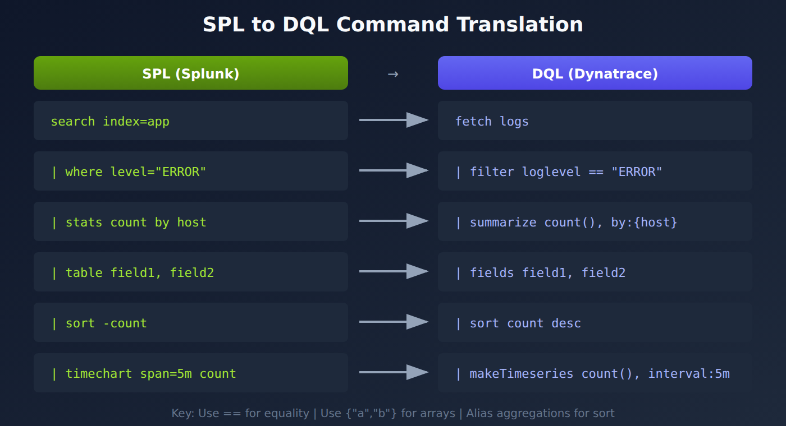

# S2D-03: SPL to DQL Translation

> **Series:** S2D — Splunk to Dynatrace Migration | **Notebook:** 3 of 9 | **Created:** January 2026 | **Last Updated:** 10/05/2026

## Overview

This notebook provides a comprehensive guide for translating Splunk SPL (Search Processing Language) queries to Dynatrace DQL (Dynatrace Query Language). While both languages share similar concepts, their syntax and capabilities differ significantly.



<!-- MARKDOWN_TABLE_ALTERNATIVE
| SPL Step | DQL Equivalent | Notes |
|---|----------------|-------|
| search/index | fetch | Data source selection |
| where | filter | Condition filtering |
| stats | summarize | Aggregation |
| eval | fieldsAdd | Field calculation |
| table | fields | Column selection |
For environments where SVG doesn't render
-->

---

## Table of Contents

1. [Command Translation Reference](#command-translation-reference)
2. [Basic Query Translation](#basic-query-translation)
3. [Filtering Patterns](#filtering-patterns)
4. [Aggregation Patterns](#aggregation-patterns)
5. [Field Extraction](#field-extraction)
6. [Time-Series Queries](#time-series-queries)
7. [Key Syntax Differences](#key-syntax-differences)

---

## Prerequisites

| Requirement | Details |
|-------------|----------|
| **Dynatrace Environment** | SaaS or Managed with Grail |
| **Permissions** | `logs.read` |
| **Knowledge** | Familiarity with source SPL queries |

## Learning Objectives

By the end of this notebook, you will be able to:

1. Map SPL commands to their DQL equivalents
2. Translate common SPL patterns to DQL
3. Handle differences in string matching and filtering
4. Convert aggregation and time-series queries
5. Apply DQL best practices during translation

<a id="command-translation-reference"></a>
## Command Translation Reference
### Core Commands

| SPL Command | DQL Command | Description |
|-------------|-------------|-------------|
| `search index=...` | `fetch logs` | Select data source |
| `where field="value"` | `filter field == "value"` | Filter records |
| `stats count by field` | `summarize count = count(), by:{field}` | Aggregate data |
| `table field1, field2` | `fields field1, field2` | Select columns |
| `sort -count` | `sort count desc` | Sort results |
| `head 10` | `limit 10` | Limit results |
| `eval new=field1+field2` | `fieldsAdd new = field1 + field2` | Calculate fields |
| `rename old AS new` | `fieldsRename old, alias:new` | Rename fields |
| `dedup field` | `dedup field` | Keeps the first record per value; add `sort:{…}` to choose which |

### String Matching

| SPL Pattern | DQL Pattern | Description |
|-------------|-------------|-------------|
| `field="*error*"` | `contains(field, "error", caseSensitive:false)` | Substring |
| `"error"` (bare term) | `matchesPhrase(content, "error")` | Whole word or phrase |
| `field=error` | `field == "error"` | Exact match |
| `field IN ("a","b")` | `in(field, {"a", "b"})` | Multiple values |
| `rex field=f "(?<name>...)"` | `parse f, "DATA:name"` | Extract patterns |

<a id="basic-query-translation"></a>
## Basic Query Translation
### Example 1: Simple Log Search

**SPL:**
```spl
index=application sourcetype=app_logs host=app-server-01 | head 100
```

**DQL:**

```dql
// Simple log search with host filter
fetch logs, from:-1h
| filter matchesPhrase(host.name, "app-server-01")
| limit 100
```

### Example 2: Error Log Count by Host

**SPL:**
```spl
index=application level=ERROR | stats count by host | sort -count
```

Splunk `level=ERROR` usually means "anything at error severity or worse". In Dynatrace that is `status == "ERROR"`, which groups SEVERE, ERROR, CRITICAL, ALERT and EMERGENCY. Use `loglevel == "ERROR"` only when you need the literal level; on a validation tenant (10/05/2026) it matched about half of the records that `status == "ERROR"` matched, because Java `SEVERE` logs fall outside it.

**DQL:**

```dql
// Error log count by host
fetch logs, from:-1h
| filter status == "ERROR"
| summarize count = count(), by:{host.name}
| sort count desc
```

### Example 3: Time-Based Aggregation

**SPL:**
```spl
index=application | timechart span=5m count by level
```

**DQL:**

```dql
// Time-series count by log level
fetch logs, from:-24h
| makeTimeseries count = count(), by:{loglevel}, interval:5m
```

<a id="filtering-patterns"></a>
## Filtering Patterns
### Phrase Matching (Contains)

**SPL:**
```spl
index=application "connection timeout"
```

**DQL:**

```dql
// Search for phrase in log content
fetch logs, from:-1h
| filter matchesPhrase(content, "connection timeout")
| limit 50
```

### Multiple Value Filter (IN)

**SPL:**
```spl
index=application level IN ("ERROR", "WARN", "FATAL")
```

Dynatrace has no `FATAL` level. The log ingest rules page lists the level values: *"It supports the following values: alert, critical, debug, emergency, error, info, none, notice, severe, warn."* Translate `FATAL` to the error-or-worse levels instead.

**DQL:**

```dql
// Filter for multiple log levels
// Dynatrace has no FATAL level; SEVERE, CRITICAL, ALERT and EMERGENCY are error-or-worse
fetch logs, from:-1h
| filter in(loglevel, {"ERROR", "SEVERE", "CRITICAL", "ALERT", "EMERGENCY", "WARN"})
| summarize count = count(), by:{loglevel}
```

### NOT Filter

**SPL:**
```spl
index=application NOT level="DEBUG"
```

**DQL:**

```dql
// Exclude DEBUG level logs
fetch logs, from:-1h
| filter loglevel != "DEBUG"
| summarize count = count(), by:{loglevel}
```

### Combined Conditions (AND/OR)

**SPL:**
```spl
index=application (host="app-01" OR host="app-02") AND level="ERROR"
```

**DQL:**

```dql
// Combined AND/OR conditions
fetch logs, from:-1h
| filter (matchesPhrase(host.name, "app-01") or matchesPhrase(host.name, "app-02"))
| filter status == "ERROR"
| limit 100
```

<a id="aggregation-patterns"></a>
## Aggregation Patterns
### Multiple Aggregations

**SPL:**
```spl
index=application | stats count, avg(response_time), max(response_time) by host
```

Splunk extracts `key=value` fields at search time, so `response_time` exists on raw events. Grail does not. Parse the field at query time, as below, or at ingest with OpenPipeline (S2D-07).

**DQL:**

```dql
// Multiple aggregations by host
// response_time is not a built-in field: parse it from the content first
fetch logs, from:-1h
| parse content, "DATA? 'response_time=' DOUBLE:response_time"
| filter isNotNull(response_time)
| summarize {
    count = count(),
    avg_response = avg(response_time),
    max_response = max(response_time)
  }, by:{host.name}
```

### Conditional Count

**SPL:**
```spl
index=application | stats count(eval(level="ERROR")) as errors, count as total by host
```

**DQL:**

```dql
// Conditional count - errors vs total
fetch logs, from:-1h
| summarize {
    errors = countIf(status == "ERROR"),
    total = count()
  }, by:{host.name}
| fieldsAdd error_rate = (toDouble(errors) / toDouble(total)) * 100
```

<a id="field-extraction"></a>
## Field Extraction
### Regex Pattern Extraction

**SPL:**
```spl
index=application | rex field=_raw "user=(?<username>\w+)"
```

`parse` matches from the start of the field, and `LD` stops at a line break. Lead the pattern with `DATA?` to get `rex`'s search-anywhere behaviour. FAQ-15 is the full DPL reference.

**DQL:**

```dql
// Extract username from log content
fetch logs, from:-1h
| filter matchesPhrase(content, "user=")
| parse content, "DATA? 'user=' WORD:username"
| summarize count = count(), by:{username}
| sort count desc
```

### Key-Value Extraction

**SPL:**
```spl
index=application | rex field=_raw "status=(?<status>\d+)" | rex field=_raw "duration=(?<duration>\d+)"
```

**DQL:**

```dql
// Extract multiple fields from structured log
// One parse per field, like two independent rex calls: field order does not matter
fetch logs, from:-1h
| parse content, "DATA? 'status=' INT:status"
| parse content, "DATA? 'duration=' INT:duration"
| filter isNotNull(status) and isNotNull(duration)
| summarize avg_duration = avg(duration), by:{status}
```

<a id="time-series-queries"></a>
## Time-Series Queries
### Timechart Equivalent

**SPL:**
```spl
index=application level=ERROR | timechart span=1m count by host
```

**DQL:**

```dql
// Time-series error count by host
fetch logs, from:-24h
| filter status == "ERROR"
| makeTimeseries count = count(), by:{host.name}, interval:1m
```

<a id="key-syntax-differences"></a>
## Key Syntax Differences
### Important DQL Rules

| Aspect | SPL | DQL |
|--------|-----|-----|
| String quotes | Single or double | Double only |
| Array syntax | `("a", "b")` | `{"a", "b"}` |
| Equality | `=` | `==` |
| Named params | Positional | Required: `decimals: 2` |
| Pipe symbol | `\|` | `\|` |
| Field access | `field_name` | `field.name` (nested) |

### Aggregation Aliasing (Critical)

In DQL, aggregations MUST be aliased if you want to reference them later:

```dql
// Wrong - cannot sort by count()
| summarize count(), by:{host.name}
| sort count() desc  // ERROR!

// Correct - alias the aggregation
| summarize count = count(), by:{host.name}
| sort count desc  // Works!
```

## Next Steps

With your queries translated, proceed to **S2D-04: Alert Migration - Anomaly Detectors** to learn how to convert Splunk alerts to continuous Dynatrace monitoring.

## References

- [DQL Reference](https://docs.dynatrace.com/docs/shortlink/dql-reference)
- [DQL Functions](https://docs.dynatrace.com/docs/shortlink/dql-functions)
- [Log ingest rules (DT docs)](https://docs.dynatrace.com/docs/shortlink/lma-log-ingest-rules)
- [DQL extraction and parsing commands (DT docs)](https://docs.dynatrace.com/docs/platform/grail/dynatrace-query-language/commands/extraction-and-parsing-commands)

---

<sub>*This notebook was AI-generated from community-submitted and publicly available sources. This notebook series is not officially supported by Dynatrace. Always verify information against official Dynatrace documentation.*</sub>
