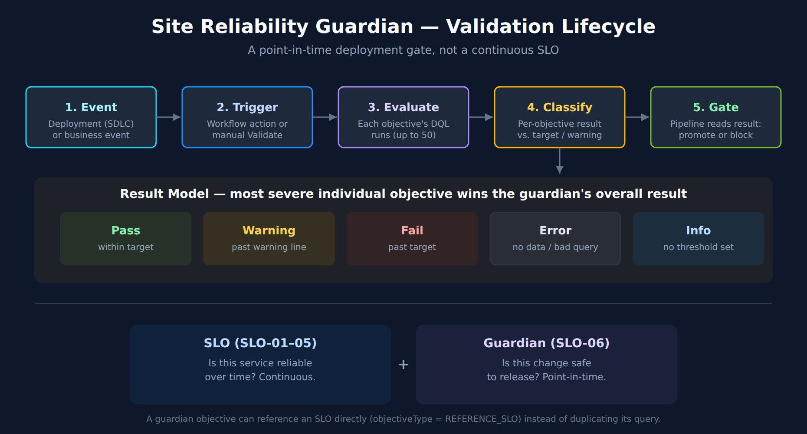

# SLO-06: Site Reliability Guardians

> **Series:** SLO — Service Level Objectives | **Notebook:** 6 of 6 | **Created:** August 2026 | **Last Updated:** 08/31/2026

## Overview

An SLO answers *"is this service reliable over time?"* — evaluated continuously against a rolling or calendar window (SLO-01). A **Site Reliability Guardian (SRG)** answers a narrower, sharper question: *"is this specific change safe to release?"* — a set of DQL-based objectives validated once, at a point in time, against a deployment or business event. This notebook covers what a guardian validates, how objectives and thresholds work, creating and triggering guardians, provisioning them as code, where guardians plug into a CI/CD pipeline, and how guardians and SLOs complement rather than compete with each other.

---

## Table of Contents

1. [What a Guardian Validates](#what)
2. [Objectives, Thresholds, and the Result Model](#objectives)
3. [Creating a Guardian](#creating)
4. [Triggering Validation](#triggering)
5. [Guardians as Code](#as-code)
6. [CI/CD Pipeline Integration](#cicd)
7. [Guardian vs SLO — Which One, or Both](#decision)

---

## Prerequisites

| Requirement | Details |
|-------------|---------|
| **Dynatrace Environment** | SaaS Gen3 with the Site Reliability Guardian app |
| **Permissions** | Grail read scopes covering whatever data your objective DQL queries touch (`storage:spans:read`, `storage:metrics:read`, `storage:bizevents:read`, …); workflow authoring permissions for automated validation |
| **Tooling (as code)** | Terraform with the `dynatrace-oss/dynatrace` provider, or Monaco |
| **Prior reading** | SLO-01 (SLI/SLO fundamentals), SLO-02 (writing DQL SLI queries — the same DQL skill authors guardian objectives) |

<a id="what"></a>
## 1. What a Guardian Validates

A **Site Reliability Guardian** is a Dynatrace app that automates change impact analysis to validate service availability, performance, and capacity objectives for a set of guarded entities. Where an SLO is a standing promise evaluated continuously, a guardian is a **point-in-time validation** run against a specific event. The app supports two guardian types:

| Guardian type | `eventKind` | Triggered by |
|---|---|---|
| **Lifecycle guardian** | `SDLC_EVENT` | Software delivery events — a deployment, a release-stage transition |
| **Business guardian** | `BIZ_EVENT` | Business events — a marketing-campaign launch, a pricing change |

Both guardian types share the same mechanics: a named group of **objectives**, each one a DQL query evaluated against a chosen timeframe, checked against thresholds, and rolled up into a single result for the guardian as a whole.



<!-- MARKDOWN_TABLE_ALTERNATIVE
| Step | Action |
|------|--------|
| 1 Event | Deployment or business event occurs |
| 2 Trigger | Workflow (or manual Validate) starts guardian validation |
| 3 Evaluate | Each objective's DQL query runs against the event timeframe |
| 4 Classify | Per-objective result: Pass / Warning / Fail / Error / Info |
| 5 Roll up | Guardian result = most severe individual objective result |
| 6 Gate | CI/CD pipeline reads the result and promotes or blocks |
For environments where SVG doesn't render
-->

<a id="objectives"></a>
## 2. Objectives, Thresholds, and the Result Model

Each objective is, at its core, a DQL query returning a single scalar value, checked against a threshold. This is the same DQL skill from SLO-02 — a guardian objective and an SLO's SLI query are structurally the same *good ÷ total* or scalar-metric shape. What differs is the timeframe (a short deployment window, not a rolling 30 days) and what happens with the result (gate a release, not accumulate an error budget).

### Objective type

| `objectiveType` | What it evaluates |
|---|---|
| **`DQL`** | A DQL query you write, evaluated over the guardian's validation timeframe |
| **`REFERENCE_SLO`** | An existing SLO's current value — ties a guardian directly to an SLO defined in SLO-01/02 rather than duplicating the query |

### Threshold type

| Threshold type | Behavior |
|---|---|
| **No thresholds** | Informational only — the objective reports a value but never fails the guardian |
| **Static thresholds** | Fixed `target` (fail point) and `warning` (soft threshold) values |
| **Auto-adaptive thresholds** | Threshold adjusts dynamically from historical data — the same idea as an SLO's adaptive baseline |

A `comparisonOperator` says which direction is good — "a higher value is good" (`GREATER_THAN_OR_EQUAL`) or "a lower value is good" (`LESS_THAN_OR_EQUAL`). An error-rate objective is a lower-is-good comparison against a `target`/`warning` pair; a request-count or bizevent-count objective is usually higher-is-good.

### Result model

Each objective resolves to one of five states, and **the guardian's overall result is the most severe individual objective result**:

| Result | Meaning |
|---|---|
| **Pass** | Value within the acceptable range |
| **Warning** | Value crossed the warning threshold but not the fail threshold |
| **Fail** | Value crossed the fail threshold |
| **Error** | The indicator could not be derived (bad query, no data) |
| **Info** | Informational objective (no threshold) — never drives Fail |

Two objective queries below, live-verified against the validation tenant, in the shape a guardian would actually run them — a short window, since a guardian validates one change, not a rolling reliability posture.

**Error rate — lower is good (`LESS_THAN_OR_EQUAL` comparison):**

```dql
// Guardian objective — error rate. Lower is good; compare against target/warning with LESS_THAN_OR_EQUAL.
// Live-verified against the validation tenant: returned ~0.40% over the last hour.
fetch spans, from:-1h
| filter span.kind == "server"
| summarize {
    good = countIf(duration < 500ms),
    total = count()
  }
| fieldsAdd errorRate = 100.0 - (good * 100.0) / total
| fields errorRate, good, total
```

**Availability — higher is good (`GREATER_THAN_OR_EQUAL` comparison):**

```dql
// Guardian objective — availability. Higher is good; compare against target/warning with GREATER_THAN_OR_EQUAL.
// Live-verified against the validation tenant: returned ~95.6% over the last 30 minutes.
timeseries {
  total = sum(dt.service.request.count),
  failures = sum(dt.service.request.failure_count)
}, from:-30m
| fieldsAdd availability = ((arraySum(total) - arraySum(failures)) / arraySum(total)) * 100
| fields availability
```

<a id="creating"></a>
## 3. Creating a Guardian

Two ways to create a guardian in the app:

- **From a template** — pick a template, run its prefilled DQL query to select guarded entities (or select all rows on the current page), then refine the pre-populated objectives.
- **Blank** — set the guardian type and name, then add objectives with your own DQL queries. When you select an entity, the app prefills the query with the correct scoping — replace any remaining placeholder (e.g. `HOST-PLACEHOLDER`) with your actual value.

**Limit:** a guardian supports a maximum of **50 objectives**.

**Variables** parameterize a guardian at the group level — define a guardian-level variable (prefixed `$`, e.g. `$MyTotal`), reference it inside an objective's DQL query, and set its value either at creation time or per validation run. This is what makes one guardian definition reusable across environments (dev / staging / prod) instead of hardcoding a threshold or entity per guardian copy.

<a id="triggering"></a>
## 4. Triggering Validation

A guardian's objectives don't evaluate themselves — validation is triggered one of two ways:

- **On-demand** — an operator opens the guardian and selects **Validate**. Useful while authoring objectives, or for an ad hoc check.
- **Automated, via Workflow** — a workflow with an event trigger runs the `dynatrace.site.reliability.guardian:validate-guardian-action` task, which validates a named guardian over a timeframe (e.g. the last 30 minutes) whenever a matching event arrives. A representative trigger filter: `application == "easytrade" and stage == "production"` — scoping validation to the specific deployment that just happened, not every deployment across every service.

This is ordinary Workflow mechanics — event trigger, filter condition, action — covered in general by the **WFLOW series**. What's specific to guardians is the action type and the fact that its result (Pass / Warning / Fail) is what a CI/CD pipeline reads back to decide whether to proceed (§6).

<a id="as-code"></a>
## 5. Guardians as Code

A guardian evaluated only by hand in the UI doesn't scale past one team's first pipeline. Provision it the same way SLO-05 provisions SLOs.

### Terraform

The `dynatrace_site_reliability_guardian` resource — schema confirmed against the `dynatrace-oss/dynatrace` provider registry, 08/31/2026:

```terraform
# dynatrace_site_reliability_guardian — schema confirmed against the
# dynatrace-oss/dynatrace provider registry, 08/31/2026.
resource "dynatrace_site_reliability_guardian" "checkout_release_gate" {
  name       = "Checkout Release Gate"
  event_kind = "SDLC_EVENT"
  tags       = ["stage:staging"]

  objectives {
    objective {
      name                = "Error rate"
      objective_type      = "DQL"
      comparison_operator = "LESS_THAN_OR_EQUAL"
      dql_query           = <<-EOT
        fetch spans, from:-30m
        | filter span.kind == "server"
        | summarize good = countIf(duration < 500ms), total = count()
        | fieldsAdd errorRate = 100.0 - (good * 100.0) / total
        | fields errorRate
      EOT
      target  = 8
      warning = 6
    }
    objective {
      name                = "Checkout volume"
      objective_type      = "DQL"
      comparison_operator = "GREATER_THAN_OR_EQUAL"
      dql_query           = <<-EOT
        fetch bizevents, from:-30m
        | filter event.type == "checkout"
        | summarize count()
      EOT
      target  = 50
      warning = 55
    }
  }
}
```

A few things this schema encodes, and where it diverges from the SLO-05 Terraform resource so you don't carry that field naming over by mistake:

- **`target` / `warning`**, not SLO-05's `target_success` / `target_warning` — two different resources, two different argument names for a similar idea.
- **`comparison_operator`** takes exactly `GREATER_THAN_OR_EQUAL` or `LESS_THAN_OR_EQUAL` — not the SLO app's own comparison vocabulary.
- **`objective_type = "REFERENCE_SLO"`** is the alternative to `DQL` — set `reference_slo` to an existing SLO instead of writing a query, which is the as-code form of §7's "guardian objective backed by an SLO" pattern.
- **`event_kind`** is `SDLC_EVENT` or `BIZ_EVENT` — matching the guardian-type distinction from §1.

### Monaco

Monaco projects use a three-file convention rather than a single settings object:

| File | Holds |
|---|---|
| `guardian.json` | The guardian definition — name, `eventKind`, tags, and the `objectives` array (`objectiveType`, `dqlQuery` or a reference, `target`, `warning`, `comparisonOperator`) |
| `workflow.json` | The automation template that triggers validation — an event trigger with a filter condition, and a task invoking the guardian-validate action |
| `config.yaml` | Shared parameters both files reference, so one edit updates both the guardian and the workflow that validates it |

### The dtctl gap

As of the `dtctl` version this repo standardizes on (0.38 — see the root `CLAUDE.md`), `dtctl get --help` lists no dedicated `guardians` resource. Terraform and Monaco are the working config-as-code path today; there is no `dtctl get guardians` / `dtctl apply` shortcut to reach for instead.

<a id="cicd"></a>
## 6. CI/CD Pipeline Integration

The guardian mechanics above only pay off wired into a pipeline. The shape is consistent across CI/CD platforms:

1. **Deploy** the change to the target environment.
2. **Emit a deployment event** (an SDLC event, if using a lifecycle guardian) so Dynatrace has something to correlate the validation window against.
3. **Trigger the guardian workflow** — either directly from the pipeline (call the workflow/guardian API) or let the event trigger from step 2 fire it automatically (§4).
4. **Read back the result.** A Pass gates the pipeline forward; a Fail blocks promotion; a Warning is a judgment call — treat it like the slow-burn tier in SLO-04, a signal to the team rather than an automatic block.

**AUTOM-07** documents the working samples for this: `github_pipeline_observability` / `gitlab_pipeline_observability` / `argocd_observability` (Monaco and Terraform variants) ingest SDLC events via OpenPipeline with pre-built dashboards, and the community [dynatrace-automation-tools](https://github.com/Dynatrace/dynatrace-automation-tools) CLI wraps guardian validation and deployment-event ingestion specifically for CI/CD use — see AUTOM-07's Community Resources section for the full sample matrix across GitHub Actions, GitLab CI, Azure DevOps, and ArgoCD.

<a id="decision"></a>
## 7. Guardian vs SLO — Which One, or Both

| | SLO (SLO-01–05) | Site Reliability Guardian |
|---|---|---|
| **Question answered** | Is this service reliable over time? | Is this specific change safe to release? |
| **Evaluation** | Continuous, rolling or calendar window (SLO-01 §2) | Point-in-time, triggered by an event |
| **Output** | Error budget consumption, burn rate (SLO-03) | Pass / Warning / Fail / Error / Info per objective |
| **Alerting fit** | Burn-rate alerting, ongoing (SLO-04) | Pipeline gate — block or promote a deployment |
| **As code** | `dynatrace_platform_slo` (SLO-05) | `dynatrace_site_reliability_guardian` (§5) |

They are not competing mechanisms — a guardian objective can reference an SLO directly (`objective_type = "REFERENCE_SLO"`, §5), which is the natural way to use both together: **the SLO defines what "reliable" means for the service on an ongoing basis; the guardian asks whether the change you're about to ship keeps it that way.** A team with no SLOs yet can still use guardians standalone with DQL objectives (§2) — a guardian doesn't require an SLO to exist first — but a mature setup typically has SLOs defining the target and guardians enforcing it at every release.

## Summary

In this notebook you learned:

1. **What a guardian validates** — point-in-time change validation, not continuous reliability; Lifecycle (`SDLC_EVENT`) vs Business (`BIZ_EVENT`) guardian types
2. **Objectives and thresholds** — `DQL` vs `REFERENCE_SLO` objective types, static / adaptive / no-threshold modes, and the five-state Pass / Warning / Fail / Error / Info result model (most severe wins)
3. **Creating a guardian** — template vs blank, the 50-objective limit, guardian-level variables
4. **Triggering validation** — on-demand Validate vs the automated Workflow action
5. **Guardians as code** — the `dynatrace_site_reliability_guardian` Terraform resource, the Monaco three-file convention, and the current `dtctl` gap
6. **CI/CD integration** — the deploy → event → trigger → gate shape, and where AUTOM-07's working samples plug in
7. **Guardian vs SLO** — complementary, not competing; a guardian objective can reference an SLO directly

## Series Summary

| Notebook | Topic | Key Takeaway |
|----------|-------|--------------|
| SLO-01 | Fundamentals | SLI/SLO/error-budget building blocks, modern vs classic SLO app |
| SLO-02 | Defining SLIs | Good/total DQL for availability, latency, error-rate, and business SLIs |
| SLO-03 | Composition & Error Budgets | Burn-rate math, composite/weighted-global SLOs, rolling vs calendar windows |
| SLO-04 | Alerting | Burn-rate over threshold-on-SLI; fast/slow-burn multiwindow alerts |
| SLO-05 | SLOs as Code | Terraform/Monaco/API provisioning for the modern SLO app |
| SLO-06 | Site Reliability Guardians | Point-in-time deployment validation gates, complementary to ongoing SLOs |

> <sub>**Sources:** [Site Reliability Guardian (DT docs)](https://docs.dynatrace.com/docs/deliver/site-reliability-guardian), [Create a Site Reliability Guardian (DT docs)](https://docs.dynatrace.com/docs/deliver/site-reliability-guardian/create-srg), [Add Site Reliability Guardian objective (DT docs)](https://docs.dynatrace.com/docs/deliver/site-reliability-guardian/reference), [Site Reliability Guardian as code (DT docs)](https://docs.dynatrace.com/docs/deliver/site-reliability-guardian/config-as-code-srg), [dynatrace_site_reliability_guardian resource (Dynatrace provider docs)](https://registry.terraform.io/providers/dynatrace-oss/dynatrace/latest/docs/resources/site_reliability_guardian). Terraform schema and the objective/threshold model fetched at source 08/31/2026; the two DQL objective queries in §2 were executed against the validation tenant the same day. **Derived:** the dtctl-gap note in §5 combines this repo's pinned `dtctl` version (root `CLAUDE.md`) with a direct `dtctl get --help` check — neither source states the gap on its own.</sub>

---

<sub>*This notebook was AI-generated from community-submitted and publicly available sources. This notebook series is not officially supported by Dynatrace. Always verify information against official Dynatrace documentation.*</sub>
