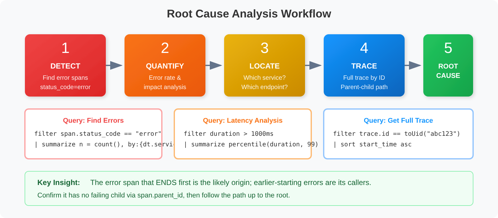
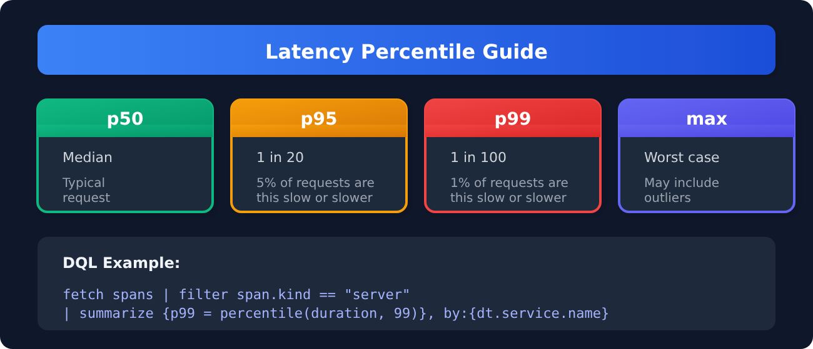
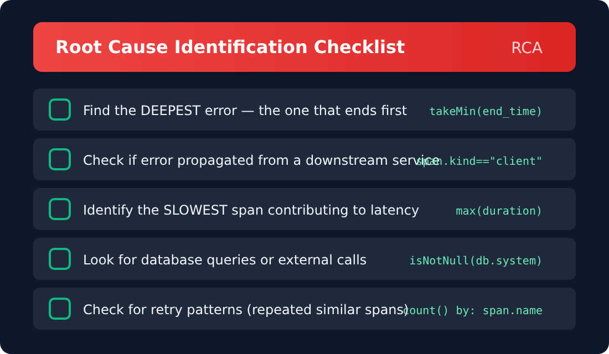

# SPANS-03: Trace Analysis & Troubleshooting

> **Series:** SPANS — Distributed Tracing and Spans | **Notebook:** 3 of 8 | **Created:** December 2025 | **Last Updated:** 10/02/2026

## Root Cause Analysis with Distributed Traces
This notebook teaches systematic approaches to troubleshoot issues using span data. You'll learn to identify error patterns, analyze latency, and trace problems to their root cause.

---

## Table of Contents

1. [Finding Error Spans](#finding-error-spans)
2. [Error Pattern Analysis](#error-pattern-analysis)
3. [Latency Analysis](#latency-analysis)
4. [Finding Slow Requests](#finding-slow-requests)
5. [Reconstructing Complete Traces](#reconstructing-complete-traces)
6. [Identifying Root Cause](#identifying-root-cause)
7. [Downstream Dependency Analysis](#downstream-dependency-analysis)
8. [Database Query Troubleshooting](#database-query-troubleshooting)

---


## Prerequisites

Before starting this notebook, ensure you have:

- ✅ Completed **SPANS-01** and **SPANS-02**
- ✅ Access to a Dynatrace environment with span data
- ✅ Understanding of DQL filtering and aggregation

## 1. RCA Workflow Overview <a id="rca-workflow"></a>

Follow this systematic approach for root cause analysis:



<!--MARKDOWN_TABLE_ALTERNATIVE
| Step | Action | Purpose |
|------|--------|---------|
| 1. DETECT | Find error or slow traces | Identify symptoms |
| 2. QUANTIFY | Count affected traces/users | Understand impact |
| 3. LOCATE | Get full trace by trace.id | Isolate the problem |
| 4. TRACE | Find first error/slowest span | Follow the flow |
| 5. ROOT CAUSE | Identify originating service | Find the source |
-->

### Key Questions to Answer

| Question | Query Strategy |
|----------|----------------|
| What's failing? | Filter `span.status_code == "error"` |
| Where did it start? | Find the **deepest** error span — the one that ends first (§7) |
| What's slow? | Filter `duration > threshold` |
| Is it widespread? | Aggregate by service/operation |
| What changed? | Compare time windows |

---

<a id="finding-error-spans"></a>
## 2. Finding Error Spans
Start by identifying error spans in your system:

> ⚠️ Remember: `span.status_code` values are lowercase (`"error"`, not `"ERROR"`), and the field is absent on most spans. A server span can also fail without it: on the validation tenant 43 of 558 HTTP 5xx server spans in an hour carried no status, so the error-rate cells below count `span.status_code == "error" or http.response.status_code >= 500`.

```dql
// Find recent error spans
fetch spans, from:-1h
| filter span.status_code == "error"
| fields start_time,
         dt.service.name,
         span.name,
         span.status_message,
         trace.id,
         duration
| sort start_time desc
| limit 50
```

```dql
// Count errors by service to see which services are most affected
fetch spans, from:-1h
| filter span.status_code == "error"
| summarize {
    error_count = count(),
    affected_traces = countDistinct(trace.id)
  }, by: {dt.service.name}
| sort error_count desc
| limit 20
```

```dql
// Error rate per service (server spans only)
fetch spans, from:-1h
| filter span.kind == "server"
| summarize {
    total_requests = count(),
    error_count = countIf(span.status_code == "error" or http.response.status_code >= 500)
  }, by: {dt.service.name}
| fieldsAdd error_rate_pct = (error_count * 100.0) / total_requests
| sort error_rate_pct desc
| limit 20
```

---

<a id="error-pattern-analysis"></a>
## 3. Error Pattern Analysis
Group errors to identify common patterns:

```dql
// Group errors by type and service using collectDistinct
fetch spans, from:-1h
| filter span.status_code == "error"
| summarize {
    occurrence = count(),
    affected_traces = countDistinct(trace.id),
    services_affected = collectDistinct(dt.service.name)
  }, by: {span.name, span.status_message}
| sort occurrence desc
| limit 20
```

```dql
// Find traces with multiple errors (cascading failures)
// origin_* is the error span that ENDED first — the deepest failing call (see §7).
fetch spans, from:-1h
| filter span.status_code == "error"
| summarize {
    error_count = count(),
    services_affected = collectDistinct(dt.service.name),
    origin = takeMin(record(end_time = end_time, span = span.name))
  }, by: {trace.id}
| filter error_count > 1
| fieldsAdd origin_span = origin[span]
| fieldsRemove origin
| sort error_count desc
| limit 20
```

```dql
// Error timeline - visualize errors over time
fetch spans, from:-24h
| filter span.kind == "server"
| makeTimeseries {
    errors = countIf(span.status_code == "error"),
    total = count()
  }, interval: 5m, by: {dt.service.name}
```

---

<a id="latency-analysis"></a>
## 4. Latency Analysis
Analyze latency patterns to find performance issues:



<!--MARKDOWN_TABLE_ALTERNATIVE
| Percentile | Description | Impact |
|------------|-------------|--------|
| p50 (median) | Typical request | Half of requests are this fast or faster |
| p95 | 1 in 20 requests is this slow or slower | Common SLO target |
| p99 | 1 in 100 requests is this slow or slower | Tail latency indicator |
| max | Worst case (may be outliers) | May not reflect real user impact |
-->

```dql
// Latency percentiles by service
fetch spans, from:-1h
| filter span.kind == "server"
| summarize {
    requests = count(),
    p50_ms = percentile(duration, 50) / 1ms,
    p95_ms = percentile(duration, 95) / 1ms,
    p99_ms = percentile(duration, 99) / 1ms,
    max_ms = max(duration) / 1ms
  }, by: {dt.service.name}
| sort p99_ms desc
| limit 20
```

```dql
// Latency percentiles by operation
fetch spans, from:-1h
| filter span.kind == "server"
| summarize {
    requests = count(),
    p50_ms = percentile(duration, 50) / 1ms,
    p95_ms = percentile(duration, 95) / 1ms,
    p99_ms = percentile(duration, 99) / 1ms
  }, by: {dt.service.name, span.name}
| filter requests > 10
| sort p95_ms desc
| limit 30
```

```dql
// Latency trend over time (use bin() for percentiles since makeTimeseries doesn't support percentile)
fetch spans, from:-24h
| filter span.kind == "server"
| fieldsAdd time_bucket = bin(start_time, 10m)
| summarize {
    p95_ms = percentile(duration, 95) / 1ms,
    request_count = count()
  }, by: {time_bucket, dt.service.name}
| sort time_bucket desc, dt.service.name
| limit 100
```

---

<a id="finding-slow-requests"></a>
## 5. Finding Slow Requests
Identify and analyze slow requests:

```dql
// Find slow server spans (> 1 second)
fetch spans, from:-1h
| filter span.kind == "server"
| filter duration > 1s
| fieldsAdd duration_ms = duration / 1ms
| fields start_time,
         dt.service.name,
         span.name,
         duration_ms,
         trace.id
| sort duration_ms desc
| limit 50
```

```dql
// Find slow traces by their root span (the entry point)
// A root span has no parent; its duration covers the trace's entry request.
fetch spans, from:-1h
| filter isNull(span.parent_id)
| filter duration > 1s
| fieldsAdd duration_ms = duration / 1ms
| fields trace.id, entry_point = span.name, dt.service.name, duration_ms
| sort duration_ms desc
| limit 20
```

```dql
// Identify slow operations (candidates for optimization)
fetch spans, from:-1h
| filter span.kind == "server"
| filter duration > 500ms
| summarize {
    slow_count = count(),
    avg_duration_ms = avg(duration) / 1ms,
    max_duration_ms = max(duration) / 1ms
  }, by: {dt.service.name, span.name}
| sort slow_count desc
| limit 20
```

---

<a id="reconstructing-complete-traces"></a>
## 6. Reconstructing Complete Traces
Once you've identified a problematic trace, reconstruct the full picture:

```dql
// Get a sample trace ID from error spans
fetch spans, from:-1h
| filter span.status_code == "error"
| fields trace.id, dt.service.name, span.name
| limit 5
```

```dql
// Reconstruct full trace (replace YOUR_TRACE_ID with actual trace.id)
fetch spans, from:-1h
// trace.id is a uid: keep the toUid() wrapper — a plain string never matches.
// | filter trace.id == toUid("YOUR_TRACE_ID")
| fieldsAdd duration_ms = duration / 1ms
| fields start_time,
         dt.service.name,
         span.name,
         span.kind,
         duration_ms,
         span.status_code,
         span.parent_id,
         span.id
| sort start_time asc
| limit 100
```

```dql
// Analyze trace complexity
// trace_duration_ms is wall-clock (last end minus first start); summing span
// durations would double-count nested and parallel work.
fetch spans, from:-1h
| summarize {
    span_count = count(),
    services_involved = countDistinct(dt.service.name),
    has_errors = countIf(span.status_code == "error") > 0,
    first_start = min(start_time),
    last_end = max(end_time)
  }, by: {trace.id}
| fieldsAdd trace_duration_ms = (last_end - first_start) / 1ms
| fields trace.id, span_count, services_involved, has_errors, trace_duration_ms
| sort span_count desc
| limit 20
```

---

<a id="identifying-root-cause"></a>
## 7. Identifying Root Cause
Use these patterns to find the origin of problems:



<!--MARKDOWN_TABLE_ALTERNATIVE
| Check | What to Look For | DQL Pattern |
|-------|------------------|-------------|
| Deepest error | The error span that ENDS first — callers that inherited the error end later | `takeMin(record(end_time = end_time, …))` |
| Downstream propagation | Error from downstream service | `span.kind == "client"` |
| Slowest span | SLOWEST span contributing to latency | `max(duration)` |
| External calls | Database queries or external calls | `isNotNull(db.system)` |
| Retry patterns | Repeated similar spans | `count() by: span.name` |
-->

> **Look for the deepest error, not the earliest one.** When a call fails, every caller above it usually fails too, and those callers **started earlier**. Picking the error span with the smallest `start_time` therefore lands on the outermost symptom. On the validation tenant, in 231 of 247 traces with more than one error span, the earliest-starting error span was the parent of another error span; the earliest-*ending* error span was a parent of another error span in 0 of 247. Use the error span that ended first as the likely origin, then confirm it has no failing child.

```dql
// Find the likely ORIGIN error in each failing trace: the error span that ended first.
// takeMin over a record compares its first field (end_time) and returns the whole record.
fetch spans, from:-1h
| filter span.status_code == "error"
| summarize {
    error_spans = count(),
    origin = takeMin(record(end_time = end_time, service = dt.service.name, span = span.name, message = span.status_message))
  }, by: {trace.id}
| fieldsAdd origin_end = origin[end_time],
    origin_service = origin[service],
    origin_span = origin[span],
    origin_message = origin[message]
| fieldsRemove origin
| sort origin_end desc
| limit 20
```

```dql
// Find the bottleneck span in each trace
fetch spans, from:-1h
| summarize {
    max_duration_ms = max(duration) / 1ms,
    total_spans = count(),
    services = collectDistinct(dt.service.name)
  }, by: {trace.id}
| filter max_duration_ms > 500
| sort max_duration_ms desc
| limit 20
```

```dql
// Time spent per span kind (where is time going?)
fetch spans, from:-1h
| summarize {
    total_time_ms = sum(duration) / 1ms,
    span_count = count(),
    avg_time_ms = avg(duration) / 1ms
  }, by: {span.kind}
| sort total_time_ms desc
```

---

<a id="downstream-dependency-analysis"></a>
## 8. Downstream Dependency Analysis
Analyze failures in downstream services (CLIENT spans):

```dql
// Find which downstream services are causing errors
fetch spans, from:-1h
| filter span.kind == "client" and span.status_code == "error"
| summarize {
    failure_count = count(),
    sample_error = takeFirst(span.status_message),
    affected_traces = countDistinct(trace.id)
  }, by: {dt.service.name, span.name}
| sort failure_count desc
| limit 20
```

```dql
// Dependency health - error rates for outbound calls
fetch spans, from:-1h
| filter span.kind == "client"
| summarize {
    calls = count(),
    errors = countIf(span.status_code == "error"),
    p95_latency_ms = percentile(duration, 95) / 1ms
  }, by: {dt.service.name, span.name}
| fieldsAdd error_rate_pct = (errors * 100.0) / calls
| filter error_rate_pct > 5 or p95_latency_ms > 500
| sort error_rate_pct desc
| limit 20
```

```dql
// Map service-to-service dependencies
fetch spans, from:-1h
| filter span.kind == "client"
| filter isNotNull(server.address)
| summarize {
    call_count = count(),
    error_count = countIf(span.status_code == "error"),
    avg_latency_ms = avg(duration) / 1ms
  }, by: {dt.service.name, server.address}
| fieldsAdd error_rate_pct = (error_count * 100.0) / call_count
| sort call_count desc
| limit 30
```

---

<a id="database-query-troubleshooting"></a>
## 9. Database Query Troubleshooting
Analyze database operations for performance issues:

```dql
// Field names corrected 08/12/2026 — pre-1.0 OpenTelemetry database semconv names had been
// used throughout, and every one of them is null on Grail spans. They fail SILENTLY: a filter on a
// non-existent field matches nothing and a summarize groups everything under null, so these cells
// returned empty or single-null-group results without ever erroring.
//   db.operation         -> db.operation.name    (stable; set on 50,379 of 57,295 db spans)
//   db.statement         -> db.query.text        (stable; 33,463)
//   db.mongodb.collection-> db.collection.name   (stable; 6,912)
//   db.name              -> db.namespace         (stable; 57,281)
// Confirm the catalog for your tenant with:
//   fetch dt.semantic_dictionary.fields | filter startsWith(name, "db.") | fields name, stability
// Find slow database queries
fetch spans, from:-1h
| filter isNotNull(db.system)
| filter duration > 100ms
| summarize {
    query_count = count(),
    avg_ms = avg(duration) / 1ms,
    p95_ms = percentile(duration, 95) / 1ms,
    max_ms = max(duration) / 1ms
  }, by: {db.system, db.namespace, span.name}
| sort p95_ms desc
| limit 20
```

```dql
// Find failing database operations
fetch spans, from:-1h
| filter isNotNull(db.system) and span.status_code == "error"
| summarize {
    error_count = count(),
    sample_error = takeFirst(span.status_message)
  }, by: {db.system, db.namespace, span.name}
| sort error_count desc
| limit 20
```

```dql
// Quick service health check (use for dashboards)
fetch spans, from:-1h
| filter span.kind == "server"
| summarize {
    requests = count(),
    errors = countIf(span.status_code == "error" or http.response.status_code >= 500),
    p50_ms = percentile(duration, 50) / 1ms,
    p99_ms = percentile(duration, 99) / 1ms
  }, by: {dt.service.name}
| fieldsAdd error_rate_pct = (errors * 100.0) / requests
| sort error_rate_pct desc
| limit 20
```

---

## Summary

In this notebook, you learned:

✅ **RCA Workflow** - Systematic approach: Detect → Quantify → Locate → Trace → Root cause  
✅ **Find errors** using `span.status_code == "error"` (plus HTTP 5xx for server error rates) and count affected traces  
✅ **Error patterns** with `collectDistinct()` to see affected services  
✅ **Latency analysis** using percentiles (p50, p95, p99) and `bin()` for trends  
✅ **Slow request analysis** to identify optimization candidates  
✅ **Trace reconstruction** to see the full picture  
✅ **Root cause identification** - the deepest error (ends first), slowest span, bottlenecks  
✅ **Dependency analysis** - CLIENT spans show downstream failures  
✅ **Database troubleshooting** for slow or failing queries  

---

## Next Steps

Continue to **SPANS-04: Service Dependencies & Flow Analysis** to learn:
- Mapping service-to-service relationships
- Analyzing async messaging patterns
- Visualizing request flows
- Critical path analysis

---

## References

- [Trace semantic conventions (DT docs)](https://docs.dynatrace.com/docs/semantic-dictionary/model/trace)
- [Aggregation functions (DT docs)](https://docs.dynatrace.com/docs/platform/grail/dynatrace-query-language/functions/aggregation-functions) — `takeMin`, `percentile`, `collectDistinct`
- [Distributed traces (DT docs)](https://docs.dynatrace.com/docs/observe/application-observability/distributed-traces)

---

<sub>*This notebook was AI-generated from community-submitted and publicly available sources. This notebook series is not officially supported by Dynatrace. Always verify information against official Dynatrace documentation.*</sub>
