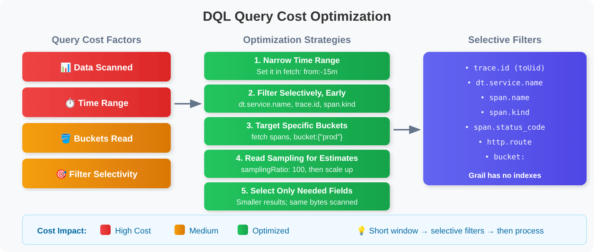
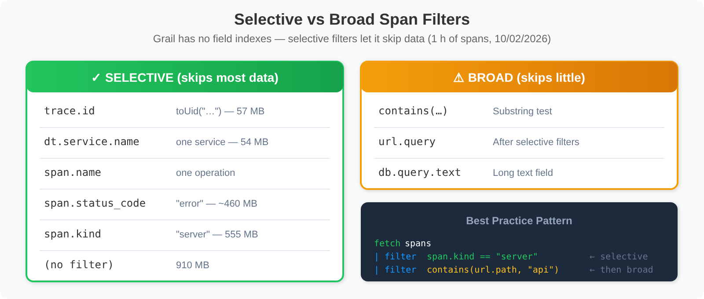
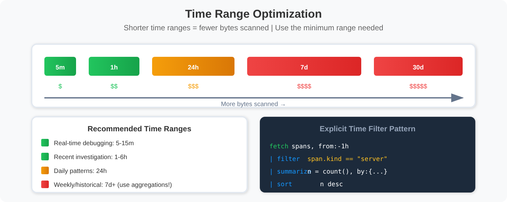

# SPANS-08: Cost-Efficient DQL Queries

> **Series:** SPANS — Distributed Tracing and Spans | **Notebook:** 8 of 8 | **Created:** December 2025 | **Last Updated:** 10/02/2026

## Optimizing Span Queries for Performance and Cost Efficiency
This notebook covers best practices for writing cost-efficient DQL queries, minimizing query consumption while maintaining effective observability.

---

## Table of Contents

1. [Understanding Query Costs](#understanding-query-costs)
2. [Filter Early Pattern](#filter-early-pattern)
3. [Selective Filters and Data Skipping](#selective-filters)
4. [Field Selection](#field-selection)
5. [Time Range Optimization](#time-range-optimization)
6. [Aggregation Efficiency](#aggregation-efficiency)
7. [High-Cardinality Grouping](#high-cardinality-grouping)
8. [Production Query Patterns](#production-query-patterns)
9. [Performance Checklist](#performance-checklist)
10. [Series Complete! 🎉](#series-complete)

---


## Prerequisites

Before starting this notebook, ensure you have:

- ✅ Completed previous SPANS notebooks (01-07)
- ✅ Understanding of DQL fundamentals
- ✅ Access to span data in your tenant (`storage:spans:read`)

<a id="understanding-query-costs"></a>
## 1. Understanding Query Costs
Query cost is driven by how much data a query scans. Under the **Dynatrace Platform Subscription (DPS)**, span queries bill under the **Traces - Query** capability, metered in bytes scanned. Every query result reports its `scannedBytes`, so you can measure each change below instead of guessing.



<!--MARKDOWN_TABLE_ALTERNATIVE
| Cost Factor | Impact | Optimization |
|-------------|--------|--------------|
| Time Range | High | Use the smallest range needed |
| Filter selectivity | High | Selective filters let Grail skip data |
| Bucket targeting | Medium | `bucket:` restricts what is read |
| Read sampling / scan limit | Medium | `samplingRatio`, `scanLimitGBytes` |
| Fields retrieved | Result size only | Fewer fields make smaller results, not fewer bytes scanned |
-->

### Cost Optimization Priorities

| Priority | Strategy | Impact |
|----------|----------|--------|
| 1 | Limit time range | High — 1 h → 15 min cut scanned bytes from 910 MB to 234 MB |
| 2 | Filter selectively, and early | High — `dt.service.name == "checkout"` scanned 54 MB of the same hour |
| 3 | Query specific buckets | Medium — targets data |
| 4 | Read sampling for estimates | Medium — `samplingRatio` reads a fraction and you scale up |
| 5 | Select only needed fields | Low — smaller results; scanned bytes unchanged |
| 6 | Use aggregations | Low — smaller results |

All figures: one hour of spans on the validation tenant, 10/02/2026.

> <sub>**Sources:** [DQL best practices (DT docs)](https://docs.dynatrace.com/docs/platform/grail/dynatrace-query-language/dql-best-practices) — *"A shorter analysis window provides better performance based on identical data sets."*</sub>

---

<a id="filter-early-pattern"></a>
## 2. Filter Early Pattern
The **most important** optimization: Apply filters as early as possible in the query pipeline.

```dql
// ✅ EFFICIENT: Filter BEFORE any processing
fetch spans, from:-1h
| filter span.kind == "server"
| filter dt.service.name == "checkout"   // replace with one of your services
| filter span.status_code == "error"
| fields start_time, span.name, duration
| limit 100
```

```dql
// ⚠️ LATE FILTER: processing and aggregation before the filter.
// On 10/02/2026 Grail's optimizer pushed this filter down and both forms scanned
// ~54 MB — but that is the optimizer's choice, not a guarantee. Filter first so the
// cost does not depend on it, and so the intent is obvious to the next reader.
fetch spans, from:-1h
| fieldsAdd duration_ms = duration / 1ms
| summarize {avg_duration = avg(duration_ms)}, by:{dt.service.name, span.name}
| filter dt.service.name == "checkout"
| limit 100
```

```dql
// ✅ EFFICIENT: Combine multiple filter conditions
fetch spans, from:-1h
| filter span.kind == "server"
        and isNotNull(dt.service.name)
        and duration > 100ms
| fields start_time, span.name, duration
| sort duration desc
| limit 50
```

---
<a id="selective-filters"></a>
## 3. Selective Filters and Data Skipping

Grail has **no field indexes**. Its storage technology *"obsoletes indexes"*, and query processing works by parallel scanning, *"eliminating the need for indexes"*. What makes a filter cheap is **selectivity**: when a condition rules out most of the data, Grail can skip reading it, and `scannedBytes` falls.

Measured on one hour of spans (10/02/2026):

| Filter | Bytes scanned |
|--------|---------------|
| none (`summarize count()`) | 910 MB |
| `span.kind == "server"` | 555 MB |
| `span.status_code == "error"` | ~460 MB |
| `trace.id == toUid("…")` | 57 MB |
| `dt.service.name == "checkout"` | 54 MB |



<!--MARKDOWN_TABLE_ALTERNATIVE
| Filter | Selectivity | Bytes scanned (1 h) |
|--------|-------------|---------------------|
| trace.id == toUid("…") | One trace | 57 MB |
| dt.service.name == "checkout" | One service | 54 MB |
| span.kind == "server" | About a third of spans | 555 MB |
| span.status_code == "error" | Error spans | ~460 MB |
| contains(url.path, "…") | Substring test — run after selective filters | — |
| No filter | Everything | 910 MB |
-->

> 💡 **Tip:** `trace.id` is a `uid`, not a string. `trace.id == "abc…"` is **always false** — Grail says so in an INFO and a SEVERE notification, but returns zero rows rather than an error. Write `trace.id == toUid("abc…")`.

> <sub>**Sources:** [Dynatrace Grail architecture (DT docs)](https://docs.dynatrace.com/docs/platform/grail/dynatrace-grail/architecture). **Dictionary:** `trace.id` (`stable`, `uid`), read 10/02/2026.</sub>

```dql
// ✅ FAST: Selective filters first
fetch spans, from:-1h
| filter isNotNull(dt.service.name)
| filter span.kind == "server"
| filter span.status_code == "error"
| fields start_time, span.name, duration
| limit 100
```

```dql
// ⚠️ BROAD: a substring test on its own skips little data
fetch spans, from:-1h
| filter contains(url.path, "checkout")  // broad
| limit 100
```

```dql
// ✅ BETTER: Selective filters first, then the substring test
fetch spans, from:-1h
| filter span.kind == "server"
| filter isNotNull(dt.service.name)
| filter contains(url.path, "checkout")  // substring test after the selective filters
| limit 100
```

---

<a id="field-selection"></a>
## 4. Field Selection
Select only the fields you need - avoid fetching all attributes.

```dql
// ✅ EFFICIENT: Select only required fields
fetch spans, from:-1h
| filter span.kind == "server"
| fields start_time,
         dt.service.name,
         span.name,
         duration,
         span.status_code
| limit 100
```

```dql
// ❌ INEFFICIENT: Fetching all fields (default behavior)
// Returns ALL fields for each span - more data transfer
fetch spans, from:-1h
| filter isNotNull(dt.service.name)
| limit 5
```

```dql
// ✅ EFFICIENT: Compute fields only when needed
fetch spans, from:-1h
| filter span.kind == "server"
| filter duration > 500ms
| fieldsAdd duration_ms = duration / 1ms
| fields start_time, dt.service.name, span.name, duration_ms
| sort duration_ms desc
| limit 50
```

---

<a id="time-range-optimization"></a>
## 5. Time Range Optimization
Always use the smallest time range that meets your needs.



<!--MARKDOWN_TABLE_ALTERNATIVE
| Time Range | Relative Cost | Use Case |
|------------|---------------|----------|
| Last 5m | $ | Real-time debugging |
| Last 1h | $$ | Recent issue analysis |
| Last 24h | $$$ | Daily patterns |
| Last 7d | $$$$ | Weekly trends |
| Last 30d | $$$$$ | Historical analysis (use aggregations!) |
-->

```dql
// Narrow window set in fetch. (A start_time filter right after fetch is pushed down to the
// same window — measured 10/02/2026 — but from: says it directly.)
fetch spans, from:-15m
| filter span.kind == "server"
| summarize {span_count = count()}, by:{dt.service.name}
| sort span_count desc
| limit 20
```

```dql
// Narrow time range for troubleshooting specific incident
fetch spans, from:-30m
| filter span.kind == "server"
| filter span.status_code == "error"
| fields start_time, dt.service.name, span.name, span.status_message
| sort start_time desc
| limit 100
```

```dql
// Use aggregations for longer time ranges to reduce output
fetch spans, from:-1h
| filter span.kind == "server"
| summarize {
    span_count = count(),
    error_count = countIf(span.status_code == "error"),
    avg_duration_ms = avg(duration) / 1ms
  }, by:{dt.service.name}
| sort span_count desc
| limit 25
```

---

<a id="aggregation-efficiency"></a>
## 6. Aggregation Efficiency
Use aggregations to summarize data instead of retrieving raw records. Simpler aggregations are faster.

```dql
// ✅ EFFICIENT: Basic aggregations
fetch spans, from:-1h
| filter span.kind == "server"
| summarize {
    requests = count(),
    errors = countIf(span.status_code == "error")
  }, by:{dt.service.name}
| sort requests desc
| limit 20
```

```dql
// ✅ EFFICIENT: Summarize at source with error rate calculation
fetch spans, from:-1h
| filter span.kind == "server"
| summarize {
    total_requests = count(),
    error_count = countIf(span.status_code == "error"),
    p50_duration_ms = percentile(duration, 50) / 1ms,
    p95_duration_ms = percentile(duration, 95) / 1ms
  }, by:{dt.service.name}
| fieldsAdd error_rate_pct = (error_count * 100.0) / total_requests
| sort total_requests desc
| limit 20
```

```dql
// ⚠️ More percentiles add compute time — they do not change bytes scanned, the billed
// quantity. Ask for the ones you will use.
fetch spans, from:-1h
| filter span.kind == "server"
| summarize {
    p50 = percentile(duration, 50) / 1ms,
    p75 = percentile(duration, 75) / 1ms,
    p90 = percentile(duration, 90) / 1ms,
    p95 = percentile(duration, 95) / 1ms,
    p99 = percentile(duration, 99) / 1ms
  }, by:{dt.service.name}
| limit 20
```

```dql
// Time-bucketed aggregations for trends
fetch spans, from:-1h
| filter span.kind == "server"
| fieldsAdd time_bucket = bin(start_time, 5m)
| summarize {
    request_count = count(),
    avg_duration_ms = avg(duration) / 1ms
  }, by:{time_bucket, dt.service.name}
| sort time_bucket desc, request_count desc
| limit 100
```

---

<a id="high-cardinality-grouping"></a>
## 7. High-Cardinality Grouping
Avoid grouping by high-cardinality fields (fields with many unique values).

```dql
// ❌ BAD: Grouping by high-cardinality field
// trace.id could have millions of unique values!
fetch spans, from:-1h
| summarize {trace_span_count = count()}, by:{trace.id}
| limit 10
```

```dql
// ✅ GOOD: Group by lower-cardinality fields
fetch spans, from:-1h
| summarize {span_count = count()}, by:{dt.service.name, span.name}
| sort span_count desc
| limit 20
```

```dql
// ✅ GOOD: If you need trace analysis, filter first
fetch spans, from:-15m                    // Narrow time
| filter span.status_code == "error"      // Reduce first
| summarize {
    span_count = count(),
    services = collectDistinct(dt.service.name)
  }, by:{trace.id}
| sort span_count desc
| limit 20
```

---

<a id="production-query-patterns"></a>
## 8. Production Query Patterns
Optimized query templates for common production use cases.

```dql
// Production Pattern: Service Health Dashboard
// Optimized for dashboard refresh (low cost)
fetch spans, from:-1h, bucket: {"default_spans"}   // use your own bucket names
| filter span.kind == "server"
| summarize {
    requests = count(),
    errors = countIf(span.status_code == "error"),
    avg_latency_ms = avg(duration) / 1ms
  }, by:{dt.service.name}
| fieldsAdd error_rate = (errors * 100.0) / requests
| sort requests desc
| limit 20
```

```dql
// Production Pattern: Error Investigation
// Fast targeted query for debugging
fetch spans, from:-30m, bucket: {"default_spans"}   // use your own bucket names
| filter span.kind == "server"
| filter span.status_code == "error"
| fields start_time,
         dt.service.name,
         span.name,
         span.status_message,
         trace.id
| sort start_time desc
| limit 50
```

```dql
// Production Pattern: Latency Trend Analysis
// Using bin() for time-series without makeTimeseries
fetch spans, from:-1h, bucket: {"default_spans"}   // use your own bucket names
| filter span.kind == "server"
| filter isNotNull(dt.service.name)
| fieldsAdd time_bucket = bin(start_time, 5m)
| summarize {
    request_count = count(),
    p95_latency_ms = percentile(duration, 95) / 1ms
  }, by:{time_bucket}
| sort time_bucket desc
| limit 50
```

```dql
// Production Pattern: Top Slow Operations
// Focus on actionable data
fetch spans, from:-1h, bucket: {"default_spans"}   // use your own bucket names
| filter span.kind == "server"
| filter duration > 1s
| summarize {
    occurrence_count = count(),
    avg_duration_ms = avg(duration) / 1ms,
    max_duration_ms = max(duration) / 1ms
  }, by:{dt.service.name, span.name}
| sort avg_duration_ms desc
| limit 20
```

```dql
// Production Pattern: Well-optimized comprehensive query
// Follows all optimization rules
fetch spans, from:-1h                      // 1. Appropriate time range
| filter span.kind == "server"             // 2. Filter early
| filter span.status_code == "error"       // 3. Selective filter
| fields start_time, span.name, duration, http.route  // 4. Only needed fields (smaller results)
| summarize {
    error_count = count(),
    avg_duration_ms = avg(duration) / 1ms
  }, by:{span.name, http.route}            // 5. Low cardinality
| sort error_count desc
| limit 20                                 // 6. Limited results
```

---

<a id="performance-checklist"></a>
## 9. Performance Checklist
Use this checklist before running production queries:

```
Query Optimization Checklist:

☐ 1. Time range - Is it as short as possible for my needs?
☐ 2. Filter early - Are filters immediately after fetch?
☐ 3. Selectivity - Do my first filters rule out most of the data?
      • trace.id (toUid!), dt.service.name, span.name
      • span.kind, span.status_code
☐ 4. Field selection - Am I selecting only needed fields?
☐ 5. Low cardinality - Are my group-by fields low cardinality?
☐ 6. Result limits - Do I have appropriate limits?
☐ 7. Bucket targeting - Am I querying specific buckets if known?
```

---

## Summary

In this notebook, you learned:

✅ **Query cost factors** and optimization priorities  
✅ **Filter early pattern** to reduce data scanned  
✅ **Selective filters** — Grail has no indexes; selectivity drives data skipping  
✅ **Field selection** to minimize data transfer  
✅ **Time range optimization** for cost control  
✅ **Aggregation efficiency** for summarized results  
✅ **High-cardinality grouping** pitfalls to avoid  
✅ **Production patterns** for common use cases  
✅ **Performance checklist** for query review  

---

<a id="series-complete"></a>
## Series Complete! 🎉
You have completed the **Spans & Distributed Tracing** notebook series!

### What You've Learned:

1. **Fundamentals** - Span structure and distributed tracing concepts
2. **Querying** - DQL syntax for effective span analysis
3. **Troubleshooting** - Error detection and root cause analysis
4. **Topology** - Service dependencies and flow visualization
5. **Analytics** - Advanced metrics and trend analysis
6. **Security** - Security monitoring and compliance with spans
7. **Buckets & Pipeline** - Data architecture, OpenPipeline, and governance
8. **Cost Optimization** - Time range, selective filters, buckets and read sampling

### Next Steps:

- Apply these patterns to your own Dynatrace environment
- Build dashboards using the optimized query patterns
- Configure alerts based on span analytics
- Set up OpenPipeline for data optimization
- Explore Dynatrace Intelligence integration for intelligent analysis

---

## References

- [DQL best practices (DT docs)](https://docs.dynatrace.com/docs/platform/grail/dynatrace-query-language/dql-best-practices)
- [Dynatrace Grail architecture (DT docs)](https://docs.dynatrace.com/docs/platform/grail/dynatrace-grail/architecture)
- [Data source commands — fetch (DT docs)](https://docs.dynatrace.com/docs/platform/grail/dynatrace-query-language/commands/data-source-commands)

---

<sub>*This notebook was AI-generated from community-submitted and publicly available sources. This notebook series is not officially supported by Dynatrace. Always verify information against official Dynatrace documentation.*</sub>
