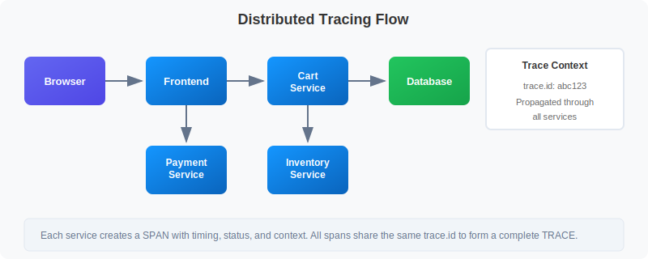
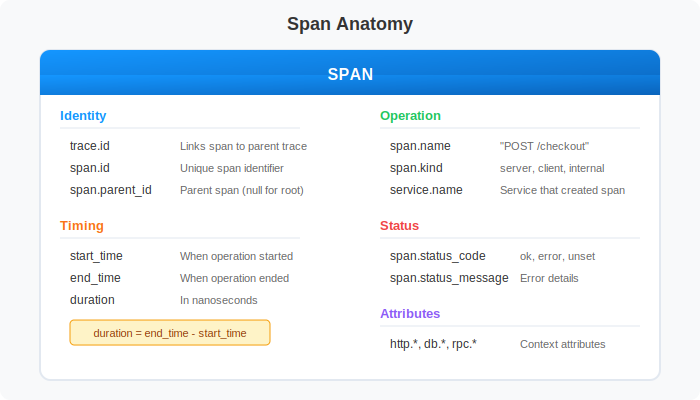
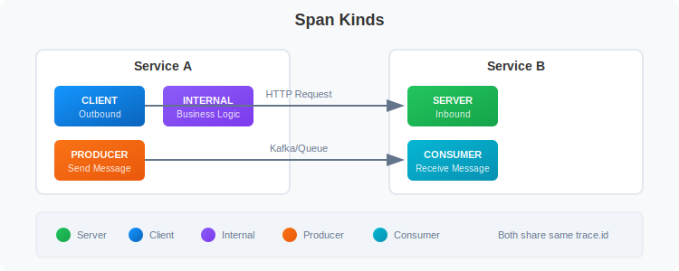
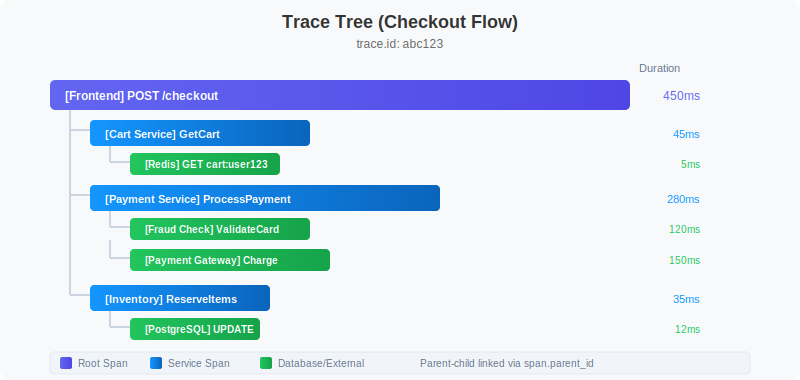

# 🔍 Spans & Distributed Tracing Fundamentals

> **Series:** SPANS | **Notebook:** 1 of 8 | **Created:** December 2025

## Understanding the Building Blocks of Observability

This notebook introduces distributed tracing concepts and demonstrates how to query span data in Dynatrace using DQL. You'll learn what spans are, how they form traces, and how to explore your distributed systems.

---

## Table of Contents

1. What is Distributed Tracing?
2. Understanding Spans
3. Span Anatomy
4. Span Kinds
5. Trace Structure
6. Your First Span Query


## Prerequisites

Before starting this notebook, ensure you have:

- ✅ Access to a Dynatrace environment with span data
- ✅ DQL query permissions (viewer role minimum)
- ✅ Basic understanding of microservices architecture

## 1. What is Distributed Tracing? <a name="distributed-tracing"></a>

In modern microservices architectures, a single user request often travels through dozens of services. **Distributed tracing** captures this journey, showing:

- The **path** a request takes through your system
- **Timing** of each operation along the way
- **Dependencies** between services
- Where **errors** and **latency** occur



<!--MARKDOWN_TABLE_ALTERNATIVE
| Step | Component | Action |
|------|-----------|--------|
| 1 | Browser | User initiates checkout request |
| 2 | Frontend | Routes request, creates root span |
| 3 | Cart Service | Retrieves cart items |
| 4 | Payment Service | Processes payment |
| 5 | Inventory | Updates stock levels |
| 6 | Database | Persists transaction |
-->

Without distributed tracing, debugging issues in this flow would require correlating logs from each service manually—an error-prone and time-consuming process.

## 2. Understanding Spans <a name="understanding-spans"></a>

A **span** represents a single unit of work in a distributed system. Think of it as a timer that captures:

- **What** operation was performed
- **When** it started and ended
- **How long** it took
- **Whether** it succeeded or failed
- **Context** about the operation (HTTP method, database query, etc.)

### Key Span Concepts

| Concept | Description | Example |
|---------|-------------|----------|
| **Trace** | Collection of spans forming a request flow | Checkout transaction |
| **Span** | Single operation within a trace | Database query |
| **Root Span** | First span in a trace (no parent) | HTTP request to frontend |
| **Child Span** | Span triggered by another span | Service calling database |

## 3. Span Anatomy <a name="span-anatomy"></a>

Every span contains these essential fields:



<!--MARKDOWN_TABLE_ALTERNATIVE
| Field | Description |
|-------|-------------|
| trace.id | Links span to its parent trace |
| span.id | Unique identifier for this span |
| span.parent_id | ID of the calling span (null for root) |
| span.name | Operation name (e.g., "POST /checkout") |
| span.kind | Role: server, client, internal, etc. |
| start_time | When the operation started |
| end_time | When the operation completed |
| duration | How long it took (in nanoseconds) |
| span.status_code | ok, error, or unset |
| attributes{} | Additional context (HTTP, DB, custom) |
-->

### Core Span Attributes

| Attribute | Type | Description |
|-----------|------|-------------|
| `trace.id` | string | Unique identifier linking all spans in a trace |
| `span.id` | string | Unique identifier for this specific span |
| `span.parent_id` | string | ID of parent span (null for root spans) |
| `span.name` | string | Operation name (e.g., "GET /api/products") |
| `start_time` | timestamp | When the span started |
| `end_time` | timestamp | When the span ended |
| `duration` | long | Duration in nanoseconds |

### Service Context Attributes

| Attribute | Type | Description |
|-----------|------|-------------|
| `service.name` | string | Name of the service |
| `dt.entity.service` | string | Dynatrace entity ID (reliable for joins) |
| `service.namespace` | string | Namespace or environment |

### Status Attributes

| Attribute | Type | Description |
|-----------|------|-------------|
| `span.status_code` | string | Status: `ok`, `error`, or `unset` |
| `span.status_message` | string | Error message when status is error |

## 4. Span Kinds <a name="span-kinds"></a>

The `span.kind` attribute indicates the span's role in the distributed transaction:



<!--MARKDOWN_TABLE_ALTERNATIVE
| Kind | Description | Example |
|------|-------------|---------|
| server | Inbound request to a service | HTTP request handler |
| client | Outbound call to another service | HTTP client request |
| internal | Internal operation within a service | Business logic execution |
| producer | Sending a message to a queue | Kafka producer |
| consumer | Receiving a message from a queue | Kafka consumer |
-->

> 💡 **Tip:** When a service calls another service, you'll see a CLIENT span on the caller and a SERVER span on the receiver. Both spans share the same `trace.id`.

## 5. Trace Structure <a name="trace-structure"></a>

A **trace** is a tree of spans connected by parent-child relationships:



<!--MARKDOWN_TABLE_ALTERNATIVE
| Service | Operation | Duration | Parent |
|---------|-----------|----------|--------|
| Frontend | POST /checkout | 450ms | (root) |
| Cart Service | GetCart | 45ms | Frontend |
| Redis | GET cart:user123 | 5ms | Cart Service |
| Payment Service | ProcessPayment | 280ms | Frontend |
| Fraud Check | ValidateCard | 120ms | Payment Service |
| Payment Gateway | Charge | 150ms | Payment Service |
| Inventory | ReserveItems | 35ms | Frontend |
| PostgreSQL | UPDATE | 12ms | Inventory |
-->

### Parent-Child Relationships

- Each span (except root) has a `span.parent_id` pointing to its parent
- Root spans have `span.parent_id = null`
- All spans in a trace share the same `trace.id`
- Child span's `start_time` is always >= parent's `start_time`

## 6. Your First Span Query <a name="first-query"></a>

Let's explore span data using DQL. We'll start with the most basic query and progressively add complexity.

> ⚠️ **Important:** Always use `limit` when exploring data to avoid processing millions of spans.

```dql
// Basic span query - fetch all spans from the last 2 hours
fetch spans
| limit 100
```

### Selecting Specific Fields

Instead of retrieving all span attributes, select only the fields you need for better performance and readability:

```dql
// Select specific span fields for analysis
fetch spans
| fields start_time,
         trace.id,
         span.id,
         span.name,
         span.kind,
         service.name,
         duration,
         span.status_code
| sort start_time desc
| limit 50
```

### Understanding Duration

Span duration in Dynatrace is stored in **nanoseconds**. Here's how to convert to more readable formats:

> 💡 **Tip:** 1 millisecond = 1,000,000 nanoseconds

```dql
// Convert duration from nanoseconds to milliseconds and seconds
fetch spans
| fields start_time,
         span.name,
         service.name,
         duration,
         duration_ms = duration / 1000000.0,     // Convert to milliseconds
         duration_sec = duration / 1000000000.0  // Convert to seconds
| sort duration desc
| limit 20
```

### Filtering Spans

Use filters to focus on specific spans. Filter early in your query for better performance:

```dql
// Filter spans by service and span kind
fetch spans
| filter span.kind == "server"
| filter duration > 100ms
| fields start_time,
         service.name,
         span.name,
         duration_ms = duration / 1000000.0,
         span.status_code
| sort duration_ms desc
| limit 50
```

### Discovering Services in Your Environment

Find all services that are generating span data:

```dql
// Discover all services with span data
fetch spans
| filter span.kind == "server"
| summarize {span_count = count()}, by:{service.name}
| sort span_count desc
| limit 50
```

---

## Summary

In this notebook, you learned:

✅ **What distributed tracing is** and why it's essential for modern architectures  
✅ **What spans are** and their core attributes  
✅ **Span anatomy** including trace.id, span.id, duration, and status  
✅ **Span kinds** (server, client, internal, producer, consumer)  
✅ **Trace structure** with parent-child relationships  
✅ **Basic DQL queries** to fetch and explore span data  
✅ **Duration conversion** from nanoseconds to human-readable formats  

---

## Next Steps

Continue to **SPANS-02: Querying Spans with DQL** to learn:
- Filtering spans by service, operation, and attributes
- Finding specific traces by trace.id
- Querying HTTP and database spans
- Combining multiple filters for precise analysis
