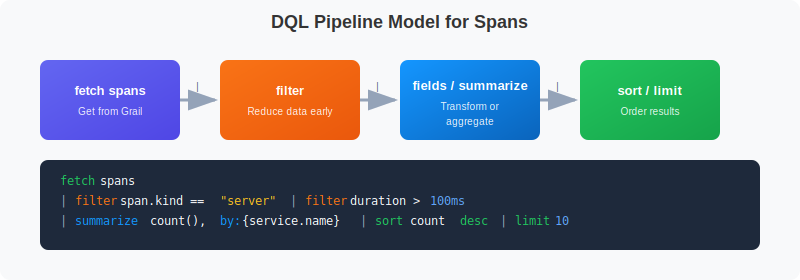
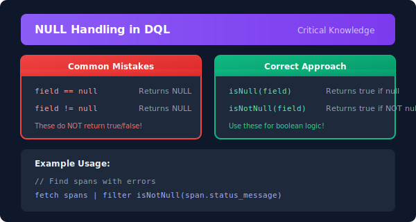

# 🔎 Querying Spans with DQL

> **Series:** SPANS | **Notebook:** 2 of 8 | **Created:** December 2025

## Mastering Span Queries in Dynatrace

This notebook covers essential techniques for querying and filtering span data to find exactly what you need. You'll learn to filter by service, operation, and attributes to quickly locate relevant traces.

---

## Table of Contents

1. DQL is NOT SQL!
2. Filtering by Service
3. Filtering by Span Kind
4. Filtering by Operation Name
5. String Matching Functions
6. Finding Specific Traces
7. HTTP Span Queries
8. Database Span Queries
9. Working with NULL Values
10. Combining Multiple Filters


## Prerequisites

Before starting this notebook, ensure you have:

- ✅ Completed **SPANS-01: Fundamentals**
- ✅ Access to a Dynatrace environment with span data
- ✅ DQL query permissions

## 1. DQL is NOT SQL! <a name="dql-not-sql"></a>

⚠️ **CRITICAL:** DQL has different syntax from SQL. Memorize these differences:



<!--MARKDOWN_TABLE_ALTERNATIVE
| DQL Stage | Purpose | Example |
|-----------|---------|---------|
| fetch | Retrieve data source | fetch spans |
| filter | Narrow down records | filter span.kind == "server" |
| fieldsAdd | Compute new fields | fieldsAdd duration_ms = duration / 1000000 |
| summarize | Aggregate data | summarize count(), by:{service.name} |
| sort | Order results | sort duration desc |
| limit | Restrict output | limit 100 |
-->

### Key Differences

| Concept | SQL | DQL |
|---------|-----|-----|
| **Arrays** | `('a', 'b')` parentheses | `{"a", "b"}` curly braces |
| **Comparison** | `=` single equals | `==` double equals |
| **String quotes** | `'single quotes'` | `"double quotes"` |
| **NULL checks** | `IS NULL` / `IS NOT NULL` | `isNull()` / `isNotNull()` |
| **Membership** | `IN (...)` | `in(field, {...})` |
| **Grouping** | `GROUP BY` | `by: {...}` in summarize |

---

## 2. Filtering by Service <a name="filtering-by-service"></a>

Filter spans to focus on specific services. Use `dt.entity.service` for reliable filtering (entity ID), or `service.name` for display name.

> 💡 **Tip:** `dt.entity.service` is always populated and indexed. `service.name` may not always be available.

```dql
// Filter spans for a specific service using exact match
fetch spans
| filter service.name == "checkout"
| fields start_time, span.name, span.kind, duration
| sort start_time desc
| limit 50
```

```dql
// Use in() with curly braces {} for multiple values (NOT parentheses!)
fetch spans
| filter in(service.name, {"checkout", "payment", "cart"})
| fields start_time, service.name, span.name, span.kind, duration
| sort start_time desc
| limit 100
```

```dql
// Count spans by service entity (more reliable)
fetch spans
| filter isNotNull(dt.entity.service)
| summarize {span_count = count()}, by: {dt.entity.service}
| sort span_count desc
| limit 20
```

---

## 3. Filtering by Span Kind <a name="filtering-by-span-kind"></a>

Filter spans based on their role in the distributed transaction.

⚠️ **IMPORTANT:** `span.kind` values are **lowercase**!

| Kind | Description | Use Case |
|------|-------------|----------|
| `"server"` | Handles incoming request | Find inbound API calls |
| `"client"` | Makes outgoing request | Find calls to dependencies |
| `"internal"` | Internal processing | Find business logic |
| `"producer"` | Sends async message | Find message publishers |
| `"consumer"` | Receives async message | Find message consumers |

```dql
// Find all SERVER spans (inbound requests)
// Note: "server" is lowercase, not "SERVER"
fetch spans
| filter span.kind == "server"
| fields start_time, service.name, span.name, duration
| sort duration desc
| limit 50
```

```dql
// Find CLIENT spans (outbound calls to dependencies)
fetch spans
| filter span.kind == "client"
| fields start_time, service.name, span.name, duration
| sort duration desc
| limit 50
```

```dql
// Count spans by kind to understand your traffic patterns
fetch spans
| summarize {span_count = count()}, by: {span.kind}
| sort span_count desc
```

---

## 4. Filtering by Operation Name <a name="filtering-by-operation"></a>

Find spans for specific operations or endpoints using the `span.name` attribute:

```dql
// Find spans for a specific operation/endpoint
fetch spans
| filter contains(span.name, "checkout")
| fields start_time, service.name, trace.id, span.name, duration, span.status_code
| sort start_time desc
| limit 50
```

```dql
// Find all POST operations (write operations)
fetch spans
| filter startsWith(span.name, "POST")
| fields start_time, service.name, span.name, duration, span.status_code
| sort start_time desc
| limit 50
```

---

## 5. String Matching Functions <a name="string-matching"></a>

DQL provides several string matching functions:

| Function | Description | Example |
|----------|-------------|----------|
| `contains(field, "text")` | Substring match | `contains(span.name, "user")` |
| `startsWith(field, "text")` | Prefix match | `startsWith(span.name, "GET")` |
| `endsWith(field, "text")` | Suffix match | `endsWith(url.path, ".json")` |
| `matchesPhrase(field, "pattern")` | Wildcard pattern | `matchesPhrase(span.name, "GET /api/*")` |
| `in(field, {"a", "b"})` | Multiple values | `in(span.kind, {"server", "client"})` |

```dql
// Contains - partial match anywhere in the string
fetch spans
| filter contains(span.name, "Get")
| fields span.name, service.name
| dedup span.name
| limit 20
```

```dql
// startsWith and endsWith - prefix/suffix matching
fetch spans
| filter startsWith(span.name, "GET") or endsWith(span.name, "query")
| fields span.name
| dedup span.name
| limit 20
```

```dql
// matchesPhrase - wildcard pattern matching with *
fetch spans
| filter matchesPhrase(span.name, "GET /api/*")
| fields span.name
| dedup span.name
| limit 20
```

```dql
// Use dedup to see unique span names per service
fetch spans
| filter span.kind == "server"
| fields service.name, span.name
| dedup service.name, span.name
| sort service.name asc
| limit 50
```

---

## 6. Finding Specific Traces <a name="finding-traces"></a>

Locate all spans belonging to a specific trace:

```dql
// First, find some trace IDs to work with
fetch spans
| filter span.kind == "server"
| fields start_time, trace.id, span.name, service.name
| sort start_time desc
| limit 10
```

```dql
// Find all spans for a specific trace ID
// Replace YOUR_TRACE_ID with an actual trace.id from above
fetch spans
// | filter trace.id == "YOUR_TRACE_ID"
| fields start_time, span.id, span.parent_id, span.name, service.name, duration
| sort start_time asc
| limit 100
```

```dql
// Find root spans (entry points) - spans without a parent
fetch spans
| filter isNull(span.parent_id)
| fields start_time, trace.id, span.name, service.name, duration, span.status_code
| sort start_time desc
| limit 50
```

---

## 7. HTTP Span Queries <a name="http-spans"></a>

Query HTTP-specific span attributes for API troubleshooting:

| Attribute | Description |
|-----------|-------------|
| `http.request.method` | HTTP method (GET, POST, etc.) |
| `http.response.status_code` | HTTP status code (200, 404, 500) |
| `http.route` | URL route pattern (use this, not url.path for aggregation) |
| `url.path` | Full URL path (may contain PII) |

```dql
// Query HTTP spans with response status codes
fetch spans
| filter isNotNull(http.response.status_code)
| fields start_time, 
         service.name, 
         http.request.method, 
         http.route,
         http.response.status_code,
         duration
| sort start_time desc
| limit 100
```

```dql
// Find HTTP 5xx errors (server errors)
fetch spans
| filter http.response.status_code >= 500 
      and http.response.status_code < 600
| fields start_time, 
         service.name, 
         http.request.method, 
         http.route,
         http.response.status_code,
         span.status_message,
         duration
| sort start_time desc
| limit 50
```

```dql
// Summarize HTTP status codes by route
fetch spans
| filter isNotNull(http.response.status_code)
| summarize {status_count = count()}, by: {http.response.status_code}
| sort http.response.status_code asc
```

---

## 8. Database Span Queries <a name="database-spans"></a>

Analyze database operations captured as spans:

| Attribute | Description |
|-----------|-------------|
| `db.system` | Database type (mysql, postgresql, redis) |
| `db.name` | Database name |
| `db.operation` | Operation type (SELECT, INSERT, UPDATE) |
| `db.statement` | The database query (may contain sensitive data) |

```dql
// Find all database spans
fetch spans
| filter isNotNull(db.system)
| fields start_time,
         service.name,
         db.system,
         db.name,
         db.operation,
         duration
| sort duration desc
| limit 50
```

```dql
// Find slow database queries (over 100ms)
fetch spans
| filter isNotNull(db.system) 
      and duration > 100ms
| fieldsAdd duration_ms = duration / 1000000
| fields start_time,
         service.name,
         db.system,
         db.operation,
         db.statement,
         duration_ms
| sort duration_ms desc
| limit 50
```

```dql
// Summarize database usage
fetch spans
| filter isNotNull(db.system)
| summarize {
    db_span_count = count(),
    avg_duration_ms = avg(duration) / 1000000
  }, by: {db.system, db.name}
| sort db_span_count desc
```

---

## 9. Working with NULL Values <a name="null-values"></a>

⚠️ **DQL uses tri-state boolean logic.** Comparisons with NULL don't work like SQL!



<!--MARKDOWN_TABLE_ALTERNATIVE
| Expression | Returns | Explanation |
|------------|---------|-------------|
| `field == null` | NULL | Does NOT return true! |
| `field != null` | NULL | Does NOT return true! |
| `isNull(field)` | true/false | Returns true if field is null |
| `isNotNull(field)` | true/false | Returns true if field is NOT null |
-->

```dql
// Find spans that have database information
fetch spans
| filter isNotNull(db.system)
| summarize {db_span_count = count()}, by: {db.system, db.name}
| sort db_span_count desc
```

```dql
// Find HTTP spans with missing route (potential instrumentation issue)
fetch spans
| filter isNotNull(http.request.method) and isNull(http.route)
| fields service.name, span.name, http.request.method, url.path
| dedup service.name, span.name
| limit 20
```

---

## 10. Combining Multiple Filters <a name="combining-filters"></a>

Build complex queries by combining multiple filter conditions:

> 💡 **Performance Tip:** Apply more restrictive filters first for better query performance.

```dql
// Complex filter: Find slow SERVER spans in the checkout service
fetch spans
| filter service.name == "checkout"
      and span.kind == "server"
      and duration > 500ms
| fieldsAdd duration_ms = duration / 1000000
| fields start_time,
         span.name,
         duration_ms,
         span.status_code
| sort duration_ms desc
| limit 50
```

```dql
// Find error spans for specific services and operations
fetch spans
| filter span.status_code == "error"
      and in(service.name, {"payment", "checkout"})
      and span.kind == "server"
| fieldsAdd duration_ms = duration / 1000000
| fields start_time,
         service.name,
         span.name,
         span.status_message,
         trace.id,
         duration_ms
| sort start_time desc
| limit 50
```

```dql
// Find spans: either server errors OR slow successful requests
fetch spans
| filter http.response.status_code >= 500
      or (http.response.status_code >= 200 
          and http.response.status_code < 300 
          and duration > 1s)
| fieldsAdd duration_ms = duration / 1000000
| fields start_time,
         service.name,
         http.request.method,
         http.route,
         http.response.status_code,
         duration_ms
| sort start_time desc
| limit 100
```

---

## Summary

In this notebook, you learned:

✅ **DQL ≠ SQL** - Critical syntax differences (arrays use `{}`, use `==`, `isNull()`)  
✅ **Filter by service** using exact match, `in()`, and pattern matching  
✅ **Filter by span kind** - values are lowercase (`"server"`, `"client"`)  
✅ **String matching** - `contains()`, `startsWith()`, `endsWith()`, `matchesPhrase()`  
✅ **Find traces** by trace.id and identify root spans  
✅ **Query HTTP spans** including status codes, methods, routes  
✅ **Analyze database spans** to find slow queries  
✅ **Handle NULL values** with `isNull()` / `isNotNull()`  
✅ **Use `dedup`** to see unique values  
✅ **Combine filters** for complex, precise queries  

---

## Next Steps

Continue to **SPANS-03: Trace Analysis & Troubleshooting** to learn:
- Identifying error patterns and failure points
- Latency analysis across services
- Root cause analysis techniques
- Tracing request flows through your system
