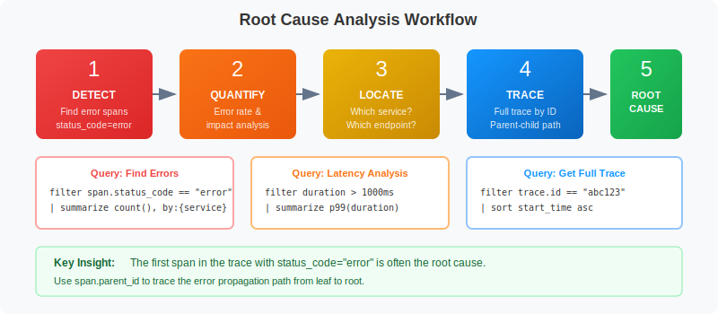
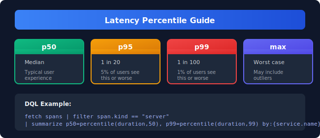
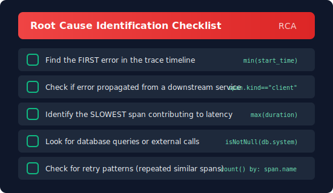

# 🔧 Trace Analysis & Troubleshooting

> **Series:** SPANS | **Notebook:** 3 of 8 | **Created:** December 2025

## Root Cause Analysis with Distributed Traces

This notebook teaches systematic approaches to troubleshoot issues using span data. You'll learn to identify error patterns, analyze latency, and trace problems to their root cause.

---

## Table of Contents

1. RCA Workflow Overview
2. Finding Error Spans
3. Error Pattern Analysis
4. Latency Analysis
5. Finding Slow Requests
6. Reconstructing Complete Traces
7. Identifying Root Cause
8. Downstream Dependency Analysis
9. Database Query Troubleshooting


## Prerequisites

Before starting this notebook, ensure you have:

- ✅ Completed **SPANS-01** and **SPANS-02**
- ✅ Access to a Dynatrace environment with span data
- ✅ Understanding of DQL filtering and aggregation

## 1. RCA Workflow Overview <a name="rca-workflow"></a>

Follow this systematic approach for root cause analysis:



<!--MARKDOWN_TABLE_ALTERNATIVE
| Step | Action | Purpose |
|------|--------|---------|
| 1. DETECT | Find error or slow traces | Identify symptoms |
| 2. QUANTIFY | Count affected traces/users | Understand impact |
| 3. LOCATE | Get full trace by trace.id | Isolate the problem |
| 4. TRACE | Find first error/slowest span | Follow the flow |
| 5. ROOT CAUSE | Identify originating service | Find the source |
-->

### Key Questions to Answer

| Question | Query Strategy |
|----------|----------------|
| What's failing? | Filter `span.status_code == "error"` |
| Where did it start? | Find first error in trace timeline |
| What's slow? | Filter `duration > threshold` |
| Is it widespread? | Aggregate by service/operation |
| What changed? | Compare time windows |

---

## 2. Finding Error Spans <a name="finding-errors"></a>

Start by identifying error spans in your system:

> ⚠️ Remember: `span.status_code` values are lowercase (`"error"`, not `"ERROR"`)

```dql
// Find recent error spans
fetch spans
| filter span.status_code == "error"
| fields start_time,
         service.name,
         span.name,
         span.status_message,
         trace.id,
         duration
| sort start_time desc
| limit 50
```

```dql
// Count errors by service to see which services are most affected
fetch spans
| filter span.status_code == "error"
| summarize {
    error_count = count(),
    affected_traces = countDistinct(trace.id)
  }, by: {service.name}
| sort error_count desc
| limit 20
```

```dql
// Error rate per service (server spans only)
fetch spans
| filter span.kind == "server"
| summarize {
    total_requests = count(),
    error_count = countIf(span.status_code == "error")
  }, by: {service.name}
| fieldsAdd error_rate_pct = (error_count * 100.0) / total_requests
| sort error_rate_pct desc
| limit 20
```

---

## 3. Error Pattern Analysis <a name="error-patterns"></a>

Group errors to identify common patterns:

```dql
// Group errors by type and service using collectDistinct
fetch spans
| filter span.status_code == "error"
| summarize {
    occurrence = count(),
    affected_traces = countDistinct(trace.id),
    services_affected = collectDistinct(service.name)
  }, by: {span.name, span.status_message}
| sort occurrence desc
| limit 20
```

```dql
// Find traces with multiple errors (cascading failures)
fetch spans
| filter span.status_code == "error"
| summarize {
    error_count = count(),
    services_affected = collectDistinct(service.name),
    first_error = takeFirst(span.name)
  }, by: {trace.id}
| filter error_count > 1
| sort error_count desc
| limit 20
```

```dql
// Error timeline - visualize errors over time
fetch spans
| filter span.kind == "server"
| makeTimeseries {
    errors = countIf(span.status_code == "error"),
    total = count()
  }, interval: 5m, by: {service.name}
```

---

## 4. Latency Analysis <a name="latency-analysis"></a>

Analyze latency patterns to find performance issues:



<!--MARKDOWN_TABLE_ALTERNATIVE
| Percentile | Description | Impact |
|------------|-------------|--------|
| p50 (median) | Typical user experience | Half of users see this or better |
| p95 | 1 in 20 users see this or worse | Important for SLOs |
| p99 | 1 in 100 users see this or worse | Tail latency indicator |
| max | Worst case (may be outliers) | May not reflect real user impact |
-->

```dql
// Latency percentiles by service
fetch spans
| filter span.kind == "server"
| summarize {
    requests = count(),
    p50_ms = percentile(duration, 50) / 1000000,
    p95_ms = percentile(duration, 95) / 1000000,
    p99_ms = percentile(duration, 99) / 1000000,
    max_ms = max(duration) / 1000000
  }, by: {service.name}
| sort p99_ms desc
| limit 20
```

```dql
// Latency percentiles by operation
fetch spans
| filter span.kind == "server"
| summarize {
    requests = count(),
    p50_ms = percentile(duration, 50) / 1000000,
    p95_ms = percentile(duration, 95) / 1000000,
    p99_ms = percentile(duration, 99) / 1000000
  }, by: {service.name, span.name}
| filter requests > 10
| sort p95_ms desc
| limit 30
```

```dql
// Latency trend over time (use bin() for percentiles since makeTimeseries doesn't support percentile)
fetch spans
| filter span.kind == "server"
| fieldsAdd time_bucket = bin(start_time, 10m)
| summarize {
    p95_ms = percentile(duration, 95) / 1000000,
    request_count = count()
  }, by: {time_bucket, service.name}
| sort time_bucket desc, service.name
| limit 100
```

---

## 5. Finding Slow Requests <a name="slow-requests"></a>

Identify and analyze slow requests:

```dql
// Find slow server spans (> 1 second)
fetch spans
| filter span.kind == "server"
| filter duration > 1s
| fieldsAdd duration_ms = duration / 1000000
| fields start_time,
         service.name,
         span.name,
         duration_ms,
         trace.id
| sort duration_ms desc
| limit 50
```

```dql
// Find slow traces with summary of services involved
fetch spans
| filter span.kind == "server"
| summarize {
    trace_duration_ms = max(duration) / 1000000,
    span_count = count(),
    entry_point = takeFirst(span.name),
    services = collectDistinct(service.name)
  }, by: {trace.id}
| filter trace_duration_ms > 1000
| sort trace_duration_ms desc
| limit 20
```

```dql
// Identify slow operations (candidates for optimization)
fetch spans
| filter span.kind == "server"
| filter duration > 500ms
| summarize {
    slow_count = count(),
    avg_duration_ms = avg(duration) / 1000000,
    max_duration_ms = max(duration) / 1000000
  }, by: {service.name, span.name}
| sort slow_count desc
| limit 20
```

---

## 6. Reconstructing Complete Traces <a name="trace-reconstruction"></a>

Once you've identified a problematic trace, reconstruct the full picture:

```dql
// Get a sample trace ID from error spans
fetch spans
| filter span.status_code == "error"
| fields trace.id, service.name, span.name
| limit 5
```

```dql
// Reconstruct full trace (replace YOUR_TRACE_ID with actual trace.id)
fetch spans
// | filter trace.id == "YOUR_TRACE_ID"
| fieldsAdd duration_ms = duration / 1000000
| fields start_time,
         service.name,
         span.name,
         span.kind,
         duration_ms,
         span.status_code,
         span.parent_id,
         span.id
| sort start_time asc
| limit 100
```

```dql
// Analyze trace complexity
fetch spans
| summarize {
    span_count = count(),
    services_involved = countDistinct(service.name),
    has_errors = countIf(span.status_code == "error") > 0,
    total_duration_ms = sum(duration) / 1000000
  }, by: {trace.id}
| sort span_count desc
| limit 20
```

---

## 7. Identifying Root Cause <a name="root-cause"></a>

Use these patterns to find the origin of problems:



<!--MARKDOWN_TABLE_ALTERNATIVE
| Check | What to Look For | DQL Pattern |
|-------|------------------|-------------|
| First error | FIRST error in the trace timeline | `min(start_time)` |
| Downstream propagation | Error from downstream service | `span.kind == "client"` |
| Slowest span | SLOWEST span contributing to latency | `max(duration)` |
| External calls | Database queries or external calls | `isNotNull(db.system)` |
| Retry patterns | Repeated similar spans | `count() by: span.name` |
-->

```dql
// Find the FIRST error span in failing traces
fetch spans
| filter span.status_code == "error"
| summarize {
    first_error_time = min(start_time),
    first_error_service = takeFirst(service.name),
    first_error_span = takeFirst(span.name),
    error_description = takeFirst(span.status_message)
  }, by: {trace.id}
| sort first_error_time desc
| limit 20
```

```dql
// Find the bottleneck span in each trace
fetch spans
| summarize {
    max_duration_ms = max(duration) / 1000000,
    total_spans = count(),
    services = collectDistinct(service.name)
  }, by: {trace.id}
| filter max_duration_ms > 500
| sort max_duration_ms desc
| limit 20
```

```dql
// Time spent per span kind (where is time going?)
fetch spans
| summarize {
    total_time_ms = sum(duration) / 1000000,
    span_count = count(),
    avg_time_ms = avg(duration) / 1000000
  }, by: {span.kind}
| sort total_time_ms desc
```

---

## 8. Downstream Dependency Analysis <a name="dependencies"></a>

Analyze failures in downstream services (CLIENT spans):

```dql
// Find which downstream services are causing errors
fetch spans
| filter span.kind == "client" and span.status_code == "error"
| summarize {
    failure_count = count(),
    sample_error = takeFirst(span.status_message),
    affected_traces = countDistinct(trace.id)
  }, by: {service.name, span.name}
| sort failure_count desc
| limit 20
```

```dql
// Dependency health - error rates for outbound calls
fetch spans
| filter span.kind == "client"
| summarize {
    calls = count(),
    errors = countIf(span.status_code == "error"),
    p95_latency_ms = percentile(duration, 95) / 1000000
  }, by: {service.name, span.name}
| fieldsAdd error_rate_pct = (errors * 100.0) / calls
| filter error_rate_pct > 5 or p95_latency_ms > 500
| sort error_rate_pct desc
| limit 20
```

```dql
// Map service-to-service dependencies
fetch spans
| filter span.kind == "client"
| filter isNotNull(server.address)
| summarize {
    call_count = count(),
    error_count = countIf(span.status_code == "error"),
    avg_latency_ms = avg(duration) / 1000000
  }, by: {service.name, server.address}
| fieldsAdd error_rate_pct = (error_count * 100.0) / call_count
| sort call_count desc
| limit 30
```

---

## 9. Database Query Troubleshooting <a name="database-issues"></a>

Analyze database operations for performance issues:

```dql
// Find slow database queries
fetch spans
| filter isNotNull(db.system)
| filter duration > 100ms
| summarize {
    query_count = count(),
    avg_ms = avg(duration) / 1000000,
    p95_ms = percentile(duration, 95) / 1000000,
    max_ms = max(duration) / 1000000
  }, by: {db.system, db.name, span.name}
| sort p95_ms desc
| limit 20
```

```dql
// Find failing database operations
fetch spans
| filter isNotNull(db.system) and span.status_code == "error"
| summarize {
    error_count = count(),
    sample_error = takeFirst(span.status_message)
  }, by: {db.system, db.name, span.name}
| sort error_count desc
| limit 20
```

```dql
// Quick service health check (use for dashboards)
fetch spans
| filter span.kind == "server"
| summarize {
    requests = count(),
    errors = countIf(span.status_code == "error"),
    p50_ms = percentile(duration, 50) / 1000000,
    p99_ms = percentile(duration, 99) / 1000000
  }, by: {service.name}
| fieldsAdd error_rate_pct = (errors * 100.0) / requests
| sort error_rate_pct desc
| limit 20
```

---

## Summary

In this notebook, you learned:

✅ **RCA Workflow** - Systematic approach: Detect → Isolate → Analyze → Correlate → Resolve  
✅ **Find errors** using `span.status_code == "error"` and count affected traces  
✅ **Error patterns** with `collectDistinct()` to see affected services  
✅ **Latency analysis** using percentiles (p50, p95, p99) and `bin()` for trends  
✅ **Slow request analysis** to identify optimization candidates  
✅ **Trace reconstruction** to see the full picture  
✅ **Root cause identification** - first error, slowest span, bottlenecks  
✅ **Dependency analysis** - CLIENT spans show downstream failures  
✅ **Database troubleshooting** for slow or failing queries  

---

## Next Steps

Continue to **SPANS-04: Service Dependencies & Flow Analysis** to learn:
- Mapping service-to-service relationships
- Analyzing async messaging patterns
- Visualizing request flows
- Critical path analysis
