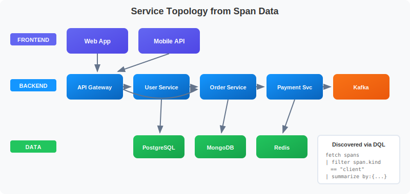
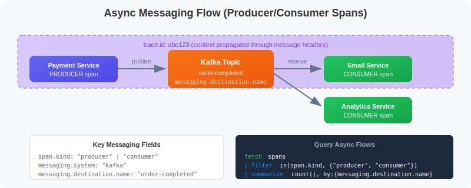
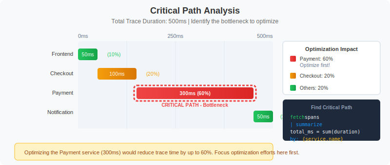

# 🗺️ Service Dependencies & Flow Analysis

> **Series:** SPANS | **Notebook:** 4 of 8 | **Created:** December 2025

## Mapping Your Distributed System

This notebook teaches you how to use span data to understand service relationships, analyze request flows, and identify critical dependencies in your system.

---

## Table of Contents

1. Understanding Service Topology
2. Discovering Services
3. Mapping Service Dependencies
4. Client-Server Call Patterns
5. Async Messaging Flows
6. Trace Hierarchy Analysis
7. Cross-Service Latency Analysis
8. Critical Path Analysis


## Prerequisites

Before starting this notebook, ensure you have:

- ✅ Completed **SPANS-01** through **SPANS-03**
- ✅ Access to a Dynatrace environment with distributed trace data
- ✅ Understanding of span kinds (server, client, producer, consumer)

## 1. Understanding Service Topology <a name="understanding-topology"></a>

Service topology shows how your services connect and communicate:



<!--MARKDOWN_TABLE_ALTERNATIVE
| Layer | Services | Function |
|-------|----------|----------|
| Frontend | Web App, Mobile API | User-facing entry points |
| Backend | Checkout, Cart, Payment, Inventory | Business logic |
| Data | PostgreSQL, Redis, Kafka | Storage and messaging |
-->

### Key Span Types for Topology

| Span Kind | Role | What It Tells You |
|-----------|------|-------------------|
| `server` | Receives requests | Entry points, inbound traffic |
| `client` | Makes requests | Outbound calls, dependencies |
| `producer` | Sends messages | Async event sources |
| `consumer` | Receives messages | Async event handlers |

---

## 2. Discovering Services <a name="discovering-services"></a>

First, discover all services generating spans in your environment:

```dql
// List all services with span counts
fetch spans
| summarize {
    span_count = count(),
    operations = countDistinct(span.name)
  }, by: {service.name}
| sort span_count desc
| limit 30
```

```dql
// Service role analysis - understand each service's function
fetch spans
| summarize {
    server_spans = countIf(span.kind == "server"),
    client_spans = countIf(span.kind == "client"),
    internal_spans = countIf(span.kind == "internal"),
    producer_spans = countIf(span.kind == "producer"),
    consumer_spans = countIf(span.kind == "consumer")
  }, by: {service.name}
| sort server_spans desc
| limit 30
```

```dql
// Discover all operations/endpoints per service
fetch spans
| filter span.kind == "server"
| summarize {
    request_count = count(),
    avg_duration_ms = avg(duration) / 1000000
  }, by: {service.name, span.name}
| sort service.name asc, request_count desc
| limit 50
```

---

## 3. Mapping Service Dependencies <a name="mapping-dependencies"></a>

Use CLIENT spans to understand which services call which other services:

### Key Attributes for Dependencies

| Attribute | Description |
|-----------|-------------|
| `peer.service` | Target service name (if instrumented) |
| `server.address` | Target host/address |
| `server.port` | Target port |
| `http.host` | HTTP host header |

```dql
// Map service-to-service calls using CLIENT spans
fetch spans
| filter span.kind == "client"
| summarize {
    call_count = count(),
    avg_latency_ms = avg(duration) / 1000000,
    error_count = countIf(span.status_code == "error")
  }, by: {service.name, span.name}
| fieldsAdd error_rate_pct = (error_count * 100.0) / call_count
| sort call_count desc
| limit 50
```

```dql
// Find services called by other services using peer.service attribute
// peer.service shows the target service name when available
fetch spans
| filter span.kind == "client" and isNotNull(peer.service)
| summarize {
    call_count = count(),
    avg_latency_ms = avg(duration) / 1000000
  }, by: {service.name, peer.service}
| sort call_count desc
| limit 30
```

```dql
// Map dependencies using HTTP host/URL information
fetch spans
| filter span.kind == "client" and isNotNull(server.address)
| summarize {
    call_count = count(),
    avg_latency_ms = avg(duration) / 1000000,
    error_count = countIf(span.status_code == "error")
  }, by: {service.name, server.address}
| fieldsAdd error_rate_pct = (error_count * 100.0) / call_count
| sort call_count desc
| limit 30
```

---

## 4. Client-Server Call Patterns <a name="client-server"></a>

Analyze the matching CLIENT and SERVER span pairs to understand inter-service communication:

```dql
// Analyze outbound calls from each service
fetch spans
| filter span.kind == "client"
| summarize {
    outbound_calls = count(),
    avg_latency_ms = avg(duration) / 1000000,
    p99_latency_ms = percentile(duration, 99) / 1000000,
    error_count = countIf(span.status_code == "error")
  }, by: {service.name}
| fieldsAdd error_rate_pct = (error_count * 100.0) / outbound_calls
| sort outbound_calls desc
| limit 20
```

```dql
// Analyze inbound requests to each service
fetch spans
| filter span.kind == "server"
| summarize {
    inbound_requests = count(),
    avg_latency_ms = avg(duration) / 1000000,
    p99_latency_ms = percentile(duration, 99) / 1000000,
    error_count = countIf(span.status_code == "error")
  }, by: {service.name}
| fieldsAdd error_rate_pct = (error_count * 100.0) / inbound_requests
| sort inbound_requests desc
| limit 20
```

```dql
// Find services with high outbound/inbound ratio (integration heavy)
fetch spans
| summarize {
    inbound = countIf(span.kind == "server"),
    outbound = countIf(span.kind == "client")
  }, by: {service.name}
| filter inbound > 0
| fieldsAdd outbound_ratio = outbound / inbound
| sort outbound_ratio desc
| limit 20
```

---

## 5. Async Messaging Flows <a name="messaging"></a>

Analyze asynchronous messaging patterns using PRODUCER and CONSUMER spans:



<!--MARKDOWN_TABLE_ALTERNATIVE
| Span Kind | Service | Action | Destination |
|-----------|---------|--------|-------------|
| producer | Payment Service | publish | order-completed |
| consumer | Email Service | receive | order-completed |
| consumer | Analytics Service | receive | order-completed |
-->

### Key Messaging Attributes

| Attribute | Description |
|-----------|-------------|
| `messaging.system` | Kafka, RabbitMQ, etc. |
| `messaging.destination.name` | Topic/queue name |
| `messaging.operation` | publish, receive, etc. |

```dql
// Find message producers (services sending async messages)
fetch spans
| filter span.kind == "producer"
| summarize {
    messages_sent = count(),
    avg_duration_ms = avg(duration) / 1000000,
    error_count = countIf(span.status_code == "error")
  }, by: {service.name, span.name}
| sort messages_sent desc
| limit 20
```

```dql
// Find message consumers (services receiving async messages)
fetch spans
| filter span.kind == "consumer"
| summarize {
    messages_received = count(),
    avg_processing_ms = avg(duration) / 1000000,
    error_count = countIf(span.status_code == "error")
  }, by: {service.name, span.name}
| fieldsAdd error_rate_pct = (error_count * 100.0) / messages_received
| sort messages_received desc
| limit 20
```

```dql
// Analyze messaging system usage (Kafka, RabbitMQ, etc.)
fetch spans
| filter span.kind == "producer" or span.kind == "consumer"
| filter isNotNull(messaging.system)
| summarize {
    message_count = count(),
    producers = countIf(span.kind == "producer"),
    consumers = countIf(span.kind == "consumer"),
    error_count = countIf(span.status_code == "error")
  }, by: {messaging.system, messaging.destination.name}
| sort message_count desc
| limit 20
```

```dql
// Map producer to consumer relationships
fetch spans
| filter span.kind == "producer" or span.kind == "consumer"
| summarize {
    span_count = count()
  }, by: {service.name, span.kind, messaging.destination.name}
| sort messaging.destination.name, span.kind
| limit 30
```

---

## 6. Trace Hierarchy Analysis <a name="trace-hierarchy"></a>

Analyze parent-child relationships within traces to understand call depth:

```dql
// Count spans per trace to understand trace complexity
fetch spans
| summarize {
    span_count = count(),
    services_involved = countDistinct(service.name),
    total_duration_ms = sum(duration) / 1000000
  }, by: {trace.id}
| sort span_count desc
| limit 25
```

```dql
// Examine a complete trace hierarchy
// Replace YOUR_TRACE_ID with an actual trace ID from above
fetch spans
// | filter trace.id == "YOUR_TRACE_ID"
| fieldsAdd duration_ms = duration / 1000000
| fields start_time,
         span.id,
         span.parent_id,
         service.name,
         span.name,
         span.kind,
         duration_ms
| sort start_time asc
| limit 100
```

```dql
// Find entry points (root spans) and their downstream services
fetch spans
| filter isNull(span.parent_id)
| summarize {
    entry_count = count(),
    avg_duration_ms = avg(duration) / 1000000
  }, by: {service.name, span.name}
| sort entry_count desc
| limit 20
```

---

## 7. Cross-Service Latency Analysis <a name="cross-service-latency"></a>

Identify latency hot spots between services:

```dql
// Latency by service-to-service call
fetch spans
| filter span.kind == "client" and isNotNull(server.address)
| summarize {
    call_count = count(),
    avg_ms = avg(duration) / 1000000,
    p95_ms = percentile(duration, 95) / 1000000,
    p99_ms = percentile(duration, 99) / 1000000
  }, by: {service.name, server.address}
| sort p95_ms desc
| limit 20
```

```dql
// Time spent per service in traces
fetch spans
| summarize {
    total_time_ms = sum(duration) / 1000000,
    span_count = count(),
    avg_per_span_ms = avg(duration) / 1000000
  }, by: {service.name}
| sort total_time_ms desc
| limit 20
```

```dql
// Find slowest dependencies (CLIENT spans)
fetch spans
| filter span.kind == "client"
| filter duration > 500ms
| summarize {
    slow_call_count = count(),
    avg_duration_ms = avg(duration) / 1000000,
    max_duration_ms = max(duration) / 1000000
  }, by: {service.name, span.name}
| sort avg_duration_ms desc
| limit 20
```

---

## 8. Critical Path Analysis <a name="critical-path"></a>

Identify the services and operations that contribute most to end-to-end latency:



<!--MARKDOWN_TABLE_ALTERNATIVE
| Service | Duration | % of Total | Priority |
|---------|----------|------------|----------|
| Frontend | 50ms | 10% | Low |
| Checkout | 100ms | 20% | Medium |
| Payment | 300ms | 60% | HIGH - Bottleneck |
| Notification | 50ms | 10% | Low |
-->

```dql
// Find services contributing most to total trace time
fetch spans
| summarize {
    total_self_time_ms = sum(duration) / 1000000,
    span_count = count(),
    avg_duration_ms = avg(duration) / 1000000,
    max_duration_ms = max(duration) / 1000000
  }, by: {service.name}
| sort total_self_time_ms desc
| limit 15
```

```dql
// Find slowest operations across all services
fetch spans
| filter span.kind == "server"
| summarize {
    call_count = count(),
    avg_duration_ms = avg(duration) / 1000000,
    p99_duration_ms = percentile(duration, 99) / 1000000,
    total_time_ms = sum(duration) / 1000000
  }, by: {service.name, span.name}
| filter call_count > 10
| sort p99_duration_ms desc
| limit 20
```

```dql
// Identify high-impact optimization candidates
// (high volume + high latency = most benefit from optimization)
fetch spans
| filter span.kind == "server"
| summarize {
    call_count = count(),
    avg_duration_ms = avg(duration) / 1000000,
    total_time_ms = sum(duration) / 1000000
  }, by: {service.name, span.name}
| filter call_count > 50
| fieldsAdd impact_score = call_count * avg_duration_ms
| sort impact_score desc
| limit 20
```

---

## Summary

In this notebook, you learned:

✅ **Service discovery** - Find all services and their operations  
✅ **Dependency mapping** - Use CLIENT spans with `peer.service` and `server.address`  
✅ **Client-server patterns** - Analyze inbound/outbound call ratios  
✅ **Async messaging** - Track PRODUCER/CONSUMER spans through message queues  
✅ **Trace hierarchy** - Understand span parent-child relationships  
✅ **Cross-service latency** - Find latency hot spots between services  
✅ **Critical path analysis** - Identify bottlenecks for optimization  

---

## Next Steps

Continue to **SPANS-05: Advanced Span Analytics** to learn:
- Time series analysis and trending
- Complex aggregations and calculations
- Building dashboard-ready queries
- Alerting patterns
