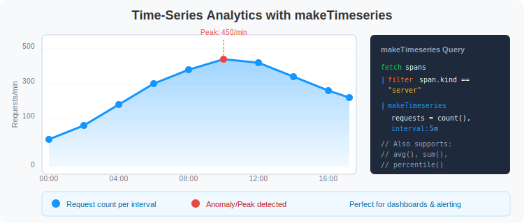

# 📊 Advanced Span Analytics

> **Series:** SPANS | **Notebook:** 5 of 8 | **Created:** December 2025

## Time-Series Analysis and Complex Aggregations

This notebook covers advanced analytical techniques for span data, including time-series analysis, trend detection, and complex aggregations for building dashboards and reports.

---

## Table of Contents

1. Time-Series with makeTimeseries
2. Trend Analysis
3. Complex Aggregations
4. Comparison Queries
5. Dashboard-Ready Queries


## Prerequisites

Before starting this notebook, ensure you have:

- ✅ Completed previous SPANS notebooks (01-04)
- ✅ Understanding of summarize and aggregation functions
- ✅ Familiarity with time-based filtering

## 1. Time-Series with makeTimeseries <a name="timeseries"></a>

Use `makeTimeseries` to create time-series data for visualization and trend analysis.



<!--MARKDOWN_TABLE_ALTERNATIVE
| Function | Purpose | makeTimeseries Support |
|----------|---------|------------------------|
| count() | Count records | ✅ Yes |
| countIf() | Conditional count | ✅ Yes |
| avg() | Average value | ✅ Yes |
| sum() | Total sum | ✅ Yes |
| min()/max() | Extremes | ✅ Yes |
| percentile() | Distribution | ❌ No - use bin() |
-->

> ⚠️ **Important:** `makeTimeseries` does NOT support `percentile()` or arithmetic expressions in aggregations. Use time-bucketed `summarize` for those.

```dql
// Request volume over time by service
fetch spans
| filter span.kind == "server"
| makeTimeseries {
    request_count = count(),
    error_count = countIf(span.status_code == "error")
  }, by:{service.name}, interval: 5m
```

```dql
// Average duration over time (without grouping)
fetch spans
| filter span.kind == "server"
| makeTimeseries {
    request_count = count(),
    avg_duration_ns = avg(duration)
  }, interval: 5m
```

```dql
// For percentile trends, use time-bucketed summarize instead
fetch spans
| filter span.kind == "server"
| fieldsAdd time_bucket = bin(start_time, 10m)
| summarize {
    request_count = count(),
    p95_duration_ms = percentile(duration, 95) / 1000000,
    error_count = countIf(span.status_code == "error")
  }, by:{time_bucket, service.name}
| sort time_bucket asc
| limit 200
```

---

## 2. Trend Analysis <a name="trend-analysis"></a>

Identify trends and patterns in your span data over time.

```dql
// Hourly error rate trend
fetch spans
| filter span.kind == "server"
| fieldsAdd hour_bucket = bin(start_time, 1h)
| summarize {
    total_requests = count(),
    errors = countIf(span.status_code == "error")
  }, by:{hour_bucket}
| fieldsAdd error_rate_pct = (errors * 100.0) / total_requests
| sort hour_bucket asc
| limit 48
```

```dql
// Latency trend by service (10-minute buckets)
fetch spans
| filter span.kind == "server"
| fieldsAdd time_bucket = bin(start_time, 10m)
| summarize {
    request_count = count(),
    avg_duration_ms = avg(duration) / 1000000,
    p90_duration_ms = percentile(duration, 90) / 1000000
  }, by:{time_bucket, service.name}
| sort time_bucket asc, service.name
| limit 300
```

```dql
// Identify services with degrading performance
fetch spans
| filter span.kind == "server"
| fieldsAdd time_bucket = bin(start_time, 30m)
| summarize {
    request_count = count(),
    p95_ms = percentile(duration, 95) / 1000000
  }, by:{time_bucket, service.name}
| filter p95_ms > 500
| sort time_bucket desc, p95_ms desc
| limit 50
```

---

## 3. Complex Aggregations <a name="complex-aggregations"></a>

Perform multi-dimensional analysis with complex aggregation patterns.

```dql
// Service health scorecard
fetch spans
| filter span.kind == "server"
| summarize {
    total_requests = count(),
    error_count = countIf(span.status_code == "error"),
    avg_duration_ms = avg(duration) / 1000000,
    p50_duration_ms = percentile(duration, 50) / 1000000,
    p95_duration_ms = percentile(duration, 95) / 1000000,
    p99_duration_ms = percentile(duration, 99) / 1000000,
    max_duration_ms = max(duration) / 1000000
  }, by:{service.name}
| fieldsAdd error_rate_pct = (error_count * 100.0) / total_requests
| fieldsAdd health_score = if(error_rate_pct > 5, "Critical", 
                            else: if(error_rate_pct > 1, "Warning", 
                            else: "Healthy"))
| sort error_rate_pct desc
| limit 30
```

```dql
// Endpoint-level analysis with multiple metrics
fetch spans
| filter span.kind == "server"
| summarize {
    request_count = count(),
    error_count = countIf(span.status_code == "error"),
    slow_count = countIf(duration > 1000000000),  // > 1 second
    avg_duration_ms = avg(duration) / 1000000,
    p95_duration_ms = percentile(duration, 95) / 1000000
  }, by:{service.name, span.name}
| fieldsAdd error_rate_pct = (error_count * 100.0) / request_count
| fieldsAdd slow_rate_pct = (slow_count * 100.0) / request_count
| filter request_count > 10
| sort error_rate_pct desc
| limit 50
```

```dql
// HTTP method distribution with performance metrics
fetch spans
| filter isNotNull(http.request.method)
| summarize {
    request_count = count(),
    error_count = countIf(span.status_code == "error"),
    avg_duration_ms = avg(duration) / 1000000
  }, by:{http.request.method, service.name}
| sort request_count desc
| limit 30
```

---

## 4. Comparison Queries <a name="comparisons"></a>

Compare metrics across different dimensions to identify outliers and patterns.

```dql
// Compare span kinds: server vs client performance
fetch spans
| filter in(span.kind, {"server", "client"})
| summarize {
    span_count = count(),
    error_count = countIf(span.status_code == "error"),
    avg_duration_ms = avg(duration) / 1000000,
    p95_duration_ms = percentile(duration, 95) / 1000000
  }, by:{span.kind}
| fieldsAdd error_rate_pct = (error_count * 100.0) / span_count
```

```dql
// Compare success vs error span characteristics
fetch spans
| filter span.kind == "server"
| summarize {
    span_count = count(),
    avg_duration_ms = avg(duration) / 1000000,
    p95_duration_ms = percentile(duration, 95) / 1000000
  }, by:{span.status_code, service.name}
| sort service.name, span.status_code
| limit 50
```

```dql
// HTTP status code distribution by service
fetch spans
| filter isNotNull(http.response.status_code)
| fieldsAdd status_class = if(http.response.status_code >= 500, "5xx",
                            else: if(http.response.status_code >= 400, "4xx",
                            else: if(http.response.status_code >= 300, "3xx",
                            else: "2xx")))
| summarize {count = count()}, by:{status_class, service.name}
| sort service.name, status_class
```

---

## 5. Dashboard-Ready Queries <a name="dashboard-queries"></a>

Queries optimized for use in Dynatrace dashboards and reports.

> 💡 **Tip:** These queries are designed to produce clean output suitable for dashboard tiles.

```dql
// Dashboard: Request rate and error rate over time
fetch spans
| filter span.kind == "server"
| makeTimeseries {
    requests = count(),
    errors = countIf(span.status_code == "error")
  }, interval: 5m
```

```dql
// Dashboard: Service health summary (single value tiles)
fetch spans
| filter span.kind == "server"
| summarize {
    total_requests = count(),
    total_errors = countIf(span.status_code == "error"),
    unique_services = countDistinct(service.name),
    avg_latency_ms = avg(duration) / 1000000
  }
| fieldsAdd overall_error_rate_pct = (total_errors * 100.0) / total_requests
```

```dql
// Dashboard: Top 10 services by request volume
fetch spans
| filter span.kind == "server"
| summarize {
    requests = count(),
    errors = countIf(span.status_code == "error"),
    p95_ms = percentile(duration, 95) / 1000000
  }, by:{service.name}
| fieldsAdd error_rate = (errors * 100.0) / requests
| sort requests desc
| limit 10
```

```dql
// Dashboard: Recent errors list
fetch spans
| filter span.status_code == "error"
| fields start_time, service.name, span.name, span.status_message
| sort start_time desc
| limit 20
```

---

## Summary

In this notebook, you learned:

✅ **Time-series analysis** with makeTimeseries and its limitations  
✅ **Time-bucketed summarize** for percentile trends  
✅ **Trend analysis** to identify patterns over time  
✅ **Complex aggregations** for multi-dimensional analysis  
✅ **Comparison queries** to identify outliers  
✅ **Dashboard-ready queries** for visualization  

---

## Next Steps

Continue to **SPANS-06: Security Analysis with Spans** to learn:
- Detecting security-relevant patterns in traces
- Analyzing authentication and authorization flows
- Finding anomalous behavior
- Security audit queries
