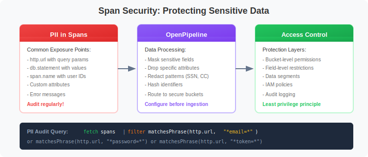
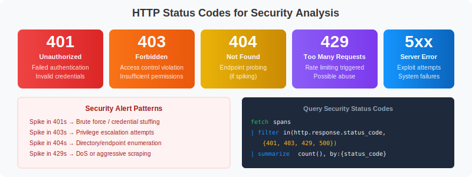

# 🔐 Security Analysis with Spans

> **Series:** SPANS | **Notebook:** 6 of 8 | **Created:** December 2025

## Protecting Distributed Traces and Ensuring Compliance

This notebook demonstrates how to use span data for security analysis, audit for sensitive data exposure, and ensure compliance with regulations.

---

## Table of Contents

1. Understanding Sensitive Data in Spans
2. PII Audit Queries
3. HTTP Status Code Security Analysis
4. Authentication Failure Detection
5. Anomalous Traffic Patterns
6. Sensitive Endpoint Monitoring
7. OpenPipeline for Data Masking
8. Compliance Considerations
9. Security Audit Queries
10. Security Checklist


## Prerequisites

Before starting this notebook, ensure you have:

- ✅ Completed previous SPANS notebooks (01-05)
- ✅ Understanding of HTTP status codes and security concepts
- ✅ Access to span data containing HTTP attributes
- ✅ Familiarity with OpenPipeline basics

## 1. Understanding Sensitive Data in Spans <a name="sensitive-data"></a>

Distributed traces can inadvertently capture sensitive information:



<!--MARKDOWN_TABLE_ALTERNATIVE
| Risk Area | Examples | Mitigation |
|-----------|----------|------------|
| URLs | User IDs, emails, tokens | Use http.route, mask PII |
| Headers | Auth tokens, cookies | Drop sensitive headers |
| DB Queries | User data in WHERE | Parameterize queries |
| Errors | Stack traces with context | Truncate/filter |
| Custom Attrs | Business data | Evaluate per case |
-->

### Fields to Consider for Protection

| Field | Risk | Recommendation |
|-------|------|----------------|
| `url.path` | PII in path/params | Mask or use http.route |
| `http.request.header.*` | Auth tokens/cookies | Drop sensitive headers |
| `db.statement` | SQL with user data | Parameterize or mask |
| `exception.stacktrace` | Variable values | Truncate or filter |
| `messaging.payload` | Message content | Drop or encrypt |
| Custom attributes | Business data | Evaluate case by case |

---

## 2. PII Audit Queries <a name="pii-audit"></a>

Regularly audit your span data for potential PII exposure. These queries help identify data that may need masking or removal.

### Step 1: Find URLs with Email Addresses

```dql
// Find URLs that might contain email addresses
// Look for @ symbol or URL-encoded %40
fetch spans
| filter isNotNull(url.path)
| filter contains(url.path, "@") or contains(url.path, "%40")
| fields start_time,
         dt.entity.service,
         http.route,
         url.path
| dedup http.route
| limit 20
```

### Step 2: Find URLs with User Identifiers

```dql
// Find URLs with potential user identifiers
fetch spans
| filter isNotNull(url.path)
| filter contains(url.path, "user") or 
        contains(url.path, "email") or
        contains(url.path, "customer") or
        contains(url.path, "account")
| fields dt.entity.service,
         http.route,
         url.path
| dedup http.route
| limit 20
```

### Step 3: Find Sensitive Query Parameters

```dql
// Find URLs with sensitive query parameters
// These suggest credentials or tokens in URLs
fetch spans
| filter isNotNull(url.path)
| filter contains(url.path, "password") or
        contains(url.path, "token") or
        contains(url.path, "key") or
        contains(url.path, "secret") or
        contains(url.path, "auth")
| fields dt.entity.service,
         http.route,
         url.path
| dedup http.route
| limit 20
```

### Step 4: Audit Database Queries for PII

```dql
// Find database queries that might contain sensitive data
fetch spans
| filter isNotNull(db.statement)
| filter contains(db.statement, "password") or
        contains(db.statement, "ssn") or
        contains(db.statement, "credit") or
        contains(db.statement, "email") or
        contains(db.statement, "phone")
| fields dt.entity.service,
         db.system,
         db.name,
         db.statement
| limit 20
```

### Step 5: Check Error Messages for Data Leakage

```dql
// Audit error messages for potential data leakage
fetch spans
| filter span.status_code == "error"
| filter isNotNull(span.status_message)
| fields dt.entity.service,
         span.name,
         span.status_message
| limit 20
```

### Summary: Which Fields Contain Potentially Sensitive Data?

```dql
// Identify which potentially sensitive fields are present
fetch spans
| summarize {
    total_spans = count(),
    has_url = countIf(isNotNull(url.path)),
    has_db_statement = countIf(isNotNull(db.statement)),
    has_exception = countIf(isNotNull(exception.stacktrace))
  }
| fieldsAdd url_percent = (has_url * 100.0) / total_spans
| fieldsAdd db_percent = (has_db_statement * 100.0) / total_spans
| fieldsAdd exception_percent = (has_exception * 100.0) / total_spans
```

---

## 3. HTTP Status Code Security Analysis <a name="http-status"></a>

HTTP status codes can reveal security-relevant patterns:



<!--MARKDOWN_TABLE_ALTERNATIVE
| Code | Meaning | Security Relevance |
|------|---------|-------------------|
| 401 | Unauthorized | Failed authentication |
| 403 | Forbidden | Access control violation |
| 404 | Not Found | Endpoint probing (if spiking) |
| 429 | Too Many Requests | Rate limiting triggered |
| 5xx | Server Error | Potential exploit attempts |
-->

```dql
// Analyze HTTP status code distribution
fetch spans
| filter isNotNull(http.response.status_code)
| summarize {count = count()}, by:{http.response.status_code}
| sort count desc
| limit 20
```

```dql
// Find security-relevant HTTP errors (401, 403, 429)
fetch spans
| filter in(http.response.status_code, {401, 403, 429})
| summarize {
    count = count()
  }, by:{http.response.status_code, dt.entity.service, http.route}
| sort count desc
| limit 50
```

```dql
// Security status codes over time (detect spikes)
fetch spans
| filter in(http.response.status_code, {401, 403, 429, 500})
| fieldsAdd time_bucket = bin(start_time, 10m)
| fieldsAdd status_category = if(http.response.status_code == 401, "401_Unauthorized",
                                else: if(http.response.status_code == 403, "403_Forbidden",
                                else: if(http.response.status_code == 429, "429_RateLimited",
                                else: "500_ServerError")))
| summarize {count = count()}, by:{time_bucket, status_category}
| sort time_bucket asc, status_category
| limit 200
```

---

## 4. Authentication Failure Detection <a name="auth-failures"></a>

Monitor authentication endpoints for potential brute force or credential stuffing attacks.

```dql
// Find 401 Unauthorized responses (failed authentication)
fetch spans
| filter http.response.status_code == 401
| fields start_time,
         dt.entity.service,
         http.request.method,
         http.route,
         url.path,
         trace.id
| sort start_time desc
| limit 100
```

```dql
// Count authentication failures by endpoint
fetch spans
| filter http.response.status_code == 401
| summarize {
    failure_count = count(),
    unique_traces = countDistinct(trace.id)
  }, by:{dt.entity.service, http.route}
| sort failure_count desc
| limit 30
```

```dql
// Authentication failure rate over time
fetch spans
| filter isNotNull(http.response.status_code)
| filter contains(http.route, "auth") or contains(http.route, "login") or contains(span.name, "login")
| fieldsAdd time_bucket = bin(start_time, 10m)
| summarize {
    total_attempts = count(),
    failures = countIf(http.response.status_code == 401)
  }, by:{time_bucket}
| fieldsAdd failure_rate_pct = (failures * 100.0) / total_attempts
| sort time_bucket asc
| limit 50
```

```dql
// High-frequency authentication failures by service
fetch spans
| filter contains(span.name, "auth") or contains(span.name, "login")
| filter span.status_code == "error" or http.response.status_code == 401 or http.response.status_code == 403
| summarize {
    failure_count = count()
  }, by:{dt.entity.service, span.name, http.response.status_code}
| filter failure_count > 10
| sort failure_count desc
```

---

## 5. Anomalous Traffic Patterns <a name="anomalous-traffic"></a>

Detect unusual patterns that might indicate attacks or misuse.

```dql
// Find endpoints with unusually high error rates
fetch spans
| filter span.kind == "server"
| filter isNotNull(http.response.status_code)
| summarize {
    total_requests = count(),
    error_4xx = countIf(http.response.status_code >= 400 and http.response.status_code < 500),
    error_5xx = countIf(http.response.status_code >= 500)
  }, by:{dt.entity.service, http.route}
| fieldsAdd error_rate_4xx = (error_4xx * 100.0) / total_requests
| fieldsAdd error_rate_5xx = (error_5xx * 100.0) / total_requests
| filter error_rate_4xx > 20 or error_rate_5xx > 5
| sort error_rate_4xx desc
| limit 30
```

```dql
// Detect potential enumeration attacks (high 404 rates)
fetch spans
| filter http.response.status_code == 404
| summarize {
    not_found_count = count(),
    unique_paths = countDistinct(url.path)
  }, by:{dt.entity.service}
| filter not_found_count > 100
| sort not_found_count desc
| limit 20
```

```dql
// Find rate limiting events (429 responses)
fetch spans
| filter http.response.status_code == 429
| fields start_time,
         dt.entity.service,
         http.route,
         trace.id
| sort start_time desc
| limit 50
```

```dql
// Unusual access patterns - services with high error rates
fetch spans
| filter span.kind == "server"
| summarize {
    requests = count(),
    unique_operations = countDistinct(span.name),
    error_rate = (countIf(span.status_code == "error") * 100.0) / count()
  }, by:{dt.entity.service}
| filter error_rate > 20
| sort error_rate desc
```

---

## 6. Sensitive Endpoint Monitoring <a name="sensitive-endpoints"></a>

Monitor access patterns to sensitive endpoints like admin panels, configuration APIs, and user data endpoints.

```dql
// Find access to admin or configuration endpoints
fetch spans
| filter span.kind == "server"
| filter contains(url.path, "admin") 
      or contains(url.path, "config")
      or contains(url.path, "settings")
      or contains(span.name, "admin")
| fields start_time,
         dt.entity.service,
         http.request.method,
         url.path,
         http.response.status_code,
         trace.id
| sort start_time desc
| limit 100
```

```dql
// Monitor data export or bulk operations
fetch spans
| filter span.kind == "server"
| filter contains(url.path, "export")
      or contains(url.path, "download")
      or contains(url.path, "bulk")
| summarize {
    access_count = count(),
    unique_traces = countDistinct(trace.id)
  }, by:{dt.entity.service, http.route}
| sort access_count desc
| limit 20
```

```dql
// Identify services that might handle regulated data
fetch spans
| filter contains(span.name, "health") or
        contains(span.name, "patient") or
        contains(span.name, "payment") or
        contains(span.name, "card") or
        contains(span.name, "billing")
| summarize {
    span_count = count(),
    unique_operations = countDistinct(span.name)
  }, by:{dt.entity.service}
| sort span_count desc
```

---

## 7. OpenPipeline for Data Masking <a name="openpipeline-masking"></a>

Use OpenPipeline to mask sensitive data **before** it is stored in Grail.

### Email Masking Configuration

```yaml
# Mask email addresses in URLs and attributes
processing:
  - type: replace
    field: http.url
    pattern: "[a-zA-Z0-9._%+-]+@[a-zA-Z0-9.-]+\\.[a-zA-Z]{2,}"
    replacement: "***@***.***"
```

### Credit Card Masking

```yaml
# Mask credit card numbers (13-16 digits)
processing:
  - type: replace
    field: http.url
    pattern: "\\b[0-9]{13,16}\\b"
    replacement: "****-****-****-****"
```

### Token/API Key Masking

```yaml
# Mask tokens, keys, secrets in query parameters
processing:
  - type: replace
    field: http.url
    pattern: "(token|key|secret|password)=([^&]+)"
    replacement: "$1=***REDACTED***"
```

### Routing Sensitive Data to Restricted Buckets

```yaml
# Route sensitive spans to restricted buckets
routing:
  - condition: contains(service.name, "payment") or contains(service.name, "auth")
    bucket: spans_sensitive
    
  - condition: matchesValue(deployment.environment, "production")
    bucket: spans_production
    
  - condition: true
    bucket: spans_default
```

### Verify Masking Is Working

```dql
// Verify email masking is working
// Result should be empty if masking is effective
fetch spans
| filter isNotNull(url.path)
| filter contains(url.path, "@") and not(contains(url.path, "***@"))
| fields url.path
| limit 10
```

---

## 8. Compliance Considerations <a name="compliance"></a>

### GDPR Compliance

- **Data minimization**: Only collect necessary data
- **Purpose limitation**: Use data only for stated purposes  
- **Storage limitation**: Define retention periods
- **Right to erasure**: Plan for data deletion requests

### PCI DSS Compliance

- **Never store** full credit card numbers
- **Mask** cardholder data in all traces
- **Encrypt** sensitive data at rest
- **Audit** access to payment-related traces

### HIPAA Compliance

- **Protect** PHI (Protected Health Information)
- **Encrypt** health-related span data
- **Restrict** access based on role
- **Audit** all access to healthcare traces

### Secure Query Patterns

**Use aggregations instead of exposing individual records:**

```dql
// SECURE: Aggregate patterns without exposing individual data
fetch spans
| filter span.kind == "server"
| summarize {
    request_count = count(),
    unique_routes = countDistinct(http.route),
    error_count = countIf(span.status_code == "error")
  }, by:{dt.entity.service}
| sort request_count desc
```

**Use `http.route` (pattern) instead of `url.path` (full URL):**

```dql
// SECURE: Use http.route (pattern) instead of url.path (full URL)
// http.route: /users/:id (pattern, no PII)
// url.path: /users/john.doe@email.com (actual value, potential PII)

fetch spans
| filter isNotNull(http.route)
| summarize {
    requests = count(),
    avg_ms = avg(duration) / 1000000
  }, by:{dt.entity.service, http.route, http.request.method}
| sort requests desc
| limit 20
```

**Limit exposure of trace.id - get just enough to diagnose:**

```dql
// For investigation: Get just enough trace.ids to diagnose
fetch spans
| filter span.status_code == "error"
| summarize {
    error_count = count(),
    sample_trace = takeFirst(trace.id)
  }, by:{dt.entity.service, span.name}
| sort error_count desc
| limit 10
```

---

## 9. Security Audit Queries <a name="audit-queries"></a>

Use these queries for regular security audits.

```dql
// Security summary dashboard: Overall security status
fetch spans
| filter isNotNull(http.response.status_code)
| summarize {
    total_requests = count(),
    auth_failures_401 = countIf(http.response.status_code == 401),
    forbidden_403 = countIf(http.response.status_code == 403),
    rate_limited_429 = countIf(http.response.status_code == 429),
    server_errors_5xx = countIf(http.response.status_code >= 500)
  }
| fieldsAdd auth_failure_rate = (auth_failures_401 * 100.0) / total_requests
| fieldsAdd forbidden_rate = (forbidden_403 * 100.0) / total_requests
```

```dql
// Security events timeline
fetch spans
| filter in(http.response.status_code, {401, 403, 429})
| makeTimeseries {
    auth_failures = countIf(http.response.status_code == 401),
    forbidden = countIf(http.response.status_code == 403),
    rate_limited = countIf(http.response.status_code == 429)
  }, interval: 10m
```

```dql
// Services with highest security event rates
fetch spans
| filter isNotNull(http.response.status_code)
| summarize {
    total_requests = count(),
    security_events = countIf(in(http.response.status_code, {401, 403, 429}))
  }, by:{dt.entity.service}
| fieldsAdd security_event_rate = (security_events * 100.0) / total_requests
| filter security_events > 0
| sort security_event_rate desc
| limit 20
```

```dql
// Final audit: Summary of potential security concerns
fetch spans
| summarize {
    total_spans = count(),
    spans_with_url = countIf(isNotNull(url.path)),
    spans_with_db_query = countIf(isNotNull(db.statement)),
    spans_with_errors = countIf(span.status_code == "error"),
    auth_failures = countIf(
        (contains(span.name, "auth") or contains(span.name, "login")) and
        (span.status_code == "error" or http.response.status_code >= 400))
  }
| fieldsAdd url_percent = (spans_with_url * 100.0) / total_spans
| fieldsAdd db_percent = (spans_with_db_query * 100.0) / total_spans
```

---

## 10. Security Checklist <a name="security-checklist"></a>

### Data Protection

- [ ] Audit spans for PII in URLs, headers, query params
- [ ] Configure OpenPipeline to mask sensitive data
- [ ] Use `http.route` instead of `url.path` when possible
- [ ] Drop or mask database query contents
- [ ] Sanitize error messages and stack traces

### Access Control

- [ ] Route sensitive spans to restricted buckets
- [ ] Configure IAM policies for span access
- [ ] Limit who can query raw span data
- [ ] Use aggregations instead of exposing individual records

### Compliance

- [ ] Define data retention policies per bucket
- [ ] Document data processing for GDPR Article 30
- [ ] Ensure PCI DSS compliance for payment spans
- [ ] Protect PHI for HIPAA compliance

### Monitoring

- [ ] Regular audits for new PII exposure
- [ ] Monitor authentication failure patterns
- [ ] Alert on unusual access patterns
- [ ] Review masking effectiveness periodically

---

## Summary

In this notebook, you learned:

✅ **Understanding sensitive data locations** in span attributes  
✅ **PII audit queries** to find emails, tokens, and credentials in spans  
✅ **HTTP status code analysis** for security-relevant codes (401, 403, 429, 500)  
✅ **Authentication failure detection** to identify potential attacks  
✅ **Anomalous traffic pattern detection** for enumeration and abuse  
✅ **Sensitive endpoint monitoring** for admin and data access  
✅ **OpenPipeline masking** configurations for emails, credit cards, tokens  
✅ **Compliance considerations** for GDPR, PCI DSS, and HIPAA  
✅ **Security audit queries** for compliance and reporting  
✅ **Security checklist** for ongoing protection  

---

## Next Steps

Continue to **SPANS-07: Grail Buckets & OpenPipeline** to learn:
- Understanding Grail bucket architecture
- Configuring OpenPipeline for span processing
- Data routing and retention strategies
- Access control for span data
