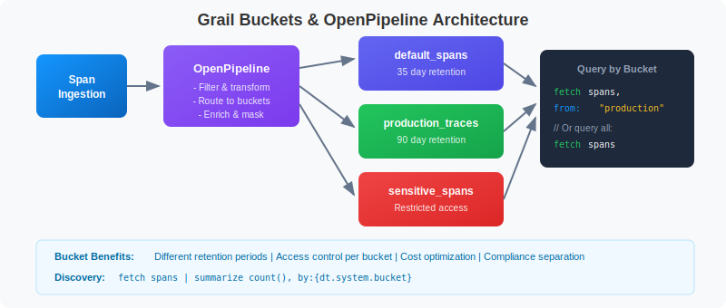
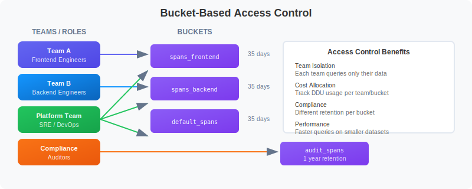

# 🏗️ Grail Buckets & OpenPipeline

> **Series:** SPANS | **Notebook:** 7 of 8 | **Created:** December 2025

## Data Architecture and Processing for Distributed Traces

This notebook covers Dynatrace Grail's bucket architecture for span storage, OpenPipeline configuration patterns, and data governance strategies.

---

## Table of Contents

1. Understanding Grail Buckets
2. Querying from Specific Buckets
3. Bucket Discovery
4. OpenPipeline Concepts
5. Filtering & Dropping Unwanted Spans
6. Transforming & Enriching Data
7. Routing to Different Buckets
8. Sampling Strategies
9. Access Control Patterns


## Prerequisites

Before starting this notebook, ensure you have:

- ✅ Completed previous SPANS notebooks (01-06)
- ✅ Understanding of Dynatrace Grail architecture
- ✅ Admin access for bucket/pipeline configuration (optional)

## 1. Understanding Grail Buckets <a name="understanding-buckets"></a>

Grail stores observability data in **buckets** - logical containers that provide data isolation, retention control, and access management.



<!--MARKDOWN_TABLE_ALTERNATIVE
| Bucket | Retention | Purpose |
|--------|-----------|---------|
| default_spans | 35 days | Standard span storage |
| production_traces | 90 days | Extended retention for prod |
| sensitive_spans | Varies | Restricted access, compliance |
-->

### Why Use Buckets?

| Purpose | Benefit |
|---------|---------|
| Cost Control | Different retention periods per bucket |
| Access Control | Restrict who can query which data |
| Compliance | Separate sensitive data for audit |
| Performance | Query specific buckets for efficiency |
| Team Isolation | Each team queries their own bucket |

> 💡 **Tip:** The default bucket for spans is `default_spans`. Custom buckets are configured via OpenPipeline.

---

## 2. Querying from Specific Buckets <a name="querying-buckets"></a>

Use the `bucket:` parameter to query from specific buckets for improved performance and cost efficiency.

```dql
// Query spans from the default bucket
fetch spans, bucket: {"default_spans"}
| filter span.kind == "server"
| fields start_time, dt.entity.service, span.name, duration
| sort start_time desc
| limit 50
```

```dql
// Query from multiple buckets (if you have custom buckets)
// Replace with your actual bucket names
fetch spans, bucket: {"default_spans"}
| filter span.kind == "server"
| summarize {span_count = count()}, by:{dt.entity.service}
| sort span_count desc
| limit 20
```

---

## 3. Bucket Discovery <a name="bucket-discovery"></a>

Discover which buckets contain your data and their characteristics.

```dql
// Find out which bucket your spans are stored in
fetch spans
| fieldsAdd bucket = dt.system.bucket
| summarize {span_count = count()}, by:{bucket}
| sort span_count desc
```

```dql
// Analyze span distribution by bucket and service
fetch spans
| fieldsAdd bucket = dt.system.bucket
| summarize {span_count = count()}, by:{bucket, dt.entity.service}
| sort bucket, span_count desc
| limit 50
```

---

## 4. OpenPipeline Concepts <a name="openpipeline-concepts"></a>

**OpenPipeline** processes incoming telemetry **before** storage. It enables filtering, transformation, routing, and sampling of span data.


<!--MARKDOWN_TABLE_ALTERNATIVE
| Stage | Purpose | Example |
|-------|---------|---------|
| Filter | Drop unwanted spans | Remove health checks |
| Transform | Enrich & modify fields | Add duration_ms |
| Route | Send to buckets | Production → long retention |
| Sample | Keep percentage | 10% of normal traffic |
-->

> ⚠️ **Note:** OpenPipeline configuration is done in the Dynatrace UI under **Settings > OpenPipeline**. This notebook shows how to identify candidates and verify results.

---

## 5. Filtering & Dropping Unwanted Spans <a name="filtering"></a>


<!--MARKDOWN_TABLE_ALTERNATIVE
| Action | Purpose | Example Config |
|--------|---------|----------------|
| drop | Remove spans | condition: span.name == "/health" |
| transform | Modify fields | duration_ms: duration / 1000000 |
| route | Send to bucket | bucket: spans_prod |
| sample | Keep percentage | rate: 0.1 |
-->

### Candidates for Dropping

1. **Health checks** - `/health`, `/ready`, `/alive` endpoints
2. **Metrics endpoints** - `/metrics`, `/prometheus`
3. **Static assets** - `.js`, `.css`, `.png` requests
4. **Internal noise** - Very frequent internal operations

```dql
// Find health check spans (candidates for dropping)
fetch spans
| filter contains(span.name, "health") or 
        contains(span.name, "ready") or
        contains(span.name, "alive") or
        contains(span.name, "ping")
| summarize {count = count()}, by:{dt.entity.service, span.name}
| sort count desc
```

```dql
// Find static asset requests (often low value)
fetch spans
| filter isNotNull(url.path)
| filter endsWith(url.path, ".js") or 
        endsWith(url.path, ".css") or
        endsWith(url.path, ".png") or
        endsWith(url.path, ".ico")
| summarize {count = count()}, by:{dt.entity.service}
| sort count desc
```

```dql
// Find high-volume, low-value spans
// High volume but almost no errors = candidates for filtering
fetch spans
| summarize {
    count = count(),
    error_count = countIf(span.status_code == "error")
  }, by:{dt.entity.service, span.name}
| fieldsAdd error_rate = (error_count * 100.0) / count
| filter count > 1000 and error_rate < 0.1
| sort count desc
```

### OpenPipeline Example: Drop Health Checks

```yaml
# Configure in Settings > OpenPipeline > Spans
pipelines:
  - name: spans_pipeline
    stages:
      - name: drop_health_checks
        rules:
          - condition: |
              contains(span.name, "health") or
              contains(span.name, "ready") or
              contains(span.name, "alive")
            action: drop
```

---

## 6. Transforming & Enriching Data <a name="transforming"></a>

Pre-compute fields at ingestion time for faster queries.

### OpenPipeline Example: Add Computed Fields

```yaml
stages:
  - name: add_computed_fields
    rules:
      - transform:
          fields:
            duration_ms: duration / 1000000
            is_slow: duration > 1000000000
```

### OpenPipeline Example: Add Business Context

```yaml
stages:
  - name: add_business_context
    rules:
      - condition: contains(service.name, "checkout")
        transform:
          fields:
            business.domain: "commerce"
            business.criticality: "high"
            
      - condition: contains(service.name, "payment")
        transform:
          fields:
            business.domain: "finance"
            business.criticality: "critical"
```

```dql
// Example: Fields you might want to pre-compute
fetch spans
| fieldsAdd 
    duration_ms = duration / 1000000,
    is_error = span.status_code == "error",
    latency_bucket = if(
        duration < 100ms, "fast",
        else: if(duration < 1s, "normal",
        else: "slow"))
| fields dt.entity.service, span.name, duration_ms, is_error, latency_bucket
| limit 10
```

```dql
// Identify services by domain for enrichment planning
fetch spans
| summarize {count = count()}, by:{dt.entity.service}
| sort count desc
| limit 20
```

---

## 7. Routing to Different Buckets <a name="routing"></a>

Route spans to buckets based on:
- **Retention needs** (short vs. long term)
- **Sensitivity** (PII vs. non-PII)
- **Environment** (prod vs. dev)
- **Cost** (high-value vs. low-value)

### OpenPipeline Example: Route by Environment

```yaml
stages:
  - name: route_by_environment
    rules:
      - condition: deployment.environment == "production"
        route:
          bucket: spans_production_90d
          
      - condition: deployment.environment == "staging"
        route:
          bucket: spans_staging_7d
          
      - condition: true  # Default
        route:
          bucket: spans_default_3d
```

### OpenPipeline Example: Route by Sensitivity

```yaml
stages:
  - name: route_by_sensitivity
    rules:
      - condition: |
          contains(service.name, "payment") or 
          contains(service.name, "auth")
        route:
          bucket: spans_sensitive
          
      - condition: true
        route:
          bucket: spans_default
```

```dql
// Check what environments/namespaces exist for routing planning
fetch spans
| summarize {count = count()}, by:{k8s.namespace.name}
| sort count desc
```

```dql
// Identify sensitive services for routing
fetch spans
| filter contains(span.name, "payment") or
        contains(span.name, "auth") or
        contains(span.name, "login")
| summarize {count = count()}, by:{dt.entity.service, span.name}
| sort count desc
```

---

## 8. Sampling Strategies <a name="sampling"></a>

For very high volume services, consider sampling to reduce costs while maintaining visibility.

### OpenPipeline Example: Smart Sampling

```yaml
stages:
  - name: smart_sampling
    rules:
      # Always keep all errors (100%)
      - condition: span.status_code == "error"
        action: keep
        
      # Always keep slow requests (100%)
      - condition: duration > 1000000000
        action: keep
        
      # Sample 10% of normal requests for high-volume service
      - condition: service.name == "high-volume-service"
        sample:
          rate: 0.1
          
      # Sample 50% for other services
      - condition: true
        sample:
          rate: 0.5
```

```dql
// Identify high-volume services for sampling consideration
fetch spans
| summarize {
    total = count(),
    errors = countIf(span.status_code == "error"),
    slow = countIf(duration > 1s)
  }, by:{dt.entity.service}
| fieldsAdd error_rate = (errors * 100.0) / total
| fieldsAdd important = errors + slow
| fieldsAdd droppable = total - errors - slow
| filter total > 10000  // High volume services
| sort total desc
```

```dql
// Calculate potential savings from filtering
fetch spans
| summarize {
    total = count(),
    health_checks = countIf(
        contains(span.name, "health") or 
        contains(span.name, "ready") or
        contains(span.name, "alive")),
    static_assets = countIf(
        endsWith(span.name, ".js") or
        endsWith(span.name, ".css") or
        endsWith(span.name, ".png")),
    errors = countIf(span.status_code == "error"),
    slow = countIf(duration > 1s)
  }
| fieldsAdd droppable = health_checks + static_assets
| fieldsAdd must_keep = errors + slow
| fieldsAdd savings_percent = (droppable * 100.0) / total
```

---

## 9. Access Control Patterns <a name="access-control"></a>

Use bucket-based queries to implement access control patterns.



<!--MARKDOWN_TABLE_ALTERNATIVE
| Team/Role | Bucket Access | Retention |
|-----------|---------------|-----------|
| Team A (Frontend) | spans_frontend | 35 days |
| Team B (Backend) | spans_backend | 35 days |
| Platform/SRE | All buckets | 35 days |
| Compliance | audit_spans | 1 year |
-->

> 💡 **Tip:** Bucket permissions are configured in the Dynatrace UI under **Account Management > Identity & Access Management**.

```dql
// Data retention analysis: Span volume by day
fetch spans
| fieldsAdd day = bin(start_time, 1d)
| summarize {span_count = count()}, by:{day}
| sort day desc
| limit 30
```

```dql
// Volume analysis by service (for cost allocation)
fetch spans
| summarize {
    span_count = count(),
    avg_duration_ms = avg(duration) / 1000000
  }, by:{dt.entity.service}
| sort span_count desc
| limit 30
```

---

## Best Practices Summary

### DO ✅

- Drop health checks and metrics endpoints
- Pre-compute commonly used fields
- Route by environment and sensitivity
- Mask PII before storage
- Sample high-volume, low-value spans

### DON'T ❌

- Drop error spans (you'll need them for RCA)
- Drop slow spans (they indicate problems)
- Over-sample (lose visibility into patterns)
- Forget to test rules before deploying

---

## Summary

In this notebook, you learned:

✅ **Grail bucket architecture** for organizing and isolating data  
✅ **Querying from specific buckets** using the bucket: parameter  
✅ **Bucket discovery** to understand data distribution  
✅ **OpenPipeline concepts** with YAML configuration examples  
✅ **Filtering & dropping** unwanted spans (health checks, static assets)  
✅ **Transforming & enriching** data with computed fields  
✅ **Routing to buckets** by environment and sensitivity  
✅ **Sampling strategies** for high-volume services  
✅ **Access control patterns** using bucket-based isolation  

---

## Next Steps

Continue to **SPANS-08: Cost-Efficient DQL Queries** to learn:
- Optimizing DQL queries for DDU efficiency
- Query cost estimation techniques
- Best practices for production queries
- Indexed fields and performance strategies
