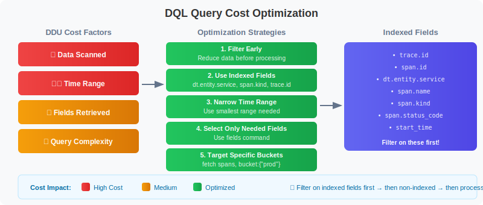
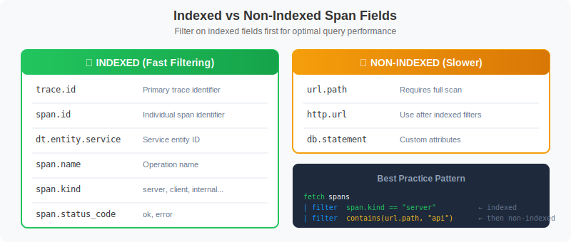

# 💰 Cost-Efficient DQL Queries

> **Series:** SPANS | **Notebook:** 8 of 8 | **Created:** December 2025

## Optimizing Span Queries for Performance and DDU Efficiency

This notebook covers best practices for writing cost-efficient DQL queries, minimizing DDU consumption while maintaining effective observability.

---

## Table of Contents

1. Understanding Query Costs
2. Filter Early Pattern
3. Indexed Fields for Performance
4. Field Selection
5. Time Range Optimization
6. Aggregation Efficiency
7. High-Cardinality Grouping
8. Production Query Patterns
9. Performance Checklist


## Prerequisites

Before starting this notebook, ensure you have:

- ✅ Completed previous SPANS notebooks (01-07)
- ✅ Understanding of DQL fundamentals
- ✅ Access to span data in your tenant

## 1. Understanding Query Costs <a name="understanding-costs"></a>

DQL queries consume DDUs (Davis Data Units) based on several factors:



<!--MARKDOWN_TABLE_ALTERNATIVE
| Cost Factor | Impact | Optimization |
|-------------|--------|--------------|
| Data Scanned | High | Filter early |
| Time Range | High | Use smallest range needed |
| Fields Retrieved | Medium | Select only needed fields |
| Query Complexity | Medium | Use indexed fields first |
| Filter Efficiency | High | Leverage indexed fields |
-->

### Cost Optimization Priorities

| Priority | Strategy | Impact |
|----------|----------|--------|
| 1 | Filter early | High - reduces data scanned |
| 2 | Use indexed fields | High - leverages optimized indexes |
| 3 | Limit time range | High - reduces data volume |
| 4 | Select only needed fields | Medium - reduces transfer |
| 5 | Query specific buckets | Medium - targets data |
| 6 | Use aggregations | Low - summarizes results |

---

## 2. Filter Early Pattern <a name="filter-early"></a>

The **most important** optimization: Apply filters as early as possible in the query pipeline.

```dql
// ✅ EFFICIENT: Filter BEFORE any processing
fetch spans
| filter span.kind == "server"           // Filter first!
| filter dt.entity.service == "SERVICE-6C36694E683AD694"  // Further narrow
| filter span.status_code == "error"     // Even more specific
| fields start_time, span.name, duration
| limit 100
```

```dql
// ❌ INEFFICIENT: Processing before filtering scans more data
// This pattern wastes resources - shown for comparison only
fetch spans
| fieldsAdd duration_ms = duration / 1000000  // Processing first (bad)
| summarize {avg_duration = avg(duration_ms)}, by:{dt.entity.service, span.name}
| filter dt.entity.service == "SERVICE-6C36694E683AD694"  // Too late!
| limit 100
```

```dql
// ✅ EFFICIENT: Combine multiple filter conditions
fetch spans
| filter span.kind == "server"
        and isNotNull(dt.entity.service)
        and duration > 100ms
| fields start_time, span.name, duration
| sort duration desc
| limit 50
```

---

## 3. Indexed Fields for Performance <a name="indexed-fields"></a>

Filter on **indexed fields** for best query performance. These fields have optimized storage that allows fast filtering.

### Commonly Indexed Span Fields



<!--MARKDOWN_TABLE_ALTERNATIVE
| Field | Type | Notes |
|-------|------|-------|
| trace.id | Indexed | Primary trace identifier - fast lookup |
| span.id | Indexed | Individual span identifier |
| dt.entity.service | Indexed | Service entity ID - excellent for filtering |
| span.name | Indexed | Operation name - commonly filtered |
| span.kind | Indexed | server, client, internal, producer, consumer |
| span.status_code | Indexed | ok, error - indexed for fast error queries |
| url.path | Non-indexed | Requires full scan - use after indexed filters |
| http.url | Non-indexed | Use after indexed filters |
| db.statement | Non-indexed | Custom attributes - slower |
-->

> 💡 **Tip:** When possible, filter on `dt.entity.service` rather than `service.name` - the entity ID is more reliably indexed.

```dql
// ✅ FAST: Filter on indexed fields
fetch spans
| filter isNotNull(dt.entity.service)    // Indexed
| filter span.kind == "server"           // Indexed
| filter span.status_code == "error"     // Indexed
| fields start_time, span.name, duration
| limit 100
```

```dql
// ⚠️ SLOWER: Filter on non-indexed field requires full scan
fetch spans
| filter contains(url.path, "checkout")  // Not indexed - slower
| limit 100
```

```dql
// ✅ BETTER: Combine indexed filter first, then non-indexed
fetch spans
| filter span.kind == "server"           // Indexed - reduces data first
| filter isNotNull(dt.entity.service)    // Indexed - further reduces
| filter contains(url.path, "checkout")  // Non-indexed on smaller dataset
| limit 100
```

---

## 4. Field Selection <a name="field-selection"></a>

Select only the fields you need - avoid fetching all attributes.

```dql
// ✅ EFFICIENT: Select only required fields
fetch spans
| filter span.kind == "server"
| fields start_time,
         dt.entity.service,
         span.name,
         duration,
         span.status_code
| limit 100
```

```dql
// ❌ INEFFICIENT: Fetching all fields (default behavior)
// Returns ALL fields for each span - more data transfer
fetch spans
| filter isNotNull(dt.entity.service)
| limit 5
```

```dql
// ✅ EFFICIENT: Compute fields only when needed
fetch spans
| filter span.kind == "server"
| filter duration > 500ms
| fieldsAdd duration_ms = duration / 1000000
| fields start_time, dt.entity.service, span.name, duration_ms
| sort duration_ms desc
| limit 50
```

---

## 5. Time Range Optimization <a name="time-range"></a>

Always use the smallest time range that meets your needs.


<!--MARKDOWN_TABLE_ALTERNATIVE
| Time Range | Relative Cost | Use Case |
|------------|---------------|----------|
| Last 5m | $ | Real-time debugging |
| Last 1h | $$ | Recent issue analysis |
| Last 24h | $$$ | Daily patterns |
| Last 7d | $$$$ | Weekly trends |
| Last 30d | $$$$$ | Historical analysis (use aggregations!) |
-->

```dql
// Query with explicit time filter (last 15 minutes)
fetch spans
| filter start_time >= now() - 15m
| filter span.kind == "server"
| summarize {span_count = count()}, by:{dt.entity.service}
| sort span_count desc
| limit 20
```

```dql
// Narrow time range for troubleshooting specific incident
fetch spans
| filter start_time >= now() - 30m
| filter span.kind == "server"
| filter span.status_code == "error"
| fields start_time, dt.entity.service, span.name, span.status_message
| sort start_time desc
| limit 100
```

```dql
// Use aggregations for longer time ranges to reduce output
fetch spans
| filter span.kind == "server"
| summarize {
    span_count = count(),
    error_count = countIf(span.status_code == "error"),
    avg_duration_ms = avg(duration) / 1000000
  }, by:{dt.entity.service}
| sort span_count desc
| limit 25
```

---

## 6. Aggregation Efficiency <a name="aggregation"></a>

Use aggregations to summarize data instead of retrieving raw records. Simpler aggregations are faster.

```dql
// ✅ EFFICIENT: Basic aggregations
fetch spans
| filter span.kind == "server"
| summarize {
    requests = count(),
    errors = countIf(span.status_code == "error")
  }, by:{dt.entity.service}
| sort requests desc
| limit 20
```

```dql
// ✅ EFFICIENT: Summarize at source with error rate calculation
fetch spans
| filter span.kind == "server"
| summarize {
    total_requests = count(),
    error_count = countIf(span.status_code == "error"),
    p50_duration_ms = percentile(duration, 50) / 1000000,
    p95_duration_ms = percentile(duration, 95) / 1000000
  }, by:{dt.entity.service}
| fieldsAdd error_rate_pct = (error_count * 100.0) / total_requests
| sort total_requests desc
| limit 20
```

```dql
// ⚠️ MORE EXPENSIVE: Many percentiles are costlier
// Use only the percentiles you actually need
fetch spans
| filter span.kind == "server"
| summarize {
    p50 = percentile(duration, 50) / 1000000,
    p75 = percentile(duration, 75) / 1000000,
    p90 = percentile(duration, 90) / 1000000,
    p95 = percentile(duration, 95) / 1000000,
    p99 = percentile(duration, 99) / 1000000
  }, by:{dt.entity.service}
| limit 20
```

```dql
// Time-bucketed aggregations for trends
fetch spans
| filter span.kind == "server"
| fieldsAdd time_bucket = bin(start_time, 5m)
| summarize {
    request_count = count(),
    avg_duration_ms = avg(duration) / 1000000
  }, by:{time_bucket, dt.entity.service}
| sort time_bucket desc, request_count desc
| limit 100
```

---

## 7. High-Cardinality Grouping <a name="cardinality"></a>

Avoid grouping by high-cardinality fields (fields with many unique values).

```dql
// ❌ BAD: Grouping by high-cardinality field
// trace.id could have millions of unique values!
fetch spans
| summarize {trace_span_count = count()}, by:{trace.id}
| limit 10
```

```dql
// ✅ GOOD: Group by lower-cardinality fields
fetch spans
| summarize {span_count = count()}, by:{dt.entity.service, span.name}
| sort span_count desc
| limit 20
```

```dql
// ✅ GOOD: If you need trace analysis, filter first
fetch spans
| filter span.status_code == "error"      // Reduce first
| filter start_time >= now() - 15m        // Narrow time
| summarize {
    span_count = count(),
    services = collectDistinct(dt.entity.service)
  }, by:{trace.id}
| sort span_count desc
| limit 20
```

---

## 8. Production Query Patterns <a name="production"></a>

Optimized query templates for common production use cases.

```dql
// Production Pattern: Service Health Dashboard
// Optimized for dashboard refresh (low DDU)
fetch spans, bucket: {"default_spans"}
| filter span.kind == "server"
| summarize {
    requests = count(),
    errors = countIf(span.status_code == "error"),
    avg_latency_ms = avg(duration) / 1000000
  }, by:{dt.entity.service}
| fieldsAdd error_rate = (errors * 100.0) / requests
| sort requests desc
| limit 20
```

```dql
// Production Pattern: Error Investigation
// Fast targeted query for debugging
fetch spans, bucket: {"default_spans"}
| filter span.kind == "server"
| filter span.status_code == "error"
| filter start_time >= now() - 30m
| fields start_time,
         dt.entity.service,
         span.name,
         span.status_message,
         trace.id
| sort start_time desc
| limit 50
```

```dql
// Production Pattern: Latency Trend Analysis
// Using bin() for time-series without makeTimeseries
fetch spans, bucket: {"default_spans"}
| filter span.kind == "server"
| filter isNotNull(dt.entity.service)
| fieldsAdd time_bucket = bin(start_time, 5m)
| summarize {
    request_count = count(),
    p95_latency_ms = percentile(duration, 95) / 1000000
  }, by:{time_bucket}
| sort time_bucket desc
| limit 50
```

```dql
// Production Pattern: Top Slow Operations
// Focus on actionable data
fetch spans, bucket: {"default_spans"}
| filter span.kind == "server"
| filter duration > 1s
| summarize {
    occurrence_count = count(),
    avg_duration_ms = avg(duration) / 1000000,
    max_duration_ms = max(duration) / 1000000
  }, by:{dt.entity.service, span.name}
| sort avg_duration_ms desc
| limit 20
```

```dql
// Production Pattern: Well-optimized comprehensive query
// Follows all optimization rules
fetch spans
| filter start_time >= now() - 1h          // 1. Appropriate time range
| filter isNotNull(dt.entity.service)      // 2. Filter early (indexed)
| filter span.kind == "server"             // 2. Additional early filter (indexed)
| filter span.status_code == "error"       // 3. Indexed field
| fields start_time, span.name, duration, http.route  // 4. Only needed fields
| summarize {
    error_count = count(),
    avg_duration_ms = avg(duration) / 1000000
  }, by:{span.name, http.route}            // 5. Low cardinality
| sort error_count desc
| limit 20                                 // 6. Limited results
```

---

## 9. Performance Checklist <a name="checklist"></a>

Use this checklist before running production queries:

```
Query Optimization Checklist:

☐ 1. Time range - Is it as short as possible for my needs?
☐ 2. Filter early - Are filters immediately after fetch?
☐ 3. Indexed fields - Am I filtering on indexed fields first?
      • trace.id, span.id, dt.entity.service
      • span.name, span.kind, span.status_code
      • start_time
☐ 4. Field selection - Am I selecting only needed fields?
☐ 5. Low cardinality - Are my group-by fields low cardinality?
☐ 6. Result limits - Do I have appropriate limits?
☐ 7. Bucket targeting - Am I querying specific buckets if known?
```

---

## Summary

In this notebook, you learned:

✅ **Query cost factors** and optimization priorities  
✅ **Filter early pattern** to reduce data scanned  
✅ **Indexed fields** for faster query execution  
✅ **Field selection** to minimize data transfer  
✅ **Time range optimization** for cost control  
✅ **Aggregation efficiency** for summarized results  
✅ **High-cardinality grouping** pitfalls to avoid  
✅ **Production patterns** for common use cases  
✅ **Performance checklist** for query review  

---

## Series Complete! 🎉

You have completed the **Spans & Distributed Tracing** notebook series!

### What You've Learned:

1. **Fundamentals** - Span structure and distributed tracing concepts
2. **Querying** - DQL syntax for effective span analysis
3. **Troubleshooting** - Error detection and root cause analysis
4. **Topology** - Service dependencies and flow visualization
5. **Analytics** - Advanced metrics and trend analysis
6. **Security** - Security monitoring and compliance with spans
7. **Buckets & Pipeline** - Data architecture, OpenPipeline, and governance
8. **Cost Optimization** - Efficient query patterns and indexed fields

### Next Steps:

- Apply these patterns to your own Dynatrace environment
- Build dashboards using the optimized query patterns
- Configure alerts based on span analytics
- Set up OpenPipeline for data optimization
- Explore Davis AI integration for intelligent analysis
