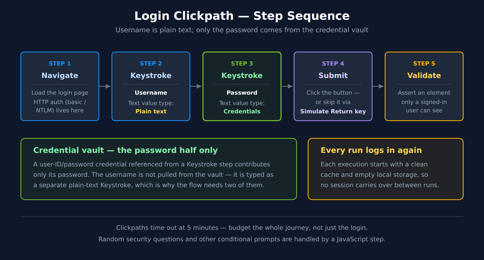

# SYNTH-02: Browser Monitors

> **Series:** SYNTH — Synthetic Monitoring | **Notebook:** 2 of 6 | **Created:** December 2025 | **Last Updated:** 08/03/2026

## Creating and Optimizing Browser-Based Synthetic Tests
This notebook covers browser monitors in Dynatrace, including single-URL monitors, browser clickpaths, and performance analysis using the latest Dynatrace platform capabilities.

---

## Table of Contents

1. [Browser Monitor Types](#browser-monitor-types)
2. [Single-URL Monitors](#single-url-monitors)
3. [Browser Clickpaths](#browser-clickpaths)
4. [Monitoring a Login Flow](#monitoring-a-login-flow)
5. [Performance Metrics](#performance-metrics)
6. [Validation and Assertions](#validation-and-assertions)
7. [Analyzing Browser Results](#analyzing-browser-results)

---


## Prerequisites

- ✅ Access to a Dynatrace environment with Synthetic Monitoring
- ✅ Completed SYNTH-01 Fundamentals
- ✅ Web application URL to monitor

> **How browser data is queried:** Browser monitors are analyzed primarily through the **`dt.synthetic.browser.*` metrics** (`timeseries`) — availability, total duration, and per-step duration. Execution-level browser records appear as `browser_monitor_execution` / `browser_step_execution` events in `fetch dt.synthetic.events` **when the classic browser experience is in use**; with the *new browser monitor experience* activated, detailed actions surface in RUM instead. **Dynatrace environments created after January 26, 2026 do not have a classic/new toggle at all** — they run the new experience by default, so this discovery step matters mainly for pre-2026-01-26 tenants. Confirm which path your tenant populates with a discovery query (`fetch dt.synthetic.events, from:-24h | filter startsWith(event.type, "browser") | limit 5`).

<a id="browser-monitor-types"></a>
## 1. Browser Monitor Types
### Single-URL Browser Monitor

Loads a single page and captures performance metrics:

| Feature | Description |
|---------|-------------|
| **Execution** | Full Chrome browser render |
| **Metrics** | W3C Navigation Timing, resource timing |
| **Screenshots** | Automatic capture on completion/failure |
| **Validation** | Content validation, element checks |

**Best For:**
- Homepage availability
- Landing page performance
- Single page applications (SPA) initial load

### Browser Clickpath Monitor

Multi-step user journey simulation:

| Feature | Description |
|---------|-------------|
| **Steps** | Multiple pages/actions in sequence |
| **Interactions** | Click, type, select, wait |
| **State** | Cookies maintained within execution (session NOT maintained between executions) |
| **Content Validation** | Validate text/elements exist on page |

> **Note:** Unlike RUM session properties, browser clickpaths do not support extracting data into variables for use across executions. Content validation allows you to verify expected text/elements exist, but you cannot capture dynamic values for reuse.

**Best For:**
- Login flows
- Checkout processes
- Form submissions
- Multi-page workflows

### Configuration Path

**Dynatrace menu → Synthetic → Create synthetic monitor → Create browser monitor**

<a id="single-url-monitors"></a>
## 2. Single-URL Monitors
### Creating a Single-URL Monitor

1. **URL Configuration**
   - Enter the full URL (https://...)
   - Set viewport size (desktop, tablet, mobile)
   - Configure user agent string

2. **Execution Settings**
   - Frequency: 5-60 minutes
   - Locations: Select public or private
   - Timeout: Maximum execution time

3. **Validation Rules**
   - HTTP status code validation
   - Content validation (text, regex)
   - Element presence checks

### Viewport Presets

| Preset | Dimensions | Use Case |
|--------|------------|----------|
| Desktop | 1920x1080 | Standard desktop |
| Laptop | 1366x768 | Common laptop |
| Tablet | 768x1024 | iPad portrait |
| Mobile | 375x667 | iPhone 8 |

```dql
// List browser/clickpath monitors
// PREFERRED -- Smartscape. Classic dt.entity.synthetic_test maps to BROWSER_MONITOR.
// entityName() is not needed: the node's `name` field IS the display name.
smartscapeNodes "BROWSER_MONITOR"
| fields name, id, id_classic, url, enabled, frequency
| sort name asc
| limit 50

// Clickpath STEPS are separate nodes (BROWSER_MONITOR_STEP), joined to the monitor by
// an edge -- they are NOT fields of the monitor record. To count steps per monitor,
// start from the steps and traverse belongs_to back to the monitor:
//
// smartscapeNodes "BROWSER_MONITOR_STEP"
// | traverse edgeTypes: {"belongs_to"}, targetTypes: {"BROWSER_MONITOR"}, direction: forward
// | summarize steps = count(), by:{monitor = name, url}
// | sort steps desc

// FALLBACK (classic surface -- still functional):
// fetch dt.entity.synthetic_test
// | fields id, entity.name
// | sort entity.name asc
// | limit 50
```

```dql
// Browser monitor availability + duration (last 24h) — metrics path
// Metric duration is already in milliseconds
timeseries {
    availability_pct = avg(dt.synthetic.browser.availability),
    duration_ms      = avg(dt.synthetic.browser.duration)
  }, from: now() - 24h, interval: 1h, by: {dt.entity.synthetic_test}
```

<a id="browser-clickpaths"></a>
## 3. Browser Clickpaths
### Creating Clickpath Monitors

#### Option 1: Record with Browser Extension

1. Install Dynatrace Synthetic Recorder (Chrome extension)
2. Start recording session
3. Perform user journey in browser
4. Stop recording and export to Dynatrace

#### Option 2: Manual Script Creation

Define steps programmatically using the script editor.

### Common Actions

| Action | Description | Example |
|--------|-------------|----------|
| `navigate` | Go to URL | Navigate to login page |
| `click` | Click element | Click login button |
| `type` | Enter text | Type username |
| `selectOption` | Select dropdown | Select country |
| `wait` | Wait for condition | Wait for element visible |
| `javascript` | Execute JS | Custom validation |

### Element Selectors

| Selector Type | Example | Best Practice |
|--------------|---------|---------------|
| CSS | `#login-btn` | Preferred - stable |
| XPath | `//button[@id='login']` | Complex structures |
| Link Text | `Login` | Simple links |
| Data Attribute | `[data-testid='login']` | Test automation |

```dql
// Clickpath step performance — per-step duration (metrics path)
timeseries step_duration_ms = avg(dt.synthetic.browser.step.duration),
    from: now() - 24h, interval: 1h, by: {dt.entity.synthetic_test, step.name}
```

<a id="monitoring-a-login-flow"></a>
## 4. Monitoring a Login Flow

Authenticated journeys are the most requested clickpath and the most failure-prone. Section 3 covered the generic mechanics; this section walks the specific case end to end, because a login introduces three problems a public-page clickpath never hits: a secret has to come from somewhere safe, "the page loaded" is not the same as "the user got in", and the credential will eventually rotate out from under the monitor.

### 4.1 Before you build: the account

Use a **dedicated synthetic test account**, never a real user's. A monitor running every 5 minutes from 10 locations is roughly 28,800 logins a month against that identity — enough to trip lockout policies, distort audit trails, and skew any product analytics keyed on user activity.

Dynatrace enumerates three authentication mechanisms for single-URL browser monitors and clickpaths:

| Mechanism | Where it is configured | Notes |
|-----------|------------------------|-------|
| **Form-based (HTML)** | Keystroke steps against the page's own fields | The common case — this section's walkthrough |
| **HTTP (basic, digest, NTLM, Negotiate/Kerberos)** | `Enable HTTP authentication` on the **Navigate** step | Browser-native dialog, not a page form. Usernames accept `<username>` or `<domain>\<username>` |
| **Certificate** | Monitor configuration | Available from any public location and on **Linux-based** private locations |

**MFA, one-time passwords, and CAPTCHA are not among the enumerated mechanisms.** That is a statement about what the supported-authentication page lists, not a tested claim that every variant fails — but plan on it: if the login you want to monitor demands a second factor, the clickpath has no documented way to satisfy it.

In community practice the workaround is organizational rather than technical — the test account is exempted from the MFA policy, or the synthetic egress ranges are allowlisted past the bot/step-up challenge. Both need the application and security teams to agree in advance, so raise it before you start building, not after the monitor goes red. The same applies to bot detection: a headless browser hitting a login form on a fixed schedule is precisely the traffic those systems exist to block.

### 4.2 Store the credential first

Create the credential before building the clickpath — the Keystroke step selects from what already exists in the vault.

**Credential Vault → Add new credential** (upper-right) → choose the type → **Save**

| Setting | What to choose for a login clickpath |
|---------|--------------------------------------|
| **Type** | *Username and password pairs* (also available: *Token credentials*, *Certificate credentials*) |
| **Scope** | *Synthetic* (the other scopes are *Extension authentication* and *AppEngine*) |
| **Owner access only** | On by default. Turn it off for *All*, or supply a comma-separated username list to share with specific users |

> **Access-control caveat worth knowing before you rely on it:** when a browser monitor is associated with a restricted credential, users who *cannot* see that credential can still edit certain fields on the monitor. Vault restriction protects the secret's value; it is not a lock on the monitor configuration. Treat monitor edit rights as a separate control.

### 4.3 Build the clickpath



<!-- MARKDOWN_TABLE_ALTERNATIVE
| Step | Type | Configuration |
|------|------|---------------|
| 1 | Navigate | Load the login page. HTTP auth (basic/NTLM) is configured here, not on a Keystroke step. |
| 2 | Keystroke | Username — Text value data type: Plain text |
| 3 | Keystroke | Password — Text value data type: Credentials (from the vault) |
| 4 | Click, or Simulate Return key on step 3 | Submit the form |
| 5 | Validate content | Assert an element only a signed-in user can see |
Each execution starts with a clean cache and empty local storage, so no session carries over between runs. Clickpaths time out at 5 minutes.
-->

The five steps, in order:

| # | Step type | Configuration |
|---|-----------|---------------|
| 1 | **Navigate** | The login page URL. At least one Navigate step is required per clickpath. |
| 2 | **Keystroke** | The username field. Leave the `Text value` data type as **Plain text**. |
| 3 | **Keystroke** | The password field. Change the `Text value` data type to **Credentials**, then **Select credentials** from the vault. |
| 4 | **Click** | The submit button — *or* skip this step entirely by enabling **Simulate Return key** on step 3. |
| 5 | **Validate content** | Assert the post-login state (see § 4.4). |

> **The thing that catches people out:** a *user ID/password pair* credential referenced from a Keystroke step supplies **only the password portion**. The username does not come from the vault — it is typed as an ordinary plain-text Keystroke. That asymmetry is why the flow needs two Keystroke steps rather than one, and why a monitor built on the assumption that one credential fills both fields fails on the username field with no obvious explanation.

Two Keystroke options are worth setting deliberately:

- **Simulate Return key** — presses Enter after the keystrokes. On a login form this submits without a separate Click step, which removes a selector that would otherwise break every time the button markup changes.
- **Simulate blur event** — on by default. Leave it on: forms that validate a field on focus-loss (or that only enable the submit button after blur) will not behave correctly without it.

If you record the clickpath rather than building it by hand, the recorder notices captured credentials — when a recording captures a password you are notified and offered the option to save it to the credential vault. Take the offer. The reverse operation, **Reset text value**, converts a credential back to unencrypted plain text, which is almost never what you want on a password field.

### 4.4 Validate that the login actually worked

This is where login monitors most often give false confidence. **A failed login usually returns HTTP 200.** The server happily renders the login page again with an "invalid credentials" banner, so status-code checking alone passes and the monitor stays green while nobody can sign in.

Content validation runs per step and supports four targets:

| Target | Use for a login |
|--------|-----------------|
| **Visible text** | Text only an authenticated user sees — an account name, a greeting |
| **Specific elements** | A DOM element unique to the signed-in shell, e.g. a sign-out control |
| **Text within elements** | Scoped text assertion — safer than a bare page-wide text match |
| **DOM / resource text** | Markup or resource content not necessarily rendered |

Validations execute sequentially and the monitor fails if a pass criterion is unmet or a fail criterion is triggered. For a login, set **both** directions:

- **Pass criterion** — an element that exists *only after* authentication. A sign-out link is the sturdiest choice: its presence is a direct assertion of session state, and it survives redesigns better than a greeting string.
- **Fail criterion** — the error banner's text. This converts the silent-200 failure into an explicit, immediately readable failure reason.

Do not validate on the *login page* loading, on the submit button existing, or on the URL changing. Each of these can be true while authentication has plainly failed.

### 4.5 When the simple path is not enough

| Situation | Approach |
|-----------|----------|
| **Random security questions**, A/B-tested login variants, conditional prompts | A **JavaScript** step — explicitly documented for dynamic scenarios including login flows with random security questions |
| **Session cookie injection** to skip the UI login | A **Cookie** step. Requires *Name*, *Value*, and *Domain* (*Path* optional); `;`, `,`, `"` and `\` are forbidden in values |
| **Browser-native auth dialog** rather than a page form | `Enable HTTP authentication` on the **Navigate** step |

JavaScript-step limits worth knowing before you architect around it: it cannot execute on PDF pages, variables are confined to a single execution, key names cap at 100 characters, and values cap at 5,000.

The Cookie step carries an important boundary. A cookie it sets is valid for **the entire monitor execution** but does **not** persist across executions — consistent with the section 1 note that clickpaths keep session state within a run and not between runs. It is a way to start each run pre-authenticated from a static value, not a way to log in once and stay logged in. If the session token is short-lived, this approach expires and the monitor fails; it suits long-lived API-style tokens far better than ordinary web session cookies.

One recording constraint: *Enable global login authentication* is not supported while recording, so configure it after the recording is captured.

### 4.6 Operating it

Two execution-model facts drive most login-monitor surprises:

- **Every run logs in from scratch.** Each execution starts with a clean cache and empty local storage. There is no "already signed in" fast path, and the full authentication cost is in every measurement.
- **Clickpaths time out at 5 minutes.** That budget covers the whole journey. A slow identity provider consumes it before your actual business steps run.

In community practice, the single most common cause of a healthy login monitor going red overnight is credential rotation — the vault entry still holds the previous password. It is worth putting the synthetic test account on the same rotation calendar as the credential vault entry, so the two move together rather than one discovering the other has changed. Verify against your own rotation policy.

> <sub>**Sources:** [Supported authentication methods in Synthetic Monitoring (DT docs)](https://docs.dynatrace.com/docs/observe/digital-experience/synthetic-monitoring/general-information/synthetic-authentication), [Credential vault (DT docs)](https://docs.dynatrace.com/docs/manage/credential-vault), [Browser clickpath events (DT docs)](https://docs.dynatrace.com/docs/observe/digital-experience/synthetic-monitoring/browser-monitors/browser-clickpath-events), [Types of clickpath steps (DT docs)](https://docs.dynatrace.com/docs/observe/digital-experience/synthetic-on-grail/synthetic-app/create-configure-browser-monitors/browser-clickpath-steps), [Record a browser clickpath (DT docs)](https://docs.dynatrace.com/docs/observe/digital-experience/synthetic-monitoring/browser-monitors/record-a-browser-clickpath). Credential-portion behavior, Keystroke data-type labels, step-type limits, and validation targets confirmed at source 08/03/2026. **Derived:** § 4.4 pass/fail criterion pairing combines the documented validation targets with the documented sequential pass/fail evaluation.</sub>

```dql
// Login clickpath — which step costs the most, and is it running everywhere?
// Ranks every step of every browser clickpath by average duration so the
// authentication steps can be compared against the business steps that follow.
//
// Deliberately unfiltered: step names are whatever the author (or the recorder)
// named them, so a hard-coded "login" filter silently returns nothing on most
// tenants. Narrow it once you know your own naming, e.g.:
//   | filter contains(step, "login", caseSensitive: false)
// Note the named parameter -- contains() rejects a positional third argument.
timeseries {
    step_ms = avg(dt.synthetic.browser.step.duration),
    runs    = sum(dt.synthetic.browser.step.executions)
  }, from: now() - 24h, interval: 1h, by: {dt.entity.synthetic_test, step.name}
| fieldsAdd avg_step_ms = round(arrayAvg(step_ms), decimals: 0),
            max_step_ms = round(arrayMax(step_ms), decimals: 0),
            executions  = arraySum(runs)
| fields monitor = dt.entity.synthetic_test, step = step.name,
         avg_step_ms, max_step_ms, executions
| sort avg_step_ms desc
| limit 25
```

<a id="performance-metrics"></a>
## 5. Performance Metrics
### Browser timing in Synthetic on Grail

Browser monitors capture full-page render timing. In Grail this is exposed as **synthetic browser metrics**, split across two levels — the monitor as a whole, and each individual step.

**Monitor-level**

| Metric key | Description | Unit |
|------------|-------------|------|
| `dt.synthetic.browser.availability` | The availability rate of browser monitors | % |
| `dt.synthetic.browser.executions` | The number of monitor executions | count |
| `dt.synthetic.browser.duration` | Duration of the monitor, calculated as a sum of all step durations. Dynatrace recommends this as the best representation of user experience. | ms |
| `dt.synthetic.browser.classic.total_duration` | Sum of the total durations of all steps. Source: **classic** RUM JavaScript | ms |
| `dt.synthetic.browser.user_events.duration` | Sum of all step-level user **event** durations. Source: **new** RUM JavaScript | ms |
| `dt.synthetic.browser.user_events.total_duration` | Sum of all step-level `user_events.total_duration` values. Source: **new** RUM JavaScript | ms |
| `dt.synthetic.browser.user_actions.duration` | Sum of all step-level user **action** durations. Source: **new** RUM JavaScript | ms |
| `dt.synthetic.browser.user_actions.total_duration` | Sum of all step-level `user_actions.total_duration` values. Source: **new** RUM JavaScript | ms |

**Step-level**

| Metric key | Description | Unit |
|------------|-------------|------|
| `dt.synthetic.browser.step.executions` | The number of step executions | count |
| `dt.synthetic.browser.step.duration` | Duration of the step, measured as a sum of the durations of user action events in the step | ms |
| `dt.synthetic.browser.step.classic.total_duration` | Sum of all user actions in the step. Source: **classic** RUM JavaScript | ms |
| `dt.synthetic.browser.step.user_events.duration` | **Span** — from the start of the first user event of the step to the end of the last. Source: **new** RUM JavaScript | ms |
| `dt.synthetic.browser.step.user_events.total_duration` | **Sum** of the durations of all user events in the step. Source: **new** RUM JavaScript | ms |
| `dt.synthetic.browser.step.user_actions.duration` | **Span** — from the start of the first user action of the step to the end of the last. Source: **new** RUM JavaScript | ms |
| `dt.synthetic.browser.step.user_actions.total_duration` | **Sum** of the durations of all user actions in the step. Source: **new** RUM JavaScript | ms |

> **`.duration` and `.total_duration` do not mean the same thing at the two levels — and the difference only exists at step level.** For a *step*, `.duration` is measured from the start of the first event/action to the end of the last (a **span**, which includes any idle time between them), while `.total_duration` is the **sum** of the individual durations (which excludes it). A step whose `.duration` markedly exceeds its `.total_duration` is spending that gap waiting rather than working — often the most useful signal in the whole family. At *monitor* level both are sums across steps, so the distinction does not carry upward.

> **`user_actions.*` vs `user_events.*`:** the documentation describes these two families in parallel wording, differing only in whether the unit being measured is a user *action* or a user *event* — it does not define how the two units differ. Do not assume they are interchangeable, and do not pick one on the strength of its name. Both families were confirmed populated side by side on a live tenant (08/03/2026), so query both over a representative window and compare before standardizing on either for alerting or SLOs.

> **New-experience metric family:** the `user_events.*`, `user_actions.*`, and `classic.total_duration` metrics only appear once a monitor is executing under the **new browser monitor experience** (environment- or monitor-level setting, or by default on tenants created after January 26, 2026). Both classic and new-experience metrics are ingested simultaneously during the transition, at no additional cost — so it's safe to query the new-experience families speculatively and fall back to plain `duration` if they return nothing.


<!-- MARKDOWN_TABLE_ALTERNATIVE
| Phase | Description |
|-------|-------------|
| DNS | DNS lookup time |
| Connect | TCP connection time |
| SSL | SSL/TLS handshake time |
| Request | Time sending request |
| Response | Time to first byte |
| DOM | DOM processing time |
| Load | Full page load complete |
-->

### Core Web Vitals — a note on where they live

| Metric | Description | Good | Needs Work |
|--------|-------------|------|------------|
| **First Contentful Paint** | First content rendered | < 1.8s | > 3.0s |
| **Largest Contentful Paint** | Largest element rendered | < 2.5s | > 4.0s |
| **Cumulative Layout Shift** | Visual stability | < 0.1 | > 0.25 |

> **Important:** Core Web Vitals (LCP, FCP, CLS) are **Real User Monitoring** measurements, not synthetic browser metric keys. The Synthetic on Grail browser metrics expose **availability**, **total duration** (classic and new-experience variants), and **per-step duration** — not the individual W3C navigation-timing phases or Web Vitals. For Web Vitals analysis, see the WEBRUM series. Targets above are Google's thresholds; set your own baselines from observed data.

> <sub>**Sources:** [Browser monitor metrics in Synthetic on Grail (DT docs)](https://docs.dynatrace.com/docs/observe/digital-experience/synthetic-on-grail/synthetic-metrics/browser-monitor-metrics), [Activate new browser monitor experience (DT docs)](https://docs.dynatrace.com/docs/observe/digital-experience/synthetic-on-grail/new-browser-monitoring-experience). Metric table and dual-ingestion/no-extra-cost claim confirmed at source; table re-verified and split by level 08/03/2026, adding the `user_actions.*` family (monitor- and step-level) and correcting two `user_events.*` descriptions that read a step-level **span** as a sum. All 15 keys confirmed present on a live tenant the same day (`metrics | filter startsWith(metric.key, "dt.synthetic.browser")`). **Derived:** the § 5 span-vs-sum callout combines the documented step-level `.duration` and `.total_duration` definitions — the docs state each separately but do not draw the contrast.</sub>

```dql
// Browser duration — average and worst-case per monitor (metrics path)
timeseries {
    avg_duration_ms = avg(dt.synthetic.browser.duration),
    max_duration_ms = max(dt.synthetic.browser.duration)
  }, from: now() - 24h, interval: 1h, by: {dt.entity.synthetic_test}
```

```dql
// Performance trend over time (last 7 days) — metrics path
timeseries {
    avg_duration_ms = avg(dt.synthetic.browser.duration),
    max_duration_ms = max(dt.synthetic.browser.duration)
  }, from: now() - 7d, interval: 1h
```

<a id="validation-and-assertions"></a>
## 6. Validation and Assertions
### Content Validation

| Validation Type | Description | Example |
|-----------------|-------------|----------|
| **Text Present** | Page contains text | "Welcome" |
| **Text Absent** | Page doesn't contain | "Error" |
| **Regex Match** | Pattern matching | `Order #\d{6}` |
| **Element Exists** | DOM element present | `#success-message` |
| **Element Content** | Element has text | Button says "Submit" |

### HTTP Validation

| Check | Default Behavior | Customization |
|-------|------------------|---------------|
| Status Code | Fails on 4xx/5xx (400-599) | Can configure to ignore specific codes |
| Response Body | Content validation | Text/regex matching |
| Screenshots | Captured on success/failure | Automatic |

> **Note:** Response size validation and header validation are not available as built-in options. Use content validation or JavaScript steps for advanced checks.

### Visual Validation

- Automatic screenshots on success/failure
- Visual comparison (pixel diff)
- Layout validation

```dql
// Failed browser executions with detail — events path
// Requires classic browser execution events (browser_monitor_execution) in dt.synthetic.events.
// If your tenant uses the new browser experience, this returns no rows — analyze failures via
// the dt.synthetic.browser.availability metric (dips below 100) instead.
fetch dt.synthetic.events, from: now() - 24h
| filter event.type == "browser_monitor_execution"
| filter result.state == "FAIL"
| fields timestamp,
         monitor = monitor.name,
         location = entityName(dt.entity.synthetic_location),
         status = result.status.message,
         detail = result.status.details
| sort timestamp desc
| limit 50
```

<a id="analyzing-browser-results"></a>
## 7. Analyzing Browser Results

```dql
// Browser availability by location (metrics path)
timeseries availability_pct = avg(dt.synthetic.browser.availability),
    from: now() - 24h, interval: 1h, by: {dt.entity.synthetic_test, dt.entity.synthetic_location}
```

```dql
// Browser duration distribution by location (metrics path)
timeseries {
    avg_ms = avg(dt.synthetic.browser.duration),
    max_ms = max(dt.synthetic.browser.duration)
  }, from: now() - 24h, interval: 1h, by: {dt.entity.synthetic_location}
```

```dql
// Slowest browser executions (outliers) — events path
// Classic browser execution events only; see the note on cell above.
fetch dt.synthetic.events, from: now() - 24h
| filter event.type == "browser_monitor_execution"
| filter result.state == "SUCCESS"
| fieldsAdd duration_ms = result.statistics.duration / 1ms
| filter duration_ms > 5000  // > 5 seconds
| fields timestamp,
         monitor = monitor.name,
         location = entityName(dt.entity.synthetic_location),
         duration_ms
| sort duration_ms desc
| limit 20
```

---

## Summary

In this notebook, you learned:

✅ **Browser monitor types** - Single-URL vs clickpath monitors  
✅ **Creating monitors** - URL configuration, viewports, locations  
✅ **Clickpath automation** - Recording, actions, selectors  
✅ **Login flows** - Vault credentials, the password-only rule, post-login validation  
✅ **Performance metrics** - `dt.synthetic.browser.*` metric keys (availability, duration, step duration)  
✅ **Where Web Vitals live** - RUM, not synthetic browser metrics  
✅ **Analysis queries** - Availability, duration trends, and failure diagnostics  

---

## Next Steps

Continue to **SYNTH-03: HTTP Monitors** to learn about lightweight API monitoring.

---

## References

- [Browser monitors (DT docs)](https://docs.dynatrace.com/docs/observe/digital-experience/synthetic-monitoring/browser-monitors)
- [Supported authentication methods in Synthetic Monitoring (DT docs)](https://docs.dynatrace.com/docs/observe/digital-experience/synthetic-monitoring/general-information/synthetic-authentication)
- [Credential vault (DT docs)](https://docs.dynatrace.com/docs/manage/credential-vault)
- [Browser clickpath events (DT docs)](https://docs.dynatrace.com/docs/observe/digital-experience/synthetic-monitoring/browser-monitors/browser-clickpath-events)
- [Types of clickpath steps (DT docs)](https://docs.dynatrace.com/docs/observe/digital-experience/synthetic-on-grail/synthetic-app/create-configure-browser-monitors/browser-clickpath-steps)
- [Activate new browser monitor experience (DT docs)](https://docs.dynatrace.com/docs/observe/digital-experience/synthetic-on-grail/new-browser-monitoring-experience)
- [Browser monitor metrics in Synthetic on Grail (DT docs)](https://docs.dynatrace.com/docs/observe/digital-experience/synthetic-on-grail/synthetic-metrics/browser-monitor-metrics)
- [Synthetic app (DT docs)](https://docs.dynatrace.com/docs/observe/digital-experience/synthetic-on-grail/synthetic-app)

---

<sub>*This notebook was AI-generated from community-submitted and publicly available sources. This notebook series is not officially supported by Dynatrace. Always verify information against official Dynatrace documentation.*</sub>
