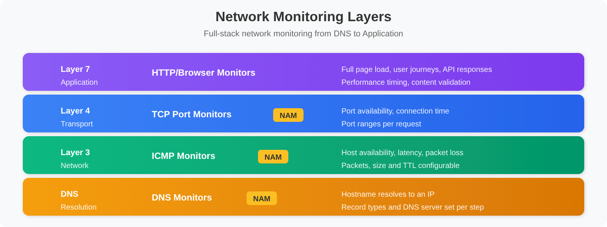
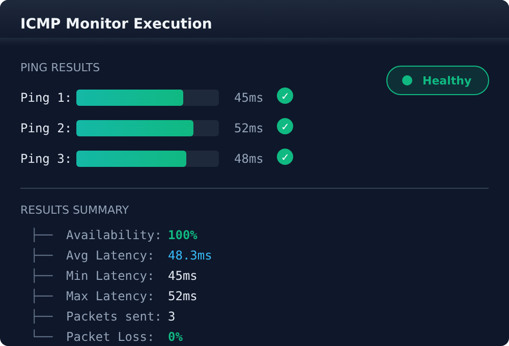

# SYNTH-05: Synthetic Network Monitoring

> **Series:** SYNTH — Synthetic Monitoring | **Notebook:** 5 of 6 | **Created:** December 2025 | **Last Updated:** 10/02/2026

## Network Availability, DNS, and ICMP Monitoring
This notebook covers Dynatrace Synthetic **Network Availability Monitors** (multi-protocol monitors), which test ICMP (ping), DNS, and TCP port reachability.

---


## Table of Contents

1. [Network Monitoring Overview](#network-monitoring-overview)
2. [ICMP (Ping) Monitors](#icmp-ping-monitors)
3. [DNS Monitors](#dns-monitors)
4. [TCP Port Monitors](#tcp-port-monitors)
5. [Multi-Protocol Monitors](#multi-protocol-monitors)
6. [Use Cases and Patterns](#use-cases-and-patterns)
7. [Analyzing Network Results](#analyzing-network-results)

---

## Prerequisites

- ✅ Access to a Dynatrace environment with Synthetic Monitoring
- ✅ Completed SYNTH-01 through SYNTH-04
- ✅ A private synthetic location — *"Network availability monitors are supported only on private Synthetic locations"*

> **⚠️ Data model — read first:** the docs describe *"three types of network availability monitors"* — ICMP, TCP and DNS. All three are the same entity in the data model (the classic name is *multi-protocol monitor*):
> - **Entity (classic):** `dt.entity.multiprotocol_monitor` — deprecated in DQL, supported for as long as Dynatrace Classic is supported
> - **Entity (Smartscape, preferred):** node type **`NETWORK_AVAILABILITY_MONITOR`** (model `dt.smartscape.network_availability_monitor`) — note the **name changed**; it is *not* `MULTIPROTOCOL_MONITOR`
> - **Events:** `fetch dt.synthetic.events | filter event.type == "multiprotocol_monitor_execution"` — the literal is unverified: the validation tenant had no NAM executions and the Synthetic events reference does not list it. Run `fetch dt.synthetic.events, from:-24h | summarize count(), by:{event.type}` on a tenant with NAM monitors and adjust the filter
> - **Metric:** `dt.synthetic.multi_protocol.executions` (execution count, by `dt.entity.multiprotocol_monitor`)
> - **Success/failure:** `result.state` (`SUCCESS`/`FAIL`) / `result.status.code` — same as other monitor types
>
> **The rename is the trap here.** Of the four synthetic classic entities, this is the one whose Smartscape node type cannot be derived from its classic name — `multiprotocol_monitor` became `NETWORK_AVAILABILITY_MONITOR`, matching the product's UI name rather than the old internal one. `smartscapeNodes "MULTIPROTOCOL_MONITOR"` raises **no error**; it returns zero rows, which is indistinguishable from an environment that has no network monitors. If a Smartscape network-monitor query comes back empty, confirm the node type spelling before concluding you have nothing to monitor. (SaaS 1.344, released 07/27/2026 with a staged tenant rollout from 07/29/2026, is what makes `dt.smartscape.*` the primary surface for the Synthetic app — verify it has reached your tenant; the node type is queryable via DQL either way. FAQ-16 covers the general migration mechanics.)
>
> The **protocol-specific measurement fields** (per-protocol latency, packet loss, resolved IP, DNS resolution time) are not published as stable metric keys and their exact `result.statistics.*` names vary by protocol. Run the discovery query in the next cell against your own tenant to see the fields your multi-protocol monitors actually emit before building latency/packet-loss queries.

<a id="network-monitoring-overview"></a>
## 1. Network Monitoring Overview

### Synthetic Network Availability Monitors

Network availability monitors come in three types:

| Protocol | Purpose | Use Case |
|----------|---------|----------|
| **ICMP** | Host reachability | Server availability |
| **DNS** | Name resolution | DNS infrastructure health |
| **TCP** | Port connectivity | Service port availability |

A NAM monitor can have several steps, and *"Unlike for HTTP and browser monitors, NAM monitors can contain multiple requests within a single step. All requests assigned to a particular step are executed in parallel."* — so one ICMP monitor can ping a whole host group. Limits: up to 1,000 network activities per monitor and 5,000 NAM monitors per environment.

### Why Network Monitoring?

Network monitors complement application-level monitoring by testing at different layers of the stack:


<!-- MARKDOWN_TABLE_ALTERNATIVE
| Layer | Monitor Type | What It Tests |
|-------|--------------|---------------|
| Layer 7 (Application) | HTTP/Browser | Full application response |
| Layer 4 (Transport) | TCP Port | Service port open |
| Layer 3 (Network) | ICMP/Ping | Host reachable |
| DNS | DNS Monitor | Name resolution works |
-->

### Benefits

- **Root Cause Isolation**: Distinguish network vs application issues
- **Infrastructure Validation**: Verify network paths are operational
- **DNS Health**: Monitor critical DNS infrastructure
- **Low Overhead**: Minimal resource consumption
- **High Frequency**: every 1, 2, 5, 10, 15 or 30 minutes, every hour, or on demand

> <sub>**Sources:** [Network availability monitoring (DT docs)](https://docs.dynatrace.com/docs/observe/digital-experience/synthetic-monitoring/network-availability-monitors/network-availability-monitoring) — *"There are three types of network availability monitors."* and *"The maximum number of network activities executed per network availability monitor is 1,000."*, [Create a NAM monitor (DT docs)](https://docs.dynatrace.com/docs/observe/digital-experience/synthetic-monitoring/network-availability-monitors/create-a-nam-monitor) — *"All requests assigned to a particular step are executed in parallel."*</sub>

```python
// DISCOVERY -- list your network availability (multi-protocol) monitors,
// then inspect the fields a recent execution emits so you know the exact
// protocol-specific result.statistics.* names available in YOUR tenant.
//
// PREFERRED -- Smartscape. The node type is NETWORK_AVAILABILITY_MONITOR, NOT
// MULTIPROTOCOL_MONITOR: the classic entity was renamed, not transliterated, and the
// wrong spelling returns zero rows instead of an error.
smartscapeNodes "NETWORK_AVAILABILITY_MONITOR", from: now() - 30d  // the default 2 h window can return none
| fields name, id, id_classic, network_monitor.type, enabled, frequency
| sort name asc
| limit 50

// FALLBACK (classic surface -- deprecated in DQL, supported for as long as
// Dynatrace Classic is supported):
// fetch dt.entity.multiprotocol_monitor
// | fields id, entity.name
// | sort entity.name asc
// | limit 50

// To inspect execution fields, run separately:
// fetch dt.synthetic.events, from: now() - 24h
// | filter event.type == "multiprotocol_monitor_execution"
// | limit 5
```

<a id="icmp-ping-monitors"></a>
## 2. ICMP (Ping) Monitors
### What ICMP Monitors Test

*"ICMP—Sends pings with a configurable number of packets or size to validate if there's a network connection to the host or device. It also checks the quality of that connection."*

### Configuration Options

| Setting | Description | Range / default |
|---------|-------------|---------------|
| **Target** | IP address, hostname, or a target filter (for example a host group) | — |
| **Number of packets** | Echo requests (`ping -c` / `-n`) | 1–10, default 1 |
| **Data length** | Packet size (`ping -s` / `-l`) | 0–65500, default 32 |
| **Time to live**, **Timeout to reply**, **Do not fragment** | ICMP-only execution attributes | — |
| **Request timeout** | Per request | up to 2 minutes |
| **Success-rate constraint** | Share of requests in a step that must succeed | default ≥ 80% |

### Creating an ICMP Monitor

**Dynatrace menu → Synthetic → Create synthetic monitor → Create network availability monitor → ICMP**

### Metrics Captured


<!-- MARKDOWN_TABLE_ALTERNATIVE
| Metric | Value | Status |
|--------|-------|--------|
| Ping 1 | 45ms | ✓ |
| Ping 2 | 52ms | ✓ |
| Ping 3 | 48ms | ✓ |
| **Availability** | 100% | Healthy |
| **Avg Latency** | 48.3ms | |
| **Min Latency** | 45ms | |
| **Max Latency** | 52ms | |
| **Packets sent** | 3 | |
| **Packet Loss** | 0% | |
-->

```dql
// Network monitor execution results (last 24h) — multi-protocol events
// Smartscape fields: dt.entity.synthetic_location / dt.entity.synthetic_test on synthetic data are
// deprecated ("will be removed in the future") in favor of dt.smartscape.* — Synthetic events model, 09/21/2026.
// Covers ICMP/DNS/TCP checks; result.state reflects overall execution success
fetch dt.synthetic.events, from: now() - 24h
| filter event.type == "multiprotocol_monitor_execution"
| fields timestamp,
         monitor = monitor.name,
         location = getNodeName(dt.smartscape.synthetic_location),
         state = result.state,
         status = result.status.message,
         duration_ms = result.statistics.duration / 1ms
| sort timestamp desc
| limit 100
```

```dql
// Latency / duration statistics by network monitor (successful executions)
// duration is the execution time; for protocol-specific latency (e.g. ICMP RTT,
// packet loss) add the field name found via the discovery query above.
fetch dt.synthetic.events, from: now() - 24h
| filter event.type == "multiprotocol_monitor_execution"
| filter result.state == "SUCCESS"
| summarize {
    avg_ms = avg(result.statistics.duration / 1ms),
    min_ms = min(result.statistics.duration / 1ms),
    max_ms = max(result.statistics.duration / 1ms),
    p95_ms = percentile(result.statistics.duration / 1ms, 95),
    executions = count()
  }, by: {monitor.name}
| sort avg_ms desc
| limit 20
```

<a id="dns-monitors"></a>
## 3. DNS Monitors
### What DNS Monitors Test

*"DNS—Validates if a hostname can be resolved to an IP address."*

### Configuration Options

| Setting | Description | Example |
|---------|-------------|----------|
| **Hostname** | Domain to resolve | `api.example.com` |
| **DNS server** | Resolver to query, optional port; system default if empty | `1.1.1.1`, `dns.google:53` |
| **Record types** | Comma-separated; each type × each host is one request | `A,AAAA` |

### DNS Record Types

| Type | Purpose | Example |
|------|---------|----------|
| `A` | IPv4 address | 192.168.1.1 |
| `AAAA` | IPv6 address | 2001:db8::1 |
| `CNAME` | Canonical name | www → app.example.com |
| `MX` | Mail exchanger | mail.example.com |
| `TXT` | Text records | SPF, DKIM |
| `NS` | Name servers | ns1.example.com |

```dql
// Network monitor execution volume by monitor (metric path)
// Scope to your DNS-checking monitors by filtering dt.entity.multiprotocol_monitor
timeseries executions = sum(dt.synthetic.multi_protocol.executions),
    from: now() - 24h, interval: 1h, by: {dt.entity.multiprotocol_monitor}
```

```dql
// Network monitor availability by monitor and location (events path)
// Smartscape fields: dt.entity.synthetic_location / dt.entity.synthetic_test on synthetic data are
// deprecated ("will be removed in the future") in favor of dt.smartscape.* — Synthetic events model, 09/21/2026.
fetch dt.synthetic.events, from: now() - 24h
| filter event.type == "multiprotocol_monitor_execution"
| summarize {
    total = count(),
    successful = countIf(result.state == "SUCCESS")
  }, by: {monitor.name, dt.smartscape.synthetic_location}
| fieldsAdd availability_pct = round((successful * 100.0) / total, decimals: 2)
| fieldsAdd location = getNodeName(dt.smartscape.synthetic_location)
| sort availability_pct asc
| limit 30
```

<a id="tcp-port-monitors"></a>
## 4. TCP Port Monitors
### What TCP Monitors Test

*"TCP—Establishes a TCP connection to a particular port. It validates if a port is open and if it accepts TCP connections."* It does not perform a TLS handshake; use an HTTP monitor for certificate checks.

### Common Ports to Monitor

| Port | Service | Use Case |
|------|---------|----------|
| 22 | SSH | Server management access |
| 80 | HTTP | Web server (plain) |
| 443 | HTTPS | Web server (secure) |
| 3306 | MySQL | Database connectivity |
| 5432 | PostgreSQL | Database connectivity |
| 6379 | Redis | Cache connectivity |
| 9200 | Elasticsearch | Search connectivity |
| 27017 | MongoDB | Database connectivity |

### Configuration

| Setting | Description | Example |
|---------|-------------|----------|
| **Host** | Target server | `db.example.com` |
| **Port ranges** | Single ports or ranges; each port × each host is one request | `5432`, `8000-8010` |

```dql
// Network monitor availability summary by monitor (events path)
fetch dt.synthetic.events, from: now() - 24h
| filter event.type == "multiprotocol_monitor_execution"
| summarize {
    total = count(),
    successful = countIf(result.state == "SUCCESS"),
    failed = countIf(result.state == "FAIL")
  }, by: {monitor.name}
| fieldsAdd availability_pct = round((successful * 100.0) / total, decimals: 2)
| sort availability_pct asc
| limit 20
```

```dql
// Network monitor execution-volume trend (metric path, last 7 days)
timeseries executions = sum(dt.synthetic.multi_protocol.executions),
    from: now() - 7d, interval: 1h
```

<a id="multi-protocol-monitors"></a>
## 5. Multi-Protocol Monitors
### Combining Network Checks

Layer the three types on the same target — one monitor per type, each with its own problems and alerting:

| Monitor | Type | Target | Check |
|------|----------|--------|-------|
| 1 | DNS | `db.example.com` | Resolves to `10.0.1.50` |
| 2 | ICMP | `10.0.1.50` | Host reachable |
| 3 | TCP | `10.0.1.50:5432` | PostgreSQL port open |

### Monitoring Strategy by Layer

| Layer | Monitor Type | Purpose |
|-------|--------------|----------|
| DNS | DNS Monitor | Name resolution works |
| Network | ICMP Monitor | Host reachable |
| Transport | TCP Monitor | Service port open |
| Application | HTTP Monitor | Service responding |

<a id="use-cases-and-patterns"></a>
## 6. Use Cases and Patterns
### Infrastructure Monitoring

| Component | Monitor Type | Target |
|-----------|--------------|--------|
| Load Balancer | TCP/443 | VIP address |
| Database Cluster | TCP/5432 | Each node |
| Cache Layer | TCP/6379 | Redis instances |
| Message Queue | TCP/5672 | RabbitMQ nodes |

### DNS Infrastructure

| Scenario | Configuration |
|----------|---------------|
| Primary DNS | Query internal DNS server |
| Secondary DNS | Query backup DNS server |
| External DNS | Query public resolvers |
| Record validation | Verify expected IP |

### Multi-Region Connectivity


<!-- MARKDOWN_TABLE_ALTERNATIVE
| Source | Protocol | Destination | Purpose |
|--------|----------|-------------|---------|
| Region A | ICMP | Region B | Network reachability |
| Region A | DNS | Region B | DNS resolution |
| Region A | TCP/443 | Region B | HTTPS health check |
-->

```dql
// All synthetic monitor types summary (HTTP / browser / network)
fetch dt.synthetic.events, from: now() - 24h
| filter endsWith(event.type, "_monitor_execution")
| filter not(coalesce(execution.retry_on_error, false) and result.state == "FAIL")  // one result per scheduled run
| summarize {
    total_executions = count(),
    successful = countIf(result.state == "SUCCESS"),
    failed = countIf(result.state == "FAIL")
  }, by: {event.type}
| fieldsAdd availability_pct = round((successful * 100.0) / total_executions, decimals: 2)
| sort total_executions desc
```

<a id="analyzing-network-results"></a>
## 7. Analyzing Network Results

```dql
// Network monitor availability over time (last 7 days)
fetch dt.synthetic.events, from: now() - 7d
| filter event.type == "multiprotocol_monitor_execution"
| makeTimeseries {
    success_count = countIf(result.state == "SUCCESS"),
    total_count = count()
  }, interval: 1h, by: {monitor.name}
| fieldsAdd availability_pct = success_count[] * 100.0 / total_count[]
```

```dql
// Duration trend for network monitors (last 24h)
fetch dt.synthetic.events, from: now() - 24h
| filter event.type == "multiprotocol_monitor_execution"
| filter result.state == "SUCCESS"
| makeTimeseries {
    avg_ms = avg(result.statistics.duration / 1ms),
    p95_ms = percentile(result.statistics.duration / 1ms, 95)
  }, interval: 15m
```

```dql
// Failed network checks with details
// Smartscape fields: dt.entity.synthetic_location / dt.entity.synthetic_test on synthetic data are
// deprecated ("will be removed in the future") in favor of dt.smartscape.* — Synthetic events model, 09/21/2026.
fetch dt.synthetic.events, from: now() - 24h
| filter event.type == "multiprotocol_monitor_execution"
| filter result.state == "FAIL"
| fields timestamp,
         monitor = monitor.name,
         location = getNodeName(dt.smartscape.synthetic_location),
         status = result.status.message,
         detail = result.status.details
| sort timestamp desc
| limit 50
```

```dql
// Network health score by monitor
fetch dt.synthetic.events, from: now() - 24h
| filter event.type == "multiprotocol_monitor_execution"
| summarize {
    total = count(),
    successful = countIf(result.state == "SUCCESS"),
    avg_ms = avg(result.statistics.duration / 1ms)
  }, by: {monitor.name}
| fieldsAdd availability_pct = round((successful * 100.0) / total, decimals: 2)
| fieldsAdd avg_ms = round(avg_ms, decimals: 1)
| fieldsAdd health_status = if(availability_pct >= 99.9, "HEALTHY",
                            else: if(availability_pct >= 99.0, "DEGRADED",
                            else: "CRITICAL"))
| sort availability_pct asc
| limit 30
```

---

## Summary

In this notebook, you learned:

✅ **Network availability monitors** - ICMP, DNS, and TCP within one multi-protocol monitor  
✅ **The data model** - `event.type == "multiprotocol_monitor_execution"` on `dt.synthetic.events`; metric `dt.synthetic.multi_protocol.executions`; entity `dt.entity.multiprotocol_monitor` (classic) or Smartscape node **`NETWORK_AVAILABILITY_MONITOR`** (preferred)  
✅ **The rename trap** - the Smartscape node is `NETWORK_AVAILABILITY_MONITOR`, not `MULTIPROTOCOL_MONITOR`; a wrong node type returns zero rows, not an error  
✅ **Discovery first** - confirm protocol-specific `result.statistics.*` fields in your own tenant  
✅ **Multi-protocol patterns** - Comprehensive infrastructure monitoring  
✅ **Analysis queries** - Availability, duration, executions, failures, health score  

---

## Next Steps

Continue to **SYNTH-06: Analytics & Alerting** to learn about dashboards, SLOs, and alerting strategies.

---

## References

- [Network availability monitoring (DT docs)](https://docs.dynatrace.com/docs/observe/digital-experience/synthetic-monitoring/network-availability-monitors/network-availability-monitoring)
- [NAM monitor metrics in Synthetic on Grail (DT docs)](https://docs.dynatrace.com/docs/observe/digital-experience/synthetic/synthetic-metrics/nam-monitor-metrics-latest)
- [Synthetic on Grail (DT docs)](https://docs.dynatrace.com/docs/observe/digital-experience/synthetic)
- [Synthetic app (DT docs)](https://docs.dynatrace.com/docs/observe/digital-experience/synthetic/synthetic-app)

---

<sub>*This notebook was AI-generated from community-submitted and publicly available sources. This notebook series is not officially supported by Dynatrace. Always verify information against official Dynatrace documentation.*</sub>
