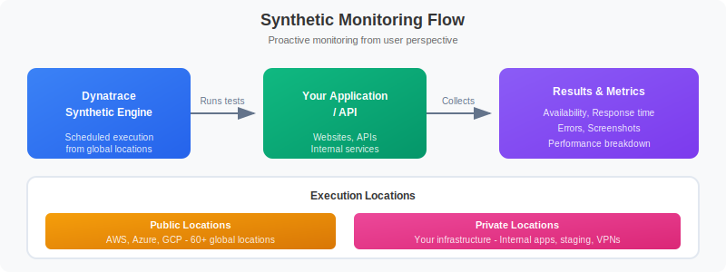

# 🔬 Synthetic Monitoring Fundamentals

> **Series:** SYNTH | **Notebook:** 1 of 6 | **Created:** December 2025

## Understanding Proactive Availability and Performance Testing

This notebook introduces Dynatrace Synthetic Monitoring, which enables proactive testing of application availability, functionality, and performance from locations around the world.

---

## Table of Contents

1. What is Synthetic Monitoring?
2. Monitor Types
3. Key Concepts
4. Synthetic Data in Grail
5. Your First Synthetic Query


## Prerequisites

- ✅ Access to a Dynatrace environment with Synthetic Monitoring enabled
- ✅ DQL query permissions (viewer role minimum)
- ✅ Basic understanding of web applications and APIs


## 1. What is Synthetic Monitoring? <a name="what-is-synthetic"></a>

**Synthetic Monitoring** simulates user interactions with your applications from external locations, providing:

- **Proactive Detection**: Find issues before real users encounter them
- **24/7 Availability Testing**: Monitor even when no users are active
- **Global Performance Baseline**: Measure response times from multiple locations
- **SLA Validation**: Verify service level agreements are being met
- **Third-Party Dependency Monitoring**: Test external APIs and services


<!-- MARKDOWN_TABLE_ALTERNATIVE
| Stage | Component | Description |
|-------|-----------|-------------|
| 1 | Synthetic Engine | Executes monitors on schedule |
| 2 | Public Locations | AWS, Azure, GCP worldwide |
| 3 | Private Locations | Your infrastructure (ActiveGate) |
| 4 | Your Application | Target being monitored |
| 5 | Results in Grail | Metrics, availability, performance |
-->

### Synthetic vs Real User Monitoring (RUM)

| Aspect | Synthetic Monitoring | Real User Monitoring |
|--------|---------------------|---------------------|
| Data Source | Simulated transactions | Actual user sessions |
| Coverage | 24/7, consistent | Only when users active |
| Locations | Controlled, specific | Wherever users are |
| Use Case | Baseline, SLA, proactive | Actual experience |
| Cost | Per execution | Per session |

## 2. Monitor Types <a name="monitor-types"></a>

Dynatrace offers three types of synthetic monitors:

### Browser Monitors (Single-URL and Browser Clickpath)

| Type | Description | Use Case |
|------|-------------|----------|
| **Single-URL** | Load a single page | Homepage availability |
| **Browser Clickpath** | Multi-step user journey | Login flows, checkout |

**Capabilities:**
- Full browser rendering (Chrome)
- JavaScript execution
- Visual validation (screenshots)
- Performance metrics (W3C timing)
- Resource waterfall analysis

### HTTP Monitors

| Type | Description | Use Case |
|------|-------------|----------|
| **Single Request** | One HTTP call | API health check |
| **Multi-step** | Chained requests | API workflow validation |

**Capabilities:**
- Any HTTP method (GET, POST, PUT, DELETE)
- Custom headers and authentication
- Response validation (status, content, JSON)
- SSL certificate monitoring
- Lightweight and fast execution

### Third-Party Monitors

Integration with external synthetic providers:
- Catchpoint
- Pingdom
- Site24x7

## 3. Key Concepts <a name="key-concepts"></a>

### Execution Locations

| Location Type | Description | Best For |
|---------------|-------------|----------|
| **Public** | Dynatrace-hosted worldwide | External-facing apps |
| **Private** | Your infrastructure | Internal apps, security |

### Execution Frequency

How often the monitor runs:
- **Browser**: 5, 10, 15, 30, 60 minutes
- **HTTP**: 1, 5, 10, 15, 30, 60 minutes

### Outage Detection

Dynatrace detects outages based on:
- Consecutive failures from single location
- Failures from multiple locations simultaneously
- Local outage vs global outage classification

### Key Metrics

| Metric | Description | Monitor Type |
|--------|-------------|-------------|
| `availability` | Success rate (%) | All |
| `responseTime` | Total execution time | All |
| `dnsTime` | DNS lookup duration | HTTP, Browser |
| `connectTime` | TCP connection time | HTTP, Browser |
| `sslTime` | SSL handshake time | HTTP, Browser |
| `ttfb` | Time to first byte | HTTP, Browser |
| `visuallyComplete` | Visual rendering complete | Browser |
| `speedIndex` | Visual progress score | Browser |

## 4. Synthetic Data in Grail <a name="grail-data"></a>

Synthetic execution data is stored in Grail and queryable via DQL:

### Data Tables

| Table | Description |
|-------|-------------|
| `dt.entity.synthetic_test` | Monitor definitions |
| `dt.entity.synthetic_location` | Execution locations |
| `dt.entity.http_check` | HTTP monitor entities |
| `dt.entity.browser_monitor` | Browser monitor entities |

### Key Fields

| Field | Description |
|-------|-------------|
| `dt.entity.synthetic_test` | Monitor entity ID |
| `dt.entity.synthetic_location` | Location entity ID |
| `synthetic.monitor.name` | Monitor display name |
| `synthetic.location.name` | Location display name |
| `synthetic.execution.id` | Unique execution identifier |
| `synthetic.availability` | Success (true/false) |
| `synthetic.response_time` | Execution duration (ms) |

## 5. Your First Synthetic Query <a name="first-query"></a>

Let's explore synthetic monitoring data in your environment.

```dql
// Discover synthetic monitors in your environment
// Note: Monitor type and enabled status are not available as entity fields
// Use bizevents to see execution details by monitor type
fetch dt.entity.synthetic_test
| fields id, entity.name
| sort entity.name asc
| limit 50
```

```dql
// Count monitors by event type (from execution data)
// Since entity 'type' field is not available, we count from bizevents
fetch bizevents, from: now() - 24h
| filter event.provider == "dynatrace.synthetic"
| summarize {count = count()}, by: {event.type}
| sort count desc
```

```dql
// List available synthetic locations
// Note: cloudPlatform, city, countryCode fields are not available on synthetic_location entity
fetch dt.entity.synthetic_location
| fields id, entity.name
| sort entity.name asc
| limit 50
```

```dql
// Query synthetic execution results (last 24 hours)
fetch bizevents, from: now() - 24h
| filter event.provider == "dynatrace.synthetic"
| fields timestamp, 
         event.type,
         synthetic_test_name = dt.entity.synthetic_test,
         location = dt.entity.synthetic_location,
         availability = toDouble(synthetic.availability),
         response_time = toDouble(synthetic.response_time)
| sort timestamp desc
| limit 100
```

```dql
// Synthetic availability summary (last 24 hours)
fetch bizevents, from: now() - 24h
| filter event.provider == "dynatrace.synthetic"
| summarize {
    total_executions = count(),
    successful = countIf(synthetic.availability == true),
    failed = countIf(synthetic.availability == false)
  }
| fieldsAdd availability_pct = round((successful * 100.0) / total_executions, decimals: 2)
```

```dql
// Response time by monitor (last 24 hours)
fetch bizevents, from: now() - 24h
| filter event.provider == "dynatrace.synthetic"
| filter isNotNull(synthetic.response_time)
| summarize {
    avg_response_ms = avg(toDouble(synthetic.response_time)),
    max_response_ms = max(toDouble(synthetic.response_time)),
    executions = count()
  }, by: {dt.entity.synthetic_test}
| sort avg_response_ms desc
| limit 20
```

---

## Summary

In this notebook, you learned:

✅ **What Synthetic Monitoring is** and how it differs from RUM  
✅ **Monitor types** - Browser (single-URL, clickpath) and HTTP monitors  
✅ **Key concepts** - Locations, frequency, outage detection  
✅ **Grail data model** - Entity tables and execution fields  
✅ **Basic DQL queries** - Discover monitors, locations, and results  

---

## Next Steps

Continue to **SYNTH-02: Browser Monitors** to learn how to create and optimize browser-based synthetic tests.

---

## References

- [Synthetic Monitoring Overview](https://docs.dynatrace.com/docs/platform-modules/digital-experience/synthetic-monitoring)
- [Browser Monitors](https://docs.dynatrace.com/docs/platform-modules/digital-experience/synthetic-monitoring/browser-monitors)
- [HTTP Monitors](https://docs.dynatrace.com/docs/platform-modules/digital-experience/synthetic-monitoring/http-monitors)
- [Synthetic Locations](https://docs.dynatrace.com/docs/platform-modules/digital-experience/synthetic-monitoring/synthetic-locations)
