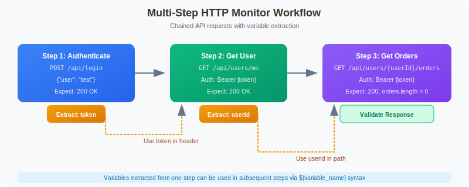

# 🔗 HTTP Monitors

> **Series:** SYNTH | **Notebook:** 3 of 6 | **Created:** December 2025

## Lightweight API and Endpoint Monitoring

This notebook covers HTTP monitors for API health checks, endpoint validation, and multi-step API workflows using the latest Dynatrace platform.

---

## Table of Contents

1. HTTP Monitor Overview
2. Single Request Monitors
3. Multi-Step HTTP Monitors
4. Authentication
5. Response Validation
6. SSL Certificate Monitoring
7. Analyzing HTTP Results


## Prerequisites

- ✅ Access to a Dynatrace environment with Synthetic Monitoring
- ✅ Completed SYNTH-01 Fundamentals
- ✅ API endpoint(s) to monitor


## 1. HTTP Monitor Overview <a name="overview"></a>

HTTP monitors execute lightweight HTTP requests without browser overhead:

### HTTP vs Browser Monitors

| Aspect | HTTP Monitor | Browser Monitor |
|--------|-------------|----------------|
| Execution | Direct HTTP call | Full browser |
| Speed | Fast (< 1s typical) | Slower (3-30s) |
| Resources | Minimal | Chrome instance |
| JavaScript | Not executed | Fully executed |
| Frequency | 1-60 minutes | 5-60 minutes |
| Cost | Lower | Higher |

### Use Cases

| Scenario | HTTP Monitor Type |
|----------|-------------------|
| API health check | Single request |
| REST API endpoint | Single request |
| Auth token + API call | Multi-step |
| GraphQL queries | Single/Multi-step |
| Webhook testing | Single request |
| Certificate expiry | Single request + SSL check |

### Configuration Path

**Dynatrace menu → Synthetic → Create synthetic monitor → Create HTTP monitor**

## 2. Single Request Monitors <a name="single-request"></a>

### Request Configuration

| Setting | Description | Example |
|---------|-------------|----------|
| **URL** | Full endpoint URL | `https://api.example.com/health` |
| **Method** | HTTP verb | GET, POST, PUT, DELETE, PATCH |
| **Headers** | Custom headers | `Authorization: Bearer ...` |
| **Body** | Request payload | JSON, form data, raw |
| **Timeout** | Max wait time | 30 seconds (default) |

### Common HTTP Methods

| Method | Use Case | Body |
|--------|----------|------|
| `GET` | Retrieve data | None |
| `POST` | Create resource | Required |
| `PUT` | Update resource | Required |
| `PATCH` | Partial update | Required |
| `DELETE` | Remove resource | Optional |
| `HEAD` | Check existence | None |
| `OPTIONS` | CORS preflight | None |

### Request Headers

```
Content-Type: application/json
Accept: application/json
Authorization: Bearer <token>
X-API-Key: <key>
User-Agent: Dynatrace Synthetic
```

```dql
// List all HTTP monitors
fetch dt.entity.http_check
| fields id, entity.name
| sort entity.name asc
| limit 50
```

```dql
// HTTP monitor execution results (last 24h)
fetch bizevents, from: now() - 24h
| filter event.provider == "dynatrace.synthetic"
| filter matchesValue(event.type, "*http*")
| fields timestamp,
         monitor = dt.entity.synthetic_test,
         location = dt.entity.synthetic_location,
         availability = synthetic.availability,
         response_time_ms = toDouble(synthetic.response_time),
         status_code = synthetic.http_status_code
| sort timestamp desc
| limit 100
```

## 3. Multi-Step HTTP Monitors <a name="multi-step"></a>

Chain multiple HTTP requests with data passing between steps:

### Multi-Step Workflow Example


<!-- MARKDOWN_TABLE_ALTERNATIVE
| Step | Action | Description |
|------|--------|-------------|
| 1 | POST /auth/login | Authenticate and get token |
| 2 | Extract token | Save token from response |
| 3 | GET /api/users/me | Call API with Bearer token |
| 4 | Extract userId | Save user ID from response |
| 5 | GET /api/users/{userId}/orders | Fetch user orders |
| 6 | Validate response | Verify orders array exists |
-->

### Variable Extraction

| Source | Syntax | Example |
|--------|--------|----------|
| JSON path | `$.data.token` | Extract from JSON body |
| Response header | `header:X-Request-Id` | Extract from headers |
| Regex | `token":"([^"]+)` | Pattern matching |

### Using Variables

Reference extracted variables in subsequent steps:
- URL: `https://api.example.com/users/${userId}`
- Header: `Authorization: Bearer ${token}`
- Body: `{"userId": "${userId}"}`

```dql
// Multi-step HTTP monitor step performance
fetch bizevents, from: now() - 24h
| filter event.provider == "dynatrace.synthetic"
| filter matchesValue(event.type, "*http*")
| filter isNotNull(synthetic.step_name)
| summarize {
    avg_duration_ms = avg(toDouble(synthetic.step_duration)),
    success_rate = countIf(synthetic.step_success == true) * 100.0 / count(),
    executions = count()
  }, by: {dt.entity.synthetic_test, synthetic.step_name}
| sort avg_duration_ms desc
| limit 30
```

## 4. Authentication <a name="authentication"></a>

### Supported Authentication Methods

| Method | Configuration | Use Case |
|--------|---------------|----------|
| **Basic Auth** | Username/password encoded | Legacy APIs |
| **Bearer Token** | Header: `Authorization: Bearer <token>` | OAuth2, JWT |
| **API Key** | Header: `X-API-Key: <key>` | Third-party APIs |
| **OAuth2** | Token endpoint + credentials | Modern APIs |
| **Client Certificate** | mTLS | High-security APIs |

### Credential Vault

Store sensitive credentials securely:

1. **Settings → Integration → Credential vault**
2. Add credential (username/password, token, certificate)
3. Reference in monitor: `${credentials.vault.myCredential}`

### OAuth2 Flow Example

```
Step 1: Get Token
    POST https://auth.example.com/oauth/token
    Body: grant_type=client_credentials
          &client_id=${vault.clientId}
          &client_secret=${vault.clientSecret}
    Extract: access_token

Step 2: API Call
    GET https://api.example.com/data
    Header: Authorization: Bearer ${access_token}
```

## 5. Response Validation <a name="validation"></a>

### HTTP Status Validation

| Status Range | Meaning | Default Behavior |
|--------------|---------|------------------|
| 2xx | Success | Pass |
| 3xx | Redirect | Follow/Pass |
| 4xx | Client Error | Fail |
| 5xx | Server Error | Fail |

### Content Validation

| Type | Description | Example |
|------|-------------|----------|
| **Contains** | Text present | `"status": "ok"` |
| **Not Contains** | Text absent | `"error"` |
| **Regex** | Pattern match | `"id":\s*\d+` |
| **JSON Path** | Value at path | `$.status == "success"` |

### JSON Path Assertions

```json
// Response:
{
  "status": "success",
  "data": {
    "users": [
      {"id": 1, "name": "John"},
      {"id": 2, "name": "Jane"}
    ]
  }
}

// Assertions:
$.status == "success"           // Check status
$.data.users.length > 0         // Array not empty
$.data.users[0].name == "John"  // First user name
```

```dql
// HTTP status code distribution
fetch bizevents, from: now() - 24h
| filter event.provider == "dynatrace.synthetic"
| filter matchesValue(event.type, "*http*")
| summarize {
    count = count()
  }, by: {dt.entity.synthetic_test, synthetic.http_status_code}
| sort count desc
| limit 30
```

```dql
// Failed HTTP requests with error details
fetch bizevents, from: now() - 24h
| filter event.provider == "dynatrace.synthetic"
| filter matchesValue(event.type, "*http*")
| filter synthetic.availability == false
| fields timestamp,
         monitor = dt.entity.synthetic_test,
         location = dt.entity.synthetic_location,
         status_code = synthetic.http_status_code,
         error = synthetic.error_message
| sort timestamp desc
| limit 50
```

## 6. SSL Certificate Monitoring <a name="ssl"></a>

HTTP monitors automatically check SSL certificates:

### Certificate Checks

| Check | Description | Alert Threshold |
|-------|-------------|----------------|
| **Validity** | Certificate not expired | Configurable days |
| **Chain** | Valid certificate chain | Any break |
| **Hostname** | Matches request domain | Mismatch |
| **Trust** | Issued by trusted CA | Untrusted |

### Expiration Alerts

Configure alerts for certificates expiring within:
- 30 days (warning)
- 14 days (critical)
- 7 days (emergency)

```dql
// SSL certificate expiration status
fetch bizevents, from: now() - 24h
| filter event.provider == "dynatrace.synthetic"
| filter isNotNull(synthetic.ssl_certificate_expiry)
| summarize {
    latest_check = max(timestamp),
    certificate_expiry = takeFirst(synthetic.ssl_certificate_expiry),
    days_until_expiry = takeFirst(toDouble(synthetic.ssl_days_until_expiry))
  }, by: {dt.entity.synthetic_test}
| filter days_until_expiry < 30
| sort days_until_expiry asc
| limit 20
```

## 7. Analyzing HTTP Results <a name="analysis"></a>

```dql
// HTTP monitor availability summary
fetch bizevents, from: now() - 24h
| filter event.provider == "dynatrace.synthetic"
| filter matchesValue(event.type, "*http*")
| summarize {
    total = count(),
    successful = countIf(synthetic.availability == true),
    failed = countIf(synthetic.availability == false)
  }, by: {dt.entity.synthetic_test}
| fieldsAdd availability_pct = round((successful * 100.0) / total, decimals: 2)
| sort availability_pct asc
| limit 30
```

```dql
// Response time percentiles by monitor
fetch bizevents, from: now() - 24h
| filter event.provider == "dynatrace.synthetic"
| filter matchesValue(event.type, "*http*")
| filter synthetic.availability == true
| summarize {
    p50_ms = percentile(toDouble(synthetic.response_time), 50),
    p95_ms = percentile(toDouble(synthetic.response_time), 95),
    p99_ms = percentile(toDouble(synthetic.response_time), 99),
    max_ms = max(toDouble(synthetic.response_time)),
    executions = count()
  }, by: {dt.entity.synthetic_test}
| sort p95_ms desc
| limit 20
```

```dql
// HTTP timing breakdown (DNS, connect, SSL, TTFB)
fetch bizevents, from: now() - 24h
| filter event.provider == "dynatrace.synthetic"
| filter matchesValue(event.type, "*http*")
| filter synthetic.availability == true
| summarize {
    avg_dns_ms = avg(toDouble(synthetic.dns_time)),
    avg_connect_ms = avg(toDouble(synthetic.connect_time)),
    avg_ssl_ms = avg(toDouble(synthetic.ssl_time)),
    avg_ttfb_ms = avg(toDouble(synthetic.time_to_first_byte)),
    avg_total_ms = avg(toDouble(synthetic.response_time)),
    executions = count()
  }, by: {dt.entity.synthetic_test}
| sort avg_total_ms desc
| limit 20
```

```dql
// Response time trend over time
fetch bizevents, from: now() - 7d
| filter event.provider == "dynatrace.synthetic"
| filter matchesValue(event.type, "*http*")
| filter synthetic.availability == true
| makeTimeseries {
    avg_response_ms = avg(toDouble(synthetic.response_time)),
    p95_response_ms = percentile(toDouble(synthetic.response_time), 95)
  }, interval: 1h
```

---

## Summary

In this notebook, you learned:

✅ **HTTP monitor types** - Single request vs multi-step  
✅ **Request configuration** - Methods, headers, body  
✅ **Multi-step workflows** - Variable extraction and chaining  
✅ **Authentication** - Basic, Bearer, OAuth2, API keys  
✅ **Response validation** - Status codes, content, JSON path  
✅ **SSL monitoring** - Certificate expiration alerts  
✅ **Analysis queries** - Availability, timing breakdown  

---

## Next Steps

Continue to **SYNTH-04: Scripted Monitors** to learn about advanced scripting capabilities.

---

## References

- [HTTP Monitors](https://docs.dynatrace.com/docs/platform-modules/digital-experience/synthetic-monitoring/http-monitors)
- [Multi-step HTTP Monitors](https://docs.dynatrace.com/docs/platform-modules/digital-experience/synthetic-monitoring/http-monitors/create-http-monitor)
- [Credential Vault](https://docs.dynatrace.com/docs/manage/identity-access-management/credential-vault)
- [SSL Certificate Monitoring](https://docs.dynatrace.com/docs/platform-modules/digital-experience/synthetic-monitoring/analysis-and-alerting/synthetic-ssl-certificates)
