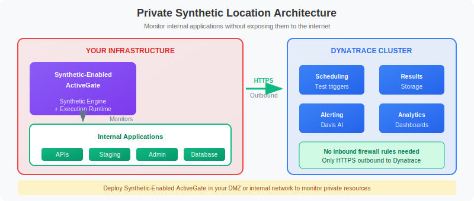

# 🏢 Private Synthetic Locations

> **Series:** SYNTH | **Notebook:** 4 of 6 | **Created:** December 2025

## Monitoring Internal Applications from Your Infrastructure

This notebook covers deploying and managing private synthetic locations (ActiveGates) for monitoring internal applications, APIs, and services not accessible from the public internet.

---

## Table of Contents

1. Why Private Locations?
2. Architecture
3. Synthetic-Enabled ActiveGate
4. Deployment Options
5. Configuration
6. Monitoring Private Location Health
7. Troubleshooting


## Prerequisites

- ✅ Access to a Dynatrace environment with Synthetic Monitoring
- ✅ Completed SYNTH-01 through SYNTH-03
- ✅ Infrastructure access to deploy ActiveGate (for setup)


## 1. Why Private Locations? <a name="why-private"></a>

### Public vs Private Locations

| Aspect | Public Locations | Private Locations |
|--------|-----------------|-------------------|
| Hosting | Dynatrace cloud | Your infrastructure |
| Access | Public internet only | Internal networks |
| Maintenance | Managed by Dynatrace | Managed by you |
| Security | External perspective | Behind firewall |
| Latency | Varies by region | Local network |

### Use Cases for Private Locations

| Scenario | Description |
|----------|-------------|
| **Internal APIs** | Services not exposed to internet |
| **VPN-only apps** | Applications requiring VPN access |
| **Pre-production** | Staging/dev environments |
| **Security compliance** | Data must not leave network |
| **Low latency testing** | Local performance baselines |
| **Isolated networks** | Air-gapped or restricted networks |

## 2. Architecture <a name="architecture"></a>

Private synthetic locations use ActiveGates deployed within your infrastructure to execute monitors against internal applications:


<!-- MARKDOWN_TABLE_ALTERNATIVE
| Component | Location | Function |
|-----------|----------|----------|
| Synthetic-Enabled ActiveGate | Your Infrastructure | Executes monitors locally |
| Synthetic Engine | Inside ActiveGate | Runs browser/HTTP tests |
| Internal Apps | Your Network | Targets being monitored |
| Dynatrace Cluster | Cloud | Scheduling, results, alerting |
-->

### Key Points

- **Outbound only**: ActiveGate initiates all connections
- **No inbound ports**: No firewall changes for external access
- **Local execution**: Tests run inside your network
- **Results upload**: Only metrics/results sent to Dynatrace

## 3. Synthetic-Enabled ActiveGate <a name="activegate"></a>

### ActiveGate Capabilities

ActiveGate can serve multiple purposes:

| Capability | Description |
|------------|-------------|
| **Synthetic** | Private synthetic location |
| **Metrics** | Metric ingestion endpoint |
| **Logs** | Log ingestion endpoint |
| **API** | Cluster API proxy |
| **Extensions** | Extension execution |

### Synthetic Engine Requirements

| Resource | Minimum | Recommended |
|----------|---------|-------------|
| **CPU** | 2 cores | 4+ cores |
| **RAM** | 4 GB | 8+ GB |
| **Disk** | 20 GB | 50+ GB |
| **Network** | HTTPS outbound | Low latency to targets |

### Browser Monitor Requirements

For browser monitors, additional requirements:
- Chrome/Chromium browser
- Display server (X11 or headless)
- Additional RAM for browser instances

## 4. Deployment Options <a name="deployment"></a>

### Option 1: Linux/Windows Installer

```bash
# Download from Dynatrace Hub
# Settings → Deployment status → ActiveGate

# Linux installation
sudo /bin/sh Dynatrace-ActiveGate-Linux-x86-*.sh \
  --enable-synthetic

# Verify synthetic capability
sudo systemctl status dynatracegateway
```

### Option 2: Container Deployment

```yaml
# docker-compose.yml
version: '3'
services:
  activegate:
    image: dynatrace/activegate:latest
    environment:
      - DT_TENANT=abc12345
      - DT_CAPABILITIES=synthetic
      - DT_API_TOKEN=${DT_API_TOKEN}
    volumes:
      - activegate-data:/var/lib/dynatrace/gateway
    ports:
      - "9999:9999"
```

### Option 3: Kubernetes

```yaml
# Use Dynatrace Operator with ActiveGate CRD
apiVersion: dynatrace.com/v1beta1
kind: DynaKube
metadata:
  name: dynakube
spec:
  activeGate:
    capabilities:
      - synthetic-monitoring
    resources:
      requests:
        cpu: "500m"
        memory: "512Mi"
```

```dql
// List all synthetic locations
// Note: 'type' (PRIVATE/PUBLIC), 'status', 'city', 'countryCode' fields are not available
// Private locations are typically identified by their naming convention
fetch dt.entity.synthetic_location
| fields id, entity.name
| sort entity.name asc
| limit 50
```

```dql
// Count synthetic locations
// Note: 'type' field not available on synthetic_location entity
// Use entity.name patterns to identify private vs public locations
fetch dt.entity.synthetic_location
| summarize {count = count()}
| fields count
```

## 5. Configuration <a name="configuration"></a>

### Creating a Private Location

1. **Deploy ActiveGate** with synthetic capability
2. **Navigate to**: Settings → Synthetic → Private synthetic locations
3. **Create location**: Name, description, geographic info
4. **Assign ActiveGates**: Select which ActiveGates serve this location

### Location Settings

| Setting | Description |
|---------|-------------|
| **Name** | Descriptive location name |
| **Latitude/Longitude** | Geographic coordinates |
| **City/Region** | Location metadata |
| **ActiveGate nodes** | Assigned ActiveGates |

### High Availability

For production workloads:
- Deploy 2+ ActiveGates per location
- Distribute across availability zones
- Load balancing automatic

```dql
// Monitor executions by location
// Note: Private locations typically have custom names (not city names like "N. Virginia")
// Identify your private locations by their naming convention
fetch bizevents, from: now() - 24h
| filter event.provider == "dynatrace.synthetic"
| summarize {
    executions = count(),
    availability_pct = round(countIf(synthetic.availability == true) * 100.0 / count(), decimals: 2)
  }, by: {dt.entity.synthetic_test, dt.entity.synthetic_location}
| sort executions desc
| limit 30
```

## 6. Monitoring Private Location Health <a name="health"></a>

### ActiveGate Health Indicators

| Metric | Description | Alert Threshold |
|--------|-------------|----------------|
| **Connectivity** | Connection to cluster | Any disconnect |
| **CPU Usage** | Processing load | > 80% sustained |
| **Memory** | RAM utilization | > 80% |
| **Disk** | Storage usage | > 80% |
| **Queue Depth** | Pending executions | > 100 |

```dql
// Location availability over time
// Filter by your private location names using matchesPhrase if needed
fetch bizevents, from: now() - 7d
| filter event.provider == "dynatrace.synthetic"
| fieldsAdd hour_bucket = bin(timestamp, 1h)
| summarize {
    success_count = countIf(synthetic.availability == true),
    total_count = count()
  }, by: {dt.entity.synthetic_location, hour_bucket}
| fieldsAdd availability_pct = round((success_count * 100.0) / total_count, decimals: 2)
| sort hour_bucket desc
```

```dql
// Execution count by location
// To filter for private locations, use entity.name patterns specific to your naming convention
fetch bizevents, from: now() - 24h
| filter event.provider == "dynatrace.synthetic"
| summarize {
    total_executions = count(),
    failed_executions = countIf(synthetic.availability == false),
    unique_monitors = countDistinct(dt.entity.synthetic_test)
  }, by: {dt.entity.synthetic_location}
| fieldsAdd failure_rate = round((failed_executions * 100.0) / total_executions, decimals: 2)
| sort total_executions desc
```

## 7. Troubleshooting <a name="troubleshooting"></a>

### Common Issues

| Issue | Symptoms | Resolution |
|-------|----------|------------|
| **No connectivity** | Location offline | Check ActiveGate logs, network |
| **SSL errors** | Certificate failures | Install CA certs on ActiveGate |
| **Timeouts** | All tests fail | Check network routes, DNS |
| **Resource exhaustion** | Slow/failed tests | Scale ActiveGate resources |
| **Browser issues** | Clickpath failures | Check Chrome/display config |

### ActiveGate Logs

```bash
# Linux log location
/var/log/dynatrace/gateway/

# Key log files
gateway.log         # Main gateway log
synthetic.log       # Synthetic execution log
connection.log      # Cluster connectivity
```

### Network Verification

```bash
# Test connectivity to target
curl -v https://internal-api.company.com/health

# DNS resolution
nslookup internal-api.company.com

# Test Dynatrace connectivity
curl -v https://<tenant>.live.dynatrace.com/api/v1/time
```

```dql
// Identify failing monitors by location
// To filter for specific private locations, add a filter on dt.entity.synthetic_location
fetch bizevents, from: now() - 24h
| filter event.provider == "dynatrace.synthetic"
| filter synthetic.availability == false
| summarize {
    failure_count = count(),
    last_failure = max(timestamp)
  }, by: {dt.entity.synthetic_test, dt.entity.synthetic_location}
| sort failure_count desc
| limit 20
```

---

## Summary

In this notebook, you learned:

✅ **Why private locations** - Internal apps, security, compliance  
✅ **Architecture** - ActiveGate with synthetic engine  
✅ **Deployment options** - Installer, container, Kubernetes  
✅ **Configuration** - Creating and managing locations  
✅ **Health monitoring** - ActiveGate and execution metrics  
✅ **Troubleshooting** - Common issues and resolution  

---

## Next Steps

Continue to **SYNTH-05: Network Monitoring** to learn about synthetic network availability monitoring.

---

## References

- [Private Synthetic Locations](https://docs.dynatrace.com/docs/platform-modules/digital-experience/synthetic-monitoring/private-synthetic-locations)
- [ActiveGate Deployment](https://docs.dynatrace.com/docs/setup-and-configuration/dynatrace-activegate)
- [Synthetic-Enabled ActiveGate](https://docs.dynatrace.com/docs/platform-modules/digital-experience/synthetic-monitoring/private-synthetic-locations/create-a-private-synthetic-location)
- [ActiveGate in Kubernetes](https://docs.dynatrace.com/docs/setup-and-configuration/setup-on-k8s/guides/activegate-capabilities)
