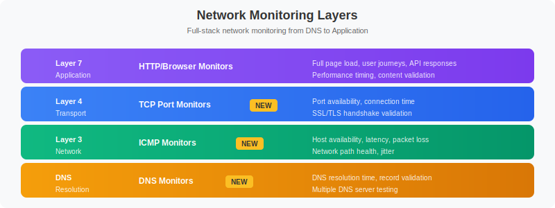
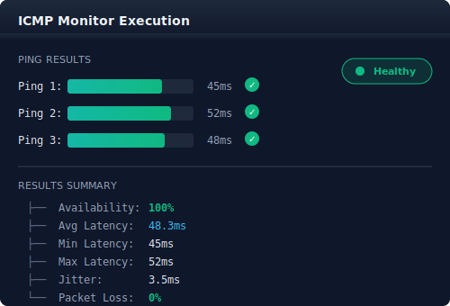
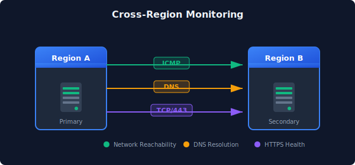

# 🌐 Synthetic Network Monitoring

> **Series:** SYNTH | **Notebook:** 5 of 6 | **Created:** December 2025

## Network Availability, DNS, and ICMP Monitoring

This notebook covers Dynatrace Synthetic Network Availability Monitors, including ICMP (ping), DNS, and TCP port monitoring capabilities introduced in recent Dynatrace releases.

---


## Table of Contents

1. Network Monitoring Overview
2. ICMP (Ping) Monitors
3. DNS Monitors
4. TCP Port Monitors
5. Multi-Protocol Monitors
6. Use Cases and Patterns
7. Analyzing Network Results

## Prerequisites

- ✅ Access to a Dynatrace environment with Synthetic Monitoring
- ✅ Completed SYNTH-01 through SYNTH-04
- ✅ Private synthetic locations (for internal network monitoring)


## 1. Network Monitoring Overview <a name="overview"></a>

### Synthetic Network Availability Monitors

Dynatrace provides network-level synthetic monitoring to verify:

| Protocol | Purpose | Use Case |
|----------|---------|----------|
| **ICMP** | Host reachability | Server availability |
| **DNS** | Name resolution | DNS infrastructure health |
| **TCP** | Port connectivity | Service port availability |

### Why Network Monitoring?

Network monitors complement application-level monitoring by testing at different layers of the stack:


<!-- MARKDOWN_TABLE_ALTERNATIVE
| Layer | Monitor Type | What It Tests |
|-------|--------------|---------------|
| Layer 7 (Application) | HTTP/Browser | Full application response |
| Layer 4 (Transport) | TCP Port | Service port open |
| Layer 3 (Network) | ICMP/Ping | Host reachable |
| DNS | DNS Monitor | Name resolution works |
-->

### Benefits

- **Root Cause Isolation**: Distinguish network vs application issues
- **Infrastructure Validation**: Verify network paths are operational
- **DNS Health**: Monitor critical DNS infrastructure
- **Low Overhead**: Minimal resource consumption
- **High Frequency**: Run every minute if needed

## 2. ICMP (Ping) Monitors <a name="icmp"></a>

### What ICMP Monitors Test

| Metric | Description |
|--------|-------------|
| **Reachability** | Host responds to ping |
| **Latency** | Round-trip time (RTT) |
| **Packet Loss** | Percentage of lost packets |
| **Jitter** | Latency variation |

### Configuration Options

| Setting | Description | Typical Value |
|---------|-------------|---------------|
| **Target** | IP address or hostname | `192.168.1.1` or `server.example.com` |
| **Packet Count** | Pings per execution | 3-10 |
| **Timeout** | Wait time per packet | 5 seconds |
| **Frequency** | Execution interval | 1-60 minutes |

### Creating an ICMP Monitor

**Dynatrace menu → Synthetic → Create synthetic monitor → Create network availability monitor → ICMP**

### Metrics Captured


<!-- MARKDOWN_TABLE_ALTERNATIVE
| Metric | Value | Status |
|--------|-------|--------|
| Ping 1 | 45ms | ✓ |
| Ping 2 | 52ms | ✓ |
| Ping 3 | 48ms | ✓ |
| **Availability** | 100% | Healthy |
| **Avg Latency** | 48.3ms | |
| **Min Latency** | 45ms | |
| **Max Latency** | 52ms | |
| **Jitter** | 3.5ms | |
| **Packet Loss** | 0% | |
-->

```dql
// ICMP monitor results (last 24h)
fetch bizevents, from: now() - 24h
| filter event.provider == "dynatrace.synthetic"
| filter matchesValue(event.type, "*icmp*") OR matchesValue(event.type, "*ping*")
| fields timestamp,
         monitor = dt.entity.synthetic_test,
         location = dt.entity.synthetic_location,
         availability = synthetic.availability,
         latency_ms = toDouble(synthetic.response_time),
         packet_loss = toDouble(synthetic.packet_loss_pct)
| sort timestamp desc
| limit 100
```

```dql
// ICMP latency statistics by target
fetch bizevents, from: now() - 24h
| filter event.provider == "dynatrace.synthetic"
| filter matchesValue(event.type, "*icmp*") OR matchesValue(event.type, "*ping*")
| filter synthetic.availability == true
| summarize {
    avg_latency_ms = avg(toDouble(synthetic.response_time)),
    min_latency_ms = min(toDouble(synthetic.response_time)),
    max_latency_ms = max(toDouble(synthetic.response_time)),
    p95_latency_ms = percentile(toDouble(synthetic.response_time), 95),
    executions = count()
  }, by: {dt.entity.synthetic_test}
| sort avg_latency_ms desc
| limit 20
```

## 3. DNS Monitors <a name="dns"></a>

### What DNS Monitors Test

| Check | Description |
|-------|-------------|
| **Resolution** | Hostname resolves to IP |
| **Response Time** | DNS query duration |
| **Expected IP** | Resolves to correct address |
| **Record Type** | A, AAAA, CNAME, MX, etc. |

### Configuration Options

| Setting | Description | Example |
|---------|-------------|----------|
| **Hostname** | Domain to resolve | `api.example.com` |
| **DNS Server** | Specific resolver (optional) | `8.8.8.8` |
| **Record Type** | DNS record type | A, AAAA, CNAME |
| **Expected IP** | Validation (optional) | `10.0.0.50` |
| **Timeout** | Query timeout | 10 seconds |

### DNS Record Types

| Type | Purpose | Example |
|------|---------|----------|
| `A` | IPv4 address | 192.168.1.1 |
| `AAAA` | IPv6 address | 2001:db8::1 |
| `CNAME` | Canonical name | www → app.example.com |
| `MX` | Mail exchanger | mail.example.com |
| `TXT` | Text records | SPF, DKIM |
| `NS` | Name servers | ns1.example.com |

```dql
// DNS monitor results (last 24h)
fetch bizevents, from: now() - 24h
| filter event.provider == "dynatrace.synthetic"
| filter matchesValue(event.type, "*dns*")
| fields timestamp,
         monitor = dt.entity.synthetic_test,
         location = dt.entity.synthetic_location,
         availability = synthetic.availability,
         response_time_ms = toDouble(synthetic.response_time),
         resolved_ip = synthetic.dns_resolved_ip
| sort timestamp desc
| limit 100
```

```dql
// DNS resolution time by location
fetch bizevents, from: now() - 24h
| filter event.provider == "dynatrace.synthetic"
| filter matchesValue(event.type, "*dns*")
| filter synthetic.availability == true
| summarize {
    avg_resolution_ms = avg(toDouble(synthetic.response_time)),
    p95_resolution_ms = percentile(toDouble(synthetic.response_time), 95),
    executions = count()
  }, by: {dt.entity.synthetic_test, dt.entity.synthetic_location}
| sort avg_resolution_ms desc
| limit 30
```

## 4. TCP Port Monitors <a name="tcp"></a>

### What TCP Monitors Test

| Check | Description |
|-------|-------------|
| **Port Open** | TCP connection succeeds |
| **Connect Time** | Time to establish connection |
| **SSL Handshake** | TLS negotiation (if applicable) |

### Common Ports to Monitor

| Port | Service | Use Case |
|------|---------|----------|
| 22 | SSH | Server management access |
| 80 | HTTP | Web server (plain) |
| 443 | HTTPS | Web server (secure) |
| 3306 | MySQL | Database connectivity |
| 5432 | PostgreSQL | Database connectivity |
| 6379 | Redis | Cache connectivity |
| 9200 | Elasticsearch | Search connectivity |
| 27017 | MongoDB | Database connectivity |

### Configuration

| Setting | Description | Example |
|---------|-------------|----------|
| **Host** | Target server | `db.example.com` |
| **Port** | TCP port number | `5432` |
| **Timeout** | Connection timeout | 10 seconds |
| **TLS** | Enable TLS check | true/false |

```dql
// TCP port monitor results (last 24h)
fetch bizevents, from: now() - 24h
| filter event.provider == "dynatrace.synthetic"
| filter matchesValue(event.type, "*tcp*") OR matchesValue(event.type, "*port*")
| fields timestamp,
         monitor = dt.entity.synthetic_test,
         location = dt.entity.synthetic_location,
         availability = synthetic.availability,
         connect_time_ms = toDouble(synthetic.response_time)
| sort timestamp desc
| limit 100
```

```dql
// TCP connection time statistics
fetch bizevents, from: now() - 24h
| filter event.provider == "dynatrace.synthetic"
| filter matchesValue(event.type, "*tcp*") OR matchesValue(event.type, "*port*")
| filter synthetic.availability == true
| summarize {
    avg_connect_ms = avg(toDouble(synthetic.response_time)),
    min_connect_ms = min(toDouble(synthetic.response_time)),
    max_connect_ms = max(toDouble(synthetic.response_time)),
    executions = count()
  }, by: {dt.entity.synthetic_test}
| sort avg_connect_ms desc
| limit 20
```

## 5. Multi-Protocol Monitors <a name="multi-protocol"></a>

### Combining Network Checks

Create comprehensive monitoring by combining multiple protocol checks:

```
Multi-Protocol Monitor Example:

Target: db.example.com

Step 1: DNS Resolution
    ├── Query: db.example.com
    └── Expected: 10.0.1.50

Step 2: ICMP Ping
    ├── Target: 10.0.1.50
    └── Check: Host reachable

Step 3: TCP Port Check
    ├── Target: 10.0.1.50:5432
    └── Check: PostgreSQL port open
```

### Monitoring Strategy by Layer

| Layer | Monitor Type | Purpose |
|-------|--------------|----------|
| DNS | DNS Monitor | Name resolution works |
| Network | ICMP Monitor | Host reachable |
| Transport | TCP Monitor | Service port open |
| Application | HTTP Monitor | Service responding |

## 6. Use Cases and Patterns <a name="use-cases"></a>

### Infrastructure Monitoring

| Component | Monitor Type | Target |
|-----------|--------------|--------|
| Load Balancer | TCP/443 | VIP address |
| Database Cluster | TCP/5432 | Each node |
| Cache Layer | TCP/6379 | Redis instances |
| Message Queue | TCP/5672 | RabbitMQ nodes |

### DNS Infrastructure

| Scenario | Configuration |
|----------|---------------|
| Primary DNS | Query internal DNS server |
| Secondary DNS | Query backup DNS server |
| External DNS | Query public resolvers |
| Record validation | Verify expected IP |

### Multi-Region Connectivity


<!-- MARKDOWN_TABLE_ALTERNATIVE
| Source | Protocol | Destination | Purpose |
|--------|----------|-------------|---------|
| Region A | ICMP | Region B | Network reachability |
| Region A | DNS | Region B | DNS resolution |
| Region A | TCP/443 | Region B | HTTPS health check |
-->

```dql
// All network monitor types summary
fetch bizevents, from: now() - 24h
| filter event.provider == "dynatrace.synthetic"
| filter matchesValue(event.type, "*icmp*") 
        OR matchesValue(event.type, "*dns*") 
        OR matchesValue(event.type, "*tcp*")
        OR matchesValue(event.type, "*ping*")
        OR matchesValue(event.type, "*port*")
| summarize {
    total_executions = count(),
    successful = countIf(synthetic.availability == true),
    failed = countIf(synthetic.availability == false)
  }, by: {event.type}
| fieldsAdd availability_pct = round((successful * 100.0) / total_executions, decimals: 2)
| sort total_executions desc
```

## 7. Analyzing Network Results <a name="analysis"></a>

```dql
// Network monitor availability dashboard
fetch bizevents, from: now() - 7d
| filter event.provider == "dynatrace.synthetic"
| filter matchesValue(event.type, "*icmp*") 
        OR matchesValue(event.type, "*dns*") 
        OR matchesValue(event.type, "*tcp*")
        OR matchesValue(event.type, "*ping*")
        OR matchesValue(event.type, "*port*")
| fieldsAdd hour_bucket = bin(timestamp, 1h)
| summarize {
    success_count = countIf(synthetic.availability == true),
    total_count = count()
  }, by: {event.type, hour_bucket}
| fieldsAdd availability_pct = round((success_count * 100.0) / total_count, decimals: 2)
| sort hour_bucket desc
```

```dql
// Latency trends for network monitors
fetch bizevents, from: now() - 24h
| filter event.provider == "dynatrace.synthetic"
| filter synthetic.availability == true
| filter matchesValue(event.type, "*icmp*") 
        OR matchesValue(event.type, "*dns*") 
        OR matchesValue(event.type, "*tcp*")
        OR matchesValue(event.type, "*ping*")
        OR matchesValue(event.type, "*port*")
| makeTimeseries {
    avg_latency_ms = avg(toDouble(synthetic.response_time)),
    p95_latency_ms = percentile(toDouble(synthetic.response_time), 95)
  }, interval: 15m
```

```dql
// Failed network checks with details
fetch bizevents, from: now() - 24h
| filter event.provider == "dynatrace.synthetic"
| filter synthetic.availability == false
| filter matchesValue(event.type, "*icmp*") 
        OR matchesValue(event.type, "*dns*") 
        OR matchesValue(event.type, "*tcp*")
        OR matchesValue(event.type, "*ping*")
        OR matchesValue(event.type, "*port*")
| fields timestamp,
         event.type,
         monitor = dt.entity.synthetic_test,
         location = dt.entity.synthetic_location,
         error = synthetic.error_message
| sort timestamp desc
| limit 50
```

```dql
// Network health score by monitor
fetch bizevents, from: now() - 24h
| filter event.provider == "dynatrace.synthetic"
| filter matchesValue(event.type, "*icmp*") 
        OR matchesValue(event.type, "*dns*") 
        OR matchesValue(event.type, "*tcp*")
        OR matchesValue(event.type, "*ping*")
        OR matchesValue(event.type, "*port*")
| summarize {
    total = count(),
    successful = countIf(synthetic.availability == true),
    avg_latency_ms = avg(toDouble(synthetic.response_time))
  }, by: {dt.entity.synthetic_test, event.type}
| fieldsAdd availability_pct = round((successful * 100.0) / total, decimals: 2)
| fieldsAdd health_status = if(availability_pct >= 99.9, "HEALTHY",
                            else: if(availability_pct >= 99.0, "DEGRADED",
                            else: "CRITICAL"))
| sort availability_pct asc
| limit 30
```

---

## Summary

In this notebook, you learned:

✅ **Network monitoring types** - ICMP, DNS, TCP  
✅ **ICMP monitors** - Ping, latency, packet loss  
✅ **DNS monitors** - Resolution time, record validation  
✅ **TCP monitors** - Port connectivity checks  
✅ **Multi-protocol patterns** - Comprehensive infrastructure monitoring  
✅ **Use cases** - Infrastructure, DNS, cross-region  
✅ **Analysis queries** - Availability, latency, failures  

---

## Next Steps

Continue to **SYNTH-06: Analytics & Alerting** to learn about dashboards, SLOs, and alerting strategies.

---

## References

- [Network Availability Monitors](https://docs.dynatrace.com/docs/platform-modules/digital-experience/synthetic-monitoring/network-availability-monitors)
- [ICMP Monitors](https://docs.dynatrace.com/docs/platform-modules/digital-experience/synthetic-monitoring/network-availability-monitors/icmp-monitors)
- [DNS Monitors](https://docs.dynatrace.com/docs/platform-modules/digital-experience/synthetic-monitoring/network-availability-monitors/dns-monitors)
- [TCP Port Monitors](https://docs.dynatrace.com/docs/platform-modules/digital-experience/synthetic-monitoring/network-availability-monitors/tcp-monitors)
