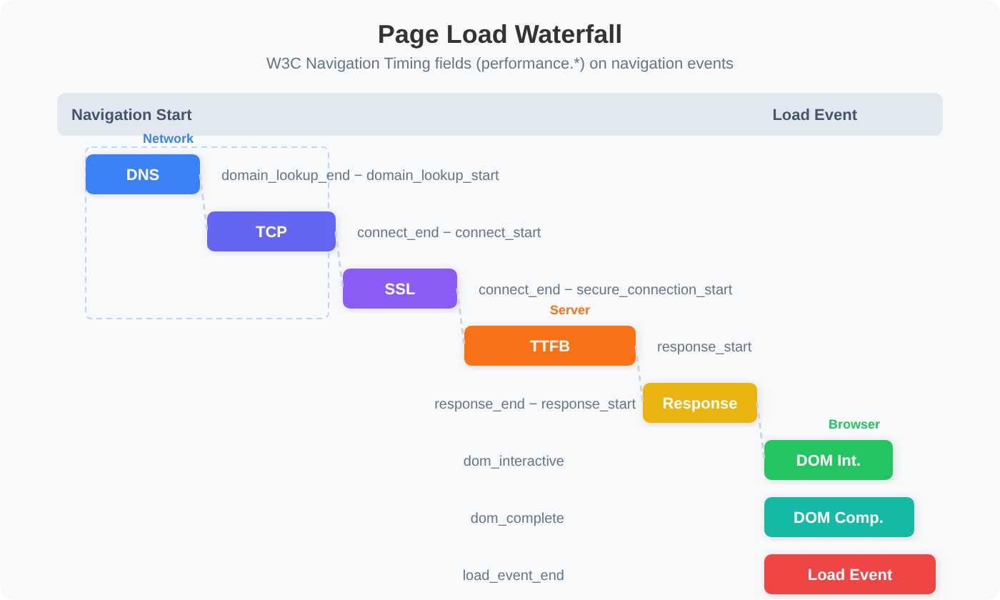

# WEBRUM-06: Performance Analysis

> **Series:** WEBRUM — Web Real User Monitoring | **Notebook:** 6 of 10 | **Created:** March 2026 | **Last Updated:** 10/05/2026

## Overview

Web performance directly impacts user experience, conversion rates, and SEO rankings. While Core Web Vitals (covered in WEBRUM-03) provide high-level scoring, a deeper performance analysis requires understanding the full page load waterfall — from DNS lookup to load complete — and how performance varies across geographies, network conditions, and device types.

---

## Table of Contents

1. [Page Load Waterfall](#page-load-waterfall)
2. [Time to First Byte (TTFB)](#ttfb)
3. [DOM Interactive and Load Event](#dom-timing)
4. [Performance by Geography](#perf-by-geo)
5. [Performance by Network and Device](#perf-by-device)
6. [Identifying Slow Pages](#slow-pages)
7. [Performance Trends](#performance-trends)
8. [Summary and Next Steps](#summary)

---

## Prerequisites

| Requirement | Details |
|-------------|----------|
| **Dynatrace Environment** | SaaS with Grail enabled |
| **RUM Enabled** | Web applications with detailed timing capture |
| **Permissions** | `storage:events:read` |
| **Previous Notebooks** | WEBRUM-01: RUM Fundamentals, WEBRUM-03: Core Web Vitals |

<a id="page-load-waterfall"></a>

## 1. Page Load Waterfall

Every page load follows a sequence of phases captured by the browser's Navigation Timing API. Dynatrace records these milestones for each load action:



<!-- MARKDOWN_TABLE_ALTERNATIVE
| Phase | DQL Field (navigation events) | Category |
|-------|-----------|----------|
| DNS Lookup | performance.domain_lookup_end − performance.domain_lookup_start | Network |
| TCP Connect | performance.connect_end − performance.connect_start | Network |
| SSL Handshake | performance.connect_end − performance.secure_connection_start | Network |
| Time to First Byte | performance.response_start | Server |
| Response Download | performance.response_end − performance.response_start | Server |
| DOM Interactive | performance.dom_interactive | Browser |
| DOM Complete | performance.dom_complete | Browser |
| Load Event | performance.load_event_end | Browser |
For environments where SVG doesn't render
-->

### Timing Milestones Explained

| Milestone | Description | Optimization Focus |
|-----------|-------------|--------------------|
| **DNS time** | Domain name resolution | Use DNS prefetching, reduce DNS lookups |
| **TCP connect** | Establishing TCP connection | Enable HTTP/2, use CDN edge servers |
| **SSL time** | TLS handshake | Enable TLS 1.3, OCSP stapling |
| **TTFB** | Server processing + first byte transit | Optimize server response time |
| **Response time** | Full HTML download | Compress, minimize HTML size |
| **DOM interactive** | HTML parsed, DOM ready for interaction | Defer non-critical JS, reduce blocking resources |
| **DOM complete** | All sub-resources loaded | Lazy load images, async load scripts |
| **Load event** | `window.onload` fires | Final milestone; all resources ready |

### Where the Timings Live

All of these milestones are fields on **navigation events** — select them with `characteristics.has_w3c_navigation_timings == true`. Each `performance.*` value is a duration measured from the start of the navigation, so `performance.load_event_end` is the page-load time. Dynatrace's own page-load query uses exactly this field and filter.

Do **not** measure page load with `duration` on a page summary. A page summary covers the page's whole life — *"A page instance begins with each hard navigation and ends when the next document request starts or when the tab is closed"* — so its `duration` is how long the page stayed open, not how long it took to load. On the synthetic-only validation tenant (24 h, 10/05/2026) the median page-summary `duration` was 4.7 s against a median load time of 0.36 s; on real-user traffic, where tabs stay open for minutes, the gap is far larger.

> <sub>**Sources:** [Monitor web performance with DQL (DT docs)](https://docs.dynatrace.com/docs/observe/digital-experience/rum/analyze-and-alert/rum-dql-web-performance) — *"RUM captures page load timings from the W3C Navigation Timing API as built-in metrics and as fields on navigation events."*; [Navigation-related events — semantic dictionary (DT docs)](https://docs.dynatrace.com/docs/semantic-dictionary/model/rum/user-events/navigation-related) — *"A page instance begins with each hard navigation and ends when the next document request starts or when the tab is closed."*; [Requests — semantic dictionary (DT docs)](https://docs.dynatrace.com/docs/semantic-dictionary/model/rum/user-events/requests) — *"The end time of the load event handler phase."* **Dictionary:** model `rum_page_summary` — *"A page instance begins with each hard navigation and ends when the next document request starts or when the tab is closed."*, read 10/05/2026.</sub>

```dql
// Page load waterfall — average phase timings for the top 10 pages, all from navigation events.
// The server phase is performance.response_start (TTFB); the previous `avg(ttfb.waiting_duration)`
// column read the pre-request wait/redirect phase, and is empty on navigation events anyway.
fetch user.events, from:-24h
| filter characteristics.has_w3c_navigation_timings == true
| summarize {page_views = count(),
    avg_dns_ms = avg(performance.domain_lookup_end - performance.domain_lookup_start) / 1ms,
    avg_connect_ms = avg(performance.connect_end - performance.connect_start) / 1ms,
    avg_ttfb_ms = avg(performance.response_start) / 1ms,
    avg_download_ms = avg(performance.response_end - performance.response_start) / 1ms,
    avg_dom_interactive_ms = avg(performance.dom_interactive) / 1ms,
    avg_load_event_ms = avg(performance.load_event_end) / 1ms},
    by:{page.detected_name}
| sort page_views desc
| limit 10
```

<a id="ttfb"></a>

## 2. Time to First Byte (TTFB)

TTFB measures the time from the browser sending the request to receiving the first byte of the response. It reflects:

- **Server processing time** — How long the backend takes to generate the response
- **Network latency** — Round-trip time between client and server
- **CDN performance** — Cache hit/miss at the edge

Google recommends a TTFB of **≤ 800ms** for a good user experience.

In New RUM the TTFB value is `web_vitals.time_to_first_byte` (stable, a duration). Where it is not populated, `ttfb.value` (experimental, in milliseconds) carries *"The responseStart value of the navigation timing"* — the same measurement. The queries below read the stable field and fall back to the experimental one. They do **not** use `ttfb.waiting_duration`: that field is *"The total time from when the user initiates loading to when the navigation request is handled"* — the wait before the request, usually redirects — and reading it as TTFB under-reports by an order of magnitude.

> <sub>**Sources:** [Navigation-related events — semantic dictionary (DT docs)](https://docs.dynatrace.com/docs/semantic-dictionary/model/rum/user-events/navigation-related) — *"The responseStart value of the navigation timing."*, *"Long waiting durations are usually caused by HTTP redirects."*; [Monitor web performance with DQL (DT docs)](https://docs.dynatrace.com/docs/observe/digital-experience/rum/analyze-and-alert/rum-dql-web-performance) (computes TTFB from `web_vitals.time_to_first_byte`).</sub>

```dql
// TTFB corrected 10/05/2026: coalesce(web_vitals.time_to_first_byte / 1ms, ttfb.value) — the
// stable duration field where populated, else the experimental responseStart value (already ms).
// ttfb.waiting_duration is the pre-request wait/redirect phase, not TTFB.
// TTFB analysis by page — identify pages with slow server response
fetch user.events, from:-24h
| filter characteristics.has_page_summary == true
| fieldsAdd ttfb_ms = coalesce(web_vitals.time_to_first_byte / 1ms, ttfb.value)
| filter isNotNull(ttfb_ms)
| summarize {page_views = count(), avg_ttfb = avg(ttfb_ms),
    p75_ttfb = percentile(ttfb_ms, 75), p95_ttfb = percentile(ttfb_ms, 95)},
    by:{page.detected_name}
| filter page_views > 10
| sort p75_ttfb desc
| limit 10
```

```dql
// TTFB corrected 10/05/2026: coalesce(web_vitals.time_to_first_byte / 1ms, ttfb.value) — the
// stable duration field where populated, else the experimental responseStart value (already ms).
// ttfb.waiting_duration is the pre-request wait/redirect phase, not TTFB.
// TTFB distribution — classify into Good / Needs Improvement / Poor
fetch user.events, from:-24h
| filter characteristics.has_page_summary == true
| fieldsAdd ttfb_ms = coalesce(web_vitals.time_to_first_byte / 1ms, ttfb.value)
| filter isNotNull(ttfb_ms)
| fieldsAdd ttfb_category = if(ttfb_ms <= 800, "Good",
    else: if(ttfb_ms <= 1800, "Needs Improvement",
    else: "Poor"))
| summarize action_count = count(), by:{ttfb_category}
| sort action_count desc
```

<a id="dom-timing"></a>

## 3. DOM Interactive and Load Event

**DOM Interactive** is when the HTML has been fully parsed and the DOM tree is ready — but images, stylesheets, and sub-frames may still be loading. This is when users can first interact with the page.

**Load Event** fires when all resources (images, scripts, stylesheets, iframes) have finished loading. The gap between DOM Interactive and Load Event reveals how much time is spent on sub-resource loading.

```dql
// DOM Interactive vs Load Event — identify resource-heavy pages
fetch user.events, from:-24h
| filter characteristics.has_w3c_navigation_timings == true
| filter isNotNull(performance.dom_interactive) and isNotNull(performance.load_event_end)
| summarize {page_views = count(),
    avg_dom_interactive = avg(performance.dom_interactive),
    avg_load_event = avg(performance.load_event_end)},
    by:{page.detected_name}
| fieldsAdd resource_load_gap = avg_load_event - avg_dom_interactive
| filter page_views > 10
| sort resource_load_gap desc
| limit 10
```

A large gap between DOM Interactive and Load Event suggests the page has many sub-resources (large images, heavy scripts, third-party tags) that delay full load completion. Consider lazy loading and async script loading to reduce this gap.

<a id="perf-by-geo"></a>

## 4. Performance by Geography

Performance varies significantly by user location due to network latency, CDN coverage, and server proximity.

```dql
// Page-load time corrected 10/05/2026: performance.load_event_end on navigation events
// (has_w3c_navigation_timings). A page summary's `duration` is how long the page was OPEN.
// Page load performance by country — identify slow regions (TTFB by region: next query)
fetch user.events, from:-24h
| filter characteristics.has_w3c_navigation_timings == true
| filter isNotNull(geo.country.name)
| summarize {page_views = count(),
    avg_load_ms = avg(performance.load_event_end) / 1ms,
    p75_load_ms = percentile(performance.load_event_end, 75) / 1ms},
    by:{geo.country.name}
| filter page_views > 20
| sort p75_load_ms desc
| limit 15
```

```dql
// TTFB corrected 10/05/2026: coalesce(web_vitals.time_to_first_byte / 1ms, ttfb.value) — the
// stable duration field where populated, else the experimental responseStart value (already ms).
// ttfb.waiting_duration is the pre-request wait/redirect phase, not TTFB.
// Compare TTFB across regions — CDN effectiveness indicator
fetch user.events, from:-24h
| filter characteristics.has_page_summary == true
| filter isNotNull(geo.continent.name)
| fieldsAdd ttfb_ms = coalesce(web_vitals.time_to_first_byte / 1ms, ttfb.value)
| summarize {page_views = count(),
    avg_ttfb_ms = avg(ttfb_ms),
    p75_ttfb_ms = percentile(ttfb_ms, 75)},
    by:{geo.continent.name}
| sort p75_ttfb_ms desc
```

> **Tip:** If TTFB is consistently high for specific regions, consider deploying CDN edge servers or regional server instances closer to those users.

<a id="perf-by-device"></a>

## 5. Performance by Network and Device

Network connection type and device capability significantly impact perceived performance.

Web RUM has no connection-type field to split by: `network.connection.type` is documented as *"Only supported by OneAgent for Mobile"*, and `network.protocol.name` is the OSI application protocol (`http`), not wifi versus cellular. The queries below break page-load time down by browser and operating system instead.

> <sub>**Sources:** [User events — semantic dictionary (DT docs)](https://docs.dynatrace.com/docs/semantic-dictionary/model/rum/user-events) — *"The internet connection type. Only supported by OneAgent for Mobile."* **Dictionary:** `network.protocol.name` (`stable`) — *"OSI Application Layer or non-OSI equivalent."*, read 10/05/2026.</sub>

```dql
// Page-load time corrected 10/05/2026: performance.load_event_end on navigation events
// (has_w3c_navigation_timings). A page summary's `duration` is how long the page was OPEN.
// Performance by browser — which browsers are slowest?
fetch user.events, from:-24h
| filter characteristics.has_w3c_navigation_timings == true
| filter isNotNull(browser.name)
| summarize {page_views = count(),
    avg_load_ms = avg(performance.load_event_end) / 1ms,
    p75_load_ms = percentile(performance.load_event_end, 75) / 1ms},
    by:{browser.name}
| filter page_views > 20
| sort p75_load_ms desc
| limit 10
```

```dql
// Page-load time corrected 10/05/2026: performance.load_event_end on navigation events
// (has_w3c_navigation_timings). A page summary's `duration` is how long the page was OPEN.
// Performance by OS — desktop vs mobile operating systems (os.name; there is no os.family field)
fetch user.events, from:-24h
| filter characteristics.has_w3c_navigation_timings == true
| filter isNotNull(os.name)
| summarize {page_views = count(),
    avg_load_ms = avg(performance.load_event_end) / 1ms,
    p75_load_ms = percentile(performance.load_event_end, 75) / 1ms},
    by:{os.name}
| filter page_views > 20
| sort p75_load_ms desc
```

<a id="slow-pages"></a>

## 6. Identifying Slow Pages

Find the pages that need optimization attention — ranked by the impact of their slowness (volume x load time).

```dql
// Page-load time corrected 10/05/2026: performance.load_event_end on navigation events
// (has_w3c_navigation_timings). A page summary's `duration` is how long the page was OPEN.
// Slowest pages by p95 load time — worst-case performance
fetch user.events, from:-24h
| filter characteristics.has_w3c_navigation_timings == true
| summarize {page_views = count(),
    avg_load_ms = avg(performance.load_event_end) / 1ms,
    p75_load_ms = percentile(performance.load_event_end, 75) / 1ms,
    p95_load_ms = percentile(performance.load_event_end, 95) / 1ms},
    by:{page.detected_name}
| filter page_views > 20
| sort p95_load_ms desc
| limit 10
```

```dql
// Page-load time corrected 10/05/2026: performance.load_event_end on navigation events
// (has_w3c_navigation_timings). A page summary's `duration` is how long the page was OPEN.
// Weighted impact score — pages with high traffic AND slow loads
fetch user.events, from:-24h
| filter characteristics.has_w3c_navigation_timings == true
| summarize {page_views = count(),
    avg_load_ms = avg(performance.load_event_end) / 1ms},
    by:{page.detected_name}
| fieldsAdd impact_score = page_views * avg_load_ms
| sort impact_score desc
| limit 10
```

> **Tip:** The impact score (page views x average load time) helps prioritize optimization efforts. A moderately slow page with high traffic may be more impactful than a very slow page with few visitors.

<a id="performance-trends"></a>

## 7. Performance Trends

Track performance over time to detect regressions and measure the impact of optimizations.

```dql
// Page-load time corrected 10/05/2026: performance.load_event_end on navigation events
// (has_w3c_navigation_timings). A page summary's `duration` is how long the page was OPEN.
// Page load time trend — daily p75 over the last 7 days
fetch user.events, from:-7d
| filter characteristics.has_w3c_navigation_timings == true
| fieldsAdd load_ms = performance.load_event_end / 1ms
| makeTimeseries p75_load_ms = percentile(load_ms, 75), interval:24h
```

```dql
// TTFB corrected 10/05/2026: coalesce(web_vitals.time_to_first_byte / 1ms, ttfb.value) — the
// stable duration field where populated, else the experimental responseStart value (already ms).
// ttfb.waiting_duration is the pre-request wait/redirect phase, not TTFB.
// TTFB trend — hourly p75 over the last 24 hours
fetch user.events, from:-24h
| filter characteristics.has_page_summary == true
| fieldsAdd ttfb_ms = coalesce(web_vitals.time_to_first_byte / 1ms, ttfb.value)
| filter isNotNull(ttfb_ms)
| makeTimeseries p75_ttfb = percentile(ttfb_ms, 75), interval:1h
```

<a id="summary"></a>

## 8. Summary and Next Steps

In this notebook, we covered:

- **Page load waterfall** — Full timing breakdown from DNS to load complete, all on navigation events
- **TTFB analysis** — Server response time measurement and classification
- **DOM timing** — Interactive vs complete timing for resource load gap analysis
- **Geographic performance** — Regional and continental performance differences
- **Device performance** — Impact of browser and OS (web RUM has no connection-type field)
- **Slow page identification** — Ranking pages by p95 load time and impact score
- **Performance trends** — Time-series tracking for regression detection

### Next Steps

- **WEBRUM-07: Session Replay** — Visually investigate slow page experiences
- **WEBRUM-08: Dashboards and Alerting** — Build operational RUM dashboards with Apdex

### References

- [Dynatrace Performance Analysis](https://docs.dynatrace.com/docs/observe/digital-experience/rum-classic/web-applications/analyze-and-use/waterfall-analysis)
- [Navigation Timing API](https://developer.mozilla.org/en-US/docs/Web/API/Performance_API/Navigation_timing)
- [TTFB Best Practices](https://web.dev/articles/ttfb)
- [User events — semantic dictionary (DT docs)](https://docs.dynatrace.com/docs/semantic-dictionary/model/rum/user-events) — *"Used for internal optimization when storing the data and not intended for query usage."*
- [Semantic Dictionary changelog 1.349 (DT docs)](https://docs.dynatrace.com/docs/semantic-dictionary/changelog/version-1-349)

---

<sub>*This notebook was AI-generated from community-submitted and publicly available sources. This notebook series is not officially supported by Dynatrace. Always verify information against official Dynatrace documentation.*</sub>
