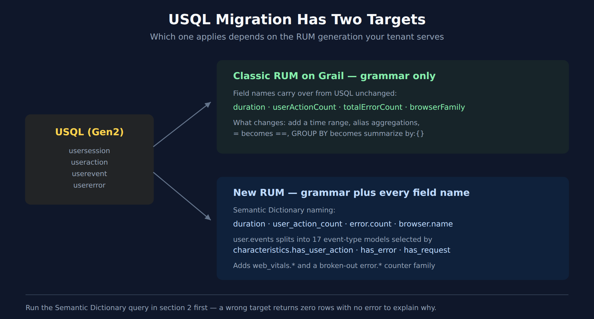

# WEBRUM-09: Migrating USQL to DQL

> **Series:** WEBRUM — Web Real User Monitoring | **Notebook:** 9 of 10 | **Created:** July 2026 | **Last Updated:** 08/12/2026

## Overview

User Sessions Query Language (USQL) is Dynatrace's own Gen2 query language for RUM data. On Gen3 it is replaced by DQL — but unlike the competitor translations elsewhere in this corpus (SPL, NRQL, SumoQL), this one has **two possible targets**, and which one you need depends on the RUM generation your tenant serves.

That distinction is the whole notebook. Get it wrong and every query returns zero rows with no error to explain why.

| | Classic RUM on Grail | New RUM |
|---|---|---|
| Session fields | `userActionCount`, `totalErrorCount`, `browserFamily` | `user_action_count`, `error.count`, `browser.name` |
| Event typing | `action.type == "Load"` | `characteristics.has_user_action == true` |
| What changes from USQL | **Grammar only** — field names carry over | Grammar **and** every field name |

The useful surprise is on the left: classic RUM on Grail preserves the USQL field names almost verbatim, so that migration is a grammar exercise. Migrating to New RUM is a genuine field-by-field translation.

---

## Table of Contents

1. [Why This Is Two Migrations](#why-this-is-two-migrations)
2. [Determining Which Model Your Tenant Serves](#determining-which-model-your-tenant-serves)
3. [Grammar Mapping](#grammar-mapping)
4. [Table Mapping](#table-mapping)
5. [Field Mapping — Sessions](#field-mapping--sessions)
6. [Field Mapping — User Actions](#field-mapping--user-actions)
7. [Worked Conversions](#worked-conversions)
8. [What Does Not Translate](#what-does-not-translate)
9. [Summary and Next Steps](#summary-and-next-steps)

---

<a id="prerequisites"></a>
## Prerequisites

| Requirement | Details |
|-------------|---------|
| **Dynatrace Environment** | SaaS with Grail |
| **RUM data** | At least one application reporting real-user sessions |
| **Permissions** | `storage:user.sessions:read` and `storage:user.events:read` |
| **Prior reading** | WEBRUM-01 (fundamentals), WEBRUM-04 (session analysis) |

> **On the validation status of the queries in this notebook.** The field names on both sides are sourced from primary references — the USQL/classic column from the Dynatrace **User sessions API** documentation, the New RUM column from a live query against `dt.semantic_dictionary.models` on a Dynatrace tenant (07/23/2026). Both are authoritative for *what the fields are called*.
>
> The two discovery queries in [section 2](#determining-which-model-your-tenant-serves) were executed against a live tenant and returned the results described. The conversion examples in [section 7](#worked-conversions) were **not** executed — the validation tenant holds zero records in `default_user_sessions` and `default_user_events`, so there was no real-user RUM data to run them against. They are schema-verified, not execution-verified. Run section 2 first, then confirm each conversion against your own data before relying on it.

<a id="why-this-is-two-migrations"></a>
## 1. Why This Is Two Migrations



<!-- MARKDOWN_TABLE_ALTERNATIVE
| Source | Target | Nature of the change |
|--------|--------|----------------------|
| USQL on Gen2 | Classic RUM on Grail | Grammar only — SELECT/FROM/WHERE become fetch/filter/summarize; field names carry over |
| USQL on Gen2 | New RUM | Grammar plus a full field-name translation; user.events splits into 17 event-type models |
For environments where SVG doesn't render
-->

USQL ran against a purpose-built session store. Gen3 moved RUM into Grail, and it did so in two stages:

- **Classic RUM on Grail** lifted the existing session model into Grail largely intact. The USQL column names came along — `duration`, `userActionCount`, `totalErrorCount`, `userType` are the same identifiers in both. What changed is the query grammar.
- **New RUM** is a redesign around the Dynatrace Semantic Dictionary. Fields are renamed to the platform's snake_case dotted conventions, and `user.events` is no longer one flat table of typed actions — it is a set of event-type models distinguished by `characteristics.has_*` flags.

The rest of the WEBRUM series is written against the classic vocabulary. If section 2 tells you your tenant serves New RUM, use the third column of the field tables below and expect the other notebooks to need the same translation.

> <sub>**Sources:** [User session structure (DT docs)](https://docs.dynatrace.com/docs/dynatrace-api/environment-api/rum/user-sessions/user-session-structure), [Custom queries, segmentation, and aggregation of session data (DT docs)](https://docs.dynatrace.com/docs/observe/digital-experience/rum-classic/session-segmentation/custom-queries-segmentation-and-aggregation-of-session-data). **Derived:** the "grammar only" characterization of the classic path combines the documented USQL field list with the field names in use across the WEBRUM series.</sub>

<a id="determining-which-model-your-tenant-serves"></a>
## 2. Determining Which Model Your Tenant Serves

Run this first. It decides which column of every table below applies to you.

The Semantic Dictionary is the authoritative description of the New RUM model. If it returns the `rum.user_session` model with snake_case dotted fields, your tenant knows about New RUM.

```dql
// Which RUM session model does this tenant describe?
// Snake_case dotted fields (browser.name, user_action_count) => New RUM.
fetch dt.semantic_dictionary.models
| filter data_object == "user.sessions"
| fields name, title, fields
```

The event side matters just as much. Under New RUM, `user.events` is described by a set of event-type models rather than one flat table — `rum_user_action`, `rum_page_summary`, `rum_navigation`, `rum_request`, `rum_exception`, `rum_crash`, and others. That is what replaces USQL's `useraction` / `userevent` / `usererror` split.

```dql
// Event-type models behind user.events under New RUM.
// Each is selected in a query via its characteristics.has_* flag.
fetch dt.semantic_dictionary.models
| filter data_object == "user.events"
| fields name, title
| sort name asc
```

Then confirm where the data actually is. A tenant can describe New RUM while its populated buckets still hold classic-shaped data, so check record counts rather than assuming.

```dql
// Which RUM buckets hold data, and can you read them?
// has_access == false means your permissions, not the data, are the problem.
fetch dt.system.buckets
| filter in(dt.system.table, {"user.sessions", "user.events"})
| fields name, dt.system.table, retention_days, records, has_access
| sort records desc
```

> **Reading the result.** Records in `default_user_sessions` and `default_user_events` are your real-user data. Records only in `default_synthetic_user_sessions` / `default_synthetic_user_events` mean the tenant is carrying synthetic traffic alone — conversions will parse and return nothing, which looks identical to a wrong field name. Confirm you have real-user records before concluding a query is broken.

<a id="grammar-mapping"></a>
## 3. Grammar Mapping

The grammar change is identical for both targets — only the field names in the third column differ.

| USQL | DQL | Notes |
|---|---|---|
| `SELECT <fields>` | `fields <fields>` | Or omit — DQL returns all fields by default |
| `SELECT <agg>` | `summarize <alias> = <agg>` | **DQL requires an alias** if you sort on it afterwards |
| `FROM usersession` | `fetch user.sessions, from:-24h` | **The time range is mandatory in DQL**; USQL inherited it from the UI or API call |
| `WHERE <cond>` | `\| filter <cond>` | `=` becomes `==` |
| `GROUP BY a, b` | `\| summarize ..., by:{a, b}` | Curly braces, not bare list |
| `ORDER BY x DESC` | `\| sort x desc` | Lowercase `desc` |
| `LIMIT 100` | `\| limit 100` | USQL default 50, max 5000; DQL default 1000 |
| `TOP(field, 10)` | `\| summarize c = count(), by:{field} \| sort c desc \| limit 10` | No direct equivalent — decompose |
| `COUNT(*)` | `count()` | |
| `AVG` / `SUM` / `MIN` / `MAX` | `avg` / `sum` / `min` / `max` | Same names, lowercase |
| `MEDIAN(x)` | `percentile(x, 50)` | |
| `PERCENTILE(x, 90)` | `percentile(x, 90)` | |
| `DISTINCT` | `countDistinctExact()` / `collectDistinct()` | Depending on whether you want the count or the values |
| `LIKE '%x%'` | `contains(field, "x")` | |
| `STARTSWITH` | `startsWith(field, "x")` | |
| `IN (a, b)` | `in(field, {"a", "b"})` | Curly braces for the value set |
| `BETWEEN a AND b` | `field >= a and field <= b` | |
| `IS NULL` / `IS NOT NULL` | `isNull(field)` / `isNotNull(field)` | |
| `YEAR` / `MONTH` / `DAY` / `HOUR` | `getYear()` / `getMonth()` / `getDayOfMonth()` / `getHour()` | |

**Two rules cause most first-attempt failures:**

1. **Every `fetch` needs a time range.** USQL took its window from the dashboard, the management-zone selector, or the API request. DQL does not — `fetch user.sessions` without `from:` is not the same query.
2. **Aggregations must be aliased before you sort on them.** `sort count() desc` is invalid; `summarize c = count()` then `sort c desc` is what USQL's implicit ordering becomes.

> <sub>**Sources:** [Custom queries, segmentation, and aggregation of session data (DT docs)](https://docs.dynatrace.com/docs/observe/digital-experience/rum-classic/session-segmentation/custom-queries-segmentation-and-aggregation-of-session-data) — USQL keyword, function, and operator lists.</sub>

<a id="table-mapping"></a>
## 4. Table Mapping

USQL had four tables. DQL has two, and the distinction USQL encoded in the table name moves into a filter.

| USQL table | Classic RUM on Grail | New RUM |
|---|---|---|
| `usersession` | `fetch user.sessions` | `fetch user.sessions` |
| `useraction` | `fetch user.events` + `filter action.type == "Load"` (or `"Xhr"`, `"Click"`, …) | `fetch user.events` + `filter characteristics.has_user_action == true` |
| `userevent` | `fetch user.events` | `fetch user.events` + the relevant `characteristics.has_*` flag |
| `usererror` | `fetch user.events` + error-type filter | `fetch user.events` + `filter characteristics.has_error == true` |

Under New RUM the event-type models each expose their own fields — `rum_exception` carries `error.name` / `error.type` / `error.is_fatal`, `rum_crash` adds `exception.stack_trace` and `exception.crash_signal_name`, `rum_request` carries `http.request.method` and `http.response.status_code`. Filter to the event type first, then reference its fields.

> <sub>**Sources:** live query of `dt.semantic_dictionary.models` (Dynatrace tenant, 07/23/2026) for the New RUM column; [Custom queries, segmentation, and aggregation of session data (DT docs)](https://docs.dynatrace.com/docs/observe/digital-experience/rum-classic/session-segmentation/custom-queries-segmentation-and-aggregation-of-session-data) for the USQL table list.</sub>

<a id="field-mapping--sessions"></a>
## 5. Field Mapping — Sessions

`usersession` → `user.sessions`. The classic column is where the USQL name carries over unchanged.

| USQL (`usersession`) | Classic RUM on Grail | New RUM |
|---|---|---|
| `duration` | `duration` | `duration` |
| `startTime` / `endTime` | `startTime` / `endTime` | `start_time` / `end_time` |
| `endReason` | `endReason` | `end_reason` |
| `userActionCount` | `userActionCount` | `user_action_count` |
| `totalErrorCount` | `totalErrorCount` | `error.count` |
| `hasError` | `totalErrorCount > 0` | `error.count > 0` |
| `hasCrash` | `hasCrash` | `error.has_crash` |
| `userType` | `userType` | `dt.rum.user_type` |
| `userSessionId` | `sessionId` | `dt.rum.session.id` |
| `browserFamily` | `browserFamily` | `browser.name` |
| `browserMajorVersion` | `browserMajorVersion` | `browser.version` |
| `osFamily` / `osVersion` | `osFamily` / `osVersion` | `os.name` / `os.version` |
| `country` | `country` | `geo.country.iso_code` |
| `ip` | `ip` | `client.ip` |
| `isp` | `isp` | `client.isp` |
| `device` | `device` | `device.type` |
| `manufacturer` | `manufacturer` | `device.manufacturer` |
| `screenWidth` / `screenHeight` | `screenWidth` / `screenHeight` | `device.screen.width` / `device.screen.height` |
| `appVersion` | `appVersion` | `app.version` |
| `hasSessionReplay` | `hasSessionReplay` | `characteristics.has_replay` |
| `rootedOrJailbroken` | `rootedOrJailbroken` | `device.is_rooted` |
| `stringProperties.<key>` | `stringProperties.<key>` | `session_properties.<key>` |
| `bounce` | `userActionCount <= 1` | `user_action_count <= 1` |

**Fields with no direct New RUM equivalent in the session model:** `city`, `continent`, `region` (only `geo.country.iso_code` is present), `userExperienceScore`, `matchingConversionGoals`, `newUser`, `numberOfRageClicks`. See [section 8](#what-does-not-translate).

**New RUM adds** counters USQL had no equivalent for: `navigation_count`, `page_summary_count`, `request_count`, `user_interaction_count`, `view_summary_count`, and a broken-out error family (`error.exception_count`, `error.http_4xx_count`, `error.http_5xx_count`, `error.csp_violation_count`, `error.anr_count`).

> <sub>**Sources:** [User session structure (DT docs)](https://docs.dynatrace.com/docs/dynatrace-api/environment-api/rum/user-sessions/user-session-structure) for the USQL column; live query of `dt.semantic_dictionary.models` (model `rum.user_session`, Dynatrace tenant, 07/23/2026) for the New RUM column. **Derived:** the classic-Grail column is inferred from the USQL names plus field usage across the WEBRUM series — verify against your own tenant per section 2.</sub>

<a id="field-mapping--user-actions"></a>
## 6. Field Mapping — User Actions

`useraction` → `user.events`. This is where the two targets diverge most.

| USQL (`useraction`) | Classic RUM on Grail | New RUM |
|---|---|---|
| `name` | `action.name` | `interaction.name` / `ui_element.name` |
| `type` | `action.type` | `characteristics.has_*` flags + `characteristics.classifier` |
| `duration` | `duration` | `duration` |
| `application` | `application` | `dt.rum.application.entities` |
| `largestContentfulPaint` | `largestContentfulPaint` | `web_vitals.largest_contentful_paint` |
| `firstInputDelay` | `firstInputDelay` | `web_vitals.first_input_delay` |
| `cumulativeLayoutShift` | `cumulativeLayoutShift` | `web_vitals.cumulative_layout_shift` |
| *(no equivalent)* | *(no equivalent)* | `web_vitals.interaction_to_next_paint` |
| *(no equivalent)* | *(no equivalent)* | `web_vitals.time_to_first_byte` (on `rum_request`) |
| `javascriptErrorCount` | `javascriptErrorCount` | count `rum_exception` events |
| `requestErrorCount` | `requestErrorCount` | `characteristics.has_failed_request` |
| `hasCrash` | `hasCrash` | `characteristics.has_crash` |

Request-shaped actions (USQL `type == 'Xhr'`) map onto the `rum_request` model, which exposes `http.request.method`, `http.response.status_code`, and `http.response.reason_phrase` — none of which existed as USQL user-action fields.

> <sub>**Sources:** [User session structure (DT docs)](https://docs.dynatrace.com/docs/dynatrace-api/environment-api/rum/user-sessions/user-session-structure) for the documented user-action fields; live query of `dt.semantic_dictionary.models` (models `rum_user_action`, `rum_request`, `rum_exception`, `rum_crash`, Dynatrace tenant, 07/23/2026) for the New RUM column.</sub>

<a id="worked-conversions"></a>
## 7. Worked Conversions

Each cell shows the original USQL as a comment, then the DQL for both targets. Uncomment the one matching your tenant.

> These were not executed against real-user data — see the note in [Prerequisites](#prerequisites). Verify against your own tenant.

```dql
// USQL: SELECT browserFamily, COUNT(*) FROM usersession GROUP BY browserFamily

// --- Classic RUM on Grail ---
fetch user.sessions, from:-24h
| filter userType == "REAL_USER"
| summarize session_count = count(), by:{browserFamily}
| sort session_count desc
| limit 10

// --- New RUM ---
// fetch user.sessions, from:-24h
// | filter dt.rum.user_type == "REAL_USER"   // confirm the enum values in your tenant
// | summarize session_count = count(), by:{browser.name}
// | sort session_count desc
// | limit 10
```

```dql
// Session/performance field vocabulary corrected 08/12/2026 (New RUM). Classic camelCase RUM
// names are null on New RUM data and fail silently. Verified against 3,261 user.sessions:
//   userType -> dt.rum.user_type      userActionCount -> user_action_count
//   totalErrorCount -> error.count    sessionId -> dt.rum.session.id
//   hasSessionReplay -> characteristics.has_replay
//   browserFamily -> browser.name     osFamily -> os.name
//   application -> primary_tags.application
//   country/city/continent -> geo.country.name / geo.city.name / geo.continent.name
//   screen.width|height -> browser.window.width|height
//   dom.interactive.time -> performance.dom_interactive
//   load.event.time -> performance.load_event_end
//   server.time -> ttfb.waiting_duration
// TWO TENANT CAVEATS on the validation tenant, both of which leave a CORRECT query empty:
//   * every session is dt.rum.user_type == "synthetic", so a real-user filter matches nothing —
//     the "real_user" literal itself could NOT be confirmed here and is the documented value form;
//   * geo.* is 0-populated, because synthetic traffic carries no geolocation.
// USQL: SELECT AVG(duration) FROM usersession WHERE browserFamily = 'Chrome'
// Note the two changes: = becomes ==, and the aggregation gets an alias.

// --- Classic RUM on Grail ---
fetch user.sessions, from:-24h
| filter browser.name == "Chrome"
| summarize avg_duration = avg(duration)

// --- New RUM ---
// fetch user.sessions, from:-24h
// | filter browser.name == "Chrome"
// | summarize avg_duration = avg(duration)
```

```dql
// USQL: SELECT country, COUNT(*) FROM usersession WHERE hasError IS TRUE GROUP BY country
// hasError has no DQL equivalent — it becomes a count comparison.

// --- Classic RUM on Grail ---
fetch user.sessions, from:-24h
| filter userType == "REAL_USER"
| summarize total = count(),
    with_errors = countIf(totalErrorCount > 0),
    by:{country}
| fieldsAdd error_pct = round(toDouble(with_errors) / toDouble(total) * 100.0, decimals: 1)
| sort error_pct desc
| limit 20

// --- New RUM ---
// fetch user.sessions, from:-24h
// | summarize total = count(),
//     with_errors = countIf(error.count > 0),
//     by:{geo.country.iso_code}
// | fieldsAdd error_pct = round(toDouble(with_errors) / toDouble(total) * 100.0, decimals: 1)
// | sort error_pct desc
// | limit 20
```

```dql
// USQL: SELECT TOP(name, 10), COUNT(*) FROM useraction GROUP BY name
// TOP() decomposes into summarize + sort + limit.

// --- Classic RUM on Grail ---
fetch user.events, from:-24h
| filter action.type == "Load"
| summarize action_count = count(), by:{action.name}
| sort action_count desc
| limit 10

// --- New RUM ---
// fetch user.events, from:-24h
// | filter characteristics.has_user_action == true
// | summarize action_count = count(), by:{interaction.name}
// | sort action_count desc
// | limit 10
```

```dql
// USQL: SELECT AVG(largestContentfulPaint) FROM useraction WHERE type = 'Load' GROUP BY application
// Web Vitals move into the web_vitals.* namespace under New RUM.

// --- Classic RUM on Grail ---
fetch user.events, from:-24h
| filter action.type == "Load"
| filter isNotNull(largestContentfulPaint)
| summarize avg_lcp = avg(largestContentfulPaint),
    p90_lcp = percentile(largestContentfulPaint, 90),
    by:{application}
| sort p90_lcp desc

// --- New RUM ---
// fetch user.events, from:-24h
// | filter characteristics.has_user_action == true
// | filter isNotNull(web_vitals.largest_contentful_paint)
// | summarize avg_lcp = avg(web_vitals.largest_contentful_paint),
//     p90_lcp = percentile(web_vitals.largest_contentful_paint, 90),
//     by:{dt.rum.application.entities}
// | sort p90_lcp desc
```

<a id="what-does-not-translate"></a>
## 8. What Does Not Translate

| USQL feature | Status | What to do instead |
|---|---|---|
| `FUNNEL` | No DQL equivalent | Rebuild as sequential `countIf()` stages, or model the funnel as business events — see the BIZEV series |
| `matchingConversionGoals` | Not in the New RUM session model | Conversion goals are a classic-application construct; express the goal as a filter on the action or as a business event |
| `userExperienceScore` | Not in the New RUM session model | Apdex-style classification has to be derived from duration thresholds |
| `city` / `continent` / `region` | Only `geo.country.iso_code` in New RUM | Country-level granularity only, unless enriched at ingest |
| `newUser` | Not in the New RUM session model | Derive from user-id first-seen, or track as a session property |
| `numberOfRageClicks` / `numberOfRageTaps` | Not a session-level counter in New RUM | Count the corresponding event-type records |
| `KEYS` / `CONDITION` | No DQL equivalent | `KEYS` was USQL property discovery; use `fieldsSummary` or the Semantic Dictionary |

**Two behavioural differences worth knowing before you trust a result:**

- **Session windowing.** `fetch user.sessions, from:-24h` returns sessions by their timestamp within the window. Long sessions can begin outside a narrow window, so a correlation query over a short range can under-count. Widen the lookback and filter afterwards when session boundaries matter.
- **Closed sessions only.** USQL documented that only closed sessions are queryable. Expect a comparable lag before an in-flight session is complete in Grail, and do not treat the most recent minutes as final.

**If `fetch user.sessions` returns nothing at all**, work through section 2 before assuming a field name is wrong — an unpopulated bucket, a missing `storage:user.sessions:read` scope, and a wrong field name all produce an empty result set, and only one of them is a query problem.

> <sub>**Sources:** [Custom queries, segmentation, and aggregation of session data (DT docs)](https://docs.dynatrace.com/docs/observe/digital-experience/rum-classic/session-segmentation/custom-queries-segmentation-and-aggregation-of-session-data) — `FUNNEL` limits, closed-session constraint, `KEYS`/`CONDITION`; live query of `dt.semantic_dictionary.models` for the absent-field determinations.</sub>

<a id="summary-and-next-steps"></a>
## 9. Summary and Next Steps

**The three things to carry away:**

1. **Establish your target before translating anything.** Section 2 takes a minute and determines which column of every table applies. Skipping it produces queries that parse cleanly and return nothing.
2. **On classic RUM, this is a grammar migration.** The USQL field names carry over. Fix the time range, alias the aggregations, swap `=` for `==`, and most queries work.
3. **On New RUM, budget for a rewrite.** Field names change, and the `useraction` / `userevent` / `usererror` split becomes `characteristics.has_*` filters over event-type models with their own field sets.

**Where to go next:**

| If you need… | Read |
|---|---|
| Session analysis patterns on Gen3 | WEBRUM-04 (session analysis) |
| Error and crash analysis | WEBRUM-05 (error analysis) |
| Core Web Vitals in depth | WEBRUM-03 (core web vitals) |
| Funnels and conversion analytics | The BIZEV series |
| DQL syntax generally | ORGNZ-99 (best practice summary and DQL reference) |
| The wider classic-to-Gen3 migration this sits inside | The -START-HERE- playbook, Doorway 4 |

---

<sub>*This notebook was AI-generated from community-submitted and publicly available sources. This notebook series is not officially supported by Dynatrace. Always verify information against official Dynatrace documentation.*</sub>
