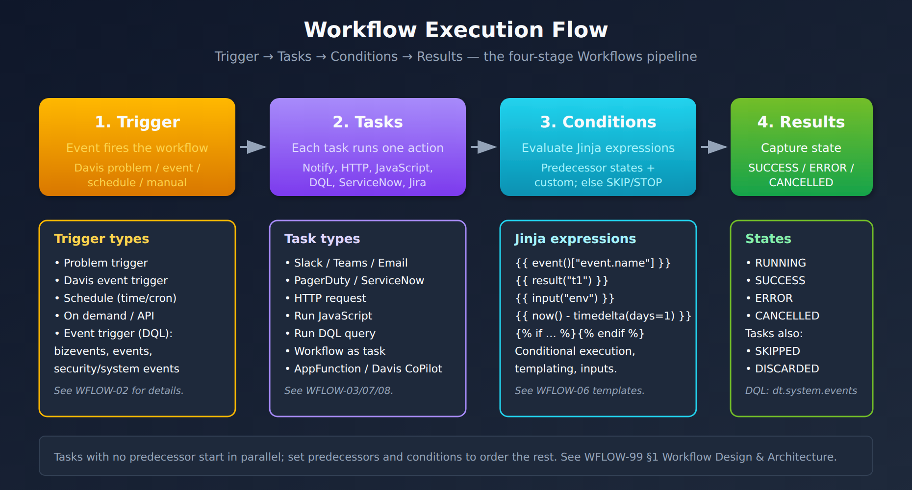

# WFLOW-01: Workflow Fundamentals

> **Series:** WFLOW — Workflows and Alert Notifications | **Notebook:** 1 of 10 | **Created:** January 2026 | **Last Updated:** 10/06/2026

## Introduction to Dynatrace Workflows
Dynatrace Workflows is the automation engine that enables event-driven automation, scheduled tasks, and integration orchestration. This notebook introduces core concepts, components, and your first workflow.

---

## Table of Contents

1. [What Are Workflows?](#what-are-workflows)
2. [Workflows vs Other Automation](#workflows-vs-other-automation)
3. [Workflow Components](#workflow-components)
4. [Accessing Workflows](#accessing-workflows)
5. [Execution Model](#execution-model)
6. [Your First Workflow](#your-first-workflow)
7. [Viewing Execution History](#viewing-execution-history)

---

## Prerequisites

| Requirement | Details |
|-------------|----------|
| **Dynatrace Environment** | SaaS with Platform subscription |
| **Permissions** | `app-engine:apps:run`, `automation:workflows:read`, `automation:workflows:write`, `automation:workflows:run`, `app-engine:functions:run`; for the §7 queries, `storage:system:read` and `storage:buckets:read` on `dt.system.events` (§4) |
| **Prior Knowledge** | Basic Dynatrace navigation |

<a id="what-are-workflows"></a>
## 1. What Are Workflows?
**Workflows** are automated sequences of tasks that execute in response to events, schedules, or manual triggers. They enable:

| Capability | Example |
|------------|----------|
| **Alert Notifications** | Send Slack/Teams messages when problems occur |
| **Incident Management** | Create PagerDuty/ServiceNow tickets automatically |
| **Auto-Remediation** | Restart pods, scale resources, run scripts |
| **Reporting** | Generate and email daily reports |
| **Integration** | Sync data with external systems |
| **Data Enrichment** | Query APIs and enrich events |

### Key Benefits

- **No Infrastructure** - Runs in Dynatrace, no external servers needed
- **Event-Driven** - Triggers on detected problems, Davis events, other Grail events, schedules
- **Low-Code + Code** - Visual builder with JavaScript option
- **Secure** - Built-in secrets management, RBAC, audit logs
- **Observable** - Execution history, metrics, debugging

<a id="workflows-vs-other-automation"></a>
## 2. Workflows vs Other Automation
Dynatrace offers multiple automation approaches. When should you use Workflows?

| Approach | Best For | Limitations |
|----------|----------|-------------|
| **Workflows** | Event-driven automation, notifications, integrations | Rate limits, execution time limits |
| **Alerting profiles + problem notifications** (Classic) | The profile filters problems; the problem notification delivers them (email, webhook, integrations) | One alerting profile per notification, no logic |
| **Apps (AppEngine)** | Custom UI, complex applications | Requires development expertise |
| **Extensions** | Data collection, custom metrics | Not for automation/notifications |
| **Site Reliability Guardian** | Release validation, SLO verification | Specific to deployment validation |

### Migration from Legacy Alerting

| Legacy Alerting | Workflow Equivalent |
|-----------------|---------------------|
| Problem notification → Email | Detected Problem trigger → Email task |
| Problem notification → Webhook | Detected Problem trigger → HTTP Request task |
| Custom integration | Detected Problem trigger → JavaScript + HTTP |

> **Recommendation:** New implementations should use Workflows. Alerting profiles are labeled **Dynatrace Classic** and Dynatrace recommends simple workflows for new setups — but no deprecation or end-of-life date has been published, so existing profiles keep working. The one real forcing function is Management Zones: the workflow Problem trigger has no management-zone filter, and Dynatrace's upgrade guidance states *"Management zones are not available in Latest Dynatrace. Replace management zone scoping with Grail record-based field filters."* A profile scoped by an MZ is rebuilt as a problem-triggered workflow scoped by affected-entity tags or a custom DQL matcher (WFLOW-02 §2; MZ2POL-01 §5).

<a id="workflow-components"></a>
## 3. Workflow Components
Every workflow consists of these components:

### 3.1 Trigger

What starts the workflow:

| Trigger Type | Starts When | Use Case |
|--------------|-------------|----------|
| **Detected Problem** | Dynatrace Intelligence detects a problem | Alert notifications |
| **Davis Event** | An anomaly detector raised a Davis event (per-alert, before grouping into a problem) | Per-alert automation |
| **Schedule** | A fixed time, a time interval, or a cron expression comes due | Daily reports |
| **On-Demand** | Manual execution or API call | Testing, ad-hoc runs |
| **Event Trigger** | Any event matching a DQL matcher (`events`, `bizevents`, `security.events`, `dt.system.events`) | Business process automation |

### 3.2 Tasks

Actions the workflow performs:

| Task Category | Examples |
|---------------|----------|
| **Notifications** | Slack, Teams, Email, PagerDuty |
| **Incident Management** | ServiceNow, Jira |
| **Data Queries** | DQL queries, entity lookups |
| **HTTP Requests** | REST API calls to any endpoint |
| **JavaScript** | Custom code execution |
| **Control Flow** | Wait, conditions, loops |

### 3.3 Conditions

Logic that controls task execution. Each task carries one `conditions` block: the states its predecessors must end in, an optional custom expression, and what to do when the condition is not met (`SKIP` or `STOP`):

```yaml
conditions:
  states:
    previous_task: OK        # SUCCESS, ERROR, ANY, OK or NOK
  custom: '{{ event()["event.category"] == "AVAILABILITY" }}'
  else: SKIP
```

### 3.4 Expressions

Dynamic values using Jinja2 syntax:

```
{{ event()["event.name"] }}      # Access trigger data (problem title)
{{ problem_link() }}             # Link to the problem (Problem trigger only)
{{ result("task_name") }}        # Previous task result — shape depends on task type; see WFLOW-08 §6
{{ input("environment") }}       # Workflow input
```

There is no `env` object in the expression language. Secrets belong in a **connection** or the **Credential Vault**, never in an expression (WFLOW-09 §2).

### 3.5 Workflow Types, Live vs. Draft, and the Actor

Three more concepts decide whether a workflow runs at all and what it costs.

**Simple or standard.** *"Simple workflows are limited to a single task, with reduced task options and a restricted set of available actions."* They cannot use Run JavaScript or Run workflow, and *"They carry no workflow hours cost."* Standard workflows support multiple tasks, branches, loops and JavaScript, and *"draw from your workflow hours quota."* Billing counts how long a standard workflow exists, not how often it runs: *"Workflow hours are the number of hours that a workflow has existed in your environment, measured since the point of its creation."* A one-destination notification is a good fit for a simple workflow; ALERT-03 covers the cost trade-off.

**Live or draft.** *"Triggers only start on live workflows."* Select **Deploy** to make the draft live. A draft can still be run by hand from the **Run** button, and *"Draft-only workflows do not directly consume workflow hours"*.

**Actor.** *"Every task executes under the actor's permissions, regardless of how the workflow was started."* By default the actor is the user who created or last updated the workflow, and event triggers only see events that user can read. For production workflows Dynatrace recommends a service user: *"We highly recommend using service users as actors for all workflows that are worked on collaboratively and serve a production grade use case."*

### Visual: Workflow Execution Flow



<!-- MARKDOWN_TABLE_ALTERNATIVE
| Stage | Description | Examples |
|-------|-------------|----------|
| Trigger | Event that starts workflow | Detected Problem, Schedule, On-Demand |
| Tasks | Actions to execute | Slack, HTTP, JavaScript, DQL |
| Conditions | Logic to control flow | Predecessor states, custom expression, else SKIP/STOP |
| Results | Capture output | SUCCESS, ERROR, CANCELLED |
For environments where SVG doesn't render
-->

<a id="accessing-workflows"></a>
## 4. Accessing Workflows
### Navigation

1. Open Dynatrace
2. Go to **Apps** in the left navigation
3. Search for and open **Workflows**

Or use the direct URL: `https://<your-environment>/ui/apps/dynatrace.automations/workflows`

### Required Permissions

| Permission | Allows |
|------------|--------|
| `app-engine:apps:run` | Open the Workflows app (list apps, read app bundles) |
| `automation:workflows:read` | View workflows |
| `storage:system:read` + `storage:buckets:read` (scoped to `dt.system.events`) | View execution history, including the §7 queries |
| `automation:workflows:write` | Create, edit, delete workflows (can be limited to `automation:workflow-type = "SIMPLE"`) |
| `automation:workflows:run` | Run workflows manually or via the API |
| `app-engine:functions:run` | Use the function executor (needed to write and execute workflows) |
| `automation:workflows:admin` | Workflow admin mode: all workflows and executions |

These grant access to workflows only: *"To successfully run workflow tasks, the actor might need additional permissions."* Each connector's setup page lists what its actions need (for example `email:emails:send` for Send email).

### Workflow Listing

The Workflows app has an **All workflows** tab and an **Executions** tab. A new workflow is private: *"By default, a workflow is only visible to the creator (workflow owner)."* The owner can make it public, or transfer ownership to another user or a group.

<a id="execution-model"></a>
## 5. Execution Model
Understanding how workflows execute is important for designing reliable automation.

### Execution Flow

```
Trigger fires
    ↓
Workflow instance created
    ↓
Tasks execute (sequential or parallel)
    ↓
Conditions evaluated at each step
    ↓
Results captured
    ↓
Execution complete (success/failure)
```

### Platform Limits

Two distinct timeouts apply to every workflow task — confusing them is one of the most common causes of "why did my task fail at exactly 2 minutes?":

| Limit | Default | Maximum | Scope |
|-------|---------|---------|-------|
| **Task timeout** | 60 minutes | 7 days | Wall-clock budget for the whole task, including retries and loops. Configured per task via the `timeout` field (in seconds). |
| **Dynatrace runtime timeout** | 120 seconds | — | Per-action execution budget inside the AutomationEngine runtime (applies to DQL queries and individual JavaScript/HTTP calls). Limits a single action and cannot be raised. A timed-out action fails; the task ends in `ERROR` unless **Retry on error** or a **Loop** runs further actions, and the task timeout bounds their total runtime. |
| **DQL `requestTimeoutMilliseconds`** | No default documented | — | The JavaScript SDK's `queryExecute()` parameter — how long the call waits for the result before returning a `requestToken` instead, in milliseconds. It does not stop the query; poll with `queryPoll()` to collect the result (WFLOW-08 §2). |

> **Why this matters.** Raising the task `timeout` does not help a DQL query that's hitting the 120-second runtime budget — you need to narrow the query window, pre-aggregate, or split the work. Conversely, an approval task waiting for a human pager-out doesn't need a runtime budget — it needs a long task timeout (`timeout: 1800` for 30 minutes, `timeout: 86400` for 24 hours).

Concrete handling: see **WFLOW-08 § Configuring Task Timeouts** for the YAML/JSON shape on `execute-dql-query`, `run-javascript`, and approval tasks.

**Other documented limits.**

- **Event-triggered executions:** *"Each workflow is limited to 1,000 event-triggered executions per hour."* Beyond that, executions are throttled (HTTP 429) for up to one hour. The two Dynatrace pages disagree about repeated breaches: the event-trigger reference says *"If it's exceeded three times within seven days, the trigger is automatically deactivated."*, while the upgrade guide says *"The trigger is not automatically deactivated when the limit is reached repeatedly."* Check the Workflows overview for throttled or deactivated triggers rather than relying on either.
- **Trigger filter size:** the matching expression compiled from all trigger fields is limited to 1,000 characters (WFLOW-02 §2).
- **Workflows per environment:** *"Environment limits are 10,000 workflows per customer environment and 100 per trial environment."*
- **Concurrent executions:** *"There can be as many executions of a workflow running at any given time as requested (within system capacity)."*
- **Input and result size:** *"The workflow default input size is limited to 10 MB."* The execution result has the same 10 MB limit.

Per-workflow task counts are not published. In community practice, keep workflows small (under ~20 tasks) and focused (one trigger → one outcome), and verify behavior under load in your own environment before designing around a specific number.

### Execution States

| State | Meaning |
|-------|----------|
| `RUNNING` | Currently executing |
| `SUCCESS` | Completed successfully |
| `ERROR` | A task failed or timed out — there is no separate `TIMED_OUT` state |
| `CANCELLED` | Manually cancelled |
| `SKIPPED` / `DISCARDED` | Task level only — the task's conditions were not met |

These are the values `dt.automation_engine.state` carries in `dt.system.events` (the queries in §7 read them); `FAILED`, `SUCCEEDED` and `TIMED_OUT` are not values.

<a id="your-first-workflow"></a>
## 6. Your First Workflow
Let's create a simple workflow that logs a message when manually triggered.

### Step 1: Create New Workflow

1. Open **Workflows** app
2. Click **+ Workflow**
3. Name it: `Hello World Workflow`

A new workflow starts as a **simple** workflow (shown in the upper-left corner of the editor), and simple workflows exclude Run JavaScript. Dynatrace's own pages differ here: the simple-workflow page excludes the action, while the Get started walkthrough adds it directly. If Run JavaScript is not offered in Step 3, unlock the full functionality, which makes this a standard workflow (§3.5). Leaving it as an undeployed draft keeps it out of workflow-hour billing; delete it when you are done.

### Step 2: Configure Trigger

1. Click the trigger box (top of canvas)
2. Select **On demand** trigger
3. This allows manual execution for testing

### Step 3: Add a Task

1. Click **+** below the trigger
2. Search for **Run JavaScript**
3. Add the following code:

```javascript
export default async function() {
  const now = new Date().toISOString();
  console.log(`Hello from Dynatrace Workflows at ${now}`);
  
  return {
    message: "Workflow executed successfully!",
    timestamp: now
  };
}
```

### Step 4: Save and Run

1. Click **Save**
2. Click **Run** (play button). *"The first time you run a workflow, you are prompted to authorize the automation service to run a workflow as your user."* Select **Allow and run**.
3. View execution results

Running from the editor works on a draft. Automatic triggers (Schedule, Problem, Event) start only once you select **Deploy** (§3.5).

### Expected Output

The task output should show:

```json
{
  "message": "Workflow executed successfully!",
  "timestamp": "2026-01-27T12:00:00.000Z"
}
```

<a id="viewing-execution-history"></a>
## 7. Viewing Execution History
Monitor your workflow executions using DQL queries.

```dql
// Recent workflow executions
// Data object corrected 08/12/2026. Workflow executions are NOT in `events`, and there is no
// `automation.task.execution` / `automation.workflow.execution` event type in any spelling — those
// filters matched nothing, silently, in 25 cells. AutomationEngine writes to `dt.system.events` with
// `event.kind == "WORKFLOW_EVENT"` (5.7M records / 30d here), split by `event.type`:
//   WORKFLOW_EXECUTION · TASK_EXECUTION · ACTION_EXECUTION · WORKFLOW_CREATED/UPDATED/DELETED
// Fields are the `dt.automation_engine.*` family:
//   .workflow.title / .workflow.id      (was workflow.name)
//   .task.name                          (was task.name)
//   .action.function / .action.app      (was task.type — e.g. run-javascript, send-email,
//                                        snow-search-incidents)
//   .state                              (was task.status / execution.status)
//                                        values RUNNING · SUCCESS · ERROR · DISCARDED · SKIPPED
//                                        — note "FAILED" is NOT a value; it is ERROR
//   .state.is_final                     true only on terminal records — filter on it, otherwise a
//                                        single execution is counted once as RUNNING and again as
//                                        SUCCESS/ERROR
//   .state_info                         (was task.error)  ·  duration (was task.duration)
// Enumerate with:
//   fetch dt.system.events, from:-24h | filter event.kind == "WORKFLOW_EVENT" | limit 1
fetch dt.system.events, from:-24h
| filter event.kind == "WORKFLOW_EVENT"
| filter event.type == "WORKFLOW_EXECUTION"
| filter dt.automation_engine.state.is_final == true
| fields timestamp, dt.automation_engine.workflow.title, dt.automation_engine.state, duration
| sort timestamp desc
| limit 25
```

```dql
// Workflow execution summary
// Data object corrected 08/12/2026. Workflow executions are NOT in `events`, and there is no
// `automation.task.execution` / `automation.workflow.execution` event type in any spelling — those
// filters matched nothing, silently, in 25 cells. AutomationEngine writes to `dt.system.events` with
// `event.kind == "WORKFLOW_EVENT"` (5.7M records / 30d here), split by `event.type`:
//   WORKFLOW_EXECUTION · TASK_EXECUTION · ACTION_EXECUTION · WORKFLOW_CREATED/UPDATED/DELETED
// Fields are the `dt.automation_engine.*` family:
//   .workflow.title / .workflow.id      (was workflow.name)
//   .task.name                          (was task.name)
//   .action.function / .action.app      (was task.type — e.g. run-javascript, send-email,
//                                        snow-search-incidents)
//   .state                              (was task.status / execution.status)
//                                        values RUNNING · SUCCESS · ERROR · DISCARDED · SKIPPED
//                                        — note "FAILED" is NOT a value; it is ERROR
//   .state.is_final                     true only on terminal records — filter on it, otherwise a
//                                        single execution is counted once as RUNNING and again as
//                                        SUCCESS/ERROR
//   .state_info                         (was task.error)  ·  duration (was task.duration)
// Enumerate with:
//   fetch dt.system.events, from:-24h | filter event.kind == "WORKFLOW_EVENT" | limit 1
fetch dt.system.events, from:-7d
| filter event.kind == "WORKFLOW_EVENT"
| filter event.type == "WORKFLOW_EXECUTION"
| filter dt.automation_engine.state.is_final == true
| summarize executions = count(), by:{dt.automation_engine.workflow.title, dt.automation_engine.state}
| sort executions desc
| limit 25
```

```dql
// Failed workflow executions
// Data object corrected 08/12/2026. Workflow executions are NOT in `events`, and there is no
// `automation.task.execution` / `automation.workflow.execution` event type in any spelling — those
// filters matched nothing, silently, in 25 cells. AutomationEngine writes to `dt.system.events` with
// `event.kind == "WORKFLOW_EVENT"` (5.7M records / 30d here), split by `event.type`:
//   WORKFLOW_EXECUTION · TASK_EXECUTION · ACTION_EXECUTION · WORKFLOW_CREATED/UPDATED/DELETED
// Fields are the `dt.automation_engine.*` family:
//   .workflow.title / .workflow.id      (was workflow.name)
//   .task.name                          (was task.name)
//   .action.function / .action.app      (was task.type — e.g. run-javascript, send-email,
//                                        snow-search-incidents)
//   .state                              (was task.status / execution.status)
//                                        values RUNNING · SUCCESS · ERROR · DISCARDED · SKIPPED
//                                        — note "FAILED" is NOT a value; it is ERROR
//   .state.is_final                     true only on terminal records — filter on it, otherwise a
//                                        single execution is counted once as RUNNING and again as
//                                        SUCCESS/ERROR
//   .state_info                         (was task.error)  ·  duration (was task.duration)
// Enumerate with:
//   fetch dt.system.events, from:-24h | filter event.kind == "WORKFLOW_EVENT" | limit 1
fetch dt.system.events, from:-24h
| filter event.kind == "WORKFLOW_EVENT"
| filter event.type == "WORKFLOW_EXECUTION"
| filter dt.automation_engine.state == "ERROR"
| fields timestamp, dt.automation_engine.workflow.title, dt.automation_engine.state_info
| sort timestamp desc
| limit 25
```

## Next Steps

Now that you understand workflow fundamentals, continue with:

### Recommended Path

1. **WFLOW-02: Triggers & Event Types** - Configure event-driven triggers
2. **WFLOW-03: Alert Notification Basics** - Send Slack, Teams, email alerts
3. **WFLOW-04: Advanced Notification Routing** - Conditional routing and escalation

### Key Takeaways

- Workflows automate responses to events, schedules, and manual triggers
- Components: Triggers → Tasks → Conditions → Results
- Use Workflows for notifications, integrations, and auto-remediation
- Monitor execution history via DQL queries

---

## Summary

In this notebook, you learned:

- What Dynatrace Workflows are and when to use them
- How workflows compare to other automation options
- Core workflow components (triggers, tasks, conditions)
- How to access and navigate the Workflows app
- The execution model and limits
- How to create your first workflow
- How to query execution history

---

## References

- [Workflows umbrella (DT docs)](https://docs.dynatrace.com/docs/analyze-explore-automate/workflows)
- [Workflow triggers (DT docs)](https://docs.dynatrace.com/docs/analyze-explore-automate/workflows/build/trigger)
- [Workflow actions (DT docs)](https://docs.dynatrace.com/docs/analyze-explore-automate/workflows/default-workflow-actions)
- [Workflow reference / Jinja expressions (DT docs)](https://docs.dynatrace.com/docs/analyze-explore-automate/workflows/reference)
- [Alerting and notifications umbrella (DT docs)](https://docs.dynatrace.com/docs/analyze-explore-automate/alerting-and-notifications)
- [Davis Problems app (DT docs)](https://docs.dynatrace.com/docs/dynatrace-intelligence/problems-app)
- [Workflows concepts (DT docs)](https://docs.dynatrace.com/docs/analyze-explore-automate/workflows/concepts)
- [Build workflows (DT docs)](https://docs.dynatrace.com/docs/analyze-explore-automate/workflows/build)
- [Create a simple workflow (DT docs)](https://docs.dynatrace.com/docs/analyze-explore-automate/workflows/build/simple-workflow)
- [Get started with Workflows (DT docs)](https://docs.dynatrace.com/docs/analyze-explore-automate/workflows/quickstart)
- [Manage workflow permissions (DT docs)](https://docs.dynatrace.com/docs/analyze-explore-automate/workflows/security)
- [Monitor workflow executions (DT docs)](https://docs.dynatrace.com/docs/analyze-explore-automate/workflows/running)
- [Automation Workflow consumption (DT docs)](https://docs.dynatrace.com/docs/license/capabilities/automation/automation)
- [Event triggers for workflows (DT docs)](https://docs.dynatrace.com/docs/analyze-explore-automate/workflows/build/trigger/event-trigger)
- [Upgrade guide — alerting and notifications (DT docs)](https://docs.dynatrace.com/docs/platform/upgrade/keep-problems-and-alerting-working/upgrade-guide-alert-notification)
- [Upgrade security notifications — management zones (DT docs)](https://docs.dynatrace.com/docs/platform/upgrade/best-practices/stage-09-team-based-global-alerting/upgrade-security-notifications)

---

<sub>*This notebook was AI-generated from community-submitted and publicly available sources. This notebook series is not officially supported by Dynatrace. Always verify information against official Dynatrace documentation.*</sub>
