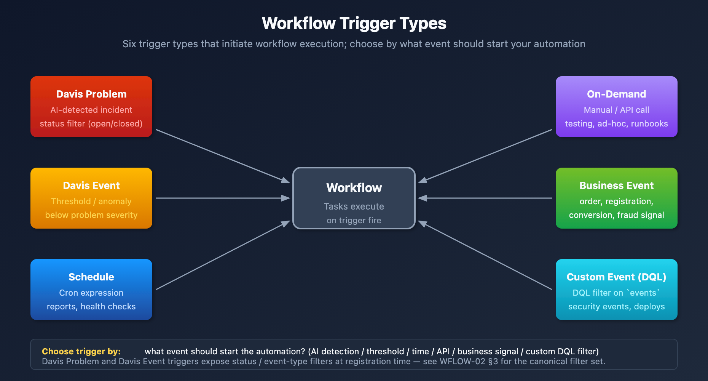
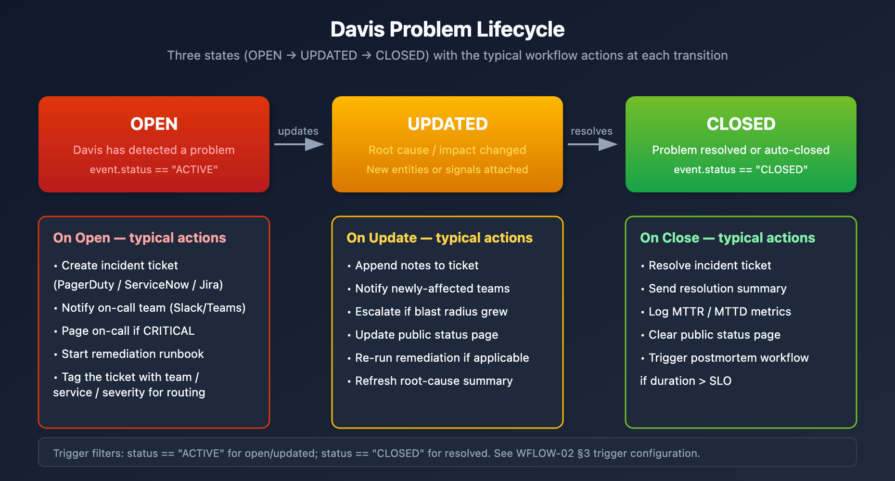

# WFLOW-02: Triggers & Event Types

> **Series:** WFLOW — Workflows and Alert Notifications | **Notebook:** 2 of 10 | **Created:** January 2026 | **Last Updated:** 09/24/2026

## Event-Driven Workflow Triggers
Triggers determine when workflows execute. This notebook covers all trigger types, detected problem events, Davis events, schedules, and custom event triggers.

---

## Table of Contents

1. [Detected Problem Trigger](#davis-problem-trigger)
2. [Davis Event Trigger](#davis-event-trigger-metrics)
3. [Schedule Trigger](#schedule-trigger)
4. [On-Demand Trigger](#on-demand-trigger)
5. [Event Trigger (Custom/Business Events)](#event-trigger-custombusiness-events)
6. [Trigger Data and Expressions](#trigger-data-and-expressions)
7. [Davis Problem Event Payload Reference](#davis-problem-payload-reference)

---

## Prerequisites

| Requirement | Details |
|-------------|----------|
| **Dynatrace Environment** | SaaS with Platform subscription |
| **Permissions** | `automation:workflows:write` |
| **Prior Knowledge** | **WFLOW-01: Workflow Fundamentals** |

## 1. Trigger Types Overview

| Trigger Type | Fires When | Primary Use Case |
|--------------|------------|------------------|
| **Detected Problem** | Dynatrace Intelligence detects/updates/closes a problem | Alert notifications, incident management |
| **Davis Event** | An anomaly detector raises a Davis event | Per-alert automation, before problem grouping |
| **Schedule** | Cron expression matches | Reports, health checks, cleanup jobs |
| **On-Demand** | Manual execution or API call | Testing, ad-hoc automation |
| **Event** | Business/custom event ingested | Business process automation |



<!-- MARKDOWN_TABLE_ALTERNATIVE
| Trigger | Source | Use Case |
|---------|--------|----------|
| Detected Problem | AI detects incident | Alert notifications |
| Davis Event | Anomaly detector alert | Per-alert automation |
| Schedule | Cron expression | Reports, health checks |
| On-Demand | Manual/API | Testing, ad-hoc |
| Event | Business event | Business automation |
For environments where SVG doesn't render
-->

### Choosing the Right Trigger

| Scenario | Recommended Trigger |
|----------|---------------------|
| "Notify when a service is slow" | Detected Problem |
| "Alert when CPU > 90% for 5 mins" | An anomaly detector for the threshold (ALERT-02), then Detected Problem |
| "Send weekly status report" | Schedule |
| "Process order completion events" | Event (bizevents) |
| "Test my workflow" | On-Demand |

<a id="davis-problem-trigger"></a>
## 2. Detected Problem Trigger
The most common trigger for alert notifications. Fires when Dynatrace Intelligence detects problems.

### Trigger Configuration

| Setting | Description | Example |
|---------|-------------|----------|
| **Problem state** | Active only, or active + closed | `Active` |
| **Categories** | Problem categories to include | Infrastructure, Application |
| **Severity** | The level at or above which problems start the workflow (see the SaaS 1.348 note in WFLOW-04 §3 before relying on it) | Any |
| **Affected entities — tags** | Tags the problem's affected entities must carry. Three modes: include all / all defined tags / any defined tag | `team:checkout` |
| **Additional custom filter query** | A DQL **matcher** on the incoming problem record (a subset of DQL — no aggregation, no querying across a set of events) | `maintenance.is_under_maintenance == false` |
| **Updates** | Re-trigger when selected fields change | Root cause changed |

> ⚠️ **There is no Management Zone filter on the problem trigger.** An earlier revision of this notebook listed one; that was wrong. Dynatrace's upgrade guide describes the replacement directly: *"A workflow's Problem trigger filters problems directly with DQL matchers on the problem. There is no separate filter object to create, name, and maintain, nor is there a one-management-zone-per-profile constraint."* The trigger's configuration (problem state, event category, severity, affected-entity tags, custom filter) has no Management Zone option ([Event triggers for workflows (DT docs)](https://docs.dynatrace.com/docs/analyze-explore-automate/workflows/build/trigger/event-trigger)). Scope the trigger with **affected-entity tags** plus the custom DQL matcher instead.
>
> This matters most if you are migrating off Management Zones: a workflow whose condition reads `event()["management_zones"]` keeps evaluating after the zones are deleted, but against an **empty array** — so every condition silently goes false and the workflow stops routing without erroring. See MZ2POL-01 §5 for the full MZ-job-to-successor mapping.

> **Validate the filter before you save it.** The trigger configuration offers **Query past events**, which estimates how many matching events occurred in your environment over recent windows. Use it on every non-trivial trigger.
>
> The result to distrust is **zero across every window in an environment you know is busy**. A trigger can be syntactically valid, save without error, and still never fire — nothing surfaces an error to tell you, because an over-constrained filter is not a malformed one. Check in particular that the **categories selected above and any category named in the custom filter query agree**: a matcher narrowing to a category you did not select leaves nothing that can ever match. Reading the estimate at authoring time costs seconds and is the only signal you get.

### Problem Event Data

The payload is the `dt.davis.problems` record. Run `fetch dt.davis.problems, from:-24h | limit 1` to see every field your templates can read. An abridged record (field names as returned by a live tenant, 09/24/2026):

```json
{
  "display_id": "P-260911127",
  "event.id": "-1001992832270454690_1790253360000V2",
  "event.name": "High response time on checkout service",
  "event.category": "SLOWDOWN",
  "event.status": "ACTIVE",
  "event.status_transition": "CREATED",
  "event.severity": "3",
  "event.start": "2026-09-24T12:37:00.000000000Z",
  "affected_entity_ids": ["SERVICE-ABC123"],
  "smartscape.affected_entities": [{"id": "SERVICE-ABC123", "name": "checkout", "type": "SERVICE"}],
  "entity_tags": ["team:checkout"],
  "maintenance.is_under_maintenance": false
}
```

There is no `title`, `status`, `problem_url` or `start_time` field. The link to the problem comes from the `{{ problem_link() }}` expression, not from the record. §7 has the full mapping.

### Problem Lifecycle Events

| Event | When | Typical Action |
|-------|------|----------------|
| Problem opened | New problem detected | Create incident, notify team |
| Problem updated | Root cause/impact changed | Update incident notes |
| Problem closed | Problem resolved | Close incident, send summary |



<!-- MARKDOWN_TABLE_ALTERNATIVE
| State | Description | Typical Workflow Actions |
|-------|-------------|--------------------------|
| OPENED | Problem detected (`event.status` ACTIVE) | Create ticket, notify team, page if critical |
| UPDATED | Root cause changed | Add notes, escalate if spreading |
| CLOSED | Problem resolved (`event.status` CLOSED) | Resolve ticket, send summary, log MTTR |
For environments where SVG doesn't render
-->

### Example: Filter Critical Production Problems

```yaml
trigger:
  type: davis-problem
  config:
    categories:
      - AVAILABILITY
      - PERFORMANCE
    entityTagsMatch: all
    entityTags:
      - key: env
        value: prod
```

<a id="davis-event-trigger-metrics"></a>
## 3. Davis Event Trigger
React to an individual Davis event, the alert an anomaly detector raises, rather than to the problem Dynatrace groups those alerts into.

> **This trigger does not evaluate a threshold.** Dynatrace documents it as *"Davis event trigger — Starts on individual alerts when anomalies are detected."* The threshold itself lives in an anomaly detector (**AIOPS-02**, **ALERT-02**); the trigger reacts to the Davis event that detector raises. An earlier revision of this notebook showed a trigger with its own DQL query and evaluation frequency. That trigger does not exist.

### When to Use

The upgrade guide's advice: *"Trigger on problems, not on Davis events. Dynatrace Intelligence groups related alerts into one problem. Triggering on raw events bypasses that grouping and floods the channel. Use the Davis event trigger only when you genuinely need per-alert granularity."* Typical cases:

- Automation on non-problem events, such as deployments, configuration changes and informational signals
- A per-alert action where the grouped problem is too coarse

### Configuration

| Setting | Description |
|---------|-------------|
| **Problem state** | active, active or closed, or closed |
| **Davis event name** | equals / contains a string |
| **Affected entities** | Filter by entity tags (all entities / all defined tags / any defined tag) |
| **Maintenance window** | Always, inside maintenance window only, or outside maintenance window only |
| **Additional custom filter query** | A DQL matcher over the Davis event record |

### Event Data

The payload is the `dt.davis.events` record. Run `fetch dt.davis.events, from:-24h | limit 1` to see its fields. Commonly used: `event.name`, `event.category`, `event.status`, `event.start`, `dt.source_entity`, `dt.smartscape_source.id`, `entity_tags`.

> <sub>**Sources:** [Event triggers for workflows (DT docs)](https://docs.dynatrace.com/docs/analyze-explore-automate/workflows/build/trigger/event-trigger), [Upgrade guide — alerting and notifications (DT docs)](https://docs.dynatrace.com/docs/platform/upgrade/keep-problems-and-alerting-working/upgrade-guide-alert-notification).</sub>

<a id="schedule-trigger"></a>
## 4. Schedule Trigger
Execute workflows on a recurring schedule using cron expressions.

### Cron Expression Format

```
┌───────────── minute (0-59)
│ ┌───────────── hour (0-23)
│ │ ┌───────────── day of month (1-31)
│ │ │ ┌───────────── month (1-12)
│ │ │ │ ┌───────────── day of week (0-6, Sun=0)
│ │ │ │ │
* * * * *
```

### Common Schedules

| Schedule | Cron Expression | Description |
|----------|-----------------|-------------|
| Every hour | `0 * * * *` | Top of every hour |
| Daily at 9 AM | `0 9 * * *` | Every day at 9:00 |
| Weekdays at 8 AM | `0 8 * * 1-5` | Mon-Fri at 8:00 |
| First of month | `0 0 1 * *` | 1st day, midnight |
| Every 15 minutes | `*/15 * * * *` | 0, 15, 30, 45 past |

### Example: Daily Health Check Report

```yaml
trigger:
  type: schedule
  config:
    cron: "0 9 * * 1-5"  # Weekdays at 9 AM
    timezone: "America/New_York"
```

### Schedule Best Practices

- **Avoid minute 0** - Many workflows run at :00, spread load
- **Use timezones** - Be explicit about timezone
- **Consider rate limits** - Don't schedule too frequently

<a id="on-demand-trigger"></a>
## 5. On-Demand Trigger
Manual execution for testing, ad-hoc runs, or API-triggered automation.

### Manual Execution

1. Open workflow in editor
2. Click **Run** button
3. Optionally provide input parameters
4. View execution results

### API Execution

Trigger workflows programmatically via API:

```bash
curl -X POST "https://<env>/platform/automation/v1/workflows/<id>/run" \
  -H "Authorization: Bearer <platform-token>" \
  -H "Content-Type: application/json" \
  -d '{"input": {"environment": "prod", "notify_slack": true}}'
```

The platform token needs the `automation:workflows:run` scope. Platform tokens use `Bearer`, not `Api-Token`: *"To use a platform token please provide the token in the Authorization header: Authorization: Bearer <platformtoken>"* ([Platform tokens (DT docs)](https://docs.dynatrace.com/docs/manage/identity-access-management/access-tokens-and-oauth-clients/platform-tokens)).

### Workflow Inputs

Values passed as `input` arrive as workflow inputs. *"The input is a merge of the default workflow inputs and the inputs provided at runtime."* Read them in tasks with `input()`:

```
{{ input('environment') }}
{{ input('notify_slack') }}
```

> <sub>**Sources:** [Monitor workflow executions (DT docs)](https://docs.dynatrace.com/docs/analyze-explore-automate/workflows/running) — the run endpoint's `input` and `params` attributes, [Jinja expressions for Workflows (DT docs)](https://docs.dynatrace.com/docs/analyze-explore-automate/workflows/reference) — `input()`.</sub>

<a id="event-trigger-custombusiness-events"></a>
## 6. Event Trigger (Custom/Business Events)
Trigger on business events or custom events ingested into Grail.

### Use Cases

- **Order completed** → Update inventory system
- **User registered** → Send welcome notification
- **Deployment finished** → Run validation tests
- **Custom alert** → External system integration

### Configuration

```yaml
trigger:
  type: event
  config:
    eventType: "com.company.order-completed"
    filterQuery: |
      event.type == "com.company.order-completed"
      AND order.total > 1000
```

### Sending Business Events

Ingest events via API:

```bash
curl -X POST "https://<env>/api/v2/bizevents/ingest" \
  -H "Authorization: Api-Token <token>" \
  -H "Content-Type: application/json" \
  -d '{
    "type": "com.company.order-completed",
    "data": {
      "order_id": "ORD-12345",
      "customer": "ACME Corp",
      "total": 1500.00
    }
  }'
```

### Event Data

Access event fields in tasks:

```
{{ event()["data"]["order_id"] }}
{{ event()["data"]["customer"] }}
{{ event()["data"]["total"] }}
```

### Business events never open problems

That is a feature of this trigger, not a gap. A record ingested through `/api/v2/bizevents/ingest` lands in Grail as a business event: queryable, and able to trigger a workflow exactly as shown above — but it never raises a Davis problem and never enters problem correlation. `dt.smartscape_source.id`, the correlation key that decides which Davis events merge into one problem (AIOPS-03 §1), is not part of this path and does not apply here.

**If what you actually want is a problem, this is the wrong API.** Custom *Davis* events go to `/api/v2/events/ingest` with an `entitySelector` naming the entity the signal is about. Omitting that selector is the classic mistake: the event associates with the environment entity rather than a real one — so instead of failing to merge, it merges with every other environment-scoped alert in the tenant into one problem that names nothing actionable. S2D-05 works through that failure in a scheduled-workflow context.

> <sub>**Sources:** [Ingest an event — POST /api/v2/events/ingest (DT docs)](https://docs.dynatrace.com/docs/dynatrace-api/environment-api/events-v2/post-event) — "If not set, the event is associated with the environment (`dt.entity.environment`) entity.", [Avoid overalerting (DT docs)](https://docs.dynatrace.com/docs/dynatrace-intelligence/use-cases/avoid-overalerting).</sub>

<a id="trigger-data-and-expressions"></a>
## 7. Trigger Data and Expressions
### Accessing Trigger Data

| Expression | Returns | Example |
|------------|---------|----------|
| `{{ event() }}` | Full event object | `{"event.name": "...", ...}` |
| `{{ event()["field"] }}` | Specific field | `"High response time"` |
| `{{ event().get("field", "default") }}` | Field with a fallback | `"n/a"` |
| `{{ execution() }}` | Current execution (id, state, started_at, workflow) | `{"state": "RUNNING", ...}` |
| `{{ input("name") }}` | A workflow input (on-demand / API runs) | `"prod"` |
| `{{ problem_link() }}` | URL of the problem (Problem trigger only) | `https://…/ui/apps/dynatrace.davis.problems/problem/…` |

There is no `trigger()` expression. Field names contain dots, so use bracket access: `event()["event.name"]`, not `event().event.name`.

### Common Event Fields by Trigger Type

**Detected Problem** (the `dt.davis.problems` record):
```
{{ event()["display_id"] }}           # P-260911127
{{ event()["event.id"] }}             # Problem ID ({PID} in Classic)
{{ event()["event.name"] }}           # Problem title
{{ event()["event.category"] }}       # AVAILABILITY, ERROR, SLOWDOWN, RESOURCE_CONTENTION, CUSTOM_ALERT, ...
{{ event()["event.status"] }}         # ACTIVE or CLOSED
{{ event()["event.severity"] }}       # 1-5 (1 = most severe); experimental, may be absent
{{ event()["event.start"] }}          # When the problem opened
{{ event()["affected_entity_ids"] }}  # Array of entity IDs
{{ event()["root_cause_entity_id"] }} # Root cause entity (when determined)
{{ event()["management_zones"] }}     # Array of MZ names (legacy — empty once MZs are retired; do not route on this)
{{ problem_link() }}                  # Link to problem
```

**Davis Event:** the `dt.davis.events` record — `event.name`, `event.category`, `event.status`, `event.start`, `dt.source_entity` (see §3).

**Schedule:** no event payload. Use `{{ execution().started_at }}` or `{{ now() }}`.

### Classic placeholder and old-template mapping

Templates written for Dynatrace Classic, and earlier revisions of this series, read fields the problem record does not have. Depending on how a missing field is read, the task fails with *Undefined variables* (bracket access) or the value is empty and every comparison is false (`.get()` with a default) — the second is silent. Use this mapping:

| Replace | With | Note |
|---|---|---|
| `event()["title"]` | `event()["event.name"]` | `{ProblemTitle}` |
| `event()["status"]` | `event()["event.status"]` | Values `ACTIVE` / `CLOSED`, never `OPEN` |
| `event()["start_time"]`, `event()["end_time"]` | `event()["event.start"]`, `event()["event.end"]` | `{startTime}`, `{endTime}` |
| `event()["problem_url"]` | `{{ problem_link() }}` | `{ProblemURL}`; Problem trigger only |
| `event()["problem_id"]` | `event()["event.id"]` | `{PID}` |
| `event()["severity"] == "CRITICAL"` | `event()["event.category"] == "AVAILABILITY"` (kind of problem), or `(event().get("event.severity") \| int(5)) <= 2` (1–5 scale) | `event.severity` is `experimental`; see WFLOW-04 §3 |

> <sub>**Sources:** [Jinja expressions for Workflows (DT docs)](https://docs.dynatrace.com/docs/analyze-explore-automate/workflows/reference) — the expression list (`event()`, `execution()`, `input()`, `problem_link()`). [Upgrade guide — alerting and notifications (DT docs)](https://docs.dynatrace.com/docs/platform/upgrade/keep-problems-and-alerting-working/upgrade-guide-alert-notification) — the placeholder-to-field mapping; `{ProblemURL}` → `{{ problem_link() }}`: *"Evaluates only in workflows with a Davis problem trigger"*. **Dictionary:** `event.name`, `event.status`, `event.category` (`stable`), `event.severity` (`experimental`), read 09/24/2026.</sub>

<a id="davis-problem-payload-reference"></a>
## 8. Davis Problem Event Payload Reference

> **Rewritten 09/24/2026 from `fetch dt.davis.problems` on a live tenant and the upgrade guide's placeholder mapping.** The previous revision of this table listed `title`, `problem_id`, `status`, `start_time`, `impacted_entities` and `problem_url` as always present. None of them is on the problem record. Payload fields can change between releases: re-run `fetch dt.davis.problems, from:-24h | limit 1` before building routing on an uncommon field.

Workflows on a Detected Problem trigger receive one `event` object: the `dt.davis.problems` record at the moment the trigger fired. Sections 2 and 7 show common access patterns; this section is the reference: the fields you can rely on, when they appear, how they join to DQL, and which downstream notebooks consume them.

### 8.1. Top-Level Field Reference

| Field | Type | Present | Notes |
|-------|------|---------|-------|
| `event.kind` | string | Always | `"DAVIS_PROBLEM"` for this trigger. Distinguishes from `DAVIS_EVENT` (raw signals). |
| `display_id` | string | Always | Human-facing problem ID (`"P-260911127"`). Use in notifications and ticket subjects. |
| `event.id` | string | Always | Problem ID (`{PID}` in Classic). Use to **join to `fetch dt.davis.problems`** (see §8.3). |
| `event.name` | string | Always | Problem title (`{ProblemTitle}`). |
| `event.category` | string | Always | `AVAILABILITY`, `ERROR`, `SLOWDOWN`, `RESOURCE_CONTENTION`, `CUSTOM_ALERT`, `MONITORING_UNAVAILABLE`, `INFO`. `{ProblemSeverity}` maps here. |
| `event.status` | string | Always | `ACTIVE` or `CLOSED`. The documented open/close discriminator. |
| `event.status_transition` | string | Always | `CREATED`, `UPDATED`, `REFRESHED`, `RESOLVED`, `CLOSED`. `experimental` in the dictionary. |
| `event.severity` | 1–5 | Usually | 1 = most severe, 5 = least. `experimental`. Arrives as a string (`"3"`) on the validation tenant, so convert with `\| int`. No longer defaulted from SaaS 1.348 (WFLOW-04 §3). |
| `event.start` | timestamp | Always | When the problem opened (`{startTime}`). |
| `event.end` | timestamp | Closed only | When the problem closed (`{endTime}`). |
| `event.description` | string | Usually | Markdown problem details (`{ProblemDetailsText}`). |
| `affected_entity_ids` | string[] | Always | Classic entity IDs. Deprecated in favor of `smartscape.affected_entities`. |
| `smartscape.affected_entities` | record[] | Usually | Each element has `id`, `type`, `name` — the entity *name* without an extra lookup. |
| `affected_entity_types` | string[] | Always | Entity types touched by this problem. Useful for routing without enumerating IDs. |
| `root_cause_entity_id` | string | When determined | Deprecated in favor of `root_cause.smartscape_entity`. Often empty early in the lifecycle. |
| `entity_tags` | string[] | When tagged | `key:value` strings (`"team:checkout"`), not objects. Deprecated in favor of `primary_tags.*`. |
| `primary_tags.*` | string | When enriched | Primary Grail tags propagated from the alerting events. |
| `dt.davis.event_ids` | string[] | Always | The Davis events grouped into this problem. |
| `maintenance.is_under_maintenance` | boolean | Always | Whether the problem falls in a maintenance window. |
| `dt.duration_marker` | string | Usually | Stepped open-duration marker used by the trigger's Minimum duration option. |
| `resolved_problem_duration` | duration (ns) | Closed only | Final duration once resolved. |

There is no `problem_url` field. Use the `{{ problem_link() }}` expression.

> <sub>**Sources:** [Event triggers for workflows (DT docs)](https://docs.dynatrace.com/docs/analyze-explore-automate/workflows/build/trigger/event-trigger) — *"To browse past occurrences, explore available fields, and test filter conditions before configuring the trigger, run this query in a notebook"*. [Upgrade guide — alerting and notifications (DT docs)](https://docs.dynatrace.com/docs/platform/upgrade/keep-problems-and-alerting-working/upgrade-guide-alert-notification) — the placeholder mapping and the deprecations: *"root_cause_entity_id and root_cause_entity_name are deprecated in favor of root_cause.smartscape_entity, and affected_entity_ids in favor of smartscape.affected_entities."* **Dictionary:** `event.name`, `event.status`, `event.category` (`stable`), `event.severity`, `event.status_transition` (`experimental`), read 09/24/2026. **Derived:** the *Present* column comes from a 7-day field-presence count on the validation tenant (09/24/2026).</sub>

**Where the entity fields come from.** `affected_entity_ids`, `root_cause_entity_id`, and `smartscape.affected_entities` are populated from the Davis events Dynatrace grouped into this problem, and that grouping runs on `dt.smartscape_source.id` — the Smartscape entity ID an event carries when it is properly attributed (84.9% of Davis events on a validation tenant over 7 days, 08/11/2026). Events naming the same entity within the correlation window merge into the single problem this payload describes.

That has a direct consequence for anyone reading these fields in a workflow: a problem assembled from **mis-attributed** events arrives with those fields populated by the *environment* entity rather than the thing that broke, so routing that branches on `affected_entity_types`, `entity_tags`, or `root_cause_entity_id` silently falls through to its default — the environment entity carries none of the team or service tags the routing expects. If a workflow keeps landing on the fallback branch, suspect the upstream detector's event template before rewriting the routing logic. Note the accompanying symptom is over-merge, not a problem-count spike: an event template that leaves `dt.smartscape_source.id` unset makes every such alert name the same entity, so they collapse into one implausibly broad problem. AIOPS-03 §1 covers the correlation rules, AIOPS-02 §8 finds unattributed detectors in your own tenant, and ALERT-99 §3 explains which Davis data object to count when you audit.

> <sub>**Sources:** [Avoid overalerting (DT docs)](https://docs.dynatrace.com/docs/dynatrace-intelligence/use-cases/avoid-overalerting).</sub>

### 8.2. Lifecycle Field Presence

With **Problem state** set to *active or closed*, a single workflow fires when the problem opens and again when it closes (and on field changes, if **Updates** is enabled). The payload differs between the two, so guard logic that assumes every field is populated will mis-route close events.

| Field | `event.status` = `ACTIVE` | `event.status` = `CLOSED` |
|-------|---------|---------|
| `display_id`, `event.id`, `event.name`, `event.category` | ✓ | ✓ |
| `event.start` | ✓ | ✓ |
| `event.end`, `resolved_problem_duration` | — | ✓ |
| `root_cause_entity_id` | sometimes empty | populated when determined |
| `affected_entity_ids`, `smartscape.affected_entities` | initial set, may expand | final set |

`event.status_transition` has five values (`CREATED`, `UPDATED`, `REFRESHED`, `RESOLVED`, `CLOSED`), and a close record can carry `RESOLVED` or `UPDATED` rather than `CLOSED`. Branch on `event.status`, which the upgrade guide uses for the close notification (*"build a second workflow filtering event.status == "CLOSED""*), then read only the fields present for that branch.

### 8.3. Joining the Payload to DQL

The workflow payload is a snapshot. For longer-window analysis (problem history, MTTR, fleet-wide patterns), join the payload's `event.id` to the canonical Grail table:

```dql
// Hydrate the workflow payload against the full Davis problems record.
// Substitute {{ event()["event.id"] }} via a DQL workflow task.
fetch dt.davis.problems, from:-7d
| filter event.id == "{{ event()['event.id'] }}"
| fields display_id,
         event.name,
         event.category,
         event.status,
         event.start,
         event.end,
         smartscape.affected_entities,
         affected_entity_ids,
         root_cause_entity_id
| limit 1
```

**Why `dt.davis.problems` and not `dt.davis.events`:** `dt.davis.problems` is the canonical problems data object; `dt.davis.events` carries only `DAVIS_EVENT` records (raw signals that *feed* problem detection, not the problems themselves). Querying `dt.davis.events` for problem records returns zero rows on modern tenants.

For aggregate views (e.g., "all problems for the same entity this week") swap the filter:

```dql
fetch dt.davis.problems, from:-7d
| filter in("{{ event()['affected_entity_ids'][0] }}", affected_entity_ids)
| summarize problem_count = count(), by:{event.category, event.status}
| sort problem_count desc
```

### 8.4. Common Access Patterns

```jinja
# Display ID and link — every notification
{{ event()["display_id"] }}
{{ problem_link() }}

# Category-based routing (see WFLOW-04 §3 for severity tiers)
 page on-call
        notify channel
                                              log only


# Lifecycle branch — distinguishes open from close in the same workflow
 close ticket
                                   create/update ticket


# Custom-tag access (entity_tags is an array of "key:value" strings)

  {{ tag.split(":", 1)[1] }}


# Entity-type filtering — route by what kind of entity is involved
 service-team channel
   infra channel


# Affected entity names (no extra lookup — smartscape.affected_entities carries names)

  {{ ent["name"] }} ({{ ent["type"] }})

```

### 8.5. Cross-References

- **WFLOW-04 §3 *Routing by Severity*** consumes `event.severity` and `event.category` from this payload to fan notifications out to team channels.
- **WFLOW-04 §4 *Routing by Team/Service*** reads entity tags (custom tags like `team:checkout`) and `affected_entity_types`.
- **WFLOW-05 *Incident Management*** uses `display_id`, `{{ problem_link() }}`, `event.status`, and `event.start` to create and update tickets through the lifecycle.
- **WFLOW-07 *Remediation*** branches on `root_cause_entity_id` and `event.name` to pick the right runbook task, and joins `event.id` to `dt.davis.problems` for richer context before acting.

### 8.6. Caveats

- **Old field names fail, sometimes silently.** A template that reads `title`, `status`, `problem_url` or `start_time` either errors (*Undefined variables*) or, when read through `.get()`, prints nothing and compares false. If a task errors on a template, or a notification arrives with blank fields, check the field names against §7's mapping first.
- **Re-verify before load-bearing logic.** This reference is dated 09/24/2026. The payload is product surface and can change in a sprint. Spot-check a real payload (a logging task, or `fetch dt.davis.problems, from:-24h | limit 1`) in your tenant before relying on a field in production routing.

### Query Detected Problems

```dql
// Recent detected problems that could trigger workflows
// Field names corrected 09/24/2026: `severity` / `status` are not the problem fields; the trigger
// payload uses `event.category` and `event.status` (ACTIVE / CLOSED).
fetch events, from: now() - 24h
| filter event.kind == "DAVIS_PROBLEM"
| fields timestamp, 
         display_id,
         event.name,
         event.category,
         event.status,
         affected_entity_ids,
         root_cause_entity_id
| sort timestamp desc
| limit 20
```

```dql
// Distinct problems by category that were ACTIVE at any point in the last 7 days
// Counted with countDistinctExact(display_id) since 09/24/2026: `events` holds one record per
// problem update, so count() over-reported problems 4-35x on the validation tenant.
// Field names corrected 08/12/2026: on `events`, a Davis problem carries `event.status` and
// `event.category` — there are no bare `status` / `severity` fields, so those filters matched
// nothing. `event.status` values are ACTIVE / CLOSED — "OPEN" is not one of them.
fetch events, from:-7d
| filter event.kind == "DAVIS_PROBLEM"
| filter event.status == "ACTIVE"
| summarize problem_count = countDistinctExact(display_id), by:{event.category}
| sort problem_count desc
```

```dql
// Business events that could trigger workflows
fetch bizevents, from: now() - 24h
| summarize event_count = count(), by:{event.type}
| sort event_count desc
| limit 20
```

## Next Steps

Now that you understand triggers, learn to send notifications:

### Recommended Path

1. **WFLOW-03: Alert Notification Basics** - Slack, Teams, email notifications
2. **WFLOW-04: Advanced Notification Routing** - Conditional routing
3. **WFLOW-07: Problem-Triggered Remediation** - Auto-remediation patterns

### Key Takeaways

- **Detected Problem** triggers for AI-detected incidents
- **Davis Event** triggers for per-alert reactions to anomaly detectors (thresholds live in the detector)
- **Schedule** triggers for recurring tasks
- **On-Demand** triggers for testing and API integration
- **Event** triggers for business events
- Use expressions like `{{ event()["field"] }}` to access data

---

## Summary

In this notebook, you learned:

- All five trigger types and when to use each
- How to configure Detected Problem triggers with filters
- When to use a Davis event trigger instead of a Problem trigger
- Cron expressions for schedule triggers
- On-demand execution via UI and API
- Business event triggers for custom automation
- How to access trigger data in expressions

---

## References

- [Workflow triggers (DT docs)](https://docs.dynatrace.com/docs/analyze-explore-automate/workflows/build/trigger)
- [Workflow reference / Jinja expressions (DT docs)](https://docs.dynatrace.com/docs/analyze-explore-automate/workflows/reference)
- [Davis Problems app (DT docs)](https://docs.dynatrace.com/docs/dynatrace-intelligence/problems-app)
- [Business Observability umbrella (DT docs)](https://docs.dynatrace.com/docs/observe/business-observability)
- [Workflows umbrella (DT docs)](https://docs.dynatrace.com/docs/analyze-explore-automate/workflows)
- [Cron expression sandbox (crontab.guru)](https://crontab.guru/)
- [Upgrade guide — alerting and notifications (DT docs)](https://docs.dynatrace.com/docs/platform/upgrade/keep-problems-and-alerting-working/upgrade-guide-alert-notification)

---

<sub>*This notebook was AI-generated from community-submitted and publicly available sources. This notebook series is not officially supported by Dynatrace. Always verify information against official Dynatrace documentation.*</sub>
