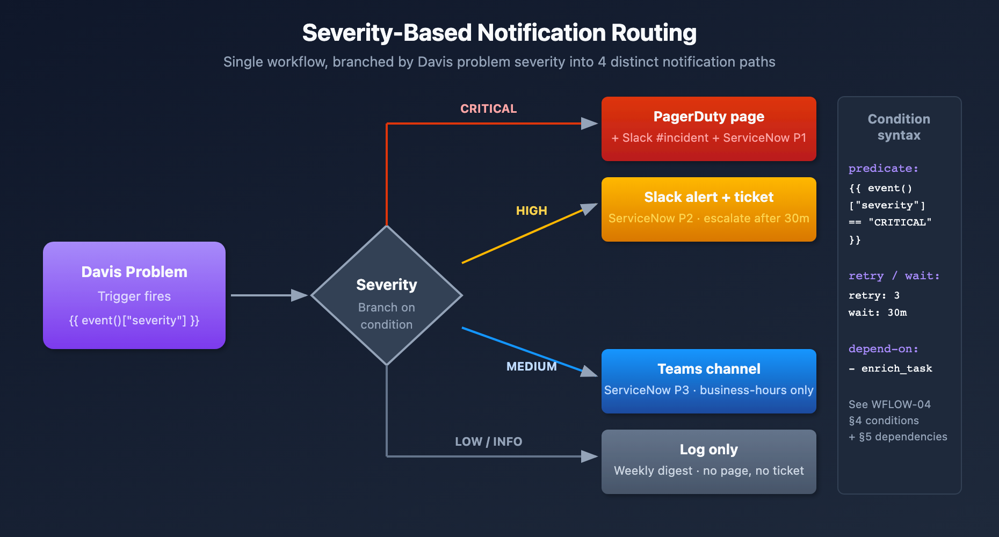

# WFLOW-04: Advanced Notification Routing

> **Series:** WFLOW — Workflows and Alert Notifications | **Notebook:** 4 of 10 | **Created:** January 2026 | **Last Updated:** 09/24/2026

## Intelligent Alert Routing
Not all alerts should go to everyone. This notebook covers conditional routing based on severity, team ownership, time of day, and escalation patterns.

---

## Table of Contents

1. [Routing Strategies](#routing-strategies)
2. [Conditional Expressions](#conditional-expressions)
3. [Routing by Severity](#routing-by-severity)
4. [Routing by Team/Service](#routing-by-teamservice)
5. [Time-Based Routing](#time-based-routing)
6. [Escalation Patterns](#escalation-patterns)
7. [Multi-Channel Strategy](#multi-channel-strategy)

---

## Prerequisites

| Requirement | Details |
|-------------|----------|
| **Dynatrace Environment** | SaaS with Platform subscription |
| **Permissions** | `automation:workflows:write` |
| **Prior Knowledge** | **WFLOW-01** through **WFLOW-03** |
| **Connections** | Slack and/or Teams connections configured |

### Sprint 1.337 (April 2026): Smartscape Ownership for Routing

SaaS 1.337 made ownership available on Smartscape nodes, for use from **Workflows actions**: *"Ownership information is now available in Smartscape and for Smartscape nodes. This lets you use Workflows actions (such as get_owners) to send automated and targeted notifications to your teams"* ([What's new in SaaS 1.337 (DT docs)](https://docs.dynatrace.com/docs/whats-new/saas/sprint-337)). It is not a DQL field. An earlier revision of this notebook read `getNodeField(affected_entity_ids[0], "ownership.team")`; that returns null on every problem, because no Smartscape node model has an `ownership.*` field and `getNodeField` does not resolve a classic entity ID.

Two documented routes:

- **Route on ownership with the Ownership app's *Get owners* action.** Add a *Get owners* task after the Problem trigger. Its *Entity ids* input takes *"A Jinja expression, for example, `{{ event()["dt.entity.host"] }}`"*; its output carries `slackChannels`, `msTeams`, `email` and `jira` contact lists per team ([Actions for Ownership (DT docs)](https://docs.dynatrace.com/docs/deliver/ownership/ownership-app/ownership-actions)). Feed those into the notification task (for example `{{ result("get_owners").slackChannels }}`) instead of hard-coding team names in the workflow.
- **Or route on `primary_tags.team`** in the trigger's custom filter or a task condition. *"Dynatrace enriches all derived signals (service metrics, Davis events, and problems) with the same tags."* ([Primary Grail fields and tags (DT docs)](https://docs.dynatrace.com/docs/manage/tags/primary-tags)). The matcher is `primary_tags.team == "payments"`. Verify your entities carry the tag first: on the validation tenant `primary_tags.team` was null on every problem (09/24/2026).

**FAQ-21 §5** covers ownership coverage and the Problem fields mapping in depth.

### Sprint 1.337 (Dynatrace API): `metadata` removed from `GET /events`

The Events API endpoint `GET /events` no longer returns the `metadata` property in event query results or individual event responses. Workflows that triggered off `dt.davis.events` and parsed event-level `metadata` for additional context need to reach into `event.*` semantic fields directly. Update any HTTP-action JSON parsing to drop the `metadata` field reference.

---

<a id="routing-strategies"></a>
## 1. Routing Strategies

> ⚠️ **Migrating from alerting profiles? Duration suppression maps onto the trigger's Minimum duration option.** An alerting profile can delay notification until a problem has been open longer than *N* minutes (`delayInMinutes`) — a common way to suppress transient blips. The problem trigger's **Minimum duration** option (renamed from **Delay** in 08/2026) postpones *"the trigger until the problem has been open for at least the configured duration"* — 5, 10, 15, 30, 60, 120, 240, 1440, or 10080 minutes, evaluated on `dt.duration_marker` ([Problem and event triggers (DT docs)](https://docs.dynatrace.com/docs/analyze-explore-automate/workflows/build/trigger/event-trigger)). Since its 09/07/2026 rewrite the [alert-notification upgrade guide (DT docs)](https://docs.dynatrace.com/docs/platform/upgrade/keep-problems-and-alerting-working/upgrade-guide-alert-notification) agrees: *"The delay, update, and severity capabilities described in this guide exist only on the workflow trigger."* Earlier versions of that guide said there was no alternative; that line is gone.
>
> The values are fixed, so a delay that is not one of those nine has to be rounded — up suppresses a little more, down pages a little sooner. Treat a long delay as evidence the alert was the wrong *shape* rather than merely delayed: a profile suppressing 30 minutes of a firing condition is usually describing a burn-rate concern, which belongs in an SLO burn-rate alert (**SLO-04**) or a Davis anomaly detector (**AIOPS-02**). Inventory `delayInMinutes` across every profile and choose a Minimum duration for each; no special migration wave is needed. See **MZ2POL-09** §6.1.
### Why Route Alerts?

| Problem | Impact | Solution |
|---------|--------|----------|
| Alert fatigue | Teams ignore alerts | Route only relevant alerts |
| Slow response | Wrong team notified | Route to owners |
| Off-hours noise | Sleep disruption | Time-based routing |
| Missed escalation | Unacknowledged alerts | Auto-escalation |

### Routing Dimensions

| Dimension | Route Based On | Example |
|-----------|----------------|----------|
| **Severity** | Problem severity level | Critical → PagerDuty, Low → Slack |
| **Team** | Entity tags, or Smartscape ownership | `team:checkout` → #checkout-alerts |
| **Service** | Service name or entity ID | Payment service → payments team |
| **Time** | Hour of day, day of week | Weekends → on-call only |
| **Environment** | prod/staging/dev tags | Prod → immediate, Dev → daily digest |

<a id="conditional-expressions"></a>
## 2. Conditional Expressions
Conditions control which tasks execute. They use Jinja expressions returning boolean values.

### Defining Conditions

```yaml
conditions:
  - name: is_critical
    expression: '{{ (event().get("event.severity") | int(5)) <= 1 }}'
    
  - name: is_production
    expression: '{{ "prod" in event()["management_zones"] }}'
    
  - name: is_checkout_team
    expression: '{{ "team:checkout" in event().get("tags", []) }}'
```

### Using Conditions on Tasks

```yaml
tasks:
  - name: pagerduty_alert
    type: dynatrace.pagerduty:create-incident
    conditions:
      - is_critical
      - is_production
    # Task runs only if BOTH conditions are true (AND logic)
```

### Negating Conditions

```yaml
tasks:
  - name: slack_only_for_non_critical
    type: dynatrace.slack:message
    conditions:
      - not is_critical
    # Task runs when is_critical is FALSE
```

### Complex Expressions

```jinja
# AND within expression
{{ (event().get("event.severity") | int(5)) <= 1 and "prod" in event()["management_zones"] }}

# OR within expression
{{ (event().get("event.severity") | int(5)) <= 2 }}

# Check if field exists
{{ event().get("root_cause_entity_id") is not none }}
```

<a id="routing-by-severity"></a>
## 3. Routing by Severity
### Severity-Based Routing Pattern

The problem record carries severity as `event.severity`, a 1–5 scale (1 = most severe). There is no `CRITICAL`/`HIGH`/`MEDIUM`/`LOW` string on it, so conditions comparing against those strings are false for every problem. The tiers below use the scale:

| `event.severity` | Actions |
|----------|----------|
| **1 (Critical)** | PagerDuty + Slack #urgent + Email |
| **2 (High)** | Slack #alerts + Email |
| **3 (Medium)** | Slack #alerts |
| **4 (Low)** | Slack #alerts (business hours only) |

> **Breaking — SaaS 1.348 (pre-release; staged tenant rollout planned from 09/22/2026): severity is no longer defaulted.** *"Davis events and problems no longer default `event.severity` to `3`."* A severity filter that was matching the default stops matching once 1.348 reaches your tenant: *"Workflows with a Davis event/problem trigger that filter on `event.severity=3` expecting it to be defaulted, might need to be changed to filter for `Any` severity to keep the alerts."* Before relying on severity tiers, check which event sources actually **set** a severity (on the validation tenant, every problem in 30 days carried the default `3` bar one). For sources that do not, route on `event.category`, ownership or tags instead, or restore a default with a Davis event OpenPipeline processor. Until 1.348 reaches your tenant, the defaulting behavior still applies and the conditions below keep working. The `int(5)` in them treats a missing severity as the least severe tier, so an unset severity never pages. **FAQ-21 §6** carries the same note.
>
> <sub>**Sources:** [What's new in Dynatrace SaaS 1.348 (DT docs)](https://docs.dynatrace.com/docs/whats-new/saas/sprint-348) — pre-release, read 09/24/2026. **Dictionary:** `event.severity` (`experimental`), read 09/24/2026.</sub>



<!-- MARKDOWN_TABLE_ALTERNATIVE
| Severity | Channel | Action |
|----------|---------|--------|
| 1 (Critical) | PagerDuty + Slack #urgent | Page on-call, ServiceNow P1 |
| 2 (High) | Slack + ServiceNow P2 | Escalate in 30m |
| 3 (Medium) | Teams + ServiceNow P3 | Business hours only |
| 4 (Low) | Log only | Weekly digest |
For environments where SVG doesn't render
-->

### Workflow Configuration

```yaml
conditions:
  - name: is_critical
    expression: '{{ (event().get("event.severity") | int(5)) <= 1 }}'
  - name: is_high
    expression: '{{ (event().get("event.severity") | int(5)) == 2 }}'
  - name: is_medium_or_low
    expression: '{{ (event().get("event.severity") | int(5)) in [3, 4] }}'

tasks:
  # CRITICAL: Page on-call + Slack urgent + Email
  - name: pagerduty_critical
    type: dynatrace.pagerduty:create-incident
    conditions: [is_critical]
    input:
      connection: pagerduty-prod
      severity: critical
      summary: "{{ event()['event.name'] }}"

  - name: slack_urgent
    type: dynatrace.slack:message
    conditions: [is_critical]
    input:
      connection: slack-production
      channel: "#alerts-urgent"
      message: ":rotating_light: *CRITICAL* {{ event()['event.name'] }}"

  # HIGH: Slack alerts + Email
  - name: slack_high
    type: dynatrace.slack:message
    conditions: [is_high]
    input:
      channel: "#alerts-production"
      message: ":warning: *HIGH* {{ event()['event.name'] }}"

  # MEDIUM/LOW: Slack only
  - name: slack_low
    type: dynatrace.slack:message
    conditions: [is_medium_or_low]
    input:
      channel: "#alerts-production"
      message: ":information_source: *{{ event()['event.category'] }}* {{ event()['event.name'] }}"
```

> **Update — unified `event.severity` field (2026).** Dynatrace now exposes a standardized **`event.severity`** value as an **integer 1–5** (1=Critical, 2=High, 3=Medium, 4=Low, 5=Informational), aligned to the ITIL severity model. It propagates from the constituent alerts up to the parent problem, which makes severity a first-class, consistent routing dimension across alerts, the problem feed, and Workflows.
>
> | Integer | Tier |
> |---------|------|
> | 1 | Critical |
> | 2 | High |
> | 3 | Medium |
> | 4 | Low |
> | 5 | Informational |
>
> **The conditions in this section key on this numeric field.** Earlier revisions compared against `"CRITICAL"` / `"HIGH"` / `"MEDIUM"` / `"LOW"`; the problem record carries no such strings, so those conditions were false for every problem. The field is `experimental` in the semantic dictionary and arrives as a string (`"3"`) on the validation tenant, hence the `| int` conversion. In DQL (problem feed, reporting) the field is queried directly as `event.severity` — see **AIOPS-03 §5** for the severity rollup pattern.

<a id="routing-by-teamservice"></a>
## 4. Routing by Team/Service
### Tag-Based Team Routing

Entities tagged with `team:checkout`, `team:payments`, etc.

```yaml
conditions:
  - name: is_checkout_team
    expression: |
      
      {{ "team:checkout" in tags or "team:cart" in tags }}

  - name: is_payments_team
    expression: '{{ "team:payments" in event().get("tags", []) }}'

  - name: is_platform_team
    expression: '{{ "team:platform" in event().get("tags", []) }}'

tasks:
  - name: notify_checkout
    type: dynatrace.slack:message
    conditions: [is_checkout_team]
    input:
      channel: "#checkout-alerts"
      message: "{{ event()['event.name'] }}"

  - name: notify_payments
    type: dynatrace.slack:message
    conditions: [is_payments_team]
    input:
      channel: "#payments-alerts"
      message: "{{ event()['event.name'] }}"

  - name: notify_platform
    type: dynatrace.slack:message
    conditions: [is_platform_team]
    input:
      channel: "#platform-alerts"
      message: "{{ event()['event.name'] }}"
```

### Management Zone Routing (legacy — do not build new workflows on this)

> ⚠️ **This pattern breaks silently when Management Zones are retired.** `event()["management_zones"]` still resolves after the zones are deleted — to an **empty array** — so every condition below evaluates false and the workflow stops notifying without raising an error. There is no Management Zone filter on the problem trigger itself (WFLOW-02 §2).
>
> Use the tag-based pattern above instead. If a region is the routing dimension, tag the entities (`region:us-east`) or use Smartscape ownership rather than reading the MZ array. Teams actively migrating off MZs should read MZ2POL-01 §5.

Retained for reference, and only valid while your Management Zones still exist:

```yaml
conditions:
  - name: is_us_region
    expression: '{{ "US-East" in event()["management_zones"] or "US-West" in event()["management_zones"] }}'
    
  - name: is_eu_region
    expression: '{{ "EU-West" in event()["management_zones"] }}'

tasks:
  - name: notify_us_team
    conditions: [is_us_region]
    input:
      channel: "#us-oncall"

  - name: notify_eu_team
    conditions: [is_eu_region]
    input:
      channel: "#eu-oncall"
```

### Dynamic Channel Selection

Use JavaScript to determine the channel dynamically:

```javascript
import { execution } from '@dynatrace-sdk/automation-utils';

export default async function () {
  const ev = (await execution()).params.event;   // trigger payload
  const tags = ev.entity_tags || [];            // "key:value" strings
  
  // Find team tag
  const teamTag = tags.find(t => t.startsWith('team:'));
  const team = teamTag ? teamTag.split(':')[1] : 'platform';
  
  return {
    channel: `#${team}-alerts`,
    team: team
  };
}
```

<a id="time-based-routing"></a>
## 5. Time-Based Routing
### Business Hours vs Off-Hours

```yaml
conditions:
  - name: is_business_hours
    expression: |
      
      
      {{ weekday < 5 and hour >= 9 and hour < 17 }}

  - name: is_off_hours
    expression: |
      
      
      {{ weekday >= 5 or hour < 9 or hour >= 17 }}

tasks:
  # Business hours: Slack channel
  - name: slack_business_hours
    type: dynatrace.slack:message
    conditions: [is_business_hours]
    input:
      channel: "#alerts-production"
      message: "{{ event()['event.name'] }}"

  # Off-hours: PagerDuty for CRITICAL only
  - name: pagerduty_off_hours
    type: dynatrace.pagerduty:create-incident
    conditions: [is_off_hours, is_critical]
    input:
      connection: pagerduty-prod
      summary: "[Off-Hours] {{ event()['event.name'] }}"

  # Off-hours non-critical: Queue for morning
  - name: slack_queue
    type: dynatrace.slack:message
    conditions: [is_off_hours, not is_critical]
    input:
      channel: "#alerts-queue"
      message: ":moon: *Queued for review* {{ event()['event.name'] }}"
```

### Weekend-Only Routing

```yaml
conditions:
  - name: is_weekend
    expression: '{{ now().weekday() >= 5 }}'

tasks:
  - name: weekend_oncall
    conditions: [is_weekend, is_critical]
    input:
      # Page weekend on-call rotation: a connection that holds that rotation's
      # routing key. Credentials live in connections, not in expressions.
      connection: pagerduty-weekend-oncall
```

<a id="escalation-patterns"></a>
## 6. Escalation Patterns
### Timed Escalation

Escalate if not acknowledged within a time window.

```yaml
tasks:
  # Step 1: Initial notification
  - name: initial_slack
    type: dynatrace.slack:message
    input:
      channel: "#alerts-production"
      message: ":warning: {{ event()['event.name'] }} - Acknowledge within 15 min"

  # Step 2: Wait 15 minutes
  - name: wait_for_ack
    type: dynatrace.automations:wait
    dependsOn: [initial_slack]
    input:
      duration: "15m"

  # Step 3: Check if still open (event.status is ACTIVE or CLOSED — never OPEN)
  - name: check_problem_status
    type: dynatrace.automations:run-javascript
    dependsOn: [wait_for_ack]
    input:
      script: |
        import { execution } from '@dynatrace-sdk/automation-utils';
        import { queryExecutionClient } from '@dynatrace-sdk/client-query';

        export default async function () {
          const ev = (await execution()).params.event;   // snapshot from trigger time
          // Re-query: the trigger payload is 15 minutes old by now
          const q = await queryExecutionClient.queryExecute({ body: { query:
            `fetch dt.davis.problems, from:-2h | filter display_id == "${ev['display_id']}" | sort timestamp desc | limit 1 | fields event.status` } });
          return { escalate: q.result.records[0]?.['event.status'] === 'ACTIVE' };
        }

  # Step 4: Escalate to PagerDuty
  - name: escalate_pagerduty
    type: dynatrace.pagerduty:create-incident
    dependsOn: [check_problem_status]
    conditions:
      - '{{ result("check_problem_status").escalate }}'
    input:
      severity: high
      summary: "[ESCALATED] {{ event()['event.name'] }} - No acknowledgment in 15 min"
```

### Multi-Tier Escalation

```
0 min  → Slack channel notification
15 min → Email to team lead
30 min → PagerDuty to on-call
60 min → PagerDuty to manager
```

<a id="multi-channel-strategy"></a>
## 7. Multi-Channel Strategy
### Recommended Channel Matrix

| `event.severity` | Environment | Channel(s) |
|----------|-------------|------------|
| 1 (Critical) | Production | PagerDuty + Slack urgent + Email |
| 1 (Critical) | Staging | Slack alerts |
| 2 (High) | Production | Slack alerts + Email |
| 2 (High) | Staging | Slack alerts |
| 3 (Medium) | Production | Slack alerts |
| 3 (Medium) | Staging | Slack (daily digest) |
| 4 (Low) | Any | Slack (weekly digest) |

### Complete Multi-Channel Workflow

```yaml
conditions:
  - name: is_critical
    expression: '{{ (event().get("event.severity") | int(5)) <= 1 }}'
  - name: is_high_or_above
    expression: '{{ (event().get("event.severity") | int(5)) <= 2 }}'
  - name: is_production
    expression: '{{ "env:prod" in event().get("tags", []) }}'
  - name: is_business_hours
    expression: '{{ now().weekday() < 5 and now().hour >= 9 and now().hour < 17 }}'

tasks:
  # PagerDuty: Critical + Production
  - name: pagerduty
    type: dynatrace.pagerduty:create-incident
    conditions: [is_critical, is_production]

  # Slack Urgent: Critical + Production
  - name: slack_urgent
    type: dynatrace.slack:message
    conditions: [is_critical, is_production]
    input:
      channel: "#alerts-urgent"

  # Slack Standard: High or above + Production
  - name: slack_standard
    type: dynatrace.slack:message
    conditions: [is_high_or_above, is_production]
    input:
      channel: "#alerts-production"

  # Email: Critical or (High + Production + Business Hours)
  - name: email_alert
    type: dynatrace.email:send-email
    conditions:
      - '{{ (event().get("event.severity") | int(5)) <= 1 or ((event().get("event.severity") | int(5)) == 2 and "env:prod" in event().get("tags", [])) }}'
```

### Query Workflow Routing Effectiveness

```dql
// Workflow executions by outcome
// Data object corrected 08/12/2026. Workflow executions are NOT in `events`, and there is no
// `automation.task.execution` / `automation.workflow.execution` event type in any spelling — those
// filters matched nothing, silently, in 25 cells. AutomationEngine writes to `dt.system.events` with
// `event.kind == "WORKFLOW_EVENT"` (5.7M records / 30d here), split by `event.type`:
//   WORKFLOW_EXECUTION · TASK_EXECUTION · ACTION_EXECUTION · WORKFLOW_CREATED/UPDATED/DELETED
// Fields are the `dt.automation_engine.*` family:
//   .workflow.title / .workflow.id      (was workflow.name)
//   .task.name                          (was task.name)
//   .action.function / .action.app      (was task.type — e.g. run-javascript, send-email,
//                                        snow-search-incidents)
//   .state                              (was task.status / execution.status)
//                                        values RUNNING · SUCCESS · ERROR · DISCARDED · SKIPPED
//                                        — note "FAILED" is NOT a value; it is ERROR
//   .state.is_final                     true only on terminal records — filter on it, otherwise a
//                                        single execution is counted once as RUNNING and again as
//                                        SUCCESS/ERROR
//   .state_info                         (was task.error)  ·  duration (was task.duration)
// Enumerate with:
//   fetch dt.system.events, from:-24h | filter event.kind == "WORKFLOW_EVENT" | limit 1
fetch dt.system.events, from:-7d
| filter event.kind == "WORKFLOW_EVENT"
| filter event.type == "WORKFLOW_EXECUTION"
| filter dt.automation_engine.state.is_final == true
| summarize executions = count(), by:{dt.automation_engine.state}
| sort executions desc
```

```dql
// Task execution distribution by notification channel
// Data object corrected 08/12/2026. Workflow executions are NOT in `events`, and there is no
// `automation.task.execution` / `automation.workflow.execution` event type in any spelling — those
// filters matched nothing, silently, in 25 cells. AutomationEngine writes to `dt.system.events` with
// `event.kind == "WORKFLOW_EVENT"` (5.7M records / 30d here), split by `event.type`:
//   WORKFLOW_EXECUTION · TASK_EXECUTION · ACTION_EXECUTION · WORKFLOW_CREATED/UPDATED/DELETED
// Fields are the `dt.automation_engine.*` family:
//   .workflow.title / .workflow.id      (was workflow.name)
//   .task.name                          (was task.name)
//   .action.function / .action.app      (was task.type — e.g. run-javascript, send-email,
//                                        snow-search-incidents)
//   .state                              (was task.status / execution.status)
//                                        values RUNNING · SUCCESS · ERROR · DISCARDED · SKIPPED
//                                        — note "FAILED" is NOT a value; it is ERROR
//   .state.is_final                     true only on terminal records — filter on it, otherwise a
//                                        single execution is counted once as RUNNING and again as
//                                        SUCCESS/ERROR
//   .state_info                         (was task.error)  ·  duration (was task.duration)
// Enumerate with:
//   fetch dt.system.events, from:-24h | filter event.kind == "WORKFLOW_EVENT" | limit 1
fetch dt.system.events, from:-7d
| filter event.kind == "WORKFLOW_EVENT"
| filter event.type == "ACTION_EXECUTION"
| filter dt.automation_engine.state.is_final == true
| summarize executions = count(), by:{dt.automation_engine.action.app, dt.automation_engine.action.function}
| sort executions desc
| limit 20
```

```dql
// Skipped tasks (conditions not met)
// Data object corrected 08/12/2026. Workflow executions are NOT in `events`, and there is no
// `automation.task.execution` / `automation.workflow.execution` event type in any spelling — those
// filters matched nothing, silently, in 25 cells. AutomationEngine writes to `dt.system.events` with
// `event.kind == "WORKFLOW_EVENT"` (5.7M records / 30d here), split by `event.type`:
//   WORKFLOW_EXECUTION · TASK_EXECUTION · ACTION_EXECUTION · WORKFLOW_CREATED/UPDATED/DELETED
// Fields are the `dt.automation_engine.*` family:
//   .workflow.title / .workflow.id      (was workflow.name)
//   .task.name                          (was task.name)
//   .action.function / .action.app      (was task.type — e.g. run-javascript, send-email,
//                                        snow-search-incidents)
//   .state                              (was task.status / execution.status)
//                                        values RUNNING · SUCCESS · ERROR · DISCARDED · SKIPPED
//                                        — note "FAILED" is NOT a value; it is ERROR
//   .state.is_final                     true only on terminal records — filter on it, otherwise a
//                                        single execution is counted once as RUNNING and again as
//                                        SUCCESS/ERROR
//   .state_info                         (was task.error)  ·  duration (was task.duration)
// Enumerate with:
//   fetch dt.system.events, from:-24h | filter event.kind == "WORKFLOW_EVENT" | limit 1
fetch dt.system.events, from:-24h
| filter event.kind == "WORKFLOW_EVENT"
| filter event.type == "TASK_EXECUTION"
| filter in(dt.automation_engine.state, {"SKIPPED", "DISCARDED"})
| summarize skipped = count(), by:{dt.automation_engine.workflow.title, dt.automation_engine.task.name, dt.automation_engine.state}
| sort skipped desc
| limit 25
```

## Next Steps

With routing configured, integrate with incident management:

### Recommended Path

1. **WFLOW-05: PagerDuty & ServiceNow** - Create incidents automatically
2. **WFLOW-06: Custom Templates** - Rich message formatting
3. **WFLOW-07: Problem-Triggered Remediation** - Auto-remediation

### Key Takeaways

- **Conditions** control task execution using Jinja expressions
- **Severity routing** ensures appropriate response levels
- **Team routing** uses entity tags or Smartscape ownership — not management zones
- **Time-based routing** reduces off-hours noise
- **Escalation patterns** prevent missed alerts
- Test conditions with On-Demand trigger before production

---

## Summary

In this notebook, you learned:

- Why and when to route alerts conditionally
- Conditional expression syntax and operators
- Severity-based routing patterns
- Team routing by entity tag, and why management-zone routing is now legacy
- Time-based (business hours) routing
- Escalation with wait and check patterns
- Multi-channel notification strategy

---

## References

- [Workflow reference / Jinja expressions + conditions (DT docs)](https://docs.dynatrace.com/docs/analyze-explore-automate/workflows/reference)
- [Workflow actions umbrella (DT docs)](https://docs.dynatrace.com/docs/analyze-explore-automate/workflows/default-workflow-actions)
- [Notification actions umbrella (DT docs)](https://docs.dynatrace.com/docs/analyze-explore-automate/workflows/default-workflow-actions/actions)
- [Davis Problems app (DT docs)](https://docs.dynatrace.com/docs/dynatrace-intelligence/problems-app)
- [Alerting and notifications umbrella (DT docs)](https://docs.dynatrace.com/docs/analyze-explore-automate/alerting-and-notifications)
- [Upgrade guide — alerting and notifications (DT docs)](https://docs.dynatrace.com/docs/platform/upgrade/keep-problems-and-alerting-working/upgrade-guide-alert-notification)

---

<sub>*This notebook was AI-generated from community-submitted and publicly available sources. This notebook series is not officially supported by Dynatrace. Always verify information against official Dynatrace documentation.*</sub>
