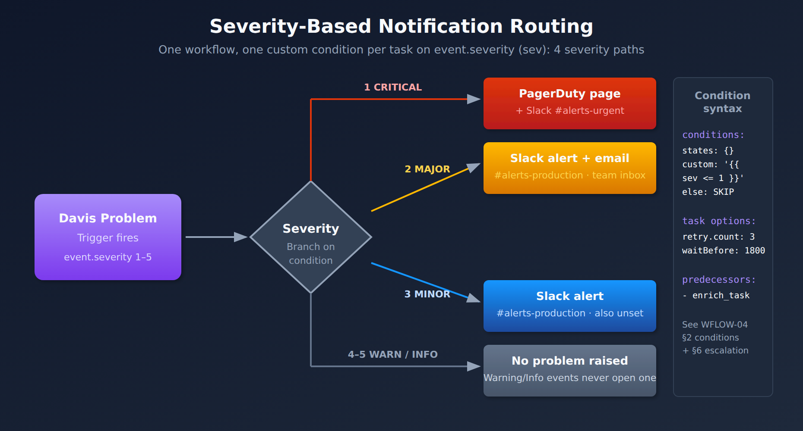

# WFLOW-04: Advanced Notification Routing

> **Series:** WFLOW — Workflows and Alert Notifications | **Notebook:** 4 of 10 | **Created:** January 2026 | **Last Updated:** 10/06/2026

## Intelligent Alert Routing
Not all alerts should go to everyone. This notebook covers conditional routing based on severity, team ownership, time of day, and escalation patterns.

---

## Table of Contents

1. [Routing Strategies](#routing-strategies)
2. [Conditional Expressions](#conditional-expressions)
3. [Routing by Severity](#routing-by-severity)
4. [Routing by Team/Service](#routing-by-teamservice)
5. [Time-Based Routing](#time-based-routing)
6. [Escalation Patterns](#escalation-patterns)
7. [Multi-Channel Strategy](#multi-channel-strategy)

---

## Prerequisites

| Requirement | Details |
|-------------|----------|
| **Dynatrace Environment** | SaaS with Platform subscription |
| **Permissions** | `automation:workflows:write`; the workflow actor also needs `storage:events:read` for the Problem trigger |
| **Prior Knowledge** | **WFLOW-01** through **WFLOW-03** |
| **Connections** | Slack and/or Teams connections configured |

### Sprint 1.337 (April 2026): Smartscape Ownership for Routing

SaaS 1.337 made ownership available on Smartscape nodes, for use from **Workflows actions**: *"Ownership information is now available in Smartscape and for Smartscape nodes. This lets you use Workflows actions (such as get_owners) to send automated and targeted notifications to your teams"* ([What's new in SaaS 1.337 (DT docs)](https://docs.dynatrace.com/docs/whats-new/saas/sprint-337)). It is not a DQL field. An earlier revision of this notebook read `getNodeField(affected_entity_ids[0], "ownership.team")`; that returns null on every problem, because no Smartscape node model has an `ownership.*` field and `getNodeField` does not resolve a classic entity ID.

Two documented routes:

- **Route on ownership with the Ownership app's *Get owners* action.** Add a *Get owners* task after the Problem trigger. Its *Entity ids* input takes *"A Jinja expression, for example, `{{ event()["dt.entity.host"] }}`"*, but that field is rarely set on a problem (33 of 4,244 problems over 7 days on the validation tenant, 10/06/2026). Pass the problem's entities instead, `{{ event()["affected_entity_ids"] | join(",") }}`; the input takes several: *"Use a comma or semicolon to separate multiple IDs."* The output carries `slackChannels`, `msTeams`, `email` and `jira`, and each is a list per team (*"A list of Slack contact details per team"*), not a single channel ([Actions for Ownership (DT docs)](https://docs.dynatrace.com/docs/deliver/ownership/ownership-app/ownership-actions)). Loop the Slack task over `result("get_owners").slackChannels` with the **Loop task** option and take the channel from each item; run the workflow once and read an item's shape in the Results tab before wiring it. That replaces hard-coded team names in the workflow.
- **Or route on `primary_tags.team`** in the trigger's custom filter or a task condition. *"Dynatrace enriches all derived signals (service metrics, Davis events, and problems) with the same tags."* ([Primary Grail fields and tags (DT docs)](https://docs.dynatrace.com/docs/manage/tags/primary-tags)). The matcher is `primary_tags.team == "payments"`. Verify your entities carry the tag first: on the validation tenant `primary_tags.team` was null on every problem (09/24/2026).

**FAQ-21 §5** covers ownership coverage and the Problem fields mapping in depth.

### Dynatrace API 1.337: `metadata` removed from the Environment API v1 events endpoints

The Dynatrace API 1.337 changelog lists, under **Environment API v1**, `GET /events` and `GET /events/{eventId}` with *"Changed EventQueryResult schema (application/json) Changed property events Removed properties: metadata"*. This affects only an HTTP task that calls the v1 endpoints `/api/v1/events` or `/api/v1/events/{eventId}` and parses `metadata`; drop that reference. Workflows started by a Problem or Davis event trigger read Grail records, which never had that property, so they are unaffected.

> <sub>**Sources:** [Dynatrace API changelog 1.337 (DT docs)](https://docs.dynatrace.com/docs/whats-new/dynatrace-api/sprint-337).</sub>

---

<a id="routing-strategies"></a>
## 1. Routing Strategies

> ⚠️ **Migrating from alerting profiles? Duration suppression maps onto the trigger's Minimum duration option.** An alerting profile can delay notification until a problem has been open longer than *N* minutes (`delayInMinutes`) — a common way to suppress transient blips. The problem trigger's **Minimum duration** option (renamed from **Delay** in 08/2026) postpones *"the trigger until the problem has been open for at least the configured duration"* — 5, 10, 15, 30, 60, 120, 240, 1440, or 10080 minutes, evaluated on `dt.duration_marker` ([Problem and event triggers (DT docs)](https://docs.dynatrace.com/docs/analyze-explore-automate/workflows/build/trigger/event-trigger)). Since its 09/07/2026 rewrite the [alert-notification upgrade guide (DT docs)](https://docs.dynatrace.com/docs/platform/upgrade/keep-problems-and-alerting-working/upgrade-guide-alert-notification) agrees: *"The delay, update, and severity capabilities described in this guide exist only on the workflow trigger."* Earlier versions of that guide said there was no alternative; that line is gone.
>
> The values are fixed, so a delay that is not one of those nine has to be rounded — up suppresses a little more, down pages a little sooner. Treat a long delay as evidence the alert was the wrong *shape* rather than merely delayed: a profile suppressing 30 minutes of a firing condition is usually describing a burn-rate concern, which belongs in an SLO burn-rate alert (**SLO-04**) or a Davis anomaly detector (**AIOPS-02**). Inventory `delayInMinutes` across every profile and choose a Minimum duration for each; no special migration wave is needed. See **MZ2POL-09** §6.1.
### Why Route Alerts?

| Problem | Impact | Solution |
|---------|--------|----------|
| Alert fatigue | Teams ignore alerts | Route only relevant alerts |
| Slow response | Wrong team notified | Route to owners |
| Off-hours noise | Sleep disruption | Time-based routing |
| Missed escalation | Unacknowledged alerts | Auto-escalation |

### Routing Dimensions

| Dimension | Route Based On | Example |
|-----------|----------------|----------|
| **Severity** | `event.severity` (1–5) | Critical (1) → PagerDuty, Minor (3) → Slack |
| **Team** | `owner` / `dt.owner` tags, or Smartscape ownership | `owner:checkout` → #checkout-alerts |
| **Service** | Service name or entity ID | Payment service → payments team |
| **Time** | Hour of day, day of week | Weekends → on-call only |
| **Environment** | prod/staging/dev tags | Prod → immediate, Dev → daily digest |

<a id="conditional-expressions"></a>
## 2. Conditional Expressions
A task condition decides whether a task runs. There is no workflow-level list of named conditions: each task carries **one** condition, written under the task itself. *"You can express task conditions based on the final state of the predecessor task and as a custom condition to implement any custom logic."*

| Part | YAML key | What it holds |
|------|----------|---------------|
| **State condition** | `states` | One entry per predecessor task. The editor offers *success or skipped* (the default), *success*, *error or cancelled*, *error* and *any*; exported YAML uses `OK`, `SUCCESS`, `NOK`, `ERROR` and `ANY`, and Dynatrace's samples use `OK` |
| **Custom condition** | `custom` | **One** Jinja expression; the task runs only when it is true. Combine checks with `and` / `or` / `not` inside it |
| **Else** | `else` | `STOP` or `SKIP`. The default is *stop here*: *"if you want to skip this step and continue the workflow, you can change the else action from stop here (default) to skip"* |

A task that follows the trigger directly has no predecessor: *"It's not possible to add a Run this task if and Else condition to the first task."* It can still carry the custom condition: *"Nevertheless, a custom condition can be configured to evaluate the properties of an event trigger context."* Dynatrace's own multi-channel sample nonetheless sets `else: SKIP` on its parallel first tasks in YAML, and the examples in this notebook follow it. In a routing workflow, set Else to **Skip** on every branch that may legitimately not run.

Connection inputs take a connection **ID** (Slack: *"Connection ID."*). In YAML, resolve a connection by its name with `connection()`: *"Get a single connection by schema ID and connection name."* The connection picker in the editor fills the ID for you.

### A Condition on a Task

```yaml
tasks:
  pagerduty_alert:
    name: pagerduty_alert
    action: dynatrace.pagerduty:send-event
    predecessors: []
    conditions:
      states: {}
      # One expression: AND, OR and NOT go inside it
      custom: '{{ (event().get("event.severity") | int(5)) <= 1 and "env:prod" in event().get("tags", "") }}'
      else: SKIP
    input:
      connectionId: "{{ connection('app:dynatrace.pagerduty:events-connection', 'pagerduty-prod') }}"
      # ... event inputs as in §3
```

### Negating a Condition

```yaml
tasks:
  slack_only_for_non_critical:
    name: slack_only_for_non_critical
    action: dynatrace.slack:slack-send-message
    predecessors: []
    conditions:
      states: {}
      custom: '{{ not ((event().get("event.severity") | int(5)) <= 1) }}'
      else: SKIP
    input:
      connection: "{{ connection('app:dynatrace.slack:connection', 'slack-production') }}"
      channel: "#alerts-production"
      message: "{{ event()['event.name'] }}"
```

### Conditioning on a Predecessor's State

```yaml
tasks:
  notify_on_failure:
    name: notify_on_failure
    action: dynatrace.slack:slack-send-message
    predecessors:
      - create_incident
    conditions:
      states:
        create_incident: ERROR    # run only if create_incident failed
      else: SKIP
    input:
      connection: "{{ connection('app:dynatrace.slack:connection', 'slack-production') }}"
      channel: "#alerts-integration"
      message: "Incident creation failed for {{ event()['display_id'] }}"
```

### Expressions

```jinja
# AND within one expression
{{ (event().get("event.severity") | int(5)) <= 1 and "env:prod" in event().get("tags", "") }}

# Critical or Major (1 or 2)
{{ (event().get("event.severity") | int(5)) <= 2 }}

# Check if field exists
{{ event().get("root_cause_entity_id") is not none }}
```

Read any field a problem may lack with `.get()` and a default. The reference documents that reading a missing attribute fails with an *"Undefined variables"* message (shown there for `input()` and `result()`), so the task errors rather than evaluating false. On the problem record `tags` is a single string (a JSON-encoded list on the validation tenant, 10/06/2026), so `in` is a **substring** test: `"env:prod"` also matches `env:production`. Choose tag values that are not prefixes of one another, or filter on tags in the trigger instead (§4).

> <sub>**Sources:**</sub>
> - <sub>[Build workflows (DT docs)](https://docs.dynatrace.com/docs/analyze-explore-automate/workflows/build)</sub>
> - <sub>[Jinja expressions for Workflows (DT docs)](https://docs.dynatrace.com/docs/analyze-explore-automate/workflows/reference)</sub>
> - <sub>[Slack Connector actions (DT docs)](https://docs.dynatrace.com/docs/analyze-explore-automate/workflows/default-workflow-actions/actions/slack/automation-workflows-slack-actions)</sub>
> - <sub>[threat-detection-notification-sender.yaml (Dynatrace GitHub)](https://raw.githubusercontent.com/Dynatrace/Dynatrace-workflow-samples/main/samples/security/threat%20detection/threat-detection-notification-sender.yaml) — parallel first tasks with `states: {}`, a `custom` condition and `else: SKIP`</sub>

<a id="routing-by-severity"></a>
## 3. Routing by Severity
### Severity-Based Routing Pattern

The problem record carries severity as `event.severity`: *"Severity is expressed as a numeric value from 1 (the most critical state) to 5 (purely informational event)."* The levels are named 1 Critical, 2 Major, 3 Minor, 4 Warning and 5 Informational. There is no `CRITICAL`/`HIGH`/`MEDIUM`/`LOW` string on the record, so conditions comparing against those strings are false for every problem.

Problems carry only the first three levels. *"The problem inherits the highest (most critical) severity across all grouped events."* *"Warning and Informational events appear in the event list and can be grouped into a problem by problem correlation, but they don't raise problems on their own."* On the validation tenant, 3,755 of 4,244 problems in the 7 days to 10/06/2026 carried `3` and the other 489 carried `1`; none carried `2`, `4` or `5`. Route on the tiers below:

| `event.severity` | Actions |
|----------|----------|
| **1 (Critical)** | PagerDuty + Slack #alerts-urgent |
| **2 (Major)** | Slack #alerts-production + email to the team |
| **3 (Minor)**, or unset | Slack #alerts-production |

To drop low tiers before any condition runs, set the Problem trigger's **Severity** filter: *"Selecting a severity level triggers the workflow for that level and all higher (more critical) levels."*

> **Breaking — SaaS 1.348 (pre-release; staged tenant rollout planned from 09/22/2026): severity is no longer defaulted.** *"Davis events and problems no longer default `event.severity` to `3`."* A severity filter that was matching the default stops matching once 1.348 reaches your tenant: *"Workflows with a Davis event/problem trigger that filter on `event.severity=3` expecting it to be defaulted, might need to be changed to filter for `Any` severity to keep the alerts."* Before relying on severity tiers, check which event sources actually **set** a severity. For sources that do not, route on `event.category`, ownership or tags instead, or restore a default with a Davis event OpenPipeline processor. Until 1.348 reaches your tenant, the defaulting behavior still applies and the conditions below keep working. The `int(5)` in them treats a missing severity as the least severe tier, so an unset severity lands with Minor and never pages. **FAQ-21 §6** carries the same note.
>
> <sub>**Sources:** [Standardized event severity (DT docs)](https://docs.dynatrace.com/docs/analyze-explore-automate/alerting-and-notifications/standardized-event-severity), [What's new in Dynatrace SaaS 1.348 (DT docs)](https://docs.dynatrace.com/docs/whats-new/saas/sprint-348) — pre-release, read 10/06/2026. **Dictionary:** `event.severity` (`experimental`), read 10/06/2026.</sub>



<!-- MARKDOWN_TABLE_ALTERNATIVE
| `event.severity` | Path | Action |
|------------------|------|--------|
| 1 (Critical) | PagerDuty page + Slack #alerts-urgent | Page on-call |
| 2 (Major) | Slack alert + email | #alerts-production and the team inbox |
| 3 (Minor), or unset | Slack alert | #alerts-production; `int(5)` puts an unset severity here |
| 4–5 (Warning, Informational) | No problem raised | These events never open a problem on their own |
Condition syntax: each task has `conditions: {states: {}, custom: '{{ sev <= 1 }}', else: SKIP}`, where sev is `(event().get("event.severity") | int(5))`. Task options: `retry.count: 3`, `waitBefore: 1800` (seconds), `predecessors: [enrich_task]`. See WFLOW-04 §2 (conditions) and §6 (escalation).
For environments where SVG doesn't render
-->

### Workflow Configuration

```yaml
tasks:
  # 1 Critical: page on-call + Slack urgent
  pagerduty_critical:
    name: pagerduty_critical
    action: dynatrace.pagerduty:send-event
    predecessors: []
    conditions:
      states: {}
      custom: '{{ (event().get("event.severity") | int(5)) <= 1 }}'
      else: SKIP
    input:
      connectionId: "{{ connection('app:dynatrace.pagerduty:events-connection', 'pagerduty-prod') }}"   # an Events connection (routing key)
      eventAction: trigger
      severity: critical
      summary: "{{ event()['event.name'] }}"
      source: dynatrace
      dedupKey: "dynatrace-{{ event()['display_id'] }}"

  slack_urgent:
    name: slack_urgent
    action: dynatrace.slack:slack-send-message
    predecessors: []
    conditions:
      states: {}
      custom: '{{ (event().get("event.severity") | int(5)) <= 1 }}'
      else: SKIP
    input:
      connection: "{{ connection('app:dynatrace.slack:connection', 'slack-production') }}"
      channel: "#alerts-urgent"
      message: ":rotating_light: *CRITICAL* {{ event()['event.name'] }}"

  # 2 Major: Slack alerts (add an email task with the same condition)
  slack_major:
    name: slack_major
    action: dynatrace.slack:slack-send-message
    predecessors: []
    conditions:
      states: {}
      custom: '{{ (event().get("event.severity") | int(5)) == 2 }}'
      else: SKIP
    input:
      connection: "{{ connection('app:dynatrace.slack:connection', 'slack-production') }}"
      channel: "#alerts-production"
      message: ":warning: *MAJOR* {{ event()['event.name'] }}"

  # 3 Minor, or unset: Slack only
  slack_minor:
    name: slack_minor
    action: dynatrace.slack:slack-send-message
    predecessors: []
    conditions:
      states: {}
      custom: '{{ (event().get("event.severity") | int(5)) >= 3 }}'
      else: SKIP
    input:
      connection: "{{ connection('app:dynatrace.slack:connection', 'slack-production') }}"
      channel: "#alerts-production"
      message: ":information_source: *{{ event()['event.category'] }}* {{ event()['event.name'] }}"
```

> **Severity levels.** `event.severity` is an integer from 1 to 5, with the names Dynatrace uses in the Problem trigger and the problems list:
>
> | Integer | Level |
> |---------|-------|
> | 1 | Critical |
> | 2 | Major |
> | 3 | Minor |
> | 4 | Warning |
> | 5 | Informational |
>
> **The conditions in this section key on this numeric field.** Earlier revisions compared against `"CRITICAL"` / `"HIGH"` / `"MEDIUM"` / `"LOW"`; the problem record carries no such strings, so those conditions were false for every problem. *"Grail stores severity as a numeric value."* The conditions still convert with `| int`, because the value in the `event()` payload may arrive as a string; Dynatrace's own PagerDuty template likewise normalizes it with `| string | trim` before mapping. The field is `experimental` in the semantic dictionary. In DQL (problem feed, reporting) it is queried directly as `event.severity`; see **AIOPS-03 §5** for the severity rollup pattern.
>
> <sub>**Sources:** [Standardized event severity (DT docs)](https://docs.dynatrace.com/docs/analyze-explore-automate/alerting-and-notifications/standardized-event-severity), [Send problem as event to PagerDuty template (DT docs)](https://docs.dynatrace.com/docs/analyze-explore-automate/workflows/default-workflow-actions/actions/pagerduty/pagerduty-workflows-problem-notification-template). **Dictionary:** `event.severity` (`experimental`, type `long`), read 10/06/2026.</sub>

<a id="routing-by-teamservice"></a>
## 4. Routing by Team/Service
### Route by Ownership Tags (recommended)

Dynatrace's ownership keys are built in: *"By default, Dynatrace provides two keys: owner and dt.owner ."* Tag entities with them, then give each team a workflow whose Problem trigger filters on its tag with the trigger's *"Affected entities : Filter by entity tags"* option. The routing decision is then made before any task runs, and no condition is needed. **FAQ-21 §5** walks through this pattern.

### Tag Conditions in One Workflow (fallback)

When one workflow must fan out to several teams, test the problem's tags in each task's custom condition. `tags` is a string on the problem record, so these are substring tests (§2): `"owner:cart"` would also match `owner:cart-v2`.

```yaml
tasks:
  notify_checkout:
    name: notify_checkout
    action: dynatrace.slack:slack-send-message
    predecessors: []
    conditions:
      states: {}
      custom: '{{ "owner:checkout" in event().get("tags", "") or "owner:cart" in event().get("tags", "") }}'
      else: SKIP
    input:
      connection: "{{ connection('app:dynatrace.slack:connection', 'slack-production') }}"
      channel: "#checkout-alerts"
      message: "{{ event()['event.name'] }}"

  notify_payments:
    name: notify_payments
    action: dynatrace.slack:slack-send-message
    predecessors: []
    conditions:
      states: {}
      custom: '{{ "owner:payments" in event().get("tags", "") }}'
      else: SKIP
    input:
      connection: "{{ connection('app:dynatrace.slack:connection', 'slack-production') }}"
      channel: "#payments-alerts"
      message: "{{ event()['event.name'] }}"

  notify_platform:
    name: notify_platform
    action: dynatrace.slack:slack-send-message
    predecessors: []
    conditions:
      states: {}
      custom: '{{ "owner:platform" in event().get("tags", "") }}'
      else: SKIP
    input:
      connection: "{{ connection('app:dynatrace.slack:connection', 'slack-production') }}"
      channel: "#platform-alerts"
      message: "{{ event()['event.name'] }}"
```

> <sub>**Sources:** [Assign team ownership (DT docs)](https://docs.dynatrace.com/docs/deliver/ownership/assign-team-ownership), [Problem and event triggers (DT docs)](https://docs.dynatrace.com/docs/analyze-explore-automate/workflows/build/trigger/event-trigger).</sub>

### Management Zone Routing (legacy — do not build new workflows on this)

> ⚠️ **This pattern has nothing to match.** `management_zones` is **not present on problem records**: on a live tenant (10/05/2026) 0 of 15,878 problems in `dt.davis.problems` over 30 days carried it, while 14 of 15 hosts belonged to a management zone. A condition that reads it has nothing to evaluate against, whether or not your zones still exist. There is no Management Zone filter on the problem trigger itself (WFLOW-02 §2).
>
> Use the ownership-tag pattern above instead. If a region is the routing dimension, tag the entities (`region:us-east`) or use Smartscape ownership rather than reading the MZ array. Teams actively migrating off MZs should read MZ2POL-01 §5.

To confirm on your own tenant: `fetch dt.davis.problems, from:-30d | summarize n = countIf(isNotNull(management_zones))`.

### Dynamic Channel Selection

Use JavaScript to determine the channel dynamically:

```javascript
import { execution } from '@dynatrace-sdk/automation-utils';

export default async function () {
  const ev = (await execution()).params.event;   // trigger payload
  // entity_tags still works but is deprecated (Dynatrace Classic) - see the upgrade guide
  const tags = ev.entity_tags || [];            // "key:value" strings

  // Find the ownership tag
  const ownerTag = tags.find(t => t.startsWith('owner:'));
  const team = ownerTag ? ownerTag.split(':')[1] : 'platform';

  return {
    channel: `#${team}-alerts`,
    team: team
  };
}
```

> <sub>**Sources:** [Upgrade guide — alert notification (DT docs)](https://docs.dynatrace.com/docs/platform/upgrade/keep-problems-and-alerting-working/upgrade-guide-alert-notification) — *"entity_tags still exists but is deprecated (Dynatrace Classic)"*.</sub>

<a id="time-based-routing"></a>
## 5. Time-Based Routing
### Business Hours vs Off-Hours

`now()` is UTC unless you pass a time zone: *"If no timezone is provided, UTC is used."* Without one, 09:00–17:00 below would mean 09:00–17:00 UTC, which is 05:00–13:00 in New York, and the weekday boundary would fall at midnight UTC. Pass the team's zone (a pytz name) to every time check:

```yaml
tasks:
  # Business hours (New York): Slack channel
  slack_business_hours:
    name: slack_business_hours
    action: dynatrace.slack:slack-send-message
    predecessors: []
    conditions:
      states: {}
      custom: '{{ now("America/New_York").weekday() < 5 and now("America/New_York").hour >= 9 and now("America/New_York").hour < 17 }}'
      else: SKIP
    input:
      connection: "{{ connection('app:dynatrace.slack:connection', 'slack-production') }}"
      channel: "#alerts-production"
      message: "{{ event()['event.name'] }}"

  # Off-hours: PagerDuty for Critical only
  pagerduty_off_hours:
    name: pagerduty_off_hours
    action: dynatrace.pagerduty:send-event
    predecessors: []
    conditions:
      states: {}
      custom: '{{ (now("America/New_York").weekday() >= 5 or now("America/New_York").hour < 9 or now("America/New_York").hour >= 17) and (event().get("event.severity") | int(5)) <= 1 }}'
      else: SKIP
    input:
      connectionId: "{{ connection('app:dynatrace.pagerduty:events-connection', 'pagerduty-prod') }}"
      eventAction: trigger
      severity: critical
      summary: "[Off-Hours] {{ event()['event.name'] }}"
      source: dynatrace
      dedupKey: "dynatrace-{{ event()['display_id'] }}"

  # Off-hours, not Critical: queue for morning
  slack_queue:
    name: slack_queue
    action: dynatrace.slack:slack-send-message
    predecessors: []
    conditions:
      states: {}
      custom: '{{ (now("America/New_York").weekday() >= 5 or now("America/New_York").hour < 9 or now("America/New_York").hour >= 17) and not ((event().get("event.severity") | int(5)) <= 1) }}'
      else: SKIP
    input:
      connection: "{{ connection('app:dynatrace.slack:connection', 'slack-production') }}"
      channel: "#alerts-queue"
      message: ":moon: *Queued for review* {{ event()['event.name'] }}"
```

For holidays and irregular hours, the same reference documents business calendars, read with `calendars()`.

### Weekend-Only Routing

```yaml
tasks:
  weekend_oncall:
    name: weekend_oncall
    action: dynatrace.pagerduty:send-event
    predecessors: []
    conditions:
      states: {}
      custom: '{{ now("America/New_York").weekday() >= 5 and (event().get("event.severity") | int(5)) <= 1 }}'
      else: SKIP
    input:
      # Page the weekend on-call rotation: a connection that holds that rotation's
      # routing key. Credentials live in connections, not in expressions.
      connectionId: "{{ connection('app:dynatrace.pagerduty:events-connection', 'pagerduty-weekend-oncall') }}"
      # ... event inputs as in §3
```

> <sub>**Sources:** [Jinja expressions for Workflows (DT docs)](https://docs.dynatrace.com/docs/analyze-explore-automate/workflows/reference) — *"The current timestamp in UTC or time zone is provided as the input parameter."*</sub>

<a id="escalation-patterns"></a>
## 6. Escalation Patterns
### Timed Escalation

Escalate if the problem is still active after a time window. This pattern checks the Dynatrace problem's `event.status`; it does not see whether anyone acknowledged the alert in Slack or PagerDuty. In community practice, acknowledgment-aware escalation is left to the paging tool's own escalation policy.

```yaml
tasks:
  # Step 1: Initial notification
  initial_slack:
    name: initial_slack
    action: dynatrace.slack:slack-send-message
    predecessors: []
    input:
      connection: "{{ connection('app:dynatrace.slack:connection', 'slack-production') }}"
      channel: "#alerts-production"
      message: ":warning: {{ event()['event.name'] }} - paging on-call if still active in 15 min"

  # Step 2: After 15 minutes, check if still open (event.status is ACTIVE or
  # CLOSED — never OPEN). There is no "wait" action: the delay is this task's
  # own Wait before option, in seconds (max 86400).
  check_problem_status:
    name: check_problem_status
    action: dynatrace.automations:run-javascript
    predecessors:
      - initial_slack
    waitBefore: 900
    input:
      script: |
        import { execution } from '@dynatrace-sdk/automation-utils';
        import { queryExecutionClient } from '@dynatrace-sdk/client-query';

        export default async function () {
          const ev = (await execution()).params.event;   // snapshot from trigger time
          // Re-query: the trigger payload is 15 minutes old by now
          const started = await queryExecutionClient.queryExecute({ body: { requestTimeoutMilliseconds: 30000, query:
            `fetch dt.davis.problems, from:-2h | filter display_id == "${ev['display_id']}" | sort timestamp desc | limit 1 | fields event.status` } });
          let q = started;   // no result yet if the query outlasted the timeout - poll (see WFLOW-08 §2)
          while (q && (q.state === 'NOT_STARTED' || q.state === 'RUNNING')) {
            q = await queryExecutionClient.queryPoll({ requestToken: started.requestToken, requestTimeoutMilliseconds: 30000 });
          }
          if (!q || q.state !== 'SUCCEEDED') throw new Error(`DQL query did not succeed: ${q?.state ?? 'no response'}`);
          return { escalate: q.result.records[0]?.['event.status'] === 'ACTIVE' };
        }

  # Step 3: Escalate to PagerDuty
  escalate_pagerduty:
    name: escalate_pagerduty
    action: dynatrace.pagerduty:send-event
    predecessors:
      - check_problem_status
    conditions:
      states:
        check_problem_status: OK
      custom: '{{ result("check_problem_status").escalate }}'
      else: SKIP
    input:
      connectionId: "{{ connection('app:dynatrace.pagerduty:events-connection', 'pagerduty-prod') }}"
      eventAction: trigger
      severity: error                  # Events API v2 accepts critical, error, warning, info
      source: dynatrace
      dedupKey: "dynatrace-{{ event()['display_id'] }}"
      summary: "[ESCALATED] {{ event()['event.name'] }} - still active after 15 min"
```

Workflows has no separate wait action. **Wait before** is a task option: *"The Wait before option controls how long a task stays in the waiting state before being run."* It takes seconds, up to 86,400, or a Jinja expression.

The same effect needs no waiting task at all: create a second workflow whose Problem trigger has **Minimum duration** 15 minutes and holds only the PagerDuty task. *"Minimum duration : Postpones the trigger until the problem has been open for at least the configured duration."* A problem that closes within 15 minutes never starts it.

> <sub>**Sources:** [Build workflows — Task options (DT docs)](https://docs.dynatrace.com/docs/analyze-explore-automate/workflows/build) — *"The default Wait is 0 second and max value is 86400 seconds."*; [PagerDuty Connector actions (DT docs)](https://docs.dynatrace.com/docs/analyze-explore-automate/workflows/default-workflow-actions/actions/pagerduty/pagerduty-workflows-actions) — *"Trigger, acknowledge, or resolve an alert in PagerDuty using the Events API v2"*; [Problem and event triggers (DT docs)](https://docs.dynatrace.com/docs/analyze-explore-automate/workflows/build/trigger/event-trigger).</sub>

### Multi-Tier Escalation

```
0 min  → Slack channel notification
15 min → Email to team lead
30 min → PagerDuty to on-call
60 min → PagerDuty to manager
```

<a id="multi-channel-strategy"></a>
## 7. Multi-Channel Strategy
### Recommended Channel Matrix

| `event.severity` | Environment | Channel(s) |
|----------|-------------|------------|
| 1 (Critical) | Production | PagerDuty + Slack urgent + Email |
| 1 (Critical) | Staging | Slack alerts |
| 2 (Major) | Production | Slack alerts + Email |
| 2 (Major) | Staging | Slack alerts |
| 3 (Minor) | Production | Slack alerts |
| 3 (Minor) | Staging | Slack (daily digest) |
| unset (SaaS 1.348+) | Any | Slack (daily digest), until the source sets a severity |

Levels 4 (Warning) and 5 (Informational) do not raise problems on their own (§3), so a problem-triggered workflow needs no row for them.

### Complete Multi-Channel Workflow

```yaml
tasks:
  # PagerDuty: Critical + Production
  pagerduty:
    name: pagerduty
    action: dynatrace.pagerduty:send-event
    predecessors: []
    conditions:
      states: {}
      custom: '{{ (event().get("event.severity") | int(5)) <= 1 and "env:prod" in event().get("tags", "") }}'
      else: SKIP
    input:
      connectionId: "{{ connection('app:dynatrace.pagerduty:events-connection', 'pagerduty-prod') }}"
      # ... event inputs as in §3

  # Slack Urgent: Critical + Production
  slack_urgent:
    name: slack_urgent
    action: dynatrace.slack:slack-send-message
    predecessors: []
    conditions:
      states: {}
      custom: '{{ (event().get("event.severity") | int(5)) <= 1 and "env:prod" in event().get("tags", "") }}'
      else: SKIP
    input:
      connection: "{{ connection('app:dynatrace.slack:connection', 'slack-production') }}"
      channel: "#alerts-urgent"
      message: ":rotating_light: {{ event()['event.name'] }}"

  # Slack Standard: Major or above + Production
  slack_standard:
    name: slack_standard
    action: dynatrace.slack:slack-send-message
    predecessors: []
    conditions:
      states: {}
      custom: '{{ (event().get("event.severity") | int(5)) <= 2 and "env:prod" in event().get("tags", "") }}'
      else: SKIP
    input:
      connection: "{{ connection('app:dynatrace.slack:connection', 'slack-production') }}"
      channel: "#alerts-production"
      message: "{{ event()['event.name'] }}"

  # Email: Critical, or Major + Production
  email_alert:
    name: email_alert
    action: dynatrace.email:send-email
    predecessors: []
    conditions:
      states: {}
      custom: '{{ (event().get("event.severity") | int(5)) <= 1 or ((event().get("event.severity") | int(5)) == 2 and "env:prod" in event().get("tags", "")) }}'
      else: SKIP
    # input: to, subject, content
```

### Query Workflow Routing Effectiveness

```dql
// Workflow executions by outcome
// Data object corrected 08/12/2026. Workflow executions are NOT in `events`, and there is no
// `automation.task.execution` / `automation.workflow.execution` event type in any spelling — those
// filters matched nothing, silently, in 25 cells. AutomationEngine writes to `dt.system.events` with
// `event.kind == "WORKFLOW_EVENT"` (5.7M records / 30d here), split by `event.type`:
//   WORKFLOW_EXECUTION · TASK_EXECUTION · ACTION_EXECUTION · WORKFLOW_CREATED/UPDATED/DELETED
// Fields are the `dt.automation_engine.*` family:
//   .workflow.title / .workflow.id      (was workflow.name)
//   .task.name                          (was task.name)
//   .action.function / .action.app      (was task.type — e.g. run-javascript, send-email,
//                                        snow-search-incidents)
//   .state                              (was task.status / execution.status)
//                                        values RUNNING · SUCCESS · ERROR · DISCARDED · SKIPPED
//                                        — note "FAILED" is NOT a value; it is ERROR
//   .state.is_final                     true only on terminal records — filter on it, otherwise a
//                                        single execution is counted once as RUNNING and again as
//                                        SUCCESS/ERROR
//   .state_info                         (was task.error)  ·  duration (was task.duration)
// Enumerate with:
//   fetch dt.system.events, from:-24h | filter event.kind == "WORKFLOW_EVENT" | limit 1
fetch dt.system.events, from:-7d
| filter event.kind == "WORKFLOW_EVENT"
| filter event.type == "WORKFLOW_EXECUTION"
| filter dt.automation_engine.state.is_final == true
| summarize executions = count(), by:{dt.automation_engine.state}
| sort executions desc
```

```dql
// Task execution distribution by notification channel
// Data object corrected 08/12/2026. Workflow executions are NOT in `events`, and there is no
// `automation.task.execution` / `automation.workflow.execution` event type in any spelling — those
// filters matched nothing, silently, in 25 cells. AutomationEngine writes to `dt.system.events` with
// `event.kind == "WORKFLOW_EVENT"` (5.7M records / 30d here), split by `event.type`:
//   WORKFLOW_EXECUTION · TASK_EXECUTION · ACTION_EXECUTION · WORKFLOW_CREATED/UPDATED/DELETED
// Fields are the `dt.automation_engine.*` family:
//   .workflow.title / .workflow.id      (was workflow.name)
//   .task.name                          (was task.name)
//   .action.function / .action.app      (was task.type — e.g. run-javascript, send-email,
//                                        snow-search-incidents)
//   .state                              (was task.status / execution.status)
//                                        values RUNNING · SUCCESS · ERROR · DISCARDED · SKIPPED
//                                        — note "FAILED" is NOT a value; it is ERROR
//   .state.is_final                     true only on terminal records — filter on it, otherwise a
//                                        single execution is counted once as RUNNING and again as
//                                        SUCCESS/ERROR
//   .state_info                         (was task.error)  ·  duration (was task.duration)
// Enumerate with:
//   fetch dt.system.events, from:-24h | filter event.kind == "WORKFLOW_EVENT" | limit 1
fetch dt.system.events, from:-7d
| filter event.kind == "WORKFLOW_EVENT"
| filter event.type == "ACTION_EXECUTION"
| filter dt.automation_engine.state.is_final == true
| summarize executions = count(), by:{dt.automation_engine.action.app, dt.automation_engine.action.function}
| sort executions desc
| limit 20
```

```dql
// Skipped tasks (conditions not met)
// Data object corrected 08/12/2026. Workflow executions are NOT in `events`, and there is no
// `automation.task.execution` / `automation.workflow.execution` event type in any spelling — those
// filters matched nothing, silently, in 25 cells. AutomationEngine writes to `dt.system.events` with
// `event.kind == "WORKFLOW_EVENT"` (5.7M records / 30d here), split by `event.type`:
//   WORKFLOW_EXECUTION · TASK_EXECUTION · ACTION_EXECUTION · WORKFLOW_CREATED/UPDATED/DELETED
// Fields are the `dt.automation_engine.*` family:
//   .workflow.title / .workflow.id      (was workflow.name)
//   .task.name                          (was task.name)
//   .action.function / .action.app      (was task.type — e.g. run-javascript, send-email,
//                                        snow-search-incidents)
//   .state                              (was task.status / execution.status)
//                                        values RUNNING · SUCCESS · ERROR · DISCARDED · SKIPPED
//                                        — note "FAILED" is NOT a value; it is ERROR
//   .state.is_final                     true only on terminal records — filter on it, otherwise a
//                                        single execution is counted once as RUNNING and again as
//                                        SUCCESS/ERROR
//   .state_info                         (was task.error)  ·  duration (was task.duration)
// Enumerate with:
//   fetch dt.system.events, from:-24h | filter event.kind == "WORKFLOW_EVENT" | limit 1
fetch dt.system.events, from:-24h
| filter event.kind == "WORKFLOW_EVENT"
| filter event.type == "TASK_EXECUTION"
| filter in(dt.automation_engine.state, {"SKIPPED", "DISCARDED"})
| summarize skipped = count(), by:{dt.automation_engine.workflow.title, dt.automation_engine.task.name, dt.automation_engine.state}
| sort skipped desc
| limit 25
```

## Next Steps

With routing configured, integrate with incident management:

### Recommended Path

1. **WFLOW-05: PagerDuty & ServiceNow** - Create incidents automatically
2. **WFLOW-06: Custom Templates** - Rich message formatting
3. **WFLOW-07: Problem-Triggered Remediation** - Auto-remediation

### Key Takeaways

- **Conditions** live on each task: predecessor states, one custom Jinja expression, and an Else of Stop or Skip
- **Severity routing** keys on `event.severity` 1 Critical / 2 Major / 3 Minor; problems never carry 4 or 5
- **Team routing** uses `owner` / `dt.owner` tags (best in the trigger's tag filter) or Smartscape ownership — not management zones
- **Time-based routing** reduces off-hours noise; pass a time zone to `now()`, which is UTC otherwise
- **Escalation patterns** prevent missed alerts
- Test conditions with On-Demand trigger before production

---

## Summary

In this notebook, you learned:

- Why and when to route alerts conditionally
- Conditional expression syntax and operators
- Severity-based routing patterns
- Team routing by entity tag, and why management-zone routing is now legacy
- Time-based (business hours) routing
- Escalation with wait-and-check patterns, or a second workflow with a Minimum duration
- Multi-channel notification strategy

---

## References

- [Workflow reference / Jinja expressions + conditions (DT docs)](https://docs.dynatrace.com/docs/analyze-explore-automate/workflows/reference)
- [Build workflows — task conditions and options (DT docs)](https://docs.dynatrace.com/docs/analyze-explore-automate/workflows/build)
- [Problem and event triggers (DT docs)](https://docs.dynatrace.com/docs/analyze-explore-automate/workflows/build/trigger/event-trigger)
- [Standardized event severity (DT docs)](https://docs.dynatrace.com/docs/analyze-explore-automate/alerting-and-notifications/standardized-event-severity)
- [Workflow actions umbrella (DT docs)](https://docs.dynatrace.com/docs/analyze-explore-automate/workflows/default-workflow-actions)
- [Notification actions umbrella (DT docs)](https://docs.dynatrace.com/docs/analyze-explore-automate/workflows/default-workflow-actions/actions)
- [Davis Problems app (DT docs)](https://docs.dynatrace.com/docs/dynatrace-intelligence/problems-app)
- [Alerting and notifications umbrella (DT docs)](https://docs.dynatrace.com/docs/analyze-explore-automate/alerting-and-notifications)
- [Upgrade guide — alerting and notifications (DT docs)](https://docs.dynatrace.com/docs/platform/upgrade/keep-problems-and-alerting-working/upgrade-guide-alert-notification)

---

<sub>*This notebook was AI-generated from community-submitted and publicly available sources. This notebook series is not officially supported by Dynatrace. Always verify information against official Dynatrace documentation.*</sub>
