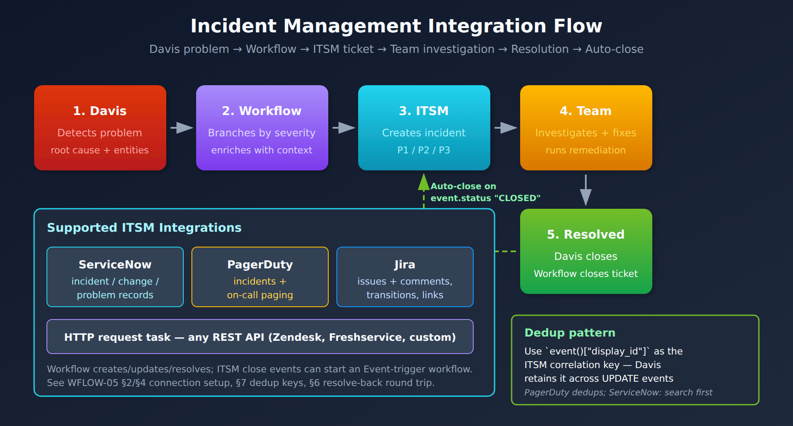

# WFLOW-05: PagerDuty & ServiceNow Integration

> **Series:** WFLOW — Workflows and Alert Notifications | **Notebook:** 5 of 10 | **Created:** January 2026 | **Last Updated:** 10/06/2026

## Incident Management Automation
Integrate Dynatrace workflows with enterprise incident management platforms. This notebook covers PagerDuty and ServiceNow integration patterns, bi-directional sync, and incident lifecycle management.

---

## Table of Contents

1. [Integration Overview](#integration-overview)
2. [PagerDuty Setup](#pagerduty-setup)
3. [PagerDuty Workflow Tasks](#pagerduty-workflow-tasks)
4. [ServiceNow Setup](#servicenow-setup)
5. [ServiceNow Workflow Tasks](#servicenow-workflow-tasks)
6. [Bi-Directional Sync](#bi-directional-sync)
7. [Incident Lifecycle Patterns](#incident-lifecycle-patterns)
8. [Production Hardening](#production-hardening)

---

## Prerequisites

| Requirement | Details |
|-------------|----------|
| **Dynatrace Environment** | SaaS with Platform subscription |
| **Permissions** | `automation:workflows:write`; `storage:events:read` for the workflow actor (Problem trigger). To create connections: `settings:objects:read`, `settings:objects:write` and `settings:schemas:read` on the connector's schema (for example `app:dynatrace.pagerduty:events-connection`). In **Workflows > Settings > Authorization settings**: `app-settings:objects:read` (both connectors), plus `state:app-states:read`, `state:app-states:write` and `state:app-states:delete` for PagerDuty |
| **PagerDuty** | Admin access to create services and integrations |
| **ServiceNow** | Admin access or integration user credentials |

> <sub>**Sources:** [Set up PagerDuty Connector (DT docs)](https://docs.dynatrace.com/docs/analyze-explore-automate/workflows/default-workflow-actions/actions/pagerduty/pagerduty-workflows-setup) — *"ALLOW settings:objects:read, settings:objects:write, settings:schemas:read WHERE settings:schemaId"*; [ServiceNow Connector (DT docs)](https://docs.dynatrace.com/docs/analyze-explore-automate/workflows/default-workflow-actions/actions/service-now) — *"Permissions needed for ServiceNow workflow actions: app-settings:objects:read"*; [Problem and event triggers (DT docs)](https://docs.dynatrace.com/docs/analyze-explore-automate/workflows/build/trigger/event-trigger).</sub>

<a id="integration-overview"></a>
## 1. Integration Overview

### Why Integrate?

| Benefit | Description |
|---------|-------------|
| **Single pane of glass** | Incidents tracked in one system |
| **On-call management** | Leverage PagerDuty/ServiceNow schedules |
| **Audit trail** | Complete incident history |
| **Escalation** | Built-in escalation policies |
| **Metrics** | MTTR, incident frequency reporting |

### Integration Flow



<!-- MARKDOWN_TABLE_ALTERNATIVE
| Step | Component | Action |
|------|-----------|--------|
| 1 | Dynatrace Intelligence | Detects problem |
| 2 | Workflow | Processes event |
| 3 | ITSM | Creates incident |
| 4 | Team | Investigates & fixes |
| 5 | Resolution | Problem closed (`event.status` CLOSED), workflow resolves the ticket |
Supported: ServiceNow (incident / change / problem records), PagerDuty (incidents + on-call paging), Jira (issues + comments, transitions, links), HTTP request task for any REST API
Bidirectional sync: the workflow creates / updates / resolves; the ITSM can send a close event that an Event trigger matches. See WFLOW-05 §2/§4 for connection setup, §7 for dedup keys, §6 for the resolve-back round trip.
Dedup: use the problem's display_id as the correlation key. PagerDuty dedups on it; for ServiceNow, search for it before creating.
For environments where SVG doesn't render
-->

### Why a Workflow (vs a Direct Webhook)

Davis can post to a webhook directly, but routing problems through a **workflow** buys four things a raw webhook cannot:

| Capability | What the workflow adds |
|------------|------------------------|
| **Payload shaping** | Map Dynatrace fields to the exact incident schema the target expects, including required and custom fields |
| **Retry + dead-letter** | Re-attempt on transient failures; quarantine permanent failures instead of losing them (see §8) |
| **Filtering** | Decide which problems become incidents — drop informational events before they reach the ITSM queue |
| **Link-back** | Capture the returned incident number and write it onto the Dynatrace problem as a comment (§6) |

Reach for the native action first; drop to a raw HTTP action only when you need a field the action doesn't expose.

<a id="pagerduty-setup"></a>
## 2. PagerDuty Setup
### Creating PagerDuty Integration

1. **In PagerDuty:**
   - Go to **Services** → Select or create service
   - **Integrations** tab → **Add Integration**
   - Select **Events API v2**
   - Copy the **Integration Key** (routing key)

2. **In Dynatrace:**
   - Go to **Settings** → **Connections** → **PagerDuty** and select the **Events API** tab
   - Select **Connection**
   - Paste the Integration Key into **Routing key**
   - Name: `pagerduty-production`

> **Two connection types.** The steps above create an **Events** connection (a routing key), which is what **Send event** uses: *"The Send event action uses the PagerDuty Events API v2 and requires a separate Events connection configured with a routing key."* **Create an incident** and the list actions use a different connection that holds a PagerDuty REST API key. Neither connection can stand in for the other.
>
> <sub>**Sources:** [Set up PagerDuty Connector (DT docs)](https://docs.dynatrace.com/docs/analyze-explore-automate/workflows/default-workflow-actions/actions/pagerduty/pagerduty-workflows-setup) — *"Use the PagerDuty Connector with a PagerDuty API key to automate incident creation and retrieve on-call information via the PagerDuty REST API."*</sub>

### Multiple Services Pattern

Create separate connections for different routing:

| Connection Name | PagerDuty Service | Use |
|-----------------|-------------------|------|
| `pagerduty-prod-critical` | Production-Critical | P1 incidents |
| `pagerduty-prod-standard` | Production-Standard | P2-P4 incidents |
| `pagerduty-platform` | Platform-Infrastructure | Infra issues |

<a id="pagerduty-workflow-tasks"></a>
## 3. PagerDuty Workflow Tasks
PagerDuty has no separate resolve or acknowledge action. One action, **Send event** (`dynatrace.pagerduty:send-event`), covers the whole alert lifecycle: its **Event action** input is `trigger`, `acknowledge` or `resolve`. Send every event about one problem with the same deduplication key, through the same Events connection, so PagerDuty updates the existing alert instead of opening a new one.

### Trigger an Alert

Input keys below follow an exported workflow (the editor labels them Event action, Severity, Summary, Source, Component, Group, Class, Custom details, Deduplication key); export your own workflow once to confirm them.

```yaml
name: trigger_pagerduty_alert
action: dynatrace.pagerduty:send-event
input:
  connectionId: "{{ connection('app:dynatrace.pagerduty:events-connection', 'pagerduty-production') }}"
  eventAction: trigger
  severity: '{{ {1: "critical", 2: "error", 3: "warning", 4: "info"}.get(event().get("event.severity") | int(5), "info") }}'
  summary: "[{{ event()['event.category'] }}] {{ event()['event.name'] }}"
  source: "dynatrace"
  # Root-cause name from the Smartscape field, falling back to the classic ID
  component: >-
    {{ rc["name"] if rc else (event().get("root_cause_entity_id") or "unknown") }}
  group: ""                    # left empty, as in Dynatrace's template; problems carry no management_zones
  eventClass: "{{ event()['event.category'] }}"
  customDetails: |             # a JSON object, written as text
    {
      "problem_id": "{{ event()['display_id'] }}",
      "problem_url": "{{ problem_link() }}",
      "affected_entities": "{{ (event().get('smartscape.affected_entities') or []) | map(attribute='name') | join(', ') or event()['affected_entity_ids'] | join(', ') }}",
      "root_cause": "{{ event().get('root_cause_entity_id', 'N/A') }}",
      "start_time": "{{ event()['event.start'] }}"
    }
  dedupKey: "dynatrace-{{ event()['display_id'] }}"
```

> **Deprecated problem fields.** *"root_cause_entity_id and root_cause_entity_name are deprecated in favor of root_cause.smartscape_entity , and affected_entity_ids in favor of smartscape.affected_entities ."* The classic fields still work and are better populated today: over 7 days on the validation tenant (10/06/2026), `affected_entity_ids` was set on 4,244 of 4,244 problems and `smartscape.affected_entities` on 3,332; `root_cause_entity_id` on 850 and `root_cause.smartscape_entity` on 150. The mapping above therefore reads the Smartscape field first and falls back to the classic one. Dynatrace's own PagerDuty template reads only the Smartscape fields and leaves Group empty.
>
> <sub>**Sources:** [Upgrade guide — alert notification (DT docs)](https://docs.dynatrace.com/docs/platform/upgrade/keep-problems-and-alerting-working/upgrade-guide-alert-notification), [Send problem as event to PagerDuty template (DT docs)](https://docs.dynatrace.com/docs/analyze-explore-automate/workflows/default-workflow-actions/actions/pagerduty/pagerduty-workflows-problem-notification-template) — *"Group : The template leaves this field empty."*</sub>

### Resolve the Alert

Run when the problem closes:

```yaml
name: resolve_pagerduty_alert
action: dynatrace.pagerduty:send-event
input:
  connectionId: "{{ connection('app:dynatrace.pagerduty:events-connection', 'pagerduty-production') }}"
  eventAction: resolve
  severity: info
  summary: "Resolved in Dynatrace: {{ event()['event.name'] }}"
  source: "dynatrace"
  dedupKey: "dynatrace-{{ event()['display_id'] }}"
```

### Acknowledge the Alert

```yaml
name: acknowledge_pagerduty_alert
action: dynatrace.pagerduty:send-event
input:
  connectionId: "{{ connection('app:dynatrace.pagerduty:events-connection', 'pagerduty-production') }}"
  eventAction: acknowledge
  severity: info
  summary: "Acknowledged from Dynatrace: {{ event()['event.name'] }}"
  source: "dynatrace"
  dedupKey: "dynatrace-{{ event()['display_id'] }}"
```

Dynatrace's own *Send problem as event to PagerDuty* template does the same in a single task: it sets the event action to `resolve` when the problem's status is `CLOSED`.

### Opening an Incident Instead of an Alert

When you need a PagerDuty *incident* opened directly, with a service ID, priority or assignee, use **Create an incident** (`dynatrace.pagerduty:create-incident`) with the REST API connection. Its inputs differ from Send event (From, Title, Service ID, Priority ID, Urgency, Incident key), and it has no resolve counterpart in the connector.

> <sub>**Sources:** [PagerDuty Connector actions (DT docs)](https://docs.dynatrace.com/docs/analyze-explore-automate/workflows/default-workflow-actions/actions/pagerduty/pagerduty-workflows-actions) — *"Trigger, acknowledge, or resolve an alert in PagerDuty using the Events API v2"*, *"Creates an incident in your PagerDuty environment for a service."*; [Send problem as event to PagerDuty template (DT docs)](https://docs.dynatrace.com/docs/analyze-explore-automate/workflows/default-workflow-actions/actions/pagerduty/pagerduty-workflows-problem-notification-template).</sub>

<a id="servicenow-setup"></a>
## 4. ServiceNow Setup
### Creating ServiceNow Connection

1. **In ServiceNow:**
   - Create an integration user, or an OAuth app
   - Give it the rights the connector's actions use: *"Search, create and update incidents (table incident )"*, read categories and subcategories (table `sys_choice`, elements `category` and `subcategory`), read assignment groups (table `sys_user_group`), and read resolution codes (table `sys_choice`, element `close_code`)
   - Note instance URL: `https://your-instance.service-now.com`

2. **In Dynatrace:**
   - Go to **Settings** → **Connections** → **Connectors** → **ServiceNow**
   - Select **Connection**
   - Enter:
     - Instance URL
     - Basic-auth username/password **or** OAuth client ID/secret
   - Name: `servicenow-production`

3. **Allow the outbound calls.** If the actions fail with `Blocked request to '…' (host not in allowlist)`, add the instance host under **Settings** → **General** → **External requests**. That is the error the ServiceNow actions returned on the validation tenant (10/06/2026) for a host that was not listed. If the instance accepts only allow-listed source IPs, **WFLOW-94** covers sending connector calls from a static egress IP through EdgeConnect.

### Authentication Options

The ServiceNow connection supports two authentication methods — these are the only two the native connector accepts:

| Method | Credentials | Best For |
|--------|-------------|----------|
| **Basic Authentication** | Username + password of a ServiceNow integration user | Quick setup, development |
| **OAuth Client Credentials** | Client ID + client secret | Production — avoids storing a user password |

> There is no API-key option for this connector. Store the chosen credential in the connection, never inline in a workflow task.

> <sub>**Sources:** [ServiceNow Connector (DT docs)](https://docs.dynatrace.com/docs/analyze-explore-automate/workflows/default-workflow-actions/actions/service-now) — *"Read resolution codes (table sys_choice , element close_code )"*, *"Either use basic authentication or OAuth client credentials."*</sub>

<a id="servicenow-workflow-tasks"></a>
## 5. ServiceNow Workflow Tasks

The native ServiceNow connector exposes these operations, selected **by name** in the workflow builder. Create Incident is `dynatrace.servicenow:snow-create-incident`, Search incidents is `dynatrace.servicenow:snow-search-incidents`, and Comment on an incident is `dynatrace.servicenow:snow-comment-on-incident`, in Dynatrace's workflow samples. The other operations are shown by name only (`# Operation:`): export a workflow that uses one to read its identifier and input names, rather than guessing them:

| Operation | Use |
|-----------|-----|
| **Create Incident** | Open an incident from a Davis problem |
| **Resolve incident** | Close the incident when the problem closes |
| **Comment on an incident** | Append work notes / status updates |
| **Update record** | Change fields on any table record (incidents included) |
| **Search incidents** | Look up an existing incident (e.g., by correlation ID) |
| **Get Groups** | Resolve assignment-group sys_ids |
| **Create a vulnerability item** | Open a VR item (security workflows) |

> **Required fields for Create Incident:** `Category`, `Subcategory`, `Impact`, `Urgency`, and `Assignment Group` are **required** — a create call missing any of them fails. `Correlation ID` is optional but strongly recommended: set it to the Dynatrace problem ID so a **Search incidents** task can find the incident again. Create Incident does not check for an existing incident (it is a plain `POST /api/now/v2/table/incident`), so the deduplication is yours: search first, and create only when nothing is found.

### Find or Create the Incident

Search for the problem's correlation ID first, then create only if the search came back empty. This is the pattern Dynatrace's own ServiceNow sample uses.

```yaml
search_incident:
  name: search_incident
  action: dynatrace.servicenow:snow-search-incidents
  predecessors: []
  input:
    connectionId: "{{ connection('app:dynatrace.servicenow:connection', 'servicenow-production') }}"
    sysparmQuery: "correlation_id=DT-{{ event()['display_id'] }}"
    sysparmLimit: "1"
```

```yaml
name: create_snow_incident
action: dynatrace.servicenow:snow-create-incident
predecessors:
  - search_incident
conditions:
  states:
    search_incident: OK
  custom: '{{ event()["event.status"] == "ACTIVE" and result("search_incident") | length == 0 }}'
  else: SKIP
input:
  connectionId: "{{ connection('app:dynatrace.servicenow:connection', 'servicenow-production') }}"
  shortDescription: "[Dynatrace] {{ event()['event.name'] }}"
  description: |
    A problem has been detected by Davis.

    Problem Details:
    ================
    Problem ID: {{ event()['display_id'] }}
    Category: {{ event()['event.category'] }}
    Status: {{ event()['event.status'] }}
    Start Time: {{ event()['event.start'] }}

    Affected Entities:
    {{ event()['affected_entity_ids'] | join('\n') }}{# deprecated field; see §3 #}

    Root Cause Entity:
    {{ event().get('root_cause_entity_id', 'Pending analysis') }}

    View in Dynatrace:
    {{ problem_link() }}
  impact: '{{ {1: 1, 2: 1, 3: 2, 4: 3}.get(event().get("event.severity") | int(5), 3) }}'
  urgency: '{{ {1: 1, 2: 1, 3: 2, 4: 3}.get(event().get("event.severity") | int(5), 3) }}'
  category: "software"           # a choice value from your instance's sys_choice list
  subCategory: "application"
  group:                         # the assignment group, picked in the editor
    id: "<sys_id of Platform Engineering>"
    displayName: "Platform Engineering"
  caller: "dynatrace.integration"
  correlationId: "DT-{{ event()['display_id'] }}"
```

> <sub>**Sources:** [ServiceNow Connector (DT docs)](https://docs.dynatrace.com/docs/analyze-explore-automate/workflows/default-workflow-actions/actions/service-now) — *"Creates an incident in your ServiceNow environment."*; [wftpl_sample_servicenow_incident_man.yaml (Dynatrace GitHub)](https://raw.githubusercontent.com/Dynatrace/Dynatrace-workflow-samples/main/samples/Messaging%20and%20Incident%20Management/wftpl_sample_servicenow_incident_man.yaml) — *"action: dynatrace.servicenow:snow-create-incident"*; [wftpl_core_journey_auto-remediation.yaml (Dynatrace GitHub)](https://raw.githubusercontent.com/Dynatrace/Dynatrace-workflow-samples/main/samples/red%20hat%20ansible%20automation%20platform/wftpl_core_journey_auto-remediation.yaml) — *"action: dynatrace.servicenow:snow-comment-on-incident"*.</sub>

**Severity → Impact / Urgency.** Dynatrace's unified `event.severity` is an integer **1–5** (1 Critical, 2 Major, 3 Minor, 4 Warning, 5 Informational; see WFLOW-04 §3 and AIOPS-03), and it is what the Davis problem and `fetch events` carry. ServiceNow `Impact`/`Urgency` run **1 (High) … 3 (Low)**, so the Dynatrace scale compresses:

| `event.severity` | ServiceNow Impact / Urgency |
|------------------|-----------------------------|
| 1 (Critical) | 1 (High) |
| 2 (Major) | 1 (High) |
| 3 (Minor) | 2 (Medium) |
| 4 (Warning) — events only, never on a problem | 3 (Low) |
| 5 (Informational) | skip — usually no incident |

> **What `event()` actually carries.** The problem record has `event.severity` on the 1–5 scale, not `"CRITICAL"`-style labels. Grail stores it as a number; in the `event()` payload it may arrive as a string, which is why the mappings above convert it with `| int`. It is `experimental` in the semantic dictionary, and from SaaS 1.348 it is no longer defaulted (WFLOW-04 §3), so `int(5)` sends an unset severity to the lowest tier. The same applies to the PagerDuty severity mapping in §3.

### Comment on an Incident

```yaml
name: comment_snow_incident
action: dynatrace.servicenow:snow-comment-on-incident
predecessors:
  - search_incident
conditions:
  states:
    search_incident: OK
  custom: '{{ result("search_incident") | length > 0 }}'
  else: SKIP
input:
  connectionId: "{{ connection('app:dynatrace.servicenow:connection', 'servicenow-production') }}"
  # The incident number (INC...), not the correlation ID or the sys_id
  number: '{{ result("search_incident")[0].number }}'
  comment: |
    [Automated Update from Dynatrace]
    Problem updated at {{ now() }}
    Current status: {{ event()['event.status'] }}
```

### Resolve Incident

**Resolve incident** targets an incident by number, not by correlation ID, and all three of its inputs are required: *"Incident Number The number of the incident to resolve."*, *"Resolution Notes Add notes for the resolution of the incident."*, *"Resolution Code The close code for the resolution."* Pick the resolution code from the editor's list: the codes are read from your instance (`sys_choice`, element `close_code`), so a hard-coded `"Resolved"` may not exist there.

```yaml
name: resolve_snow_incident
# Operation: "Resolve incident" (export a workflow to read its action identifier)
predecessors:
  - search_incident
conditions:
  states:
    search_incident: OK
  custom: '{{ event()["event.status"] == "CLOSED" and result("search_incident") | length > 0 }}'
  else: SKIP
input:
  connectionId: "{{ connection('app:dynatrace.servicenow:connection', 'servicenow-production') }}"
  number: '{{ result("search_incident")[0].number }}'   # Incident Number
  resolutionNotes: |                                     # Resolution Notes
    Problem automatically resolved in Dynatrace.
    Resolution time: {{ event().get('event.end', now()) }}
  resolutionCode: "<a close code from the editor's list>"   # Resolution Code
```

> <sub>**Sources:** [ServiceNow Connector (DT docs)](https://docs.dynatrace.com/docs/analyze-explore-automate/workflows/default-workflow-actions/actions/service-now); [wftpl_core_journey_auto-remediation.yaml (Dynatrace GitHub)](https://raw.githubusercontent.com/Dynatrace/Dynatrace-workflow-samples/main/samples/red%20hat%20ansible%20automation%20platform/wftpl_core_journey_auto-remediation.yaml) — reads the incident number from `result("search_incident")[0].number`.</sub>

<a id="bi-directional-sync"></a>
## 6. Bi-Directional Sync

The native ServiceNow **workflow action is one-way** — it creates, comments on, resolves, and updates ServiceNow records, but ServiceNow-side changes do not flow back automatically. There are two ways to close the loop:

- **DIY polling (shown below)** — a scheduled workflow queries ServiceNow for Dynatrace-correlated incidents and writes their status back onto the Dynatrace problem. Portable and works today, but you own the polling cadence and rate budget.
- **Native bi-directional (ITOM)** — the ServiceNow-side Dynatrace app / ITOM Event Management ingests Dynatrace events and synchronises incident state both ways. This is the richest option for ITOM-centric shops; the **ALERT-04** notebook lays out the full maturity ladder and when to climb to it.

### Sync Status from ServiceNow to Dynatrace (DIY polling)

Use a scheduled workflow to check incident status:

```javascript
import { credentialVaultClient } from '@dynatrace-sdk/client-classic-environment-v2';

const SNOW_URL = 'https://your-instance.service-now.com';   // add to Settings > External requests

export default async function () {
  // A JavaScript task does not receive a connection object; keep the credential in the Credential Vault.
  // The credential needs: the AppEngine scope selected, "Allow access without app context" turned on,
  // and access for the workflow actor - otherwise this call is denied.
  const cred = await credentialVaultClient.getCredentialsDetails({ id: 'CREDENTIALS_VAULT-XXXXXXXXXXXX' });
  // Query ServiceNow for Dynatrace-related incidents. Encoded queries join field, operator
  // and value with no spaces: correlation_idSTARTSWITHDT-
  const response = await fetch(
    `${SNOW_URL}/api/now/table/incident?` +
    `sysparm_query=${encodeURIComponent('correlation_idSTARTSWITHDT-^state!=6')}`,
    {
      headers: {
        'Authorization': `Basic ${btoa(cred.username + ':' + cred.password)}`,
        'Accept': 'application/json'
      }
    }
  );

  const incidents = await response.json();

  // Process each incident
  for (const incident of incidents.result) {
    const displayId = incident.correlation_id.replace('DT-', '');   // P-..., the display ID
    // problemsClient.createComment needs the problem ID (event.id), not the display ID:
    // look it up in dt.davis.problems by display_id, then post the SNOW status as a comment
    // ...
  }

  return { processed: incidents.result.length };
}
```

> <sub>**Sources:** [Run JavaScript action (DT docs)](https://docs.dynatrace.com/docs/analyze-explore-automate/workflows/default-workflow-actions/run-javascript-workflow-action) — *"The following credential settings are required. The AppEngine scope is selected. Allow access without app context is turned on. The workflow actor has access to the credential."*</sub>

### Write the Incident Number onto the Problem (link-back)

Create Incident returns the new incident's number. A downstream task can read it directly as `{{ result("create_snow_incident").number }}`, so no extra task is needed just to store it. To give responders a path from the Dynatrace problem to the ticket, post the number as a problem comment:

```yaml
link_back:
  name: link_back
  action: dynatrace.automations:run-javascript
  predecessors:
    - create_snow_incident
  conditions:
    states:
      create_snow_incident: SUCCESS
    else: SKIP
  input:
    script: |
      import { execution, result } from '@dynatrace-sdk/automation-utils';
      import { problemsClient } from '@dynatrace-sdk/client-classic-environment-v2';

      export default async function () {
        const ev = (await execution()).event();                 // the Problem trigger payload
        if (!ev) throw new Error('No event context - run this from a Problem trigger');
        const incident = await result('create_snow_incident');
        await problemsClient.createComment({
          problemId: ev['event.id'],
          body: { message: `ServiceNow incident ${incident.number}`, context: 'ServiceNow' },
        });
        return { incident_number: incident.number };
      }
```

Dynatrace's own ServiceNow sample passes `event()["event.id"]` as the `problemId` of the problems API in a Problem-triggered workflow; the comment call takes the same ID.

> <sub>**Sources:** [wftpl_sample_servicenow_incident_man.yaml (Dynatrace GitHub)](https://raw.githubusercontent.com/Dynatrace/Dynatrace-workflow-samples/main/samples/Messaging%20and%20Incident%20Management/wftpl_sample_servicenow_incident_man.yaml) — *"{problemId: davisEvent['event.id'], fields: 'impactAnalysis'}"*.</sub>

<a id="incident-lifecycle-patterns"></a>
## 7. Incident Lifecycle Patterns
### Complete Lifecycle Workflow

Handle open, update, and close events:

In the editor, set the Problem trigger's **Problem state** to *active or closed*: *"active or closed : Starts when the problem opens and again when it closes."* Without it the workflow never runs on close, and the resolve task never fires. Exported, the trigger and tasks look like this:

```yaml
title: incident-lifecycle-management
trigger:
  eventTrigger:
    isActive: true
    triggerConfiguration:
      type: davis-problem
      value:
        triggerOn: open-and-close     # UI: Problem state = active or closed
        categories:
          availability: true
          error: true
          slowdown: true
          resource: true
          custom: true
        entityTagsMatch: all
        entityTags:
          env:
            - prod

tasks:
  # CREATE: when the problem opens
  trigger_alert:
    name: trigger_alert
    action: dynatrace.pagerduty:send-event
    predecessors: []
    conditions:
      states: {}
      custom: '{{ event()["event.status"] == "ACTIVE" }}'
      else: SKIP
    input:
      connectionId: "{{ connection('app:dynatrace.pagerduty:events-connection', 'pagerduty-production') }}"
      eventAction: trigger
      source: dynatrace
      severity: critical
      summary: "{{ event()['event.name'] }}"
      dedupKey: "dynatrace-{{ event()['display_id'] }}"

  # RESOLVE: when the problem closes
  resolve_alert:
    name: resolve_alert
    action: dynatrace.pagerduty:send-event
    predecessors: []
    conditions:
      states: {}
      custom: '{{ event()["event.status"] == "CLOSED" }}'
      else: SKIP
    input:
      connectionId: "{{ connection('app:dynatrace.pagerduty:events-connection', 'pagerduty-production') }}"
      eventAction: resolve
      source: dynatrace
      severity: info
      summary: "Resolved in Dynatrace: {{ event()['event.name'] }}"
      dedupKey: "dynatrace-{{ event()['display_id'] }}"
```

`triggerOn` is the current key in the `@dynatrace-sdk/client-automation` typings, where `onProblemClose` is marked deprecated; older exports, including Dynatrace's ServiceNow sample, still carry `onProblemClose`.

> <sub>**Sources:** [Problem and event triggers (DT docs)](https://docs.dynatrace.com/docs/analyze-explore-automate/workflows/build/trigger/event-trigger); [wftpl_sample_servicenow_incident_man.yaml (Dynatrace GitHub)](https://raw.githubusercontent.com/Dynatrace/Dynatrace-workflow-samples/main/samples/Messaging%20and%20Incident%20Management/wftpl_sample_servicenow_incident_man.yaml) — the exported `triggerConfiguration` shape.</sub>

### Deduplication Strategy

| Platform | Dedup Field | Pattern |
|----------|-------------|----------|
| PagerDuty | `dedupKey` | `dynatrace-{problem_id}` |
| ServiceNow | `correlation_id` | `DT-{problem_id}` — run **Search incidents** on it first and create only if none is found (§5) |

PagerDuty deduplicates on the key itself, so a repeated `trigger` updates the open alert. ServiceNow's Create Incident does not: the search-before-create step is what prevents a duplicate.

<a id="production-hardening"></a>
## 8. Production Hardening

An incident integration sits on the critical path: when it silently fails, problems open in Dynatrace but never reach the on-call queue. Harden it before you depend on it.

### Failure Handling

Decide explicitly what happens on each failure mode rather than letting the workflow fail open:

| Failure | Handling |
|---------|----------|
| ServiceNow **5xx** (server error) | Turn on the task's **Retry on error** (fixed count and delay, e.g. 3 × 60 s) |
| ServiceNow **4xx** (bad payload / auth) | Retry cannot tell it apart from a 5xx; a follow-up task with state condition **error** writes the payload to a dead-letter store and alerts the team |
| **Timeout** (slow response) | Covered by Retry on error; surface a final failure on the Dynatrace problem as a comment |
| **Rate limit reached** | Log dropped events and continue; alert if the sustained drop rate crosses a threshold |
| **DNS / connection failure** | Retry; if persistent, alert via a secondary channel (e.g., a Slack action) |
| **Auth token expired** | Re-fetch the credential once per run from the connection/secret store; alert ops if it recurs |

**Retry on error** has a fixed count and a fixed delay, with no backoff, and it retries every failure regardless of status code: *"Number of retries , by default, is set to two. Delay between retries (seconds) , by default, is set to 30."* *"If none of the action retries are successful, the task will end in an error state."* Branch on that error state for the dead-letter path.

> <sub>**Sources:** [Build workflows — Task options (DT docs)](https://docs.dynatrace.com/docs/analyze-explore-automate/workflows/build).</sub>

### Dead-Letter Queue

Retries cover transient failures; **permanent** failures (4xx, schema mismatch) must not vanish. Write the failed payload to a durable store — a dedicated Grail bucket or an external queue — with a retention window (e.g., 30 days) so an operator can inspect and **replay** it after fixing the root cause. Without a dead-letter store, a malformed-payload bug means silently lost incidents with no audit trail.

### Link Back to the Dynatrace Problem

Capture the ServiceNow incident number from the create response and write it onto the originating problem as a comment (the link-back task in §6). This gives responders a one-click path from the Dynatrace problem to the ServiceNow ticket. The correlation ID is what lets a later **Search incidents** task find the incident number that **Comment** and **Resolve** require (§5).

The integration is itself a production dependency, so monitor it like one — the queries below track execution volume, success rate, and failures so a broken connection surfaces as a metric, not as a silent gap in the incident queue.

### Monitor Incident Integration

```dql
// Incident-management connector task executions
// Data object corrected 08/12/2026. Workflow executions are NOT in `events`, and there is no
// `automation.task.execution` / `automation.workflow.execution` event type in any spelling — those
// filters matched nothing, silently, in 25 cells. AutomationEngine writes to `dt.system.events` with
// `event.kind == "WORKFLOW_EVENT"` (5.7M records / 30d here), split by `event.type`:
//   WORKFLOW_EXECUTION · TASK_EXECUTION · ACTION_EXECUTION · WORKFLOW_CREATED/UPDATED/DELETED
// Fields are the `dt.automation_engine.*` family:
//   .workflow.title / .workflow.id      (was workflow.name)
//   .task.name                          (was task.name)
//   .action.function / .action.app      (was task.type — e.g. run-javascript, send-email,
//                                        snow-search-incidents)
//   .state                              (was task.status / execution.status)
//                                        values RUNNING · SUCCESS · ERROR · DISCARDED · SKIPPED
//                                        — note "FAILED" is NOT a value; it is ERROR
//   .state.is_final                     true only on terminal records — filter on it, otherwise a
//                                        single execution is counted once as RUNNING and again as
//                                        SUCCESS/ERROR
//   .state_info                         (was task.error)  ·  duration (was task.duration)
// Enumerate with:
//   fetch dt.system.events, from:-24h | filter event.kind == "WORKFLOW_EVENT" | limit 1
fetch dt.system.events, from:-7d
| filter event.kind == "WORKFLOW_EVENT"
| filter event.type == "ACTION_EXECUTION"
| filter dt.automation_engine.state.is_final == true
| filter contains(dt.automation_engine.action.app, "servicenow") or contains(dt.automation_engine.action.app, "pagerduty") or contains(dt.automation_engine.action.app, "jira")
| summarize executions = count(), by:{dt.automation_engine.action.app, dt.automation_engine.action.function, dt.automation_engine.state}
| sort executions desc
```

```dql
// Failed incident management tasks
// Data object corrected 08/12/2026. Workflow executions are NOT in `events`, and there is no
// `automation.task.execution` / `automation.workflow.execution` event type in any spelling — those
// filters matched nothing, silently, in 25 cells. AutomationEngine writes to `dt.system.events` with
// `event.kind == "WORKFLOW_EVENT"` (5.7M records / 30d here), split by `event.type`:
//   WORKFLOW_EXECUTION · TASK_EXECUTION · ACTION_EXECUTION · WORKFLOW_CREATED/UPDATED/DELETED
// Fields are the `dt.automation_engine.*` family:
//   .workflow.title / .workflow.id      (was workflow.name)
//   .task.name                          (was task.name)
//   .action.function / .action.app      (was task.type — e.g. run-javascript, send-email,
//                                        snow-search-incidents)
//   .state                              (was task.status / execution.status)
//                                        values RUNNING · SUCCESS · ERROR · DISCARDED · SKIPPED
//                                        — note "FAILED" is NOT a value; it is ERROR
//   .state.is_final                     true only on terminal records — filter on it, otherwise a
//                                        single execution is counted once as RUNNING and again as
//                                        SUCCESS/ERROR
//   .state_info                         (was task.error)  ·  duration (was task.duration)
// Enumerate with:
//   fetch dt.system.events, from:-24h | filter event.kind == "WORKFLOW_EVENT" | limit 1
fetch dt.system.events, from:-24h
| filter event.kind == "WORKFLOW_EVENT"
| filter event.type == "ACTION_EXECUTION"
| filter dt.automation_engine.state == "ERROR"
| filter contains(dt.automation_engine.action.app, "servicenow") or contains(dt.automation_engine.action.app, "pagerduty")
| fields timestamp, dt.automation_engine.action.function, dt.automation_engine.state_info
| sort timestamp desc
| limit 25
```

```dql
// Connector activity per day
// Data object corrected 08/12/2026. Workflow executions are NOT in `events`, and there is no
// `automation.task.execution` / `automation.workflow.execution` event type in any spelling — those
// filters matched nothing, silently, in 25 cells. AutomationEngine writes to `dt.system.events` with
// `event.kind == "WORKFLOW_EVENT"` (5.7M records / 30d here), split by `event.type`:
//   WORKFLOW_EXECUTION · TASK_EXECUTION · ACTION_EXECUTION · WORKFLOW_CREATED/UPDATED/DELETED
// Fields are the `dt.automation_engine.*` family:
//   .workflow.title / .workflow.id      (was workflow.name)
//   .task.name                          (was task.name)
//   .action.function / .action.app      (was task.type — e.g. run-javascript, send-email,
//                                        snow-search-incidents)
//   .state                              (was task.status / execution.status)
//                                        values RUNNING · SUCCESS · ERROR · DISCARDED · SKIPPED
//                                        — note "FAILED" is NOT a value; it is ERROR
//   .state.is_final                     true only on terminal records — filter on it, otherwise a
//                                        single execution is counted once as RUNNING and again as
//                                        SUCCESS/ERROR
//   .state_info                         (was task.error)  ·  duration (was task.duration)
// Enumerate with:
//   fetch dt.system.events, from:-24h | filter event.kind == "WORKFLOW_EVENT" | limit 1
fetch dt.system.events, from:-30d
| filter event.kind == "WORKFLOW_EVENT"
| filter event.type == "ACTION_EXECUTION"
| filter dt.automation_engine.state.is_final == true
| filter contains(dt.automation_engine.action.app, "servicenow") or contains(dt.automation_engine.action.app, "pagerduty")
| makeTimeseries executions = count(), interval:24h
```

## Next Steps

With incident management configured, customize message templates:

### Recommended Path

1. **WFLOW-06: Custom Notification Templates** - Rich formatting
2. **WFLOW-07: Problem-Triggered Remediation** - Auto-remediation
3. **WFLOW-08: JavaScript & HTTP Actions** - Custom integrations

### Key Takeaways

- **PagerDuty**: **Send event** triggers, acknowledges and resolves through Events API v2 (routing key); **Create an incident** uses the REST API (API key)
- **ServiceNow** uses a native connection (Basic or OAuth Client Credentials) with operations selected by name; `Category`, `Subcategory`, `Impact`, `Urgency`, `Assignment Group` are required on create
- **Deduplication**: PagerDuty dedups on `dedupKey`; for ServiceNow, **Search incidents** on the correlation ID before creating, because Create Incident does not dedupe
- **Lifecycle workflows** handle open/update/close events
- **Bi-directional**: the native action is one-way; true state sync comes from the ServiceNow-side Dynatrace app / ITOM (see ALERT-04)
- **Production hardening** — retry, dead-letter, link-back, and monitoring keep the integration trustworthy

---

## Summary

In this notebook, you learned:

- Integration benefits and architecture
- PagerDuty connection setup and tasks
- ServiceNow connection setup and tasks
- Bi-directional sync patterns
- Incident lifecycle management
- Deduplication strategies
- Production hardening (failure handling, dead-letter, monitoring)

---

## References

- [ServiceNow action (DT docs)](https://docs.dynatrace.com/docs/analyze-explore-automate/workflows/default-workflow-actions/actions/service-now)
- [Set up PagerDuty Connector (DT docs)](https://docs.dynatrace.com/docs/analyze-explore-automate/workflows/default-workflow-actions/actions/pagerduty/pagerduty-workflows-setup)
- [Build workflows — task conditions and options (DT docs)](https://docs.dynatrace.com/docs/analyze-explore-automate/workflows/build)
- [Problem and event triggers (DT docs)](https://docs.dynatrace.com/docs/analyze-explore-automate/workflows/build/trigger/event-trigger)
- [PagerDuty action (DT docs)](https://docs.dynatrace.com/docs/analyze-explore-automate/workflows/default-workflow-actions/actions/pagerduty)
- [Send Dynatrace notifications to ServiceNow (DT docs)](https://docs.dynatrace.com/docs/analyze-explore-automate/notifications-and-alerting/problem-notifications/servicenow-integration)
- [Notification actions umbrella (DT docs)](https://docs.dynatrace.com/docs/analyze-explore-automate/workflows/default-workflow-actions/actions)
- [HTTP request action (DT docs)](https://docs.dynatrace.com/docs/analyze-explore-automate/workflows/default-workflow-actions/http-request-workflow-action)
- [Davis Problems app (DT docs)](https://docs.dynatrace.com/docs/dynatrace-intelligence/problems-app)
- [PagerDuty Events API v2 (PagerDuty Developer)](https://docs.pagerduty.com/developer/events-api-v2-overview)
- [ServiceNow REST API reference (ServiceNow Developer)](https://developer.servicenow.com/dev.do#!/reference/api)

---

<sub>*This notebook was AI-generated from community-submitted and publicly available sources. This notebook series is not officially supported by Dynatrace. Always verify information against official Dynatrace documentation.*</sub>
