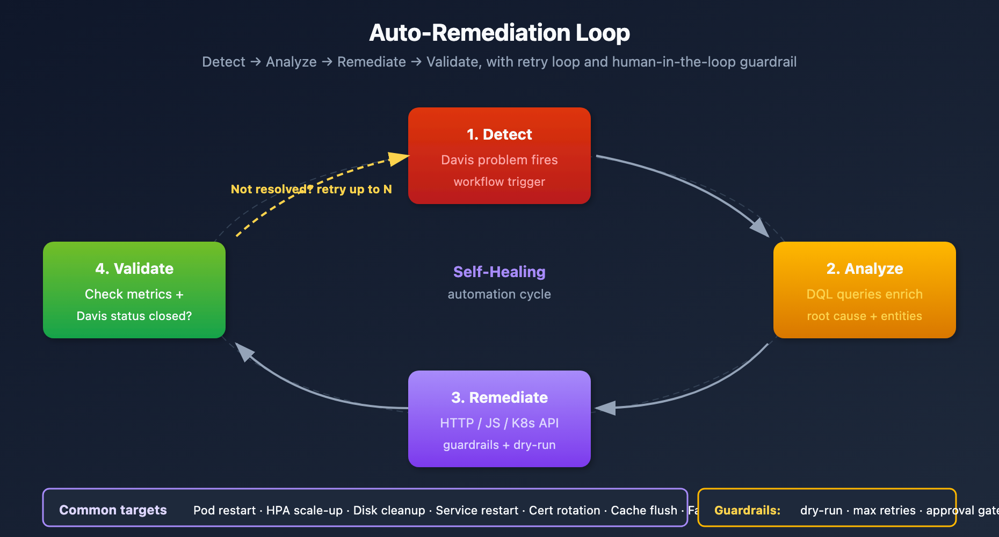

# WFLOW-07: Problem-Triggered Remediation

> **Series:** WFLOW — Workflows and Alert Notifications | **Notebook:** 7 of 10 | **Created:** January 2026 | **Last Updated:** 10/06/2026

## Auto-Remediation with Workflows
Move beyond notifications to automated problem resolution. This notebook covers remediation patterns, safety guardrails, runbook automation, and common remediation scenarios.

---

## Table of Contents

1. [Auto-Remediation Principles](#auto-remediation-principles)
2. [Safety Guardrails](#safety-guardrails)
3. [Common Remediation Patterns](#common-remediation-patterns)
4. [Kubernetes Remediation](#kubernetes-remediation)
5. [Cloud Resource Remediation](#cloud-resource-remediation)
6. [Runbook Automation](#runbook-automation)
7. [Approval Workflows](#approval-workflows)

---

## Prerequisites

| Requirement | Details |
|-------------|----------|
| **Dynatrace Environment** | SaaS with Platform subscription |
| **Permissions** | `automation:workflows:write` to author. Each task also needs the scopes it uses, granted to the workflow under **Settings > Authorization settings** in the Workflows app — for example `automation:workflows:read` for `execution()` and `result()`, `environment-api:credentials:read` for the Credential Vault, and the `storage:*:read` scope of each data object a query reads. A missing one fails the task with a 403 at run time. |
| **Prior Knowledge** | **WFLOW-01** through **WFLOW-06** |
| **External Systems** | Credentials for the target system in the Credential Vault, or a connection for the Kubernetes or AWS Connector |
| **Outbound access** | Every host a script or HTTP task calls added under **Settings > General > External requests**. Hosts on a private network (an internal automation API, a Kubernetes API server, an `.internal` endpoint) also need an EdgeConnect host pattern — see the **WFLOW-94 LAB** |

> <sub>**Sources:** [Run JavaScript action (DT docs)](https://docs.dynatrace.com/docs/analyze-explore-automate/workflows/default-workflow-actions/run-javascript-workflow-action) — *"The external endpoint must be added to External requests."*; [Workflows security (DT docs)](https://docs.dynatrace.com/docs/analyze-explore-automate/workflows/security) — *"If the required permission for a workflow task is missing, an attempt to execute this task results in a 403 Forbidden error."*; [EdgeConnect (DT docs)](https://docs.dynatrace.com/docs/ingest-from/edgeconnect) — *"Any HTTP request (from your app functions, workflows, or ad-hoc functions) that matches a defined host pattern is handled by an EdgeConnect instance"*.</sub>

<a id="auto-remediation-principles"></a>
## 1. Auto-Remediation Principles
### When to Automate Remediation

| Scenario | Automate? | Reason |
|----------|-----------|--------|
| Pod crash loop | Yes | Well-defined fix (restart) |
| Disk space 90% | Yes | Clear action (cleanup) |
| Memory pressure | Maybe | Scale up vs investigate |
| Database deadlock | No | Needs investigation |
| Security incident | No | Requires human judgment |

### Remediation Maturity Model

```
Level 0: Manual remediation (runbook lookup)
Level 1: Automated notification with runbook link
Level 2: Semi-automated (human approval required)
Level 3: Fully automated with guardrails
Level 4: Self-healing with learning
```

### Auto-Remediation Loop



<!-- MARKDOWN_TABLE_ALTERNATIVE
| Step | Action | Description |
|------|--------|-------------|
| 1. Detect | Detected Problem | Triggers workflow |
| 2. Analyze | DQL queries | Determine root cause |
| 3. Remediate | Execute action | HTTP/Script/K8s API |
| 4. Validate | Check metrics | Verify resolution |
| Loop | If not resolved | Return to step 1 |
Examples: Restart pod, scale up, clear cache, rotate certs
For environments where SVG doesn't render
-->

### Gate Every Action on a Root-Cause Entity

Remediation acts on a component, and most problems do not name one. On the validation tenant over seven days (10/06/2026), 850 problems carried `root_cause_entity_id`, 151 carried `root_cause.smartscape_entity`, and 3,348 of 4,241 (79%) carried neither. The upgrade guide gives the reason: *"Dynatrace Intelligence does not populate a root cause for every problem, particularly early in the lifecycle or for externally ingested events."* A script that reads the field without checking passes `undefined` to whatever it calls next.

The guide also states that *"root_cause_entity_id and root_cause_entity_name are deprecated in favor of root_cause.smartscape_entity"*, a record with `id`, `type` and `name`. On the same tenant the two fields did not cover the same problems: the Smartscape field named EC2 instances where the classic field was empty, and the classic field named Kubernetes workloads where the Smartscape field was empty. The samples in this notebook therefore read the Smartscape field first, fall back to the classic ID, and end the run with a clear "skipped" result when neither is present:

```javascript
// Root-cause entity of a problem, or null when Davis named none.
// Reads root_cause.smartscape_entity first and falls back to the deprecated
// root_cause_entity_id. Event values can arrive as JSON strings, so parse defensively.
function rootCause(event) {
  let rc = event['root_cause.smartscape_entity'];
  if (typeof rc === 'string') {
    try { rc = JSON.parse(rc); } catch { rc = null; }
  }
  if (rc && rc.id) return { id: String(rc.id), type: rc.type, name: rc.name };
  const classic = event.root_cause_entity_id;
  if (!classic) return null;
  return { id: classic, type: classic.split('-')[0], name: event.root_cause_entity_name ?? null };
}
```

Measure the split on your own tenant with the last query in §7 before you decide which problems a workflow can act on.

> <sub>**Sources:** [Upgrade guide: alert notifications (DT docs)](https://docs.dynatrace.com/docs/platform/upgrade/keep-problems-and-alerting-working/upgrade-guide-alert-notification) — *"A root-cause condition silently drops those problems."*, *"root_cause_entity_id and root_cause_entity_name are deprecated in favor of root_cause.smartscape_entity, and affected_entity_ids in favor of smartscape.affected_entities."*</sub>

<a id="safety-guardrails"></a>
## 2. Safety Guardrails
### Essential Guardrails

| Guardrail | Implementation | Purpose |
|-----------|----------------|----------|
| **Rate limiting** | Max 3 remediations/hour | Prevent loops |
| **Time window** | Business hours only | Avoid off-hours changes |
| **Environment scope** | Non-prod first | Protect production |
| **Cooldown period** | 30 min between actions | Allow stabilization |
| **Rollback capability** | Capture pre-state | Enable undo |

### Rate Limiting Implementation

Run the check as its own task, `check_rate_limit`, before the remediation task. It **fails** when the limit is reached, so a remediation task gated on its success does not run (see the YAML under *Time Window Check*).

```javascript
import { queryExecutionClient } from '@dynatrace-sdk/client-query';

async function runQuery(query) {
  // queryExecute returns a requestToken instead of the result when the query outlasts
  // requestTimeoutMilliseconds - poll until it reaches a final state (see WFLOW-08 §2).
  const started = await queryExecutionClient.queryExecute({ body: { query, requestTimeoutMilliseconds: 30000 } });
  let r = started;
  while (r && (r.state === 'NOT_STARTED' || r.state === 'RUNNING')) {
    r = await queryExecutionClient.queryPoll({ requestToken: started.requestToken, requestTimeoutMilliseconds: 30000 });
  }
  if (!r || r.state !== 'SUCCEEDED') throw new Error(`DQL query did not succeed: ${r?.state ?? 'no response'}`);
  return r.result.records;
}

export default async function ({ executionId }) {
  // Count remediation runs in the last hour. Workflow executions are recorded in dt.system.events;
  // there is no automation.workflow.execution event type (a query on it always returns 0,
  // so this guardrail would never trip).
  // - countDistinctExact on the execution ID counts runs that are still in flight as well as
  //   finished ones; count() would count each run twice (a RUNNING record, then a final one).
  // - This run is excluded, or it would count against its own limit.
  // - contains() is case-sensitive unless told otherwise; filtering on the exact
  //   dt.automation_engine.workflow.id of your remediation workflows is stricter still.
  // runQuery() throws if the query does not complete, so a slow query stops the
  // remediation instead of reading as "0 attempts" and sailing past the limit.
  const records = await runQuery(`
    fetch dt.system.events, from:-1h
    | filter event.kind == "WORKFLOW_EVENT" and event.type == "WORKFLOW_EXECUTION"
    | filter contains(dt.automation_engine.workflow.title, "remediation", caseSensitive: false)
    | filter dt.automation_engine.workflow_execution.id != "${executionId}"
    | summarize attempts = countDistinctExact(dt.automation_engine.workflow_execution.id)
  `);

  const attempts = Number(records[0]?.attempts ?? 0);
  const maxAttempts = 3;

  if (attempts >= maxAttempts) {
    // Fail the task. A returned { proceed: false } would leave it in SUCCESS, and a
    // remediation task chained after it would run anyway.
    throw new Error(`Rate limit reached: ${attempts}/${maxAttempts} remediation runs in the last hour`);
  }

  return { attempt_number: attempts + 1 };
}
```

This counts remediation runs across all entities. Execution records do not carry the entity a run acted on, so a per-entity limit needs the entity ID recorded somewhere you can query — for example in a business event the remediation task emits.

### Time Window Check

A workflow has no named, workflow-level conditions. Each guardrail is a condition on the task it protects: a **state** condition on its predecessors and an optional **custom** Jinja condition. The remediation task below runs only when `check_rate_limit` succeeded and the current time is inside the window:

```yaml
tasks:
  remediation_action:
    name: remediation_action
    action: dynatrace.automations:run-javascript
    predecessors:
      - check_rate_limit
    conditions:
      states:
        check_rate_limit: SUCCESS        # a tripped rate limit leaves ERROR, so this task does not run
      # Monday to Friday, 06:00-21:59 in the named timezone. now() without a timezone is UTC.
      custom: '{{ now("Europe/Vienna").weekday() < 5 and now("Europe/Vienna").hour >= 6 and now("Europe/Vienna").hour < 22 }}'
      else: SKIP                         # outside the window: skip instead of stopping the workflow
    input:
      script: |
        // ... remediation
```

Test the window expression once with a manual run in your timezone before you rely on it.

> <sub>**Sources:** [Workflow reference / Jinja expressions (DT docs)](https://docs.dynatrace.com/docs/analyze-explore-automate/workflows/reference) — *"If no timezone is provided, UTC is used."*; [Build workflows (DT docs)](https://docs.dynatrace.com/docs/analyze-explore-automate/workflows/build) — *"The custom condition of a task is only checked if all the predecessor tasks are finished and fulfilled their state condition."*; [client-automation SDK — TaskConditionOption (Dynatrace Developer)](https://developer.dynatrace.com/develop/sdks/client-automation/).</sub>

<a id="common-remediation-patterns"></a>
## 3. Common Remediation Patterns

Every sample below that acts on a component first checks that the problem names one (§1), and every target host must be reachable from the Dynatrace runtime (Prerequisites). Functions marked `placeholder` are yours to supply.

### Pattern 1: Service Restart

```javascript
// Ask your own automation system to restart the root-cause component
import { execution } from '@dynatrace-sdk/automation-utils';
import { credentialVaultClient } from '@dynatrace-sdk/client-classic-environment-v2';

// rootCause() as defined in §1
// A private endpoint: add it under External requests and give it an EdgeConnect host pattern
const AUTOMATION_URL = 'https://automation.company.internal/api/restart';

export default async function () {
  const event = (await execution()).params.event;   // trigger payload
  const rc = rootCause(event);
  if (!rc) {
    return { skipped: 'problem has no root-cause entity' };
  }
  const token = (await credentialVaultClient.getCredentialsDetails({ id: 'CREDENTIALS_VAULT-XXXXXXXXXXXX' })).token;

  // The automation system maps the Dynatrace entity to the host and service it manages
  const response = await fetch(AUTOMATION_URL, {
    method: 'POST',
    headers: {
      'Authorization': `Bearer ${token}`,
      'Content-Type': 'application/json'
    },
    body: JSON.stringify({
      entity_id: rc.id,
      entity_type: rc.type,
      entity_name: rc.name,
      reason: `Dynatrace problem ${event.display_id}`
    })
  });

  if (!response.ok) {
    throw new Error(`Restart request failed: HTTP ${response.status} ${await response.text()}`);
  }
  return { success: true, entity: rc.id };
}
```

### Pattern 2: Clear Cache

A Dynatrace entity ID is not a hostname, so call a fixed endpoint of your own and send the problem in the payload. If the endpoint needs a hostname, resolve it in a JavaScript task first and pass it on with `result()`.

```yaml
tasks:
  clear_cache:
    name: clear_cache
    action: dynatrace.automations:http-function
    input:
      url: "https://cache-admin.company.internal/api/clear"   # private host: needs an EdgeConnect host pattern
      method: POST
      headers:
        Content-Type: "application/json"
      payload: |
        {
          "problem_id": {{ event()['display_id'] | to_json }},
          "title": {{ event()['event.name'] | to_json }}
        }
      # Authentication: a Credential Vault token selected in the task's
      # Authentication field — never a static Authorization header
```

### Pattern 3: Traffic Redirect

```javascript
// Redirect traffic away from a failing instance
import { execution } from '@dynatrace-sdk/automation-utils';

// rootCause() as defined in §1

export default async function () {
  const event = (await execution()).params.event;   // trigger payload
  const rc = rootCause(event);
  if (!rc) {
    return { redirected: false, skipped: 'problem has no root-cause entity' };
  }

  // placeholder: implement updateLoadBalancer() for your load balancer's API.
  // It receives a Dynatrace entity; map it to the load-balancer target your LB knows.
  await updateLoadBalancer({
    action: 'drain',
    entity: rc,
    reason: event.display_id
  });

  return { redirected: true, entity: rc.id };
}
```

> <sub>**Sources:** [HTTP request action (DT docs)](https://docs.dynatrace.com/docs/analyze-explore-automate/workflows/default-workflow-actions/http-request-workflow-action) — *"All HTTP calls are validated against the global allowlist."*; [Workflow reference / Jinja expressions (DT docs)](https://docs.dynatrace.com/docs/analyze-explore-automate/workflows/reference) — `to_json`: *"Converts an object to its JSON representation."*</sub>

<a id="kubernetes-remediation"></a>
## 4. Kubernetes Remediation

The **Kubernetes Connector** runs Kubernetes operations as workflow actions — *"All actions correspond to a command of the command-line interface kubectl"* — and reaches the cluster through EdgeConnect, so the API server stays private. Setting it up prepares *"EdgeConnect so it can, once deployed, route the API requests executed by the Kubernetes workflow actions to the Kubernetes API."* Prefer it to a Kubernetes client library: a Run JavaScript task cannot import npm packages by name, only ECMAScript modules from allow-listed URLs, and libraries that need sockets or the file system do not load.

### Restart a Workload

Problem records carry Kubernetes context as arrays. On the validation tenant over seven days (10/06/2026), 2,039 of 4,245 problems carried `k8s.namespace.name` and `k8s.workload.name`, but only 17 carried `k8s.pod.name`. Restart the **workload**, and only when the problem names exactly one. Use two tasks:

1. `pick_workload` (Run JavaScript) returns the namespace, workload and kind, or `restart: false` with a reason.
2. `restart_workload` is the connector's **Rollout restart resource** action (`kubectl rollout restart`). Set **Resource type** to match `{{ result("pick_workload").kind }}`, **Namespace** to `{{ result("pick_workload").namespace }}` and **Resource name** to `{{ result("pick_workload").workload }}`.

```javascript
// pick_workload: name the one workload to restart, or decline
import { execution } from '@dynatrace-sdk/automation-utils';

// Kinds that `kubectl rollout restart` accepts (k8s.workload.kind is lowercase, e.g. "deployment")
const RESTARTABLE = new Set(['deployment', 'daemonset', 'statefulset']);

// Problem fields such as k8s.workload.name are arrays; they may arrive as JSON strings
function asArray(v) {
  if (Array.isArray(v)) return v;
  if (typeof v === 'string' && v.startsWith('[')) {
    try { return JSON.parse(v); } catch { return [v]; }
  }
  return v == null || v === '' ? [] : [v];
}

export default async function () {
  const event = (await execution()).params.event;   // trigger payload
  const namespaces = [...new Set(asArray(event['k8s.namespace.name']))];
  const workloads = [...new Set(asArray(event['k8s.workload.name']))];
  const kinds = [...new Set(asArray(event['k8s.workload.kind']))];

  if (namespaces.length !== 1 || workloads.length !== 1 || kinds.length !== 1) {
    return {
      restart: false,
      reason: `expected exactly one workload, found ${workloads.length} in ${namespaces.length} namespace(s)`
    };
  }
  if (!RESTARTABLE.has(String(kinds[0]))) {
    return { restart: false, reason: `a ${kinds[0]} cannot be rollout-restarted` };
  }
  return { restart: true, namespace: namespaces[0], workload: workloads[0], kind: kinds[0] };
}
```

Gate the restart on the result, so a problem without a single workload ends as a skipped task rather than a failed one:

```yaml
tasks:
  restart_workload:
    name: restart_workload
    # action: the Kubernetes Connector's "Rollout restart resource" action, picked in the editor
    predecessors:
      - pick_workload
    conditions:
      states:
        pick_workload: SUCCESS
      custom: '{{ result("pick_workload").restart }}'
      else: SKIP
```

To delete a single pod instead, the connector's **Delete resources** action takes a resource type, name and namespace.

### Deployment Rollback

There is no rollback field to patch: for `apps/v1` Deployments, *"spec.rollbackTo is removed"*. Kubernetes rolls a Deployment back with `kubectl rollout undo` (*"Roll back to the previous deployment"*), and the Kubernetes Connector lists no action for it. A rollback also reverses a release. In community practice it is left to the delivery tooling that made the release — a workflow triggers the CD system's own rollback (Argo CD, Flux or a pipeline job) through an HTTP request task, behind the approval gate in §7.

### Horizontal Pod Autoscaler Adjustment

The connector's **Patch resource** action does this through EdgeConnect. The same patch with `fetch` needs the API server added under External requests, which a private API server cannot be without EdgeConnect:

```javascript
import { credentialVaultClient } from '@dynatrace-sdk/client-classic-environment-v2';

// Add to Settings > General > External requests; a private API server also needs
// an EdgeConnect host pattern
const K8S_API_SERVER = 'https://k8s-api.example.com';

export default async function () {
  const k8sToken = (await credentialVaultClient.getCredentialsDetails({ id: 'CREDENTIALS_VAULT-XXXXXXXXXXXX' })).token;
  // Temporarily raise the replica floor for high load
  const response = await fetch(
    `${K8S_API_SERVER}/apis/autoscaling/v2/namespaces/production/horizontalpodautoscalers/checkout-hpa`,
    {
      method: 'PATCH',
      headers: {
        'Authorization': `Bearer ${k8sToken}`,
        'Content-Type': 'application/merge-patch+json'
      },
      body: JSON.stringify({
        spec: {
          minReplicas: 5  // raise the floor (the Kubernetes default is 1)
        }
      })
    }
  );

  return { scaled: response.ok, status: response.status };
}
```

> <sub>**Sources:** [Actions for Kubernetes Connector (DT docs)](https://docs.dynatrace.com/docs/analyze-explore-automate/workflows/default-workflow-actions/actions/kubernetes-automation/kubernetes-workflow-actions), [EdgeConnect for Kubernetes Connector (DT docs)](https://docs.dynatrace.com/docs/ingest-from/setup-on-k8s/guides/deployment-and-configuration/edgeconnect/kubernetes-automation), [Run JavaScript action (DT docs)](https://docs.dynatrace.com/docs/analyze-explore-automate/workflows/default-workflow-actions/run-javascript-workflow-action) — *"Only modules from allowlisted URLs can be loaded."*, *"Libraries that require low-level socket or filesystem access (for example, Kafka clients like KafkaJS) will fail to load."*; [Deprecated API migration guide (kubernetes.io)](https://kubernetes.io/docs/reference/using-api/deprecation-guide/); [kubectl rollout (kubernetes.io)](https://kubernetes.io/docs/reference/kubectl/generated/kubectl_rollout/) — *"Valid resource types include: deployments daemonsets statefulsets"*; [kubectl rollout undo (kubernetes.io)](https://kubernetes.io/docs/reference/kubectl/generated/kubectl_rollout/kubectl_rollout_undo/); [HorizontalPodAutoscaler v2 (kubernetes.io)](https://kubernetes.io/docs/reference/kubernetes-api/autoscaling/horizontal-pod-autoscaler-v2/) — *"It defaults to 1 pod."*</sub>

<a id="cloud-resource-remediation"></a>
## 5. Cloud Resource Remediation
### AWS EC2 Instance Reboot

The **AWS Connector** runs AWS API operations as workflow actions over a connection you configure, so no AWS SDK has to load in the JavaScript runtime. Its **Reboot instances** action *"Requests a reboot of the specified instances"* and takes **Region** and **InstanceIds**; the AWS role behind the connection needs `ec2:RebootInstances`. Follow the connector's setup page for the IAM role, the connection and the External requests entry.

A Dynatrace entity ID is not an instance ID. Resolve it from the Smartscape node first:

```javascript
// resolve_instance: find the EC2 instance behind the problem's root cause
import { execution } from '@dynatrace-sdk/automation-utils';

// runQuery() as defined in §2; rootCause() as defined in §1

export default async function () {
  const event = (await execution()).params.event;   // trigger payload
  const rc = rootCause(event);
  if (!rc || rc.type !== 'AWS_EC2_INSTANCE') {
    return { reboot: false, reason: rc ? `root cause is ${rc.type}, not an EC2 instance` : 'problem has no root-cause entity' };
  }

  const records = await runQuery(`
    smartscapeNodes "AWS_EC2_INSTANCE", from:-24h
    | filter id == toSmartscapeId("${rc.id}")
    | fields aws.resource.id, aws.region, aws.state
    | limit 1
  `);
  const node = records[0];
  if (!node || node['aws.state'] !== 'running') {
    return { reboot: false, reason: `instance is ${node ? node['aws.state'] : 'not found'}` };
  }
  return { reboot: true, instance_id: node['aws.resource.id'], region: node['aws.region'] };
}
```

Then add the connector's **Reboot instances** task with predecessor `resolve_instance`, **Region** `{{ result("resolve_instance").region }}`, the instance ID from `result("resolve_instance").instance_id` in **InstanceIds**, and the conditions `states: { resolve_instance: SUCCESS }`, `custom: '{{ result("resolve_instance").reboot }}'` and `else: SKIP`.

### AWS Lambda

Redeploying a function from an artifact replaces its code with whatever the artifact holds: it is a deployment, not a restart, and belongs to your release process and its change approval. The AWS Lambda Connector also offers configuration-level actions such as **Update function configuration**, which *"Modify the version-specific settings of a Lambda function."* A configuration change is still a production change, so put it behind the approval gate in §7.

### Azure App Service Restart

Store the service principal's client ID and secret, not an access token: an Entra access token expires, by default after *"a random value ranging between 60-90 minutes"*. The script requests a fresh token on each run with the client-credentials flow. Add `login.microsoftonline.com` and `management.azure.com` under External requests.

```javascript
import { credentialVaultClient } from '@dynatrace-sdk/client-classic-environment-v2';

const AZURE_TENANT_ID = '<tenant-id>';
const AZURE_SUBSCRIPTION_ID = '<subscription-id>';
const RESOURCE_GROUP = '<resource-group>';
const APP_NAME = '<app-service-name>';

export default async function () {
  // A username/password credential holding the service principal's client ID and secret.
  // Request a fresh access token on every run: a stored token expires.
  const sp = await credentialVaultClient.getCredentialsDetails({ id: 'CREDENTIALS_VAULT-XXXXXXXXXXXX' });
  const tokenResponse = await fetch(`https://login.microsoftonline.com/${AZURE_TENANT_ID}/oauth2/v2.0/token`, {
    method: 'POST',
    headers: { 'Content-Type': 'application/x-www-form-urlencoded' },
    body: new URLSearchParams({
      client_id: sp.username,
      client_secret: sp.password,
      scope: 'https://management.azure.com/.default',
      grant_type: 'client_credentials'
    })
  });
  if (!tokenResponse.ok) {
    throw new Error(`Token request failed: HTTP ${tokenResponse.status}`);
  }
  const { access_token } = await tokenResponse.json();

  const response = await fetch(
    `https://management.azure.com/subscriptions/${AZURE_SUBSCRIPTION_ID}/resourceGroups/${RESOURCE_GROUP}/providers/Microsoft.Web/sites/${APP_NAME}/restart?api-version=2022-03-01`,
    {
      method: 'POST',
      headers: {
        'Authorization': `Bearer ${access_token}`
      }
    }
  );

  return { restarted: response.ok, status: response.status };
}
```

> <sub>**Sources:** [AWS EC2 Connector (DT docs)](https://docs.dynatrace.com/docs/analyze-explore-automate/workflows/default-workflow-actions/actions/aws/aws-workflows-actions-ec2), [AWS Lambda Connector (DT docs)](https://docs.dynatrace.com/docs/analyze-explore-automate/workflows/default-workflow-actions/actions/aws/aws-workflows-actions-lambda), [Set up AWS Connector (DT docs)](https://docs.dynatrace.com/docs/analyze-explore-automate/workflows/default-workflow-actions/actions/aws/aws-workflows-setup); [Access tokens (Microsoft Learn)](https://learn.microsoft.com/en-us/entra/identity-platform/access-tokens); [OAuth 2.0 client credentials flow (Microsoft Learn)](https://learn.microsoft.com/en-us/entra/identity-platform/v2-oauth2-client-creds-grant-flow).</sub>

<a id="runbook-automation"></a>
## 6. Runbook Automation
### Runbook Lookup and Execution

```javascript
import { execution } from '@dynatrace-sdk/automation-utils';

// rootCause() as defined in §1

export default async function () {
  const event = (await execution()).params.event;   // trigger payload
  // Map problem types to runbooks
  const runbookMap = {
    'High CPU': 'runbook-cpu-investigation',
    'Memory exhaustion': 'runbook-memory-cleanup',
    'Disk space': 'runbook-disk-cleanup',
    'Connection pool': 'runbook-connection-reset'
  };

  // Find matching runbook
  let runbookId = null;
  for (const [pattern, id] of Object.entries(runbookMap)) {
    if (event['event.name'].includes(pattern)) {
      runbookId = id;
      break;
    }
  }

  if (!runbookId) {
    return {
      action: 'no_runbook',
      message: 'No automated runbook for this problem type'
    };
  }

  const rc = rootCause(event);
  if (!rc) {
    return { action: 'no_runbook', message: 'Problem has no root-cause entity to run the runbook against' };
  }

  // placeholder: implement executeRunbook() as a call to your automation system
  const result = await executeRunbook(runbookId, {
    problem_id: event.display_id,
    entity_id: rc.id,
    entity_name: rc.name
  });

  return {
    action: 'runbook_executed',
    runbook: runbookId,
    result: result
  };
}
```

### Include Runbook Link in Notification

```yaml
message: |
  :warning: *{{ event()['event.name'] }}*
  
  *Suggested Runbook:*
  
  <https://wiki.company.com/runbooks/cpu-investigation|CPU Investigation Runbook>
  
  <https://wiki.company.com/runbooks/memory-troubleshooting|Memory Troubleshooting Runbook>
  
  <https://wiki.company.com/runbooks|Browse Runbooks>
  
```

<a id="approval-workflows"></a>
## 7. Approval Workflows
### Human-in-the-Loop Pattern

The Slack Connector's **Request approval** action is the built-in way to pause for a person. The docs describe it as: *"Send an approval request to a Slack channel and pause the workflow until a response is received."* The action posts the message with its own **Approve** and **Decline** buttons. It resumes the workflow when someone answers or the timeout set in its **Options** tab passes, and replies in the thread with the outcome.

```yaml
tasks:
  # 1. Ask for approval and pause until someone answers or the timeout passes
  request_approval:
    name: request_approval
    action: dynatrace.slack:request-approval
    timeout: 1800          # 30 minutes, in seconds (Options tab)
    input:
      connection: slack-production
      channel: "#approvals"
      message: "*Remediation approval required*\nProblem: {{ event()['event.name'] }}\nProposed action: restart pod\nRoot cause: {{ event().get('root_cause_entity_id', 'none identified') }}"

  # 2. Execute only after the approval task finished successfully
  execute_remediation:
    name: execute_remediation
    action: dynatrace.automations:run-javascript
    predecessors:
      - request_approval
    conditions:
      states:
        request_approval: SUCCESS
    input:
      script: |
        // Perform remediation action
```

> **Test Decline before you rely on the gate.** The docs list the action's outputs (`approvalType` plus the channel, message and thread IDs and a permalink), but they name no approved/declined field and do not say which task state a Decline or a timeout leaves. Run one approval, one decline and one timeout in a test workflow, and read the task's state and result each time. The same test confirms that the task timeout in the YAML (set in the Options tab as **Adapt timeout**) is the approval window. If a Decline also ends in `SUCCESS`, gate on whatever field distinguishes it, or the remediation runs either way. The message takes Slack Markdown only, so do not add buttons of your own.

> <sub>**Sources:** [Slack Connector actions (DT docs)](https://docs.dynatrace.com/docs/analyze-explore-automate/workflows/default-workflow-actions/actions/slack/automation-workflows-slack-actions) — *"When an approver responds, or the configured timeout is reached, the workflow resumes and posts the outcome as a reply in the original message thread."*, *"Configure the timeout in the action's Options tab."*</sub>

### Auto-Approve for Non-Production

Problem records carry no `management_zones` field, so a gate that reads it never sees "Production": on the validation tenant over seven days (10/06/2026), none of 4,246 problems carried the field. A gate written as "approve unless production" then sends **every** problem, production included, down the auto-remediation path. Write the gate the other way round, so that it **fails closed**: remediate without approval only when the problem positively says it is non-production, and send everything else — production, an unknown value, or no value at all — to approval.

The upgrade guide's advice for routing applies here: *"Filter on tags or affected entities instead. Prefer tags over long filter chains."* Primary tags (`primary_tags.*`) are propagated from the alerting events into the problem record and arrive as arrays; `entity_tags` *"still exists but is deprecated"*. The sample reads `primary_tags.environment` — replace it with the primary tag your organization sets. A classifying task makes the decision once, so both branches read the same answer:

```javascript
// classify_environment: decide whether this problem may be remediated without approval
import { execution } from '@dynatrace-sdk/automation-utils';

// The values of your environment tag that mark non-production. Anything else,
// including no tag at all, is treated as production.
const NON_PRODUCTION = new Set(['dev', 'test', 'staging']);

function asArray(v) {
  if (Array.isArray(v)) return v;
  if (typeof v === 'string' && v.startsWith('[')) {
    try { return JSON.parse(v); } catch { return [v]; }
  }
  return v == null || v === '' ? [] : [v];
}

export default async function () {
  const event = (await execution()).params.event;   // trigger payload
  // primary_tags.environment: replace with the primary tag your organization uses
  const environments = asArray(event['primary_tags.environment']).map((e) => String(e).toLowerCase());
  // Non-production only if the problem names at least one environment and every one is non-production
  const nonProduction = environments.length > 0 && environments.every((e) => NON_PRODUCTION.has(e));
  return { non_production: nonProduction, environments };
}
```

```yaml
tasks:
  # classify_environment: the script above
  auto_remediate:
    name: auto_remediate
    predecessors:
      - classify_environment
    conditions:
      states:
        classify_environment: SUCCESS
      custom: '{{ result("classify_environment").non_production == true }}'
      else: SKIP
    # ... remediation action

  request_prod_approval:
    name: request_prod_approval
    action: dynatrace.slack:request-approval
    predecessors:
      - classify_environment
    conditions:
      states:
        classify_environment: SUCCESS
      custom: '{{ result("classify_environment").non_production != true }}'
      else: SKIP
    # ... approval input, then the remediation chained on request_prod_approval: SUCCESS
```

If `classify_environment` itself fails, neither branch runs. Check how often your problems carry the tag before you rely on the non-production path: a problem without it always waits for approval.

> <sub>**Sources:** [Upgrade guide: alert notifications (DT docs)](https://docs.dynatrace.com/docs/platform/upgrade/keep-problems-and-alerting-working/upgrade-guide-alert-notification) — *"are automatically propagated from the alerting events into the problem record."*</sub>

### Monitor Remediation Workflows

```dql
// Workflow success rates. To see only your remediation workflows, uncomment the title filter
// (or filter on their dt.automation_engine.workflow.id).
// Data object corrected 08/12/2026. Workflow executions are NOT in `events`, and there is no
// `automation.task.execution` / `automation.workflow.execution` event type in any spelling — those
// filters matched nothing, silently, in 25 cells. AutomationEngine writes to `dt.system.events` with
// `event.kind == "WORKFLOW_EVENT"` (5.7M records / 30d here), split by `event.type`:
//   WORKFLOW_EXECUTION · TASK_EXECUTION · ACTION_EXECUTION · WORKFLOW_CREATED/UPDATED/DELETED
// Fields are the `dt.automation_engine.*` family:
//   .workflow.title / .workflow.id      (was workflow.name)
//   .task.name                          (was task.name)
//   .action.function / .action.app      (was task.type — e.g. run-javascript, send-email,
//                                        snow-search-incidents)
//   .state                              (was task.status / execution.status)
//                                        values RUNNING · SUCCESS · ERROR · DISCARDED · SKIPPED
//                                        — note "FAILED" is NOT a value; it is ERROR
//   .state.is_final                     true only on terminal records — filter on it, otherwise a
//                                        single execution is counted once as RUNNING and again as
//                                        SUCCESS/ERROR
//   .state_info                         (was task.error)  ·  duration (was task.duration)
// Enumerate with:
//   fetch dt.system.events, from:-24h | filter event.kind == "WORKFLOW_EVENT" | limit 1
fetch dt.system.events, from:-7d
| filter event.kind == "WORKFLOW_EVENT"
| filter event.type == "WORKFLOW_EXECUTION"
| filter dt.automation_engine.state.is_final == true
// | filter contains(dt.automation_engine.workflow.title, "remediation", caseSensitive: false)
| summarize {total = count(), succeeded = countIf(dt.automation_engine.state == "SUCCESS")}, by:{dt.automation_engine.workflow.title}
| fieldsAdd success_pct = round(succeeded * 100.0 / total, decimals: 1)
| sort total desc
| limit 20
```

```dql
// Distinct problems closed per day
// Counted with countDistinctExact(display_id) since 09/24/2026: `events` holds several records per
// closed problem, so count() over-reported closed problems ~4x on the validation tenant.
// Field names corrected 08/12/2026: on `events`, a Davis problem carries `event.status` and
// `event.category` — there are no bare `status` / `severity` fields, so those filters matched
// nothing. `event.status` values are ACTIVE / CLOSED — "OPEN" is not one of them.
fetch events, from:-30d
| filter event.kind == "DAVIS_PROBLEM" and event.status == "CLOSED"
| summarize total_closed = countDistinctExact(display_id), by:{time_bucket = bin(timestamp, 24h)}
| sort time_bucket asc
```

```dql
// How often do your problems name a root cause? (see §1)
// One row per problem: dt.davis.problems holds one record per problem.
// On the validation tenant (10/06/2026, 7 days) 3,348 of 4,241 problems had neither field.
fetch dt.davis.problems, from:-7d
| summarize {problems = count(),
    smartscape_root_cause = countIf(isNotNull(root_cause.smartscape_entity)),
    classic_root_cause = countIf(isNotNull(root_cause_entity_id)),
    neither = countIf(isNull(root_cause.smartscape_entity) and isNull(root_cause_entity_id))}
| fieldsAdd neither_pct = round(neither * 100.0 / problems, decimals: 1)
```

## Next Steps

With remediation patterns in place, learn advanced integrations:

### Recommended Path

1. **WFLOW-08: JavaScript & HTTP Actions** - Custom integrations
2. **WFLOW-09: Security, Governance & Monitoring** - Production best practices

### Key Takeaways

- **Guardrails** prevent runaway automation
- **Rate limiting** avoids remediation loops
- **Root cause** is absent on most problems: gate every action on it
- **Kubernetes** and **AWS** actions run through their connectors
- **Runbook mapping** ties problems to solutions
- **Approval workflows** for production changes

---

## Summary

In this notebook, you learned:

- Auto-remediation principles and maturity model
- Safety guardrails (rate limiting, time windows)
- Common remediation patterns
- Kubernetes workload remediation through the Kubernetes Connector
- Cloud resource remediation (AWS, Azure)
- Runbook automation integration
- Human-in-the-loop approval workflows

---

## References

- [Workflow actions umbrella (DT docs)](https://docs.dynatrace.com/docs/analyze-explore-automate/workflows/default-workflow-actions)
- [Run JavaScript action (DT docs)](https://docs.dynatrace.com/docs/analyze-explore-automate/workflows/default-workflow-actions/run-javascript-workflow-action)
- [HTTP request action (DT docs)](https://docs.dynatrace.com/docs/analyze-explore-automate/workflows/default-workflow-actions/http-request-workflow-action)
- [Workflow reference / Jinja expressions (DT docs)](https://docs.dynatrace.com/docs/analyze-explore-automate/workflows/reference)
- [Davis Problems app (DT docs)](https://docs.dynatrace.com/docs/dynatrace-intelligence/problems-app)
- [Build workflows (DT docs)](https://docs.dynatrace.com/docs/analyze-explore-automate/workflows/build)
- [Upgrade guide: alert notifications (DT docs)](https://docs.dynatrace.com/docs/platform/upgrade/keep-problems-and-alerting-working/upgrade-guide-alert-notification)
- [Actions for Kubernetes Connector (DT docs)](https://docs.dynatrace.com/docs/analyze-explore-automate/workflows/default-workflow-actions/actions/kubernetes-automation/kubernetes-workflow-actions)
- [AWS EC2 Connector (DT docs)](https://docs.dynatrace.com/docs/analyze-explore-automate/workflows/default-workflow-actions/actions/aws/aws-workflows-actions-ec2)
- [EdgeConnect (DT docs)](https://docs.dynatrace.com/docs/ingest-from/edgeconnect)
- [Kubernetes API reference (kubernetes.io)](https://kubernetes.io/docs/reference/kubernetes-api/)

---

<sub>*This notebook was AI-generated from community-submitted and publicly available sources. This notebook series is not officially supported by Dynatrace. Always verify information against official Dynatrace documentation.*</sub>
